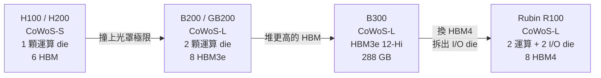
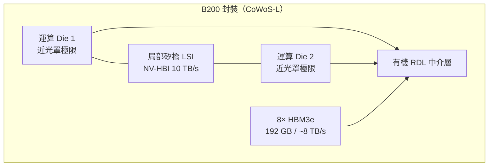
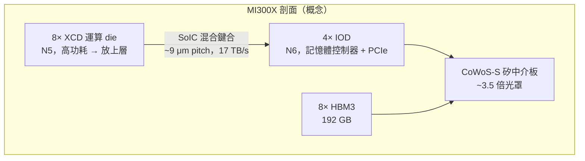

# CoWoS 在 AI 加速器中的角色

> **資訊時點**：本頁產品規格整理至 **2026 年 9 月**。標示 **[官方]** 者出自廠商技術部落格、白皮書或 JEDEC；標示 **[報導]** 者出自拆解機構與科技媒體（TechInsights、SemiAnalysis、TrendForce 等）；標示 **[傳聞]** 者尚未證實。AI 加速器規格更新極快，引用前請看日期。

CoWoS 不只是封裝技術，它是決定 AI 加速器效能天花板的核心架構選擇。這一頁用實際產品說明：**封裝變體的選擇，如何直接決定一顆加速器能長多大、餵多少記憶體。**

## 一條主線：從單 die 到雙 die，從 CoWoS-S 到 CoWoS-L

過去四個世代的 NVIDIA 資料中心 GPU，剛好演示了整個 2.5D 封裝的演進邏輯：

轉折點是 **Blackwell**。GH100 是一顆 814 mm² 的單晶片，已經逼近光罩極限（約 858 mm²）。Blackwell 想要的運算量換算成單晶片約需 1,000 mm²——**物理上不可能做出來**。於是 NVIDIA 把它拆成兩顆接近光罩極限的 die，用封裝拼回去。

這一拆，就把封裝從 CoWoS-S 推向了 CoWoS-L。

## NVIDIA Hopper：H100 / H200（CoWoS-S）

| 項目 | H100 SXM5 | H200 SXM |
|------|-----------|----------|
| 運算 die | GH100，TSMC 4N，約 814 mm² | 同 GH100 |
| 封裝 | CoWoS-S（全矽中介板） | CoWoS-S |
| HBM | HBM3，6 個位置、**5 顆啟用** | HBM3e，6 顆啟用 |
| 容量 | 80 GB | 141 GB |
| 頻寬 | 約 3.35 TB/s | 約 4.8 TB/s |

一個容易誤解的細節：H100 封裝上有 **6 個 HBM 位置，但只啟用 5 顆**，第 6 顆是維持機械平衡與翹曲對稱的結構填充 die。這是「封裝的機械需求反過來決定產品規格」的典型例子。

另一個值得注意的點：**H100 無法「升級」成 H200**。換 HBM 世代連帶要換記憶體控制器、base die 與中介板設計，因此只能以獨立 SKU 推出。這說明了 CoWoS 封裝內的元件**耦合有多緊**。

## NVIDIA Blackwell：B200 / GB200（CoWoS-L 的登場）

Blackwell 是 CoWoS-L 第一顆旗艦級產品，也是理解「為什麼 CoWoS-L 不是降級版」的最佳案例。

- **雙 die 設計**：兩顆接近光罩極限的運算 die，**以 10 TB/s 的 NV-HBI（NVIDIA High-Bandwidth Interface）互連，在軟體層呈現為單一 GPU** [官方]
- **電晶體數**：2,080 億，約為 H100 的 2.6 倍 [官方]
- **製程**：客製化 TSMC 4NP [官方]
- **HBM**：HBM3e 8 顆堆疊、192 GB、約 8 TB/s [報導]

那個 **10 TB/s** 的數字值得停下來想一想。它意味著兩顆 die 之間的頻寬，比整包 HBM 的 8 TB/s 還高——這正是[平行慢速互連](11-die-to-die-and-power.md)在極短距離下能做到的事，而它只有靠 CoWoS-L 的局部矽橋才可能實現。

值得記錄的是，CoWoS-L 初期並不順利：2024 年下半有報導指出 Blackwell 遇到**運算 die、矽橋、RDL 中介層與基板之間 CTE 不匹配造成的翹曲**問題，NVIDIA 重新設計了頂層金屬與凸塊才改善良率 [報導]。這是[可靠性章節](10-reliability-manufacturing.md)談的物理，在旗艦產品上真實發生過一次。

## Blackwell Ultra：B300 / GB300

B300 沒有換封裝，只換了記憶體——但效果顯著：

- HBM3e 從 8-Hi 升級為 **12-Hi 堆疊**，單 GPU 容量從 192 GB 提升到 **288 GB** [報導]
- 頻寬維持約 8 TB/s（堆更高增加的是容量，不是頻寬）
- TechInsights 拆解確認 **Micron 首度打進 NVIDIA 高階 HBM3e 供應鏈**，與 SK hynix、Samsung 並列三大供應商 [報導]

「堆更高只增容量、不增頻寬」是一個重要直覺：**頻寬由介面寬度與 pin 速率決定，容量由堆疊層數決定**，兩者是分開的旋鈕。

## NVIDIA Rubin（R100）：HBM4 世代

Rubin 於 2026 年初正式發表，是第一代大量採用 HBM4 的加速器 [官方]：

| 項目 | 規格 | 等級 |
|------|------|------|
| 電晶體數 | 3,360 億 | [官方] |
| 製程／封裝 | TSMC N3P，CoWoS-L | [報導] |
| Die 構型 | 2 顆運算 die；第三方分析描述為再加 2 顆 I/O die，共 4 die 於約 4 倍光罩面積的中介層上 | 運算架構[官方]／構型細節[報導] |
| HBM4 | 8 顆堆疊、288 GB、**聚合頻寬最高 22 TB/s** | [官方] |
| NVLink 6 | 單 GPU 3.6 TB/s 雙向 | [官方] |
| 算力 | 50 PFLOPS NVFP4 推理 | [官方] |

**22 TB/s 是 Blackwell 8 TB/s 的約 2.8 倍**，而容量同樣是 288 GB。這個「容量不變、頻寬近三倍」的跳躍，幾乎完全來自 HBM4 把介面從 1024-bit 加寬到 2048-bit——再次印證「頻寬靠線的數量」這條主線。

Rubin 另一個結構性改變是**把 I/O 拆成獨立 die**。運算 die 用最貴的 N3P，I/O 功能不需要，拆出去用成熟製程更划算。這是 chiplet 異質整合最經典的動機，而它需要封裝提供足夠的 die-to-die 頻寬才成立。

### Rubin CPX：一個反例

同一個 Rubin 世代裡，NVIDIA 還推出了 **Rubin CPX**——一顆刻意**不用 HBM、也不用 CoWoS** 的加速器 [官方]：單一光罩大小的 monolithic die，配 128 GB GDDR7，走傳統 flip-chip BGA 封裝 [報導]。

它專為超長 context 推理設計，這類工作負載吃**容量**多於吃**頻寬**。既然如此，用每 GB 成本低一半以上的 GDDR7 反而更划算 [報導]。

這是全書最有價值的反例之一：**先進封裝不是愈先進愈好，而是要看工作負載到底缺什麼。** 當瓶頸不是頻寬時，CoWoS 帶來的成本與產能代價就不划算。

## AMD Instinct：把 3D 疊進 2.5D

AMD 走了一條與 NVIDIA 不同的路——更早、更激進地把 [SoIC 3D 堆疊](14-soic-3d-stacking.md)與 CoWoS 混用，業界稱之為「**3.5D**」。

### MI300X / MI300A（2023）

- **架構**：以 SoIC 混合鍵合（第一代，約 9 μm bump pitch）把運算 chiplet（XCD／CCD）**堆疊在 4 顆 I/O die（IOD）之上**，整組再放到 CoWoS-S 矽中介板上 [報導]
- **3D 堆疊間垂直頻寬達 17 TB/s** [報導]
- **MI300X**：8 顆 XCD + 4 顆 IOD + 8 顆 HBM3（12-Hi）= 192 GB
- **MI300A**：3 顆 Zen4 CCD + 6 顆 XCD + 4 顆 IOD + 8 顆 HBM3 = 128 GB
- **中介板**：報導稱達「創紀錄的 3.5 倍光罩尺寸」CoWoS-S [報導]
- **製程**：XCD 用 N5，IOD 用 N6

注意這個結構符合[前一章](14-soic-3d-stacking.md)講的散熱鐵律：**高功耗的運算 die 疊在上面，較低功耗的 IOD 在下面**。

### MI325X / MI350 / MI355X（2024–2025）

維持 CoWoS-S + SoIC 架構，主要升級在記憶體：MI325X 用 HBM3e 12-Hi 達 256 GB；MI355X 達 **288 GB、約 8 TB/s**，185B 電晶體，N3P + N6 混合節點 [報導]。HBM 由 Samsung 與 Micron 雙供應 [報導]。

### MI400 / MI450（2026）：AMD 也轉向 CoWoS-L

MI400 世代是 AMD 的封裝轉折點——**從 CoWoS-S 改用 CoWoS-L**，環繞 **12 顆 HBM4 堆疊**（NVIDIA Rubin 是 8 顆）[報導]：

- MI455X：432 GB HBM4、**23.3 TB/s** 頻寬 [報導]
- Helios 機櫃：72 GPU、約 2.9 ExaFLOPS FP4、約 31 TB 總 HBM4 [報導]

> 註：MI400 系列數字來自 Hot Chips 2026 演講的媒體轉述，未能與 AMD 官方白皮書逐字核對，請視為[報導]等級。

**兩家旗艦在同一年都落到 CoWoS-L**，這件事本身就是本書最重要的結論之一：當封裝面積需求越過某個門檻，全矽中介板就不再是最優解。

## 自研 ASIC 陣營：封裝選型的三種策略

雲端業者的自研晶片，展示了在 CoWoS 產能受限下的三種不同打法：

| 加速器 | 封裝 | HBM | 策略解讀 |
|--------|------|-----|---------|
| **Google TPU v7 Ironwood** | TSMC 封裝含 CoWoS（Broadcom 設計） | 8 堆疊 HBM3e、**192 GiB、7.4 TB/s** [官方] | 正面競爭：規格對標同期旗艦 |
| **AWS Trainium3** | **CoWoS-L，但用有機薄膜中介層**（6 層銅 RDL 於聚合物基板） | HBM3e、144 GB、4.9 TB/s | 成本優化：拿 CoWoS-L 的架構，但避開昂貴的矽 |
| **Microsoft Maia 100** | CoWoS-S，約 820 mm² die | **HBM2e**、64 GB、1.8 TB/s | 刻意退一代：迴避與 NVIDIA/AMD 爭搶先進 HBM |

Trainium3 的作法特別值得注意——**CoWoS-L 的「局部矽 + 有機 RDL」架構，允許把有機的部分做得更便宜**。它證明了 CoWoS-L 不是單一規格，而是一整條可以按成本調整的光譜。

Maia 100 的選擇則說明了另一件事：當先進 HBM 與 CoWoS 產能都被前兩大廠鎖住時，**刻意用上一代技術也是一種可行的工程決策**——尤其當你的工作負載是自家內部的、可以協同設計的。

Ironwood 的規模數字也值得記錄：最高 **9,216 顆晶片組成 superpod，全 pod 可直接存取的 HBM 總量達 1.77 PB** [官方]。這提醒我們封裝只是第一層——真正的系統邊界已經是機櫃與叢集。

## 產能：CoWoS 還是不是瓶頸？

截至 2026 年，答案是「仍然是，但缺口正在收斂」：

- TSMC 兩大 CoWoS 家族（S 與 L）**皆全數訂滿，交期約 52–78 週** [報導]
- 供需缺口據估由 2026 年初約 **20%** 收斂至年底約 **10%** [報導]
- 產能由 2024 年底約 35,000 片/月，規劃擴增至 2026 年底約 **120,000–140,000 片/月** [報導]
- 據報 NVIDIA 拿下 2026–2027 年 **逾半數**的 TSMC CoWoS 產能 [報導]

但瓶頸的性質有一個重要的更新：**它不再是單一環節，而是一條鏈。** interposer 加工、bonding、切割、ABF 基板供應、測試產能、設備交期與良率，環環相扣。TSMC 在 2026 年技術論壇上就明確把 **HBM 記憶體與 ABF 基板**點名為未來 AI 供應鏈的兩大瓶頸 [報導]。

換句話說，「CoWoS 是瓶頸」這個 2023–2024 年的敘事，到 2026 年應該改寫為：**CoWoS、HBM、ABF 基板是並行的三重瓶頸**，而不是一個取代另一個。

> 相關：[CoWoS-R 與 CoWoS-L](06-cowos-r-l.md) ｜ [HBM 整合](07-hbm-integration.md) ｜ [產能、成本與供應鏈](15-capacity-and-economics.md) ｜ [SoIC 與 3D 堆疊](14-soic-3d-stacking.md)
