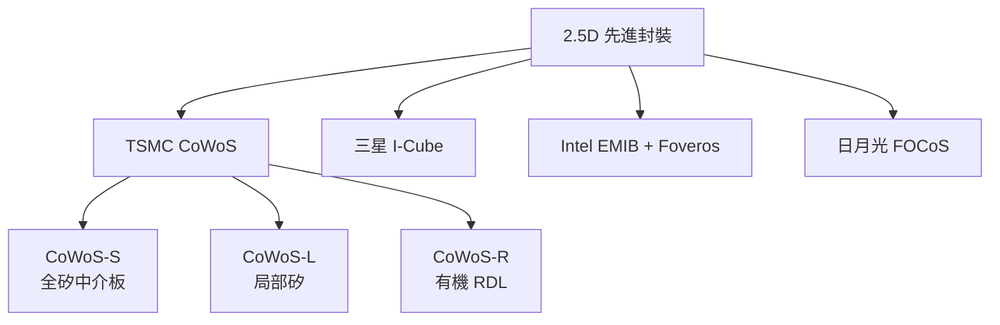
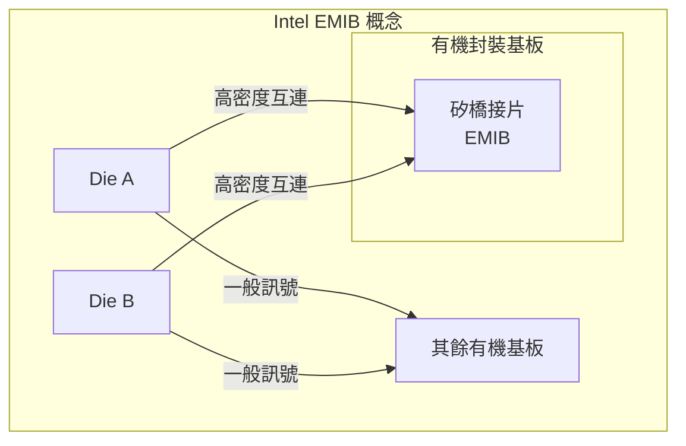
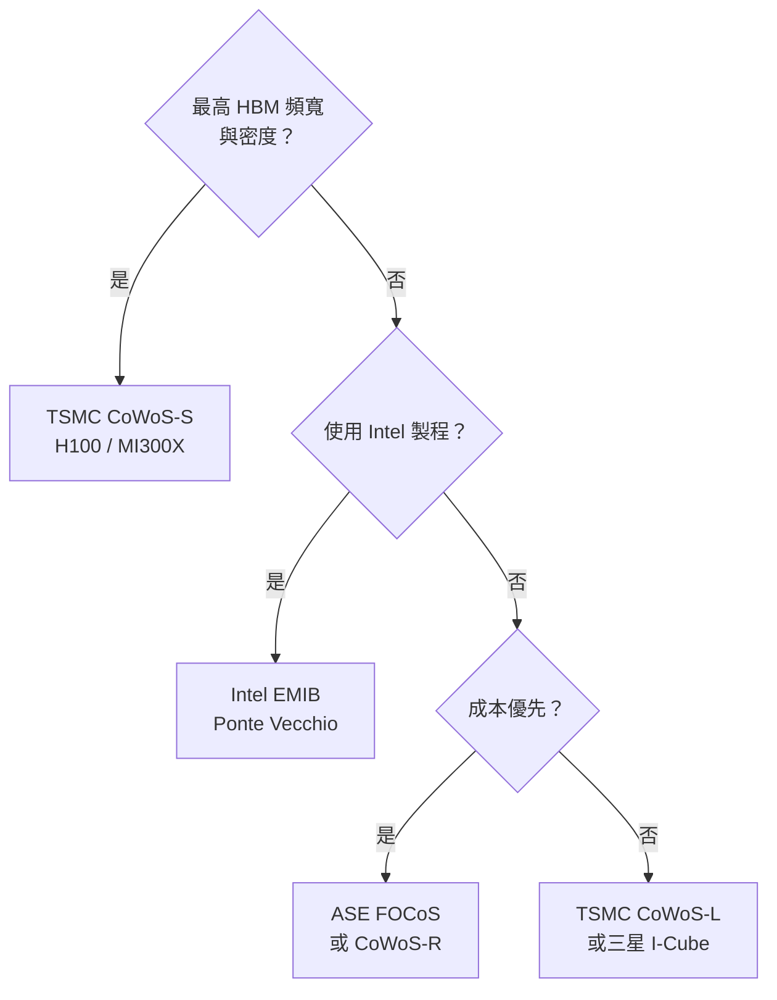

# 競爭技術比較

CoWoS 並非唯一的 2.5D 先進封裝方案。三星、Intel、台廠（日月光、力成）都有對應的技術。了解差異有助於判斷各技術的適用邊界。

## 主要競爭技術一覽

## TSMC CoWoS vs 三星 I-Cube

三星的 I-Cube 系列（I-Cube4、I-Cube8）是 CoWoS 最直接的競爭者：

| 特性 | TSMC CoWoS-S | 三星 I-Cube4/8 |
|------|-------------|--------------|
| 中介板 | 矽（TSMC 晶圓廠製造） | 矽（三星製造） |
| HBM 支援 | 最多 8 顆（Gen 5） | 最多 4–8 顆 |
| 製程節點整合 | TSMC 全系列 | 三星製程優先 |
| 客戶生態 | NVIDIA、AMD、Intel | 三星 Exynos、部分 HPC |
| 市場地位 | 市場主導 | 追趕中 |

## Intel EMIB：局部橋接的先驅

Intel 的 EMIB（Embedded Multi-die Interconnect Bridge）是 CoWoS-L 概念的先行者：

- 不需要整面矽中介板，成本較低
- 橋接片只覆蓋 Die 邊緣的互連區
- 用於 Intel Ponte Vecchio、Sapphire Rapids HBM

## Intel Foveros vs TSMC SoIC

| 特性 | Intel Foveros | TSMC SoIC |
|------|--------------|---------------------|
| 技術類型 | 3D 晶片堆疊 | 3D 晶片堆疊 |
| 接合方式 | Hybrid Bonding | Hybrid Bonding |
| 適用場景 | CPU + IO Die | GPU + CPU Chiplet |
| 代表產品 | Meteor Lake | AMD MI300X（部分） |

## 台灣封測廠商：日月光 FOCoS

日月光（ASE）推出 FOCoS（Fan-Out Chip-on-Substrate）：

- 使用先進 Fan-Out 技術取代矽中介板
- 無需 TSV，成本更低
- 互連密度介於 CoWoS-R 與 CoWoS-S 之間
- 適合中等效能需求的 AI 推論加速器

## 選擇框架

> 相關：[CoWoS-R 與 CoWoS-L](06-cowos-r-l.md)
