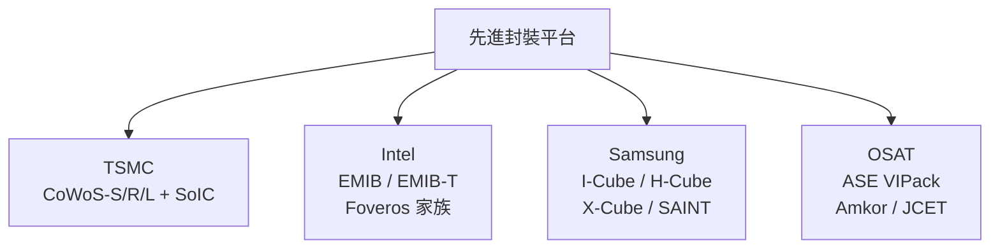
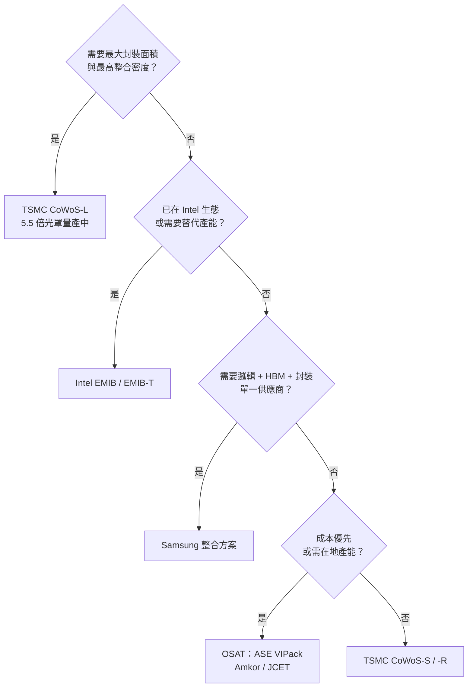

# 競爭技術比較

> **資訊時點**：整理至 **2026 年 9 月**。各家進度變動快，標示 [官方]／[報導]／[傳聞] 以區分可信度。

CoWoS 並非唯一的先進封裝方案。Intel、Samsung 與各大 OSAT 都有對應技術，而在 CoWoS 產能長期吃緊的 2025–2026 年，**這些替代方案第一次真正有了商業機會**。

## 全景

```mermaid
flowchart TD
    AP["先進封裝平台"]
    AP --> TSMC["TSMC<br/>CoWoS-S/R/L + SoIC"]
    AP --> INTEL["Intel<br/>EMIB / EMIB-T<br/>Foveros 家族"]
    AP --> SAMSUNG["Samsung<br/>I-Cube / H-Cube<br/>X-Cube / SAINT"]
    AP --> OSAT["OSAT<br/>ASE VIPack<br/>Amkor / JCET"]
```

## Intel：從 EMIB 的先行者到 CoWoS 的替代選項

Intel 是「局部矽橋」概念的先行者——**EMIB 比 CoWoS-L 早了好幾年**。過去這件事的商業意義有限，但 2026 年情況改變了。

### EMIB 與 EMIB-T

**EMIB（Embedded Multi-die Interconnect Bridge）** 把小矽橋嵌在有機基板中，只在需要高密度互連的區域用矽——**與 CoWoS-L 完全同源的思路**。

**EMIB-T** 是 2026 年的新版本，在橋接片中加入 **TSV**，讓橋不只能做橫向互連，也能做縱向供電與訊號穿透 [報導]：

- 支援 HBM3、HBM3E、HBM4，乃至規劃中的 HBM5
- 可擴展至 **120 × 180 mm** 封裝，支援超過 38 個橋接與 12 顆以上光罩尺寸的晶粒 [報導]
- 2026 年進入晶圓廠導入階段，首發產品可能是 Jaguar Shores [報導]

**這件事在 2026 年最重要的意義是替代性**：因 CoWoS 產能緊張，SK hynix 據報已在測試 Intel 的 EMIB 2.5D 方案 [報導]。當一家記憶體大廠去驗證競爭對手的封裝平台，代表產能壓力已經真實到足以改變供應鏈行為。

### Foveros 家族

| 技術 | 內容 | 2026 狀態 |
|------|------|----------|
| Foveros | 細間距 micro-bump 3D 堆疊 | 成熟量產（Meteor Lake、Panther Lake） |
| **Foveros Direct 3D** | **混合鍵合**（銅對銅，無凸塊） | **Clearwater Forest（Xeon 6+）2026 上半年量產，約 9 μm 凸塊間距** [官方／報導] |
| Foveros-R | RDL-based 成本優化 2.5D | 對外提供 [官方] |
| Foveros-B | 橋接整合的大型 HPC 2.5D | 對外提供 [官方] |

Clearwater Forest 值得特別記錄：它用 Foveros Direct 3D 把 **12 顆運算 chiplet（Intel 18A）+ 3 顆主動基底 tile（Intel 3）+ 2 顆 I/O tile（Intel 7）** 疊在一起 [報導]。注意那個「**主動**基底 tile」——它不是被動中介板，而是**含電晶體的矽**。這是與 TSMC 全被動矽中介板路線的一個真正的架構分歧。

### Intel 的封裝代工業務

Intel 正把 EMIB／Foveros 開放給外部客戶，目標 2026 下半年起接單，整體封裝營收展望上調至 **10 億美元以上** [報導]。有報導稱 Google、Amazon 對其入門級先進封裝表達興趣，但**沒有找到已簽約的確認**——請視為 [傳聞]。

## Samsung：唯一的「三合一」供應商

Samsung 的差異化不在單一技術，而在**它同時擁有邏輯代工、HBM 記憶體與封裝**——TSMC 沒有自家記憶體，Intel 沒有 HBM。

| 技術 | 內容 | 2026 狀態 |
|------|------|----------|
| I-Cube4 | 4 HBM + 1 邏輯 die 於矽中介板 | 量產中 [官方] |
| H-Cube | 進階 2.5D 整合方案 | 對外提供 [官方] |
| X-Cube | TSV 垂直堆疊 | — |
| **SAINT** | 混合鍵合（logic-on-logic、logic-on-memory） | 量產線建置中 |

SAINT 的時程是重點：Samsung 正在平澤建置約 50 台 D2W 鍵合機的混合鍵合量產線，設備 2026 年底開始進機，但**全面部署內部預期要到 2029–2030 年** [報導]。

**這是一個顯著落後**——Intel 的 Foveros Direct 3D 已經在 2026 年量產，TSMC SoIC 的 3nm 級堆疊也已在 2025 年量產。Samsung 在混合鍵合上晚了三到四年。

不過在 HBM 端 Samsung 相當積極：已在向 NVIDIA 推混合鍵合的 HBM4 原型，但**良率據報僅約 10%** [報導]——這個數字說明了混合鍵合用在 DRAM 堆疊上有多難。

## OSAT 陣營：從代工到自有平台

CoWoS 缺貨最大的受益者是封測廠。它們不只承接外包，也在推自有平台：

| 廠商 | 平台 | 2026 狀態 |
|------|------|----------|
| **ASE** | **VIPack** → **FOCoS**、**FOCoS-Bridge（+TSV）** | FOCoS-Bridge 加入 TSV，宣稱功耗損失降約 3 倍、互連密度較傳統有機封裝高近 200 倍 [官方]。2026 年資本支出達創紀錄的 70 億美元 [報導] |
| **Amkor** | S-SWIFT、S-Connect | 亞利桑那新廠投資擴大至約 70 億美元，**2028 年初開始生產**；**Apple 確認為首位且最大客戶**，NVIDIA 亦被點名 [官方／報導] |
| **JCET** | XDFOI | 已進入高量產；基於 XDFOI 的矽光子引擎於 2026 年 1 月完成客戶送樣驗證 [報導] |
| **SPIL**（ASE 子公司） | 與母公司整合，另主導 **CoWoP**（省掉封裝基板） | [報導] |

Amkor 亞利桑那廠的定位值得注意：它**與 TSMC 亞利桑那晶圓廠比鄰**，共同服務需要在地製造彈性的客戶 [報導]。這是地緣政治直接寫進封裝供應鏈布局的例子。

## 混合鍵合：新的競爭高地

當 micro-bump 的間距逼近極限，[混合鍵合](14-soic-3d-stacking.md)成為下一個戰場。三家的進度：

| 廠商 | 平台 | 間距 | 狀態 |
|------|------|------|------|
| TSMC | SoIC | **2025 年達 6 μm，2029 目標 4.5 μm**；A14-to-A14 SoIC 規劃 2029 量產 | [官方] |
| Intel | Foveros Direct 3D | 約 9 μm | 2026 上半年 Clearwater Forest 量產 [報導] |
| Samsung | SAINT | — | 產線建置中，全面部署 2029–2030 [報導] |

TSMC 的 6 μm → 4.5 μm 路線圖是官方數字，也是目前最領先的公開規格。

## UCIe：標準有了，市場還沒到

**UCIe（Universal Chiplet Interconnect Express）** 版本演進為 1.0 → 1.1 → 2.0 → 3.0，3.0 把頻寬翻倍至 48／64 GT/s [報導]。

但一個誠實的觀察：**真正跨公司混搭 chiplet 的「晶片商城」並沒有出現。** 產業媒體對此相當明確——規格成熟不等於生態成形。大廠仍然普遍使用自家專有介面（NVIDIA NV-HBI、AMD Infinity Fabric），因為專有介面能針對自家封裝把功耗與延遲壓得更低。

UCIe 目前的實際價值，更多在**建立共通詞彙與長期可能性**，而非立刻改變產業結構。詳見 [Die-to-Die 互連與供電](11-die-to-die-and-power.md)。

## 選擇框架

```mermaid
flowchart TD
    Q1{"需要最大封裝面積<br/>與最高整合密度？"}
    Q1 -->|"是"| A["TSMC CoWoS-L<br/>5.5 倍光罩量產中"]
    Q1 -->|"否"| Q2{"已在 Intel 生態<br/>或需要替代產能？"}
    Q2 -->|"是"| B["Intel EMIB / EMIB-T"]
    Q2 -->|"否"| Q3{"需要邏輯 + HBM + 封裝<br/>單一供應商？"}
    Q3 -->|"是"| C["Samsung 整合方案"]
    Q3 -->|"否"| Q4{"成本優先<br/>或需在地產能？"}
    Q4 -->|"是"| D["OSAT：ASE VIPack<br/>Amkor / JCET"]
    Q4 -->|"否"| E["TSMC CoWoS-S / -R"]
```

## 一句話總結競爭格局

**TSMC 在面積與混合鍵合密度上領先；Intel 在局部矽橋上有先行技術與可觀的替代產能；Samsung 有唯一的「邏輯＋記憶體＋封裝」全包能力但混合鍵合落後三到四年；OSAT 陣營則因 CoWoS 缺貨獲得了過去沒有的話語權。**

真正改變格局的變數不是誰的技術更好，而是**產能**——這正是 2023 年之後先進封裝競爭的核心特徵。

> 相關：[CoWoS-R 與 CoWoS-L](06-cowos-r-l.md) ｜ [SoIC 與 3D 堆疊](14-soic-3d-stacking.md) ｜ [封裝路線圖與產能](15-capacity-and-economics.md)
