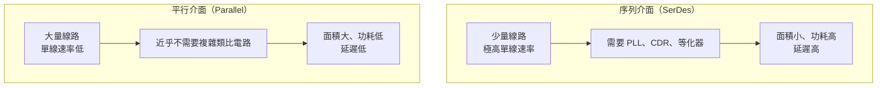

# Die-to-Die 互連與供電：封裝的電氣本質

到目前為止，我們談中介板都用「高密度互連」一筆帶過。但**互連密度到底換來了什麼、代價是什麼**，才是理解 2.5D 封裝為何值得的關鍵。這一頁把中介板當成電路來看，回答兩個工程師真正會被問到的問題：

1. 跨過中介板的一個 bit，要花多少能量？
2. 一千瓦的電，怎麼穿過中介板送到 die 上？

## 為什麼「短」這麼重要：能量的尺度階梯

在晶片系統裡，搬移資料的能量成本隨距離呈現非常陡的階梯。以下為概念性量級（實際值因製程與設計差異很大，此處用來建立直覺）：

| 資料搬移路徑 | 能量量級（pJ/bit） | 相對倍數 |
|------------|------------------|---------|
| 晶片內部（on-die）短距 | ~0.1 | 1× |
| 2.5D 中介板 die-to-die | ~0.3–0.5 | 3–5× |
| 有機基板上的 die-to-die | ~1–2 | 10–20× |
| HBM 介面（含 DRAM 存取） | ~3–4 | 30–40× |
| 傳統 SerDes 跨 PCB | ~5–10 | 50–100× |
| 光學鏈路（跨機櫃） | ~5–15 | 50–150× |

這張表是先進封裝的整個經濟基礎。當一顆加速器功耗中有可觀比例花在搬資料而非計算上，**把互連距離從「跨 PCB」縮短到「跨中介板」，等於直接把那部分功耗砍掉一個數量級**——省下的功耗預算可以還給運算單元。

換句話說，CoWoS 賣的不只是頻寬，是**每 bit 的能量效率**。

## 平行 vs 序列：兩種完全不同的哲學

跨越晶片邊界有兩種基本策略，2.5D 封裝之所以特別，是因為它讓前者變得可行。



**序列（SerDes）** 的思路：既然線路貴（PCB 上每條線都要佔面積、要接腳），就把資料擠進少數幾條線，用極高的頻率換頻寬。代價是每條線都需要時脈回復（CDR）、等化器（equalizer）等類比電路，功耗高、延遲高。

**平行（parallel）** 的思路：既然中介板上的線便宜到不像話（0.4 μm 線寬意味著同樣寬度能塞下數十倍的線），那就用**幾千條慢速線**取代少數幾條快線。單線只跑幾 Gbps，訊號完整性壓力小到可以省掉大部分類比電路，功耗與延遲同時下降。

**HBM 的 1024-bit（HBM4 為 2048-bit）介面，正是這個哲學的極致體現。** 它之所以只能存在於 2.5D 封裝上，不是因為別的地方做不出頻寬，而是因為只有矽中介板等級的佈線密度，才容納得下那麼多條線。

這也解釋了 [HBM 章節](07-hbm-integration.md)裡那句話的真正含義：HBM 需要 CoWoS，不是為了速度，是為了**線的數量**。

## UCIe：讓 chiplet 可以跨公司組裝

當 chiplet 來自不同供應商，就需要一套共通的 die-to-die 介面標準。**UCIe（Universal Chiplet Interconnect Express）** 就是為此而生的產業標準，扮演的角色類似「封裝內部的 PCIe」。

UCIe 定義了兩種封裝等級，正好對應本書談的兩類載體：

| 等級 | 對應載體 | 凸塊間距 | 特性 |
|------|---------|---------|------|
| **Standard Package** | 有機基板 | 較粗（數十 μm） | 成本低，頻寬密度較低 |
| **Advanced Package** | 矽中介板／矽橋（CoWoS、EMIB） | 細（~25–45 μm 及以下） | 頻寬密度高一個數量級，能效更佳 |

兩者的差距**完全由封裝技術決定**：同一套協定，跑在矽中介板上能得到的每毫米邊緣頻寬（bandwidth per mm of die edge），遠高於跑在有機基板上。這是「封裝決定系統效能」最具體的證據——協定沒變，換個載體，效能就差一個數量級。

值得注意的是，市場上真正跨公司混搭 chiplet 的案例仍然稀少。實務上大廠多半使用**自家的專有介面**（NVIDIA 在 Blackwell 兩顆運算 die 之間用的 NV-HBI、AMD 的 Infinity Fabric），因為專有介面可以針對自家封裝把功耗與延遲壓到更低。UCIe 的真正價值目前更多在**建立共通詞彙與長期的生態可能性**，而非立刻實現「chiplet 商城」的願景。

## 訊號完整性：中介板不是理想導線

中介板上的線又細又長（跨越數千平方毫米），它的寄生效應不能忽略：

- **電阻**：0.4 μm 線寬的銅線截面積極小，單位長度電阻高。訊號跨越大面積中介板時，RC 延遲成為真實限制。
- **串音（crosstalk）**：線距同樣只有微米量級，相鄰線之間的耦合顯著，需要在佈線上插入接地屏蔽線。
- **矽基板損耗**：矽中介板是**半導體**而非絕緣體，高頻訊號會在基板中感應渦流造成損耗。這是矽中介板相對於玻璃（真正的絕緣體）在高頻特性上的先天劣勢——也是玻璃基板路線在射頻與光通訊應用上被看好的原因之一。

這些效應合起來，決定了「平行慢速」策略的合理性：既然線本身不適合跑高頻，那就不要跑高頻。

## 供電：被低估的那一半

訊號問題有解，**供電問題往往更難。** 用一個簡單的計算就能看出規模：

一顆 1000 W 的封裝，若核心電壓約 0.8 V，需要的電流是：

```
I = P / V = 1000 / 0.8 = 1250 A
```

**一千兩百五十安培**，全部要穿過中介板送到 die 上。這帶來三個層層相扣的問題：

### 1. IR drop（電阻壓降）

電流流過有電阻的路徑就會產生壓降。核心電壓只有 0.8 V，能容忍的壓降預算可能只有幾十毫伏——換算下來，整條供電路徑的等效電阻必須低到毫歐姆等級。中介板上的 TSV 與 RDL 因此有很大比例**不是用來傳訊號，而是用來送電**。這是超大中介板上一個常被忽略的面積成本。

### 2. 電源雜訊與去耦

運算負載劇烈變動（例如矩陣運算單元同時啟動）會造成瞬間的大電流變化 di/dt，在供電網路的電感上產生電壓突波。傳統作法是在封裝基板上放去耦電容，但電容離 die 愈遠、迴路電感愈大、抑制高頻雜訊的效果愈差。

因此高階封裝把電容往裡搬：**深溝槽電容（deep trench capacitor）直接做在矽中介板裡**，或以整合式被動元件（IPD）的形式嵌在 die 正下方。這是矽中介板相對於有機中介板的一項隱藏優勢——**矽可以做電容，有機基板不行。**

### 3. 背面供電：把電從另一面送進來

最新的方向是把供電路徑與訊號路徑徹底分開：**背面供電網路（BSPDN，Backside Power Delivery Network）** 把電源軌搬到晶圓背面，訊號走正面。好處是雙重的——供電路徑更短更粗（IR drop 大幅下降），同時正面的佈線資源全部釋放給訊號。

這是製程技術（背面供電是先進節點的特徵）與封裝技術的交會點，也再次印證本書的主線：**在後摩爾時代，晶片設計與封裝設計已經無法分開思考。**

## 收束：中介板到底在賣什麼

把這一頁收攏成一句話：中介板賣的不是「連接」，而是**用極高的佈線密度，換取更低的每 bit 能量、更多的平行通道，以及更穩的供電**。這三件事合起來，才是 AI 加速器效能躍升的電氣基礎。

> 相關：[矽中介板與 2.5D 整合](03-silicon-interposer-2d5.md) ｜ [HBM 整合](07-hbm-integration.md) ｜ [熱管理](12-thermal-management.md)
