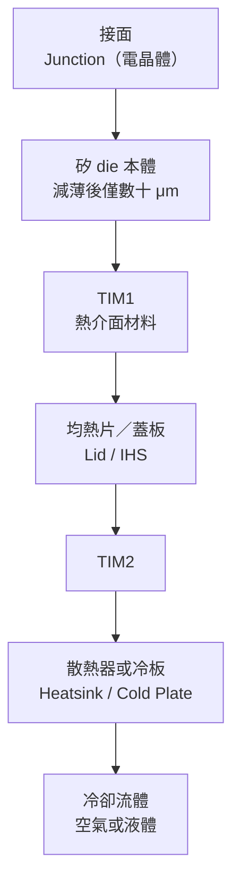
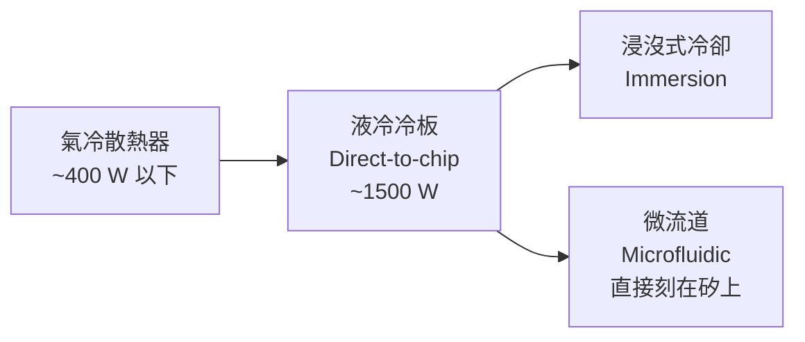

# 熱管理：功率密度才是真正的天花板

前面幾章一直在談「面積」與「互連密度」，彷彿封裝的極限是幾何問題。但把一顆 GPU die、八顆 HBM 堆疊、加上一片幾千平方毫米的中介板塞進同一個封裝之後，第一個先撞牆的往往不是面積，而是**熱**。

一顆現代 AI 加速器封裝的功耗已經跨過 1000 W 量級，而封裝的散熱面積只有幾十平方公分。這不是「加大風扇」能解決的問題——它是一連串串在一起的熱阻，任何一環都可能成為瓶頸。

## 熱從哪裡來、往哪裡走

在 2.5D 封裝裡，熱幾乎全部由運算 die 產生，而 HBM 卻是最怕熱的元件。這造成一個結構性矛盾：**發熱源與最怕熱的元件，被設計要求貼在一起。**

這條路徑上的每一段都有熱阻（thermal resistance，單位 °C/W），總溫升是各段熱阻乘以功率的總和。工程上最常見的誤解，是以為換一顆更大的散熱器就能解決問題——**當瓶頸在 TIM1 或 die 內部的橫向擴散時，放大最外層完全無效。**

## 2.5D 封裝特有的三個熱難題

### 1. 熱點（hot spot）與橫向擴散

功耗不是均勻分布的。GPU 的矩陣運算單元在滿載時形成局部熱點，功率密度可以是晶片平均值的數倍。矽的導熱係數雖高（約 150 W/m·K），但 die 為了 TSV 露出與封裝厚度而被**減薄到數十微米**，橫向擴散的截面積跟著變小，熱點更難被攤平。

減薄是 2.5D 封裝的必要之惡：TSV 必須露出才能導通，但薄化同時削弱了矽自身的散熱能力。這是一個典型的封裝取捨。

### 2. HBM 的溫度天花板

HBM 是堆疊的 DRAM，而 DRAM 的資料保存靠電容電荷，溫度愈高、漏電愈快、更新（refresh）就要愈頻繁。一旦溫度超過閾值，記憶體控制器會啟動 **refresh rate 加倍**，有效頻寬直接下降；再高則觸發降頻或關機保護。

更麻煩的是 HBM 堆疊本身的內部熱阻：一疊 12 層或 16 層 DRAM，最底層的熱要穿過上面所有層才能散出，而 DRAM die 之間的接合層與填充膠導熱都遠不如矽。**堆得愈高，底層愈熱。**

於是出現一個違反直覺的結論：在超大封裝上，**HBM 的溫度上限，往往比運算 die 的溫度上限更早成為系統的限制條件**。設計上因此要刻意把 HBM 放在離熱點較遠的位置，並在中介板與蓋板設計上做熱隔離。

### 3. 大面積蓋板的接觸品質

封裝面積愈大，蓋板（lid）與 die 之間的 TIM1 就愈難維持均勻厚度。[翹曲](10-reliability-manufacturing.md)讓封裝中央與邊緣的間隙不同，TIM 太厚的地方熱阻飆升，太薄的地方則在熱循環中被擠出（pump-out）。這也是為什麼大面積封裝普遍從導熱膏轉向**焊料型熱介面材料（solder TIM，例如銦）**——導熱係數高一個量級，且不會被擠出。

## 幾個關鍵材料數字

熱設計的直覺，來自對材料導熱係數量級的熟悉：

| 材料 | 導熱係數（W/m·K，約值） | 在封裝中的角色 |
|------|----------------------|--------------|
| 銅 | 400 | 蓋板、冷板、TSV／RDL 導體 |
| 矽 | 150 | die 與矽中介板本體 |
| 銦（solder TIM） | 80 | 高階 TIM1 |
| 底部填充膠 Underfill | 0.5–1 | die 下方，**熱與應力的兩難** |
| 環氧封膠 molding | 0.5–3 | 封裝保護層 |
| 有機基板 | 0.3–0.5 | 向下散熱幾乎不可行 |
| 玻璃 | ~1 | 玻璃基板路線的主要風險之一 |

兩個推論值得記住：

1. **熱幾乎只能往上走。** 有機基板的導熱係數比矽低兩個數量級，往下散熱的路徑實質上是封死的。這是為什麼封裝的散熱設計幾乎全部集中在 die 的背面。
2. **玻璃的導熱是它最大的技術債。** 玻璃在剛性、平坦度、CTE 上都優於有機基板，但導熱係數只有矽的百分之一量級。這一點在討論[玻璃基板路線](appendix-references.md)時常被樂觀敘事略過，卻是超高功率封裝上最實際的阻力。

## 從氣冷到液冷：系統層面的轉折

當單封裝功耗跨過約 700–1000 W，氣冷在合理的機櫃體積內已經無法提供足夠的熱交換能力。產業的路徑是逐級推進的：

- **冷板液冷（direct-to-chip）**：把冷卻水管直接壓在封裝蓋板上，目前是高階 AI 機櫃的主流。它移除的是「蓋板到環境」這一段熱阻，但 TIM1 與 die 內部的熱阻完全沒被改善。
- **微流道（microfluidic cooling）**：把冷卻通道直接蝕刻在矽 die 或矽中介板背面，讓流體貼著發熱源流動，**繞過 TIM1 這個瓶頸**。這是目前最激進、也最能突破熱阻天花板的方向，但引入了封裝內流體密封與可靠度的全新問題。

值得注意的是熱與封裝架構的耦合：**液冷把散熱瓶頸往封裝內部推**。當外部熱阻被大幅降低，原本被掩蓋的 TIM1、die 減薄、HBM 堆疊內部熱阻就浮上來成為新的限制。散熱不是外掛，它是封裝架構本身的一部分。

## 熱與可靠度是同一個問題

最後把熱接回[可靠性](10-reliability-manufacturing.md)：溫度不只影響效能，它同時是所有失效機制的加速器。

- 溫度梯度放大 [CTE 不匹配](10-reliability-manufacturing.md)造成的應力，加速凸塊裂紋。
- 電遷移（electromigration）速率隨溫度指數上升，直接壓縮導體的壽命與可承載電流。
- 開關機的熱循環，本身就是可靠度測試在模擬的疲勞來源。

換句話說，**熱設計做得好，可靠度規格才有可能達標**；兩者不是先後關係，而是同一組物理的兩個切面。

> 相關：[可靠性與製造挑戰](10-reliability-manufacturing.md) ｜ [HBM 整合](07-hbm-integration.md)
