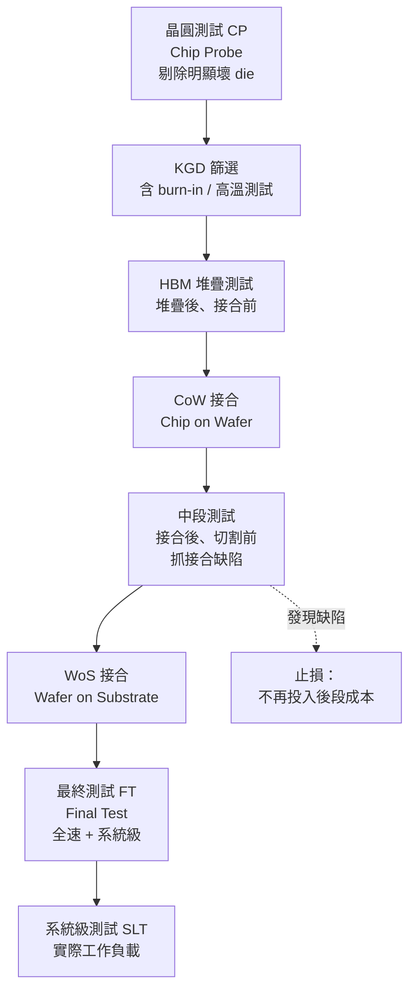

# 測試與已知良品：為什麼 Chiplet 的良率是乘法

先進封裝有一個殘酷的算術特性：**封裝把多顆晶片的良率相乘。**

一顆傳統單晶片封裝壞了，損失是一顆晶片。一顆 CoWoS 封裝裡有 2 顆運算 die、8 顆 HBM 堆疊、一片幾千平方毫米的中介板——任何一個元件在接合後才被發現有問題，報廢的是**整個封裝**，包括所有其他良品。這使得測試不再是「製造完之後的品管環節」，而是決定整條產線經濟性的核心。

## 複合良率：把數字算出來就懂了

假設每顆元件都有各自的良率，且接合本身也有良率，最終封裝良率大致是所有環節的乘積：

```
Y_package ≈ Y_運算die^n × Y_HBM^m × Y_中介板 × Y_接合^(n+m)
```

代入一組樂觀的數字：運算 die 良率 95%（2 顆）、HBM 良率 90%（8 顆）、中介板良率 85%、每次接合良率 99.5%（10 次）：

```
0.95² × 0.90⁸ × 0.85 × 0.995¹⁰
≈ 0.9025 × 0.4305 × 0.85 × 0.951
≈ 0.314
```

**約 31%。** 每三顆封裝就有兩顆報廢——而報廢的每一顆裡都躺著好幾顆完好的 HBM 與一顆昂貴的先進製程 die。

這個算式解釋了先進封裝的兩條鐵律：

1. **每一顆元件都必須在接合前就確認是良品**，這就是 KGD。
2. **必須有辦法在中途止損**，這就是中段測試與修復策略。

## KGD：已知良品晶片

**KGD（Known Good Die，已知良品晶片）** 指的是在裸晶狀態下（尚未封裝）就已經完成足夠測試、可以合理保證功能正確的晶片。這聽起來理所當然，實作上卻很難：

- **探針的物理極限**：micro-bump 間距只有數十微米，傳統探針卡（probe card）的針尖根本紮不進去，且探測會在凸塊上留下痕跡，影響後續接合。
- **速度測試困難**：在晶圓狀態下難以提供完整的高速訊號環境與供電，全速功能測試（at-speed test）受限。
- **溫度與老化**：許多潛在缺陷要在高溫或長時間運作後才顯現，晶圓級測試很難完整模擬。

於是業界的作法不是「把所有測試都搬到晶圓級」，而是**分層設限**：晶圓級測試抓大部分的致命缺陷，內建自我測試分擔一部分，剩下的靠設計冗餘吸收。

## DFT：把測試能力設計進晶片裡

既然外部探測受限，就把測試電路做進晶片內部——這是 **DFT（Design for Test，可測試性設計）** 的核心思路。在 chiplet 時代，DFT 從「加分項」變成「必要條件」。

| 機制 | 全名 | 在 2.5D 封裝裡做什麼 |
|------|------|-------------------|
| BIST | Built-In Self-Test | 晶片自己產生測試圖樣並比對結果，不需外部高速訊號 |
| MBIST | Memory BIST | 專測記憶體陣列，HBM 的必備機制 |
| Boundary Scan | IEEE 1149.1（JTAG） | 檢查 die 與 die 之間的互連是否斷路／短路 |
| IEEE 1838 | 3D-IC 測試存取標準 | 為堆疊晶片定義統一的測試存取埠與串接方式 |
| IEEE 1687（IJTAG） | 內嵌儀器存取 | 存取晶片內部的感測器與測試儀器 |

其中 **IEEE 1838** 特別關鍵：它讓一疊堆起來的晶片可以用一條串接的測試通道逐層存取，否則堆疊之後上層晶片就完全失去測試入口。

## 冗餘與修復：接受缺陷，而非消滅缺陷

當良率無法靠「不出錯」達成時，另一條路是**設計成出錯也能救**。

- **HBM 的備援行與列**：DRAM 陣列內建多餘的行（row）與列（column），測到壞的就用熔絲或電子熔絲切換到備援單元。這是 DRAM 產業數十年的成熟技術，也是 HBM 能堆到 12 層、16 層還維持可用良率的根本原因。
- **TSV 冗餘**：HBM 堆疊裡的 TSV 數量遠多於邏輯所需，部分通道失效時可切換到備用 TSV。
- **運算單元的容錯分倉（binning）**：GPU 有數十甚至上百個運算叢集，允許少數失效並在出貨時關閉，同一片矽因此能對應到不同的產品型號。這也是為什麼同一顆 die 會有多個 SKU。
- **中介板的 RDL 冗餘**：在關鍵訊號上做並聯路由，單點斷線不致造成功能失效。

冗餘的代價是面積與功耗；但相較於報廢整顆封裝，這筆帳幾乎永遠划算。

## 測試流程：在哪裡插入檢查點

實務上的測試流程，是在每一個「還來得及止損」的節點插入檢查：



關鍵設計原則只有一條：**愈早發現缺陷，損失愈小。** 每往後一個步驟，被浪費掉的累積價值就上升一個台階。中段測試（接合後、切割與 WoS 之前）之所以重要，正是因為它是最後一個「還能只丟掉中介板、不必連封裝基板一起丟」的節點。

## 修復（rework）：可能，但代價高昂

理論上，接合出問題的晶片可以被拆下來換掉。實務上，2.5D 封裝的 rework 極其困難：

- micro-bump 已經回焊固化，拆除需要局部加熱，而加熱會影響鄰近元件的接合。
- 底部填充膠（underfill）一旦灌入並固化，幾乎不可能在不破壞中介板的情況下移除。
- 大面積封裝的翹曲讓局部加熱的溫度控制更難。

因此高階 2.5D 封裝的實務策略是**盡量不 rework，而是把資源投在前段的 KGD 篩選**。這再次回到同一個結論：在 chiplet 時代，測試成本是往前移的——花在晶圓級測試上的每一塊錢，都在避免後段一筆大得多的損失。

## 系統級測試：最後一道，也最貴的一道

最終測試（FT）驗證的是規格；**系統級測試（SLT，System-Level Test）** 驗證的是「在真實工作負載下能不能活」。對 AI 加速器而言，SLT 要在接近實際運作的功耗、溫度與訊號環境下，跑數小時的真實負載，抓出那些只在特定時序與熱條件組合下才浮現的邊界缺陷。

SLT 昂貴（每顆的測試時間以小時計）、佔用大量測試設備，但對單價數萬美元的封裝而言仍然划算。這也是先進封裝拉高整體測試成本佔比的主要原因之一——**測試已經是先進封裝成本結構中不可忽視的一塊，而不再是尾數。**

> 相關：[可靠性與製造挑戰](10-reliability-manufacturing.md) ｜ [HBM 整合](07-hbm-integration.md)
