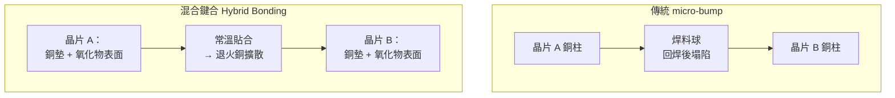
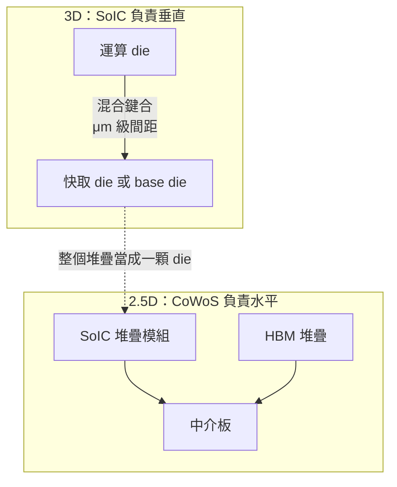

# SoIC 與 3D 堆疊：當凸塊本身成為瓶頸

前面所有章節談的都是 **2.5D**——晶片並排在中介板上，靠橫向的 RDL 互連。這一頁換一個方向：把晶片**疊起來**。

這不只是「另一種封裝形式」。3D 堆疊觸及一個 2.5D 永遠無法解決的物理極限：**凸塊（bump）本身的尺寸。**

## 凸塊的天花板

2.5D 封裝的互連密度，最終由 micro-bump 的間距決定。而 micro-bump 是**焊料**，焊料在回焊時會熔化、塌陷、向外擴散。這給了它一個下限：

- 間距太小，相鄰凸塊在回焊時會**橋接短路**。
- 焊料與銅之間會生成介金屬化合物（IMC），凸塊愈小，IMC 佔比愈高、機械性質愈脆。
- 凸塊本身有高度（數十微米），這段距離帶來寄生電阻與電感。

實務上 micro-bump 間距約在 40–50 μm 附近，往下推進到 20–25 μm 已是極限區。每平方毫米約能放下數百到上千個接點——聽起來很多，但和晶片內部金屬層的密度相比，仍然差了好幾個數量級。

**要突破這道牆，唯一的辦法是把焊料整個拿掉。**

## 混合鍵合：沒有凸塊的接合

**混合鍵合（hybrid bonding）** 的作法是：把兩片晶圓的表面拋光到原子級平整，讓表面上的**銅墊直接對銅墊、氧化物直接對氧化物**貼合，再以退火讓銅原子互相擴散、長成一體。

沒有焊料，就沒有塌陷與橋接的下限。接合間距可以從 micro-bump 的數十微米，一路推進到**個位數微米、甚至次微米**。這代表單位面積的互連數量提升**兩到三個數量級**。

同時，因為兩片矽是直接貼合的，中間沒有焊料與底部填充膠這兩層低導熱材料，**縱向熱阻也大幅下降**。

代價是製程要求極端嚴苛：

| 要求 | 為什麼致命 |
|------|-----------|
| 表面平坦度（CMP 後）需達奈米級 | 任何凸起都會讓周圍大片區域無法貼合 |
| 潔淨度需達無塵室最高等級 | **一顆微塵就能造成局部空洞（void）** |
| 對位精度需達次微米 | 接合墊只有數微米寬，對不準就是斷路 |
| 銅的凹陷量（dishing）需精確控制 | 太凹接不上，太凸則氧化物貼不緊 |

這也是為什麼混合鍵合的設備（Besi、EVG、ASMPT 等）與製程 know-how 成為先進封裝的新競爭高地。

## TSMC SoIC：把混合鍵合產品化

**SoIC（System on Integrated Chips）** 是 TSMC 的混合鍵合 3D 堆疊平台。它有兩種形態：

- **SoIC-X**：晶片對晶片（或晶片對晶圓）的**無凸塊**混合鍵合，追求最高互連密度。
- **SoIC-P**：使用細間距凸塊的版本，密度低於 -X，但製程門檻與成本較低。

SoIC 最重要的一點是：**它不是 CoWoS 的替代品，而是 CoWoS 的補充。** 兩者在現代 AI 加速器裡通常一起使用：

先用 SoIC 把運算 die 與其他 die 垂直整合成一個模組，再用 CoWoS 把這個模組與 HBM 並排在中介板上。**垂直方向給 SoIC，水平方向給 CoWoS**——這是目前旗艦 AI 加速器的標準組合拳。

## 3D 堆疊的三個先天限制

3D 不是無條件優於 2.5D。把晶片疊起來立刻引入三個新問題：

### 1. 散熱：上層擋住下層的路

熱幾乎只能從封裝頂部散出（見[熱管理](12-thermal-management.md)）。一旦把 die 疊起來，**下層 die 的熱必須穿過上層 die 才能出去**。這造成一條硬性設計規則：

> **高功率的 die 放上面，低功率的 die 放下面。**

這條規則嚴重限制了 3D 堆疊的適用場景。它非常適合「運算 die + 大容量 SRAM 快取」這種組合（快取功耗低、放下面沒問題），但兩顆都高功耗的運算 die 疊在一起，在現有散熱技術下幾乎不可行。這正是為什麼旗艦加速器的多顆運算 die 仍然是**並排（2.5D）而非堆疊**。

### 2. 良率：堆疊把良率相乘，且無法修復

混合鍵合是永久性的原子級接合，**接合完成後無法拆開**。若堆疊後才發現下層 die 有問題，整個堆疊報廢。這把[測試與 KGD](13-test-and-kgd.md) 的重要性推到極致——3D 堆疊是 KGD 要求最嚴苛的應用場景。

### 3. 設計複雜度：兩顆 die 必須協同設計

2.5D 的 chiplet 之間有標準介面，相對解耦。3D 堆疊的兩顆 die 卻是在**微米尺度上逐點對齊**的，等於必須共同設計佈局、共同規劃供電與時脈、共同做熱模擬。這大幅提高了設計成本與流片風險，也讓 3D 堆疊實務上幾乎只出現在同一家公司內部的產品裡。

## HBM 本身就是 3D——而且正在轉向混合鍵合

值得指出一件容易被忽略的事：**HBM 從第一天起就是 3D 堆疊產品**。十幾層 DRAM 用 TSV 串接，正是本頁談的技術。

過去 HBM 的層間互連使用 micro-bump 加熱壓縮接合（TC-NCF），但當堆疊層數往 16 層推進，兩個問題同時出現：**總堆疊高度受封裝厚度限制**，以及**底層 DRAM 的散熱惡化**。

混合鍵合正好同時解決兩者——拿掉凸塊，每層之間省下數十微米厚度，同時消除焊料與填充膠這兩層熱阻。因此更高層數的 HBM 世代普遍被認為會走向混合鍵合，這是記憶體業者目前最關鍵的製程競賽之一（各家的採用時程與策略見[學習資源](appendix-references.md)所列的追蹤來源）。

## 一張表看懂三種整合方式

| 維度 | 2D（有機基板） | 2.5D（CoWoS） | 3D（SoIC／混合鍵合） |
|------|--------------|--------------|-------------------|
| 晶片排列 | 並排 | 並排 | **垂直堆疊** |
| 互連間距 | 100+ μm | 40–50 μm（micro-bump） | **< 10 μm，可至次微米** |
| 互連密度（相對） | 1× | ~100× | **~10,000×** |
| 每 bit 能量 | 最高 | 中 | **最低** |
| 散熱 | 容易 | 中等 | **最困難** |
| 良率風險 | 低 | 中 | **高（不可修復）** |
| 典型應用 | 一般 SoC 封裝 | GPU + HBM | 運算 die + 快取、HBM 內部堆疊 |

## 為什麼未來是「2.5D 與 3D 一起用」

看完限制就會發現，3D 不會取代 2.5D，因為兩者解決的是不同的問題：

- **3D 解決「密度」**：需要極高頻寬、極低延遲、且其中一方功耗低的組合（運算 + 快取、DRAM 層間）。
- **2.5D 解決「面積」**：需要把多個高功耗元件放在一起、且各自都要散熱的組合（多運算 die + 多 HBM）。

現代旗艦 AI 加速器兩者兼用，正是因為它同時面對這兩個問題。而封裝技術的下一步——[更大的載體](appendix-references.md)——要解決的則是第三個問題：當 2.5D 的水平面積也不夠用時該怎麼辦。

> 相關：[CoWoS 架構總覽](04-cowos-overview.md) ｜ [測試與已知良品](13-test-and-kgd.md) ｜ [熱管理](12-thermal-management.md) ｜ [競爭技術比較](09-competing-technologies.md)
