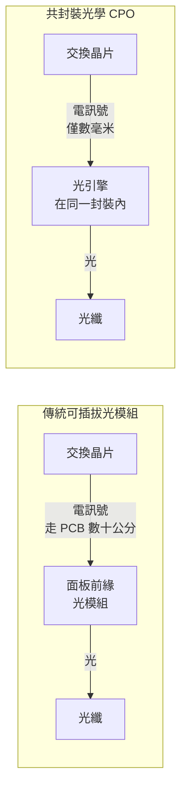
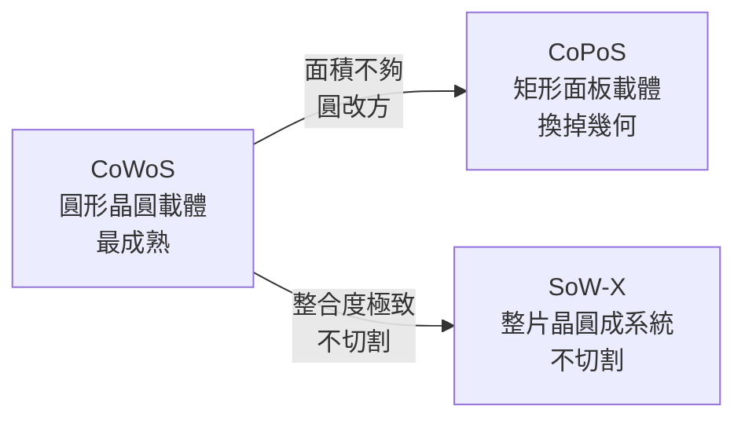

# 下一步：共封裝光學與更大的載體

讀到這裡，CoWoS 的故事已經完整：把 chiplet 與 HBM 用矽中介板拼在一起，用互連密度換取頻寬與能效，再用 LSI 橋把面積推到光罩的 5.5 倍以上。

那接下來呢？

答案分成兩條線，而它們解決的是兩個不同的問題：

- **當瓶頸從「封裝內」外移到「封裝之間」時** → 共封裝光學（CPO）
- **當封裝面積連晶圓都塞不下時** → 換掉圓形載體

## 第一條線：CPO——把光引擎搬進封裝

### 問題的位置變了

AI 叢集的規模已經到了單機櫃 72 顆、甚至數千顆 GPU 的量級。當一個模型的訓練跨越數百顆 GPU 時，真正的瓶頸不再是某一顆 GPU 內部的 HBM 頻寬，而是**GPU 與 GPU 之間、機櫃與機櫃之間的資料傳輸**。

而傳統的做法有一個結構性浪費：訊號從交換晶片出來，先用電走過一段 PCB 到面板前緣的**可插拔光模組**，才轉成光。這段「電走 PCB」的路徑，佔掉了整個鏈路可觀的功耗與延遲。

**CPO（Co-Packaged Optics，共封裝光學）** 的解法很直接：把光引擎搬進封裝裡，緊貼運算或交換晶片。電訊號只要走幾毫米就轉成光，那段昂貴的 PCB 路徑直接消失。

### TSMC COUPE

TSMC 在 2026 年技術論壇上發表了 **COUPE（Compact Universal Photonic Engine）**，這是它的 CPO 平台 [官方／報導]：

- 基於 SoIC 與矽光子技術（**注意：與玻璃基板無關**，這兩件事常被混為一談）
- 「COUPE on substrate」於 **2026 年開始生產**
- 宣稱相較可插拔光模組有 **2 倍能效、10 倍延遲改善**
- 200 Gbps 微環調變器（micro-ring modulator），用於資料中心機櫃間連線

它與本書主線的關係在於：**CPO 本質上是先進封裝的一個新應用領域**。它需要的能力——把異質元件（矽光子晶片、雷射、電子 IC）在微米精度下整合進同一封裝——正是 CoWoS 與 SoIC 累積下來的能力。

### CPO 的難點

CPO 不是把光模組縮小就好，它引入了封裝從未面對過的問題：

- **對位精度**：光纖與波導的耦合對準要求在**次微米**等級，遠嚴於電氣接點
- **溫度敏感性**：雷射與微環調變器的波長隨溫度漂移，而它們現在被放在一顆上千瓦的晶片旁邊——[熱管理](12-thermal-management.md)的難度直接升級
- **可維修性**：可插拔光模組壞了可以換一個；封裝在裡面的光引擎壞了，整顆封裝報廢。這對可靠度規格的要求極高
- **雷射光源**：雷射的壽命與溫度耐受度遠不如 CMOS，是否把雷射也封進去（vs. 外接光源）是產業尚未有定論的架構分歧

> 需要澄清一個常見混淆：本輪查證**沒有找到**已出貨的 Broadcom／NVIDIA CPO 交換器使用玻璃基板的證據。「CPO 用玻璃基板」目前是一個合理的技術推測，不是已確認的事實。

## 第二條線：當圓形晶圓不夠用

### 幾何的極限

CoWoS 的中介層是從 12 吋圓形晶圓上切下來的。而**封裝是矩形的**。把愈來愈大的矩形排進圓形，邊緣一圈弓形區域的浪費佔比會急遽上升。

一片 300 mm 晶圓的面積約 **70,686 mm²**。當單顆封裝逼近 8,000 mm² 時，一片晶圓只排得下寥寥幾顆——而且邊緣「差一點就能再排一顆」的損失被放到最大。

TSMC 的答案是把載體從圓形晶圓換成**矩形面板**：**CoPoS（Chip-on-Panel-on-Substrate）**。

### CoPoS 的現況（截至 2026 年 9 月）

TSMC 董事長魏哲家在 **2026 年 4 月 16 日的法說會上正式確認** CoPoS 試產線的存在 [官方]，並給出兩個關鍵定調：

1. **CoPoS 是 CoWoS 的「補充」，不是「取代」。**
2. 距離量產「還要幾年」，玻璃基板與 CoPoS「**沒有捷徑**」。

TSMC 主管更進一步表示，面板封裝「短期內不會取代 CoWoS」，理由是**晶圓級 CoWoS 已經能做到單一封裝容納 58 顆 die** [報導]——這是面板技術目前還追不上的整合密度。

其餘細節（310 × 310 mm 面板規格、AP7 嘉義試產線、2028–2029 量產時程）多為供應鏈報導而非官方確認，且各家說法不一致。

### 一個值得先知道的意外

市場敘事普遍把 CoPoS 與玻璃基板綁在一起。但 2026 年 7 月有引述 TSMC 先進封裝資深研發主管的報導指出：**第一代 CoPoS 很可能是「零玻璃」的——用有機面板核心，玻璃只作為製程中的暫時載體** [報導，供應鏈消息]。理由很簡單：「玻璃太難處理了。」

真正的玻璃核心基板（與 Ibiden、群創合作的三層設計）目標是 **2030 年之後** [報導]。

> CoPoS 的完整討論——面板幾何、玻璃基板、面板級製程挑戰、供應鏈競局——見本書庫的《CoPoS 面板級先進封裝筆記》。

## 第三條線：SoW-X 與 wafer-scale

還有一條更激進的路：**不切割晶圓，整片當成一個系統**。TSMC 的 **SoW-X** 走的就是這條路——40 倍光罩尺寸，最高 64 顆 HBM 堆疊，目標 **2029 年**量產 [官方／報導]。

三條路線的分工可以這樣理解：

- **CoWoS**：現在的主力，密度最高、最成熟
- **CoPoS**：用「換載體形狀」換取面積與材料利用率，代價是一整套新的製程與設備生態
- **SoW-X**：用「不切割」換取極致整合，代價是把良率風險集中在單一晶圓上

三者長期共存，按封裝面積與整合密度分工，而不是一刀切換。

## 全書收束

把整本書濃縮成一句話：

> **當製程微縮不再是效能的主要來源，封裝就從「保護殼」變成了「互連架構」；而互連架構的每一次進步——從 TSV 到矽中介板、從全矽到局部矽橋、從 micro-bump 到混合鍵合、從電到光——都在回答同一個問題：怎麼用更低的能量、把更多的資料、搬得更近。**

這條主線會繼續往下走。當你看到下一則先進封裝的新聞時，可以用同一組問題去拆解它：

1. 它改變的是**面積**、**密度**、還是**能效**？
2. 它把「必須完美的部分」變小了，還是變大了？
3. 它的熱怎麼出去？
4. 它讓良率的算術變好還是變壞？

能回答這四個問題，就抓住了先進封裝的核心。

> 相關：[封裝路線圖、產能與經濟學](15-capacity-and-economics.md) ｜ [SoIC 與 3D 堆疊](14-soic-3d-stacking.md) ｜ [熱管理](12-thermal-management.md) ｜ [學習資源與論文導讀](appendix-references.md)
