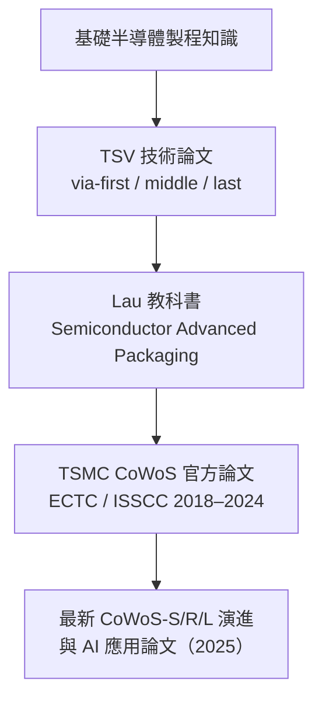

# 學習資源與論文導讀

本筆記以以下公開資源為知識基礎。所有整理均為原創，不重現受版權保護的原文。

## 教科書（建議閱讀順序）

### 1. Semiconductor Advanced Packaging
**John H. Lau，2021，Springer**

目前最完整的進階封裝教科書之一。涵蓋 2D、2.5D、3D IC 整合、Chiplet 封裝、晶圓接合與混合接合等主題。適合工程師與研究生入門。

建議章節：
- Chapter 5：2.5D IC 整合與矽中介板
- Chapter 7：CoWoS 技術演進
- Chapter 12：可靠性與製造

### 2. Chiplet Design and Heterogeneous Integration Packaging
**John H. Lau，2023，Springer**

深入探討 Chiplet 設計與異質整合，分析五種不同整合方法的成本效益。適合已有基礎的讀者。

### 3. Heterogeneous Integrations
**John H. Lau，2019，Springer**

了解 CoWoS 技術背景的奠基讀物，聚焦 Moore's Law 終結後的異質整合解決方案。

---

## 關鍵論文

### 奠基論文（IEEE ECTC 2013）

| 論文 | 重點 |
|------|------|
| Lin et al. (2013)，"Reliability characterization of CoWoS 3D IC integration technology" | CoWoS 可靠性的原始研究 |
| Chuang et al. (2013)，"Unified methodology for heterogeneous integration with CoWoS technology"（[IEEE Xplore](https://ieeexplore.ieee.org/document/6575673)） | CoWoS 異質整合方法論奠基 |
| Wang & Liu (2018)，"CoWoS technology: Integration of multiple dies for high-performance applications"，*Microelectronics Journal* 72:35–42 | 多晶片整合概覽 |

### TSMC 官方技術論文

TSMC 在 **IEEE ECTC** 與 **ISSCC** 持續發表 CoWoS 技術演進論文，描述中介板面積從 830 mm²（單光罩）擴展至 2500 mm²（三光罩拼接）的歷程。

**建議搜尋方式**：
- IEEE Xplore 搜尋關鍵字：`"CoWoS" AND "TSMC"`
- 篩選：ECTC 2018–2024、ISSCC 2022–2024
- TSMC Research 官網：[research.tsmc.com](https://research.tsmc.com/english/research/interconnect/publish-time-2.html)

### 2026 審閱時追加來源

- NVIDIA Technical Blog，〈NVIDIA Hopper Architecture In-Depth〉——H100 SXM5「80 GB（five stacks）HBM3」的官方出處。
- Tom's Hardware，〈Nvidia shifts to CoWoS-L packaging for Blackwell GPU production ramp-up〉（查閱 2026-07）——B200 採 CoWoS-L 的來源。
- Tom's Hardware，〈TSMC "Super Carrier" CoWoS interposer gets bigger... 9-reticle sizes with 12 HBM4 stacks〉（查閱 2026-07）——9.5 倍光罩中介板路線圖。

### 最新綜述（2025）

- **John H. Lau (2025)**，"Current Advances and Outlook of Advanced Packaging"，*ASME Journal of Electronic Packaging* — 系統性介紹 CoWoS-S/R/L、HBM、玻璃基板與光電 IC 異質整合。
- **PMC Review (2025)**，"Electronic Chip Package and Co-Packaged Optics (CPO) Technology for Modern AI Era"（[開放取用](https://pmc.ncbi.nlm.nih.gov/articles/PMC12029643/)）— 對比 TSMC CoWoS-S 與三星 I-Cube4 等競爭技術。

---

## TSV 背景補充

- 〈Three-Dimensional Integrated Circuit Key Technology: Through-Silicon Via (TSV)〉— 開放取用論文，詳細解釋 via-first、via-middle、via-last 三種 TSV 形成方式，是理解 CoWoS 矽中介板的技術基礎。

---

## 建議學習路線

---

*本筆記整理於 2025 年，2026-07 審閱更新。所有論文資訊以原始出版品為準。*
