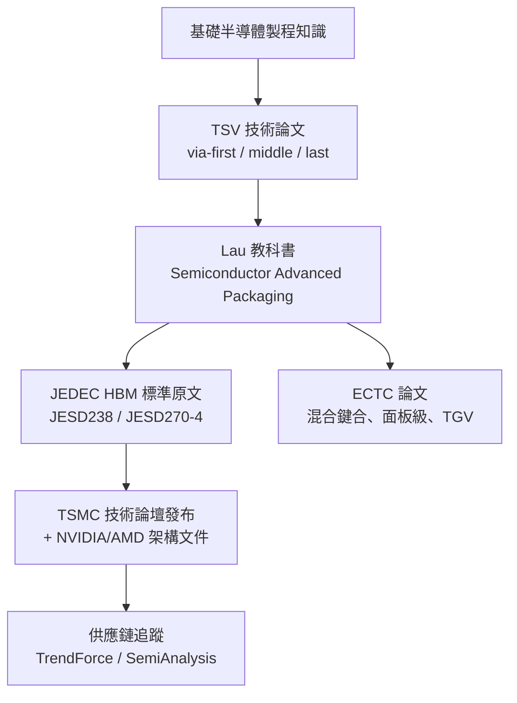

# 學習資源與論文導讀

本筆記以以下公開資源為知識基礎。所有整理均為原創，不重現受版權保護的原文。

!!! warning "可信度與時效"
    本書正文使用三級標示：**[官方]** 廠商官方發布／技術論壇／JEDEC；**[報導]** 拆解機構與科技媒體；**[傳聞]** 未證實的供應鏈消息。
    產業數字變動極快，本頁資源查閱時點為 **2026 年 9 月**。引用任何數字前，請回到原始出處確認最新版本。

## 一、教科書（建議閱讀順序）

### 1. Semiconductor Advanced Packaging
**John H. Lau，2021，Springer**

目前最完整的進階封裝教科書之一。涵蓋 2D、2.5D、3D IC 整合、Chiplet 封裝、晶圓接合與混合接合。適合工程師與研究生入門。

建議章節：Ch.5（2.5D IC 整合與矽中介板）、Ch.7（CoWoS 技術演進）、Ch.12（可靠性與製造）。

### 2. Chiplet Design and Heterogeneous Integration Packaging
**John H. Lau，2023，Springer**

深入探討 Chiplet 設計與異質整合，分析五種整合方法的成本效益。適合已有基礎的讀者，與本書[路線圖與經濟學](15-capacity-and-economics.md)一章互補。

### 3. Heterogeneous Integrations
**John H. Lau，2019，Springer**

CoWoS 技術背景的奠基讀物，聚焦 Moore's Law 終結後的異質整合解決方案。

### 4. Current Advances and Outlook of Advanced Packaging
**John H. Lau，2025，ASME Journal of Electronic Packaging**

系統性介紹 CoWoS-S/R/L、HBM、玻璃基板與光電 IC 異質整合的最新綜述。

---

## 二、標準文件（一手來源，最可靠）

| 標準 | 機構 | 內容 |
|------|------|------|
| **JESD270-4（HBM4）** | JEDEC，2025-04-16 發布 | HBM4 完整規格：2048-bit 介面、16-Hi 堆疊、64 GB/堆疊上限 |
| JESD238 / 238A | JEDEC | HBM3 / HBM3e 規格 |
| IEEE 1838 | IEEE | 3D-IC 測試存取標準，見[測試與 KGD](13-test-and-kgd.md) |
| IEEE 1149.1 | IEEE | Boundary Scan（JTAG） |
| UCIe 1.0 / 1.1 / 2.0 / 3.0 | UCIe 聯盟 | Chiplet 互連標準；3.0 頻寬提升至 48/64 GT/s |

> **建議**：談 HBM 規格時，優先引用 JEDEC 原文而非二手報導。二手來源經常混淆「JEDEC 規格基線」與「廠商客製目標」——這正是 HBM4 pin 速率最常被誤述的地方。

---

## 三、廠商一手技術資料

| 來源 | 用途 |
|------|------|
| **TSMC 北美技術論壇**（每年 4 月）與 pr.tsmc.com | CoWoS 面積路線圖、SoIC 間距路線圖、COUPE 的官方發布時點 |
| TSMC 3DFabric 技術頁 | CoWoS-S/R/L 與 SoIC 的官方技術說明 |
| **NVIDIA Blackwell / Rubin 架構頁與開發者部落格** | NV-HBI 10 TB/s、電晶體數、HBM 頻寬的官方出處 |
| AMD Instinct 產品頁與 Hot Chips 論文集 | MI300／MI400 系列的架構細節 |
| Google Cloud 部落格（TPU Ironwood） | TPU 世代的官方 HBM 容量與頻寬 |
| Microsoft Hot Chips 論文（Maia 100） | 少數公開的雲端自研晶片封裝細節 |
| SK hynix／Samsung／Micron newsroom | HBM 世代進度與客製化方案 |

---

## 四、關鍵論文

### 奠基論文（IEEE ECTC 2013）

| 論文 | 重點 |
|------|------|
| Lin et al. (2013)，"Reliability characterization of CoWoS 3D IC integration technology" | CoWoS 可靠性的原始研究 |
| Chuang et al. (2013)，"Unified methodology for heterogeneous integration with CoWoS technology"（[IEEE Xplore](https://ieeexplore.ieee.org/document/6575673)） | CoWoS 異質整合方法論奠基 |
| Wang & Liu (2018)，"CoWoS technology: Integration of multiple dies for high-performance applications"，*Microelectronics Journal* 72:35–42 | 多晶片整合概覽 |

### TSV 背景

- 〈Three-Dimensional Integrated Circuit Key Technology: Through-Silicon Via (TSV)〉——開放取用論文，詳解 via-first／via-middle／via-last 三種形成方式。

### 開放取用綜述

- **PMC Review (2025)**，"Electronic Chip Package and Co-Packaged Optics (CPO) Technology for Modern AI Era"（[開放取用](https://pmc.ncbi.nlm.nih.gov/articles/PMC12029643/)）——對比 TSMC CoWoS-S 與 Samsung I-Cube4 等競爭技術，並涵蓋 CPO。

### 怎麼在 IEEE Xplore 找到你要的

- 關鍵字：`"CoWoS" AND "TSMC"`、`"hybrid bonding" AND "pitch"`、`"panel level packaging" AND "warpage"`
- 篩選會議：**ECTC**（每年 5 月，先進封裝最重要的一手發表場）、**IEDM**、**ISSCC**、**Hot Chips**
- ECTC 每年的 Press Kit 是免費的，可以先用它定位該年的重點主題再查全文

---

## 五、產業追蹤來源（時效性資訊）

| 來源 | 特性 | 使用建議 |
|------|------|---------|
| **TechInsights** | 實體拆解報告 | 可信度最高的第三方——它拆開來看過 |
| **SemiAnalysis** | 深度供應鏈與架構分析 | 對封裝與系統設計的推理深度最好 |
| **TrendForce** | 產能、時程、供應鏈 | 產能數字的主要來源，但多為推估 |
| **3D InCites（IFTLE 專欄）** | 先進封裝的長期技術追蹤 | 對 ECTC 內容的整理很有價值 |
| **Semiconductor Engineering** | 製程與設備的技術深度 | 面板級封裝、混合鍵合的最佳非論文來源 |
| Tom's Hardware / AnandTech / TechPowerUp | 科技媒體 | 速度快，但數字常為轉述，需回溯原始出處 |
| DigiTimes / 經濟日報 / 工商時報 | 台灣供應鏈 | 獨家性強，但多為未具名消息來源，應標為[傳聞] |

!!! tip "讀產業新聞的三個檢查"
    1. **這個數字是官方的，還是分析機構推估的？** 產能與良率數字幾乎全是後者。
    2. **這是已量產，還是路線圖？** 「2029 年支援 24 顆 HBM」是規劃，不是現況。
    3. **報導日期是什麼時候？** 先進封裝的路線圖一年會改一次——SoW-X 就從 2027 被推遲到 2029。

---

## 六、建議學習路線

```mermaid
flowchart TD
    A["基礎半導體製程知識"]
    B["TSV 技術論文<br/>via-first / middle / last"]
    C["Lau 教科書<br/>Semiconductor Advanced Packaging"]
    D["JEDEC HBM 標準原文<br/>JESD238 / JESD270-4"]
    E["TSMC 技術論壇發布<br/>+ NVIDIA/AMD 架構文件"]
    F["ECTC 論文<br/>混合鍵合、面板級、TGV"]
    G["供應鏈追蹤<br/>TrendForce / SemiAnalysis"]
    A --> B --> C
    C --> D --> E
    C --> F
    E --> G
```

---

## 七、本書庫相關筆記

- **《CoPoS 面板級先進封裝筆記》**——當圓形晶圓的幾何極限浮現，接棒者是矩形面板。本書[最後一章](16-cpo-and-next-steps.md)點到為止的內容，在該專書完整展開。

---

*本筆記整理於 2025 年，2026 年 9 月進行內容與時效性全面更新。所有論文與規格資訊以原始出版品為準。*
