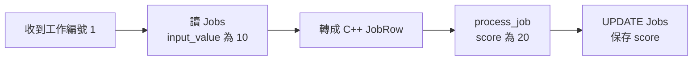

# 開場｜今天接手的是哪一支程式？

先不要安裝資料庫。我們先坐到接手專案的工程師旁邊，看他今天要處理什麼。

同事留下一句話：「工作 1 的輸入是 10，程式好像算完了，但資料庫裡還沒有結果。」你能讀 C++，也會下 breakpoint；困難在於，還不知道這句話跨過了多少地方。

這是本書的教學情境，不是某個私有專案的事故報告。我們會用合成資料拆解它，不連既有專案的資料庫。

## 先跟一筆工作走完，不先讀完整個 repo

想像原來的服務一直在等外部訊息。收到工作編號後，它查 SQL、拿出輸入、計算，再把結果寫回。先只畫這五步：



讀圖時先把「轉成 C++ JobRow」和最後的「UPDATE Jobs」分開。前者是 C++ 現在拿到了哪些值，後者是把結果保存回資料庫。兩者之間還有計算、SQL 執行與提交；看到 `score=20`，並不自動表示最後的保存已發生。

我們暫時不引入真正的設備或訊息服務。它們在故事中解釋為什麼重跑很麻煩，並不是範例已實作的功能。

## 這幾個名字，各自指什麼？

資料庫的 `dbo.Jobs` 是一張表。你可以先把表想成有欄名、能依條件查找的資料列集合；`dbo` 是這張表所屬的 SQL Server schema 名稱。本書一般實驗只追蹤 `job_id=1` 這一列。

| 欄位 | 基準值 | 這次拿來做什麼 |
|---|---|---|
| `job_id` | 1 | 指出是哪一筆工作，不是計算值 |
| `input_value` | 10 | 核心要處理的輸入 |
| `note` | NULL | 沒有備註；後面拿來觀察空值轉換 |
| `score` | NULL | 尚未保存結果；算完預期是 20 |

SQL 的 `NULL` 表示沒有值，不是整數 0。先記住這個差別就好，第 06 章才需要實際讀取它。

`JobRow` 則是 C++ 記憶體裡的一個 struct，定義在 [job_core.h](examples/job_core.h)：

```cpp
struct JobRow {
    int job_id;
    int input_value;
    std::optional<std::string> note;
};
```

它不是資料庫表本身，也不是自動連動的資料列。把 `row.input_value` 改成 9，只改了這個程序的記憶體；除非程式另外送 SQL，資料庫不會跟著改。`std::nullopt` 是這裡用來表達「沒有備註」的 C++ 值。

計算刻意非常簡單：`score = input_value * 2`，輸入至少 10 就通過。`process_job(row)` 回傳 `Result`，裡面有工作編號、score 與通過與否。這個函式不讀庫、不寫庫，也不等設備。先有這個小核心，才能看清楚外面每一層做了什麼。

## 老手為什麼不立刻改 UPDATE？

同事說「好像算完」還不是證據。可能跑了舊 exe；可能讀到另一筆資料；可能計算對了，但寫回的 key 錯了。現在直接改 UPDATE，改完即使看起來正常，也不知道原來錯在哪裡。

他會先把問題切成幾個可回答的小問句：

1. 我正在啟動的，真的是剛建置的程式嗎？第 01 章先核對產物。
2. 能不能不用再等外部訊息，就讓同一筆輸入進核心？第 02–03 章親手改入口。
3. 能不能把今天的值留下，明天繼續查？第 04 章保存與重播。
4. 固定輸入正常，從 SQL 讀來卻不同，那中間哪個轉換要看？第 05–09 章處理讀取邊界。
5. 核心正常之後，怎麼知道寫回真的發生？第 10–12 章才查寫入、交易與等待。

順序不是規定，而是成本判斷：前幾個動作便宜、影響小，能先排掉幾類常見混淆。若你已有某一段的可靠證據，就可以往下走。

## 你會拿到三個小程式，不是一套假裝完整的服務

| 程式 | 你在這裡學什麼 | 有沒有資料庫連線 |
|---|---|---|
| `first_job.exe` | 看懂入口、手動固定輸入、插入開關 | 沒有，只印文字 |
| `field_lab.exe` | 同一核心的命令列入口、輸入存檔、重播 | 沒有，會寫本地檔案 |
| `sql_lab.exe` | 真正 ODBC 讀取、更新、回滾等小案例 | 有，只連專用合成庫 |

三者共用 `job_core.h` 的計算，但不是三個功能完全相等的正式程式。前兩個顯示 `would update` 的意思是「打算寫入的內容」，不是假裝已經寫入。

前四章不需要 Docker。第一次讀，現在到[準備頁第一層](appendix-lab.md#first-run)編譯，再從[第 01 章](01-artifact.md)開始。遇到不懂的名字，先問它在上圖哪一格；不必在今天把 ODBC 和 SQL Server 一次學完。
