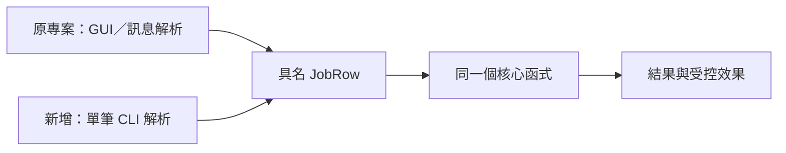

# 02｜不用等設備，先讓一筆工作跑完

正式程式每次都要開 GUI、登入、選檔、等一則訊息。你只想改核心中的一個判斷，卻得重做整套操作。老手會先找「一筆工作真正開始的那個函式」，留一條短入口。

## 薄入口，不是第二套核心

本書範例的接縫是 `JobRow`：工作編號、輸入值、可空文字。它是已解析的業務資料，不含視窗 handle、socket 或整個資料庫連線。`process_job` 只接這一包值，回傳 `Result`。

這和你熟悉的函式呼叫一樣：呼叫前要把引數準備好。不同在於，我們刻意讓原本藏在 GUI／訊息解析裡的預設值現形，才能問兩條入口是否真的準備了同一份資料。



圖是移植位置示意。本書沒附 GUI；附的是 fixed、cli、fixture 三種可比入口。不能把 CLI 通過說成 GUI 協定也通過。

## 先用相同的值走兩次

依[準備頁](appendix-lab.md)編譯後，在範例目錄執行：

```powershell
.\build\field_lab.exe --input fixed --effect preview --out run-entry-a
```

觀察 job_id 1、score 20、accepted true。保留這份結果，再換入口，不換值：

```powershell
.\build\field_lab.exe --input cli --job-id 1 --value 10 --effect preview --out run-entry-b
```

預測結果相同。本版確實相同，但更重要的是你能在 `job_core.h` 的 `process_job` 放同一個 breakpoint，看見兩次都進來。如果你把核心複製成 `test_process_job`，即使答案一樣，也失去查原問題的價值。

## 相同結果之後，故意走錯一次

只改 value 成 `10oops`。程式應拒絕，不產生一份假成功的結果。為什麼要做這個小反例？因為「短入口」最容易偷偷採用另一套寬鬆解析：正式入口拒絕，CLI 卻讀成 10，你會誤以為問題不在核心以外。

本範例以 `stoi` 配合已消耗長度檢查尾端字元，另限制輸入 0–1000，讓乘二不溢位。這是合成資料的明確契約，不是完整的正式請求格式驗證器。

## 放回你的專案時，先找第一個寫入

如果原函式一進去就 reset 狀態，不能只把入口接過去就開始大量重跑。先按[第 03 章](03-test-mode.md)分離輸入與效果。沒有必要先引入整套 repository、工廠或 DI 容器；一個可命名的輸入、一個共享核心，常已足夠開始。

省下的是外層等待，轉移的成本是入口可能漂移。因此保留少數「同一 JobRow、相同核心結果」對照，比維護另一份假演算法划算。日常會用就留著；一次調查用完，也可以只留重跑說明與輸入。

## 換個情境想一次

CLI 成功，常駐程式每隔幾次才失敗。下一步要把 DB 換掉嗎？

<details><summary>核對判準</summary>

先保存常駐路徑第一次進核心時的值、規則、執行緒與前一筆殘留狀態。CLI 每次新程序，可能已省掉觸發條件。短入口幫你控制一次工作，不能證明生命週期與並行沒有問題。

</details>

本章入口設計由本書提出，已驗的合成輸入對照見[驗證紀錄](appendix-validation.md)。
