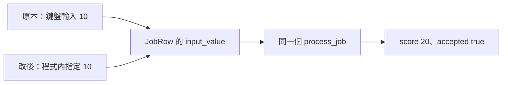

# 02｜先只改三行，讓一筆工作不用等輸入

上一章確認了改動會進入正在跑的 exe。接下來回到開場的問題：我們想查工作 1，卻每次都要重新操作入口。正式專案可能要開 GUI、等訊息；本章先用「每次輸入一個數字」代替那段等待。

目標很小：保留同一個計算函式，只換掉資料從哪裡來。你會親手改程式，而不是直接使用一套已經做好的測試框架。

## 先讀完這支小程式的主幹

開啟 [first_job.cpp](examples/first_job.cpp)。它沒有 SQL、沒有網路，也不寫結果檔。完整檔案有例外處理，先把注意力放在下面這段現有原碼：

```cpp
JobRow row{1, 0, std::nullopt};

std::cout << "input_value? ";
if (!(std::cin >> row.input_value))
    throw std::runtime_error("expected an integer");

const Result result = process_job(row);
```

第一行準備一筆工作：編號是 1，輸入暫放 0，沒有備註。接下來從鍵盤讀值，覆蓋 `input_value`。最後那一行才真的把準備好的資料交給核心。

這裡的分界不是什麼特殊語法，就是函式呼叫前後：**呼叫前負責把值準備好；函式裡負責用那些值計算。** 先找到這條分界，才知道哪幾行能換、哪一行必須留下。

看 [job_core.h](examples/job_core.h) 的回傳式：

```cpp
return {row.job_id, row.input_value * 2, row.input_value >= 10};
```

三個位置依序對應 `Result` 的 `job_id`、`score`、`accepted`。前面的檢查會拒絕非正數的工作編號與超出 0–1000 的輸入。這樣先把數字範圍固定，今天就不用同時處理溢位和入口問題。

## 第一輪：先留下正常路徑的答案

在[範例目錄](appendix-lab.md#first-run)執行：

```powershell
.\build\first_job.exe
```

看到 `input_value?` 後輸入 10、按 Enter。應看到：

```text
job_id=1 score=20 accepted=true
would update job_id=1 score=20 (NOT EXECUTED)
```

第一行來自計算結果。第二行只是用文字把「如果要寫回，會寫哪筆、寫多少」列出來，沒有真的執行 `UPDATE`。你還沒有證明任何資料庫行為；目前只是建立一筆可核對的 C++ 基準。

再執行一次、輸入 9，應得到 `score` 18、`accepted` false。這兩個值在通過門檻的兩側，能幫你分辨是不是永遠印同一個答案。把這兩組結果記下，下一輪要拿它們比較。

## 第二輪：只替換取得輸入的區塊

先把原檔另存一份，方便撤回，例如 `first_job-original.cpp`；若已有同名檔案，換一個名字。編譯腳本仍只使用 `first_job.cpp`，不會自動編譯這份備份。

在 `first_job.cpp` 找到下面三行：

```cpp
std::cout << "input_value? ";
if (!(std::cin >> row.input_value))
    throw std::runtime_error("expected an integer");
```

**用這一行替換它們**，不是另外貼在計算之後：

```cpp
row.input_value = 10;
```

不要移動下一行 `process_job(row)`，也不要直接把 `result.score` 寫成 20。前者是固定條件，後者是把要驗的計算跳過；兩者都可能印出 20，但證據完全不同。

存檔，重新建置這個小程式：

```powershell
.\build.cmd first
```

建置成功後再執行：

```powershell
.\build\first_job.exe
```

這次不應停下來等你輸入，直接得到 `score` 20、`accepted` true。和第一輪的數字相同，而省掉了鍵盤操作。如果還在等待，先照第 01 章查存檔、建置和 exe 路徑，不要改核心來「試試看」。

## 第三輪：確認留下的是同一個核心

現在只把固定的 10 改成 9，存檔、重新執行 `build.cmd` first，再執行 exe。預測應回到 `score` 18、`accepted` false。

你也可以在 debugger 的 `process_job` 函式入口下 breakpoint，檢查 `row.input_value`。這時你要看的不是整個 `main` 的所有變數，而是「交給核心的值是否正是剛固定的那個值」。



兩條入口是改前／改後的版本，不是目前 exe 同時有兩條路。重點是匯合處之後沒有改：你省掉了準備輸入的成本，還在查原本那個計算。

## 原專案沒有這麼乾淨，怎麼找位置？

不要期待原專案剛好也有 `JobRow`。先找一筆工作開始處，追到「最後一個輸入值已經準備好，第一個計算還沒開始」的位置。下面只是既有專案的縮小示意，不是可直接編譯的本書原碼：

```cpp
auto message = wait_for_message();        // 等待
auto row = read_job(message.job_id);      // 讀取與轉換
auto result = calculate(row);             // 計算
save_result(result);                      // 寫回
```

如果你正在查 `calculate` 的判斷，候選替換處就是前兩行：先用合成 `row` 代替它們。但還不能直接按執行，因為最後一行仍會寫回。這就是[下一章](03-test-mode.md)要處理的第二件事：固定輸入，不等於控制了輸出效果。

若 `calculate` 自己還偷偷讀設定或查資料庫，固定 `row` 就不等於固定全部條件。先用 breakpoint 看它實際呼叫了什麼，只記下本次影響結果的依賴；不用一開始就把整個服務重構成「完美可測試」架構。

## 這個很土的改動，什麼時候值得留下？

只查一次，硬編碼加上紀錄就可能足夠；每天都要重跑時，頻繁改碼重建的成本開始變高，才值得改成開關或命令列參數。不是因為 if 不夠漂亮，而是工作方式真的重複了。

完成本章後，把固定值恢復為 10 並重建，留在「固定輸入版」。第 03 章會在這一版加入開關。如果你直接跳讀下一章，依本章第二輪先完成這個替換即可。

## 換個情境想一次

你沒有固定 `input_value`，而是把 `process_job` 的回傳改成永遠回傳 `score` 20。畫面正常了，能說原來的計算沒問題嗎？

<details><summary>核對判準</summary>

不能。你改的是答案，不是輸入，因此避開了待查邏輯。恢復 `process_job`，改在呼叫前固定 `row`，再用 10 與 9 的門檻對照確認兩條結果仍會出現。

</details>

本章為本書設計的入口練習，不是對所有服務都有效的改寫配方。新增小程式與實測範圍見[驗證紀錄](appendix-validation.md)。
