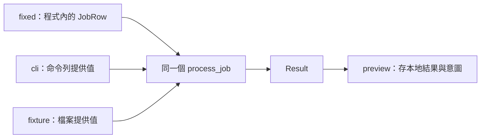

# 03｜親手加一個 test_mode，留下要查的那段邏輯

上一章用一行固定輸入，省掉了每次手動輸入。現在你想在「固定案例」與「原來的鍵盤入口」之間切換，卻不想每次註解三行、再貼回三行。這正是加一個 bool 就能省事的時候。

先別談設定平台。本章先在 `first_job.cpp` 寫一個最普通的 if，觀察它控制哪一段；之後才認識已整理好的 field_lab 工具。

## 第一步：在入口放開關，不放在計算裡

接續第 02 章的固定輸入版。在 `first_job.cpp` 的 include 之後、`main` 之前，新增：

```cpp
constexpr bool test_mode = true;
```

再把第 02 章留下的 `row.input_value` = 10; 這一行，替換成下面這段：

```cpp
if (test_mode) {
    row.input_value = 10;
    std::cout << "input=fixed\n";
} else {
    std::cout << "input_value? ";
    if (!(std::cin >> row.input_value))
        throw std::runtime_error("expected an integer");
}
```

保留原來的 `JobRow` 宣告，以及區塊後面的這一行：

```cpp
const Result result = process_job(row);
```

現在請先用眼睛走一次：true 只跳過鍵盤讀取，填入 10；false 則等你輸入。不管哪一邊，都會離開 if，往下呼叫同一個 `process_job`。這就是開關的位置為什麼重要。

在範例目錄重新建置：

```powershell
.\build.cmd first
```

再執行：

```powershell
.\build\first_job.exe
```

預期先印 input=`fixed`，再得到 `score` 20。若你把 `process_job` 也放進 else，固定模式就不會走到它；先檢查大括號範圍，不要只盯著 bool 的值。

## 第二步：不重建一次，親眼看見開關的生效時點

把 `test_mode` 改成 false，存檔，但刻意先不要 build。再執行同一份 exe。它應仍印 input=`fixed`，因為這個 constexpr 是編進產物的值，不是執行時讀取的設定檔。

現在執行 `build.cmd` first，成功後再啟動。這次才應停在 `input_value?`。輸入 9，應得到 `score` 18、`accepted` false。

這裡有兩個不同問題：**原碼的開關是多少？正在執行的產物，實際走哪條路？** 老手說「上線前記得關掉」時，至少要核對第二個問題。只截一張編輯器裡 false 的畫面，不足以證明交出去的 exe 是這一版。

先把這個練習版保持 false 並重建，恢復手動輸入。接下來換用另一支已附的工具，不用把下面的命令列解析硬塞進這支短程式。

## 固定輸入，為什麼還不等於可以安全重跑？

first_job 只印文字，所以你剛才反覆跑不會改庫。但原專案可能長這樣。以下是示意，函式名稱不是本書已實作功能：

```cpp
auto row = test_mode ? make_sample() : read_job();
auto result = process_job(row);
save_result(result);
send_notification(result);
```

即使 `test_mode` 是 true，最後兩行仍會執行。你只控制「資料怎麼進來」，沒有控制「結果往哪裡去」。

最小的調查方案可能是暫時把最後兩行改成印出寫入意圖。但要先確認更早的 `read_job` 或初始化沒有先做 reset；如果第一個寫入藏在讀取之前，只註解最後的 `UPDATE` 仍會改資料。找不到時，用 debugger 追蹤呼叫，在隔離合成環境核對前後值，不拿正式資料試運氣。

這些會留下外部改變的操作，常被叫做「副作用」：寫資料庫、建立檔案、發通知都算。不是說它們不好，而是重跑前要知道它們會不會一起再做一次。

## 第三步：把已經理解的小招，接到現成的重跑工具

開啟 [field_lab.cpp](examples/field_lab.cpp)。不要從第一行一路讀所有 helper，先在 `main` 找下面這個順序：

1. 依 --input 選擇來源，準備 `row`。
2. 呼叫一次 `process_job(row)`。
3. 在新目錄保存結果、輸入和寫入意圖。

這是前面手工改法的一種整理方式。field_lab 的 `test_mode` 只控制能不能選 `fixed`；`cli` 和 `fixture` 不受這個開關禁止。這和 first_job 的 true／false 切換鍵盤入口不同，**同名開關的意思是程式作者定的，不是 C++ 的內建約定。**



這次三條路真的同時存在於 field_lab。它完全沒有資料庫或通知實作，因此圖的最後一格就是結束，沒有藏著一條正式寫庫路徑。`preview` 仍會建立本地檔案。

先確認 `field_lab.cpp` 預設 `test_mode` 為 true；若前面只有建置 first 版本，執行一次完整的 `build.cmd`。接著跑固定入口：

```powershell
.\build\field_lab.exe --input fixed --effect preview --out run-fixed
```

`--out` 指定的新目錄不存在才會成功。若已存在，換成 `run-fixed-2`，後面讀檔命令也要跟著換。成功後看結果檔：

```powershell
Get-Content .\run-fixed\result.jsonl
```

```json
{"schema":1,"rule":"double-v1","job_id":1,"score":20,"accepted":true}
```

先只看最後三欄，它們就是剛才的 `Result`。`schema` 是輸出格式版本，`rule` 標記計算規則；第 04 章會解釋為什麼一起保存。JSONL 是「一行一筆 JSON」，這裡只有一筆，先不用學序列化函式庫。

再看另一個檔案：

```powershell
Get-Content .\run-fixed\intent.txt
```

裡面寫 would update、would notify 和 NOT EXECUTED。這是在問「如果把結果往外送，準備送什麼」，不是已寫入的證明。若你要查的是 SQL 是否真的執行，得等資料庫實驗，不能在這裡拿意圖檔當收據。

## 第四步：不用改碼，改一個輸入

現在改用命令列提供同一個值：

```powershell
.\build\field_lab.exe --input cli --job-id 1 --value 10 --effect preview --out run-cli
```

結果應和 `fixed` 一樣。再只改 value：

```powershell
.\build\field_lab.exe --input cli --job-id 1 --value 9 --effect preview --out run-nine
```

應是 `score` 18、`accepted` false。這次不用重新建置，因為改的是執行時的引數，不是原碼中的 constexpr。你剛得到兩種控制方式的實際差別：硬編碼省設計，命令列省日常重建。

如果同值卻不同結果，先在 `process_job` 入口看 `row`，查兩種入口是否準備了同樣的值。若 `row` 相同才往核心的設定或隱藏狀態查；不要因為故事涉及 SQL，就直接從資料庫開始。

## 留下哪一種，不必一次決定永久架構

一次調查，用 first_job 那樣的幾行修改可能已足夠。反覆要查門檻，就留下命令列入口；要讓同事明天重現，才需要把輸入存起來。這是[下一章](04-snapshot.md)的理由。

今天你驗到了「不同入口能進同一個核心」，還沒驗資料庫轉換與寫回。這不是失敗，而是把原本一大團「好像沒寫回」拆出了一小塊已知正常的部分。

## 換個情境想一次

某個專案的 `test_mode` 只讓 `read_job` 回傳固定 `row`。後面仍呼叫 `save_result`。你能只因為看到 `test_mode`=on，就拿正式工作編號重跑嗎？

<details><summary>核對判準</summary>

不能。要沿本次路徑找到第一次外部寫入，確認是否被隔離或改為觀察。開關名稱不是安全保證；先核對它控制哪一個 if、共用哪個核心、還會執行哪些效果。

</details>

本章兩種開關語意都是本書新增程式的設計，不是 ODBC 內建能力。[驗證紀錄](appendix-validation.md)分開記錄編譯練習與既有 DB 實驗。
