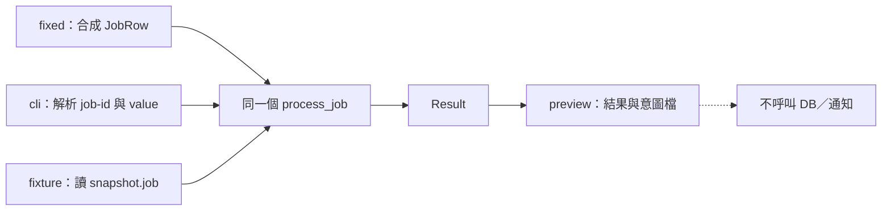

# 03｜加一個 test_mode，但別把真正要查的邏輯也跳過

你只想知道「輸入 10 為什麼被判成不通過」，但正式入口要等設備送資料；每跑一次，又會改狀態、寫結果、發通知。老手常做的第一件事不是架測試框架，而是在入口塞一筆固定資料。

這招的關鍵不是 `if (test_mode)`，而是：**省掉等待之後，你查的還是不是同一段程式？**

本章使用已附上的新增範例；需要 C++17、重新建置，不需要資料庫。先依[實驗準備](appendix-lab.md)完成 `field_lab.exe`。所有命令從你下載範例的目錄執行，使用 PowerShell；每次 `--out` 都用尚不存在的目錄。

## 先得到結果，不先碰寫庫

看 `job_core.h`：`input_value` 乘二得到 `score`；輸入至少 10 才通過。這是刻意簡單的業務規則，好讓你分得清「控制路徑的問題」和「演算法的問題」。

先預測固定的 `{job_id=1, input_value=10, note=NULL}` 會得到什麼，再執行：

```powershell
.\build\field_lab.exe --input fixed --effect preview --out run-fixed
Get-Content .\run-fixed\result.jsonl
```

本版實測的結果檔是一列：

```json
{"schema":1,"rule":"double-v1","job_id":1,"score":20,"accepted":true}
```

終端還會印實際 exe 路徑，以及 `test_mode=on input=fixed effect=preview`。先確認這些，再看數字。若目錄已存在而被拒絕，不是計算失敗；換一個 run 名稱，保留上一輪證據。

這個 target 沒有 ODBC 連線或網路通知實作。`intent.txt` 只記「原本打算做什麼」，不是已寫入的收據。預覽仍寫本地檔案，因此我們只說「沒有 DB／通知路徑」，不說「完全沒有副作用」。

## 開關放在哪裡，決定你到底測到什麼

`field_lab.cpp` 的開頭有真正會編進產物的開關：

```cpp
constexpr bool test_mode = true;
```

它只決定是否允許 `--input fixed`。它不偷偷縮短 timeout、不吞掉錯誤，也不另外換一份永遠成功的計算。輸出端則獨立要求 `--effect preview`；目前任何其他效果模式都會被拒絕。



讀圖時找三條線匯合的位置。那個匯合點才是這個小招留下的證據：你換入口，但沒有換掉要查的核心。虛線不是一條已實作的通知通道。

如果你在自己的專案只把最末端 `UPDATE` 註解掉，卻在 SELECT 前就有 `reset_status()`，還是會改資料。因此移植這招前，沿一次工作把第一個寫入圈出來：初始化、stored procedure、另一條連線、檔案和通知都算。找不到邊界時，先用 breakpoint 唯讀追蹤，不拿正式資料「跑一次看看」。

## 改一個值，證明沒有繞過核心

固定模式先不改。換成另一條入口，傳同樣的值：

```powershell
.\build\field_lab.exe --input cli --job-id 1 --value 10 --effect preview --out run-cli
```

結果應仍是 score 20、accepted true。接著只把 value 換成 9：

```powershell
.\build\field_lab.exe --input cli --job-id 1 --value 9 --effect preview --out run-nine
```

本版得到 score 18、accepted false。你剛驗的是門檻兩側的核心路徑，不只是「程式沒有 crash」。在 debugger 對 `process_job` 下 breakpoint，兩次都應進這個函式；先看呼叫堆疊與輸入，不急著逐行走完整個 main。

若兩次都 true，下一步是核對傳進核心的 `input_value`，不是先換資料庫。若 CLI 與固定入口同值卻不同結果，先找入口預設值、規則版本或隱藏狀態。

## source 關掉，不代表正在跑的檔案已關掉

把 `test_mode` 手動改成 false，但先不要 build。再執行舊 exe 的固定入口：它仍允許，因為它不會回頭讀你的 `.cpp`。接著重新建置，改用完整路徑執行新 exe；固定入口會以 exit code 2 拒絕，CLI 仍可使用。

這個差異把常見的口頭叮嚀「上線前記得關」變成可查的證據：核對候選包的實際行為、模式與檔案 hash。**關掉 fixed 不會讓本範例變成正式寫库模式**；preview-only 的能力範圍也要一併核對。

實驗後將 source 恢復 true 並重新建置，讓後續章節沿用相同基準。不要覆寫留作對照的舊產物。

## 這次結果能證明多少？

能支持：這三個教學入口匯入同一個核心，preview target 只產生本地檔案。不能支持：你的正式專案已沒有漏出的 reset、ODBC 轉換正確、交易可撤回或通知只送一次。這些必須在真正的接縫另驗；下一章先[把核心吃到的值存下來](04-snapshot.md)。

一次調查可以只保留 fixture 與紀錄；每週都要用，才值得把入口留下。不要為了一個 bool 先打造設定平台，也不要讓沒人知道的全域開關活在交付包裡。

## 換個情境想一次

你在自己的專案記到 UPDATE 計數為零，但 preview 後資料仍變了。下一步在哪裡放觀察？什麼證據能推翻你的猜測？

<details>
<summary>核對判準</summary>

先核對實際 exe、DB 目標與第一個外部效果，尤其 SELECT 前的 reset、SP、第二條連線與其他 writer。用獨占合成資料的前後值和呼叫紀錄找首次改變；不要先假設多包一層 rollback 就能控制不同連線與通知。

</details>

來源界線：入口與模式由本書設計；[ODBC 交易文件](https://learn.microsoft.com/en-us/sql/odbc/reference/develop-app/committing-and-rolling-back-transactions)只支持資料庫交易機制，不替應用的 preview 背書。[完整實測範圍](appendix-validation.md)。
