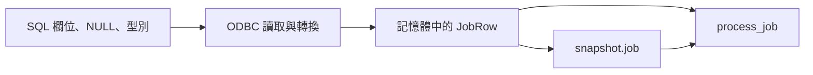

# 04｜今天跑對了，明天怎麼把同一筆值拿回來？

上一章的 CLI 讓你不用改碼就能試 10 和 9。但現在同事問：「你昨天那一筆到底傳了什麼？」如果回答只是「應該是 10」，這個小入口還不足以交接。

本章把一次成功執行的輸入存下來，再從檔案讀回。重點不是選哪個儲存格式，而是決定：**存在哪個位置，之後就能重跑哪一段。**

## 先分清 SQL 文字和 C++ 實際收到的值

假設 SQL 查的是工作 1。昨天的 `input_value` 是 9，今天被改成 10。你保存同一句 `SELECT`，明天再執行，也不會自動得到昨天的值。

另一種差異發生在轉換：資料庫的 `NULL` 可能被錯誤地當成 0，文字可能被截短。這時「SQL 查到了什麼」與「核心收到什麼」也不是同一份證據。



圖中檔案記的是「記憶體中的 JobRow」那一格。保存後，你不必重建資料庫現場，就能重跑 `process_job`。但如果前面的「ODBC 讀取與轉換」已經轉錯，檔案也會忠實保存錯值。這不是檔案的錯，而是保存位置決定了它能回答的問題。

本章先用 field_lab 完成檔案對照。圖中的真 DB 路徑稍後才接入，不要為了讀這一章提前建立資料庫。

## 第一步：製造一筆有名字的基準

所有命令仍從[下載範例目錄](appendix-lab.md#first-run)執行。即使已做第 03 章，也另取一個 run 名稱，避免不知道正在看哪一輪：

```powershell
.\build\field_lab.exe --input cli --job-id 1 --value 10 --effect preview --out run-snapshot-a
```

成功後先看目錄：

```powershell
Get-ChildItem .\run-snapshot-a -Name
```

你會看到四個檔案，各自回答不同問題：

| 檔案 | 先問它什麼 |
|---|---|
| `snapshot.job` | 核心這次使用什麼輸入？ |
| `result.jsonl` | 用這個輸入算出了什麼？ |
| `intent.txt` | 如果往外送，原本打算送什麼？ |
| `run.txt` | 使用哪一種入口、模式與規則？ |

現在只打開輸入：

```powershell
Get-Content .\run-snapshot-a\snapshot.job
```

```text
schema=1
rule=double-v1
job_id=1
input_value=10
note=null
```

`job_id` 與 `input_value` 已經熟悉。`schema`=1 讓 reader 知道這份檔案的格式；`rule`=double-v1 表示當時約定的規則。它不是自動驗證每行原碼的 hash，而是提醒你不要拿不同規則的結果硬比。

這種保存好的測試輸入常叫 `fixture`。本書採短的 key=value 格式，一行一欄，先省掉 JSON 函式庫依賴。它只支援本書的小資料形狀，不是任意 SQL 匯出格式。

## 第二步：換來源，不換值，也不重建

保留原 exe 不變，讓它改讀剛才的檔案：

```powershell
.\build\field_lab.exe --input fixture --fixture .\run-snapshot-a\snapshot.job --effect preview --out run-snapshot-b
```

這次 --input `fixture` 選讀檔入口，--`fixture` 才指定檔案路徑。不要把 `result.jsonl` 塞進去，那是答案，不是輸入。

先預測結果一樣，再各看一份：

```powershell
Get-Content .\run-snapshot-a\result.jsonl
Get-Content .\run-snapshot-b\result.jsonl
```

兩份都應是 `job_id` 1、`score` 20、`accepted` true。`run.txt` 的 input 則應從 `cli` 變成 `fixture`。這代表你真的換了入口，而不是重新看同一份結果檔。

回到 [field_lab.cpp](examples/field_lab.cpp) 看兩行就能接起來：

```cpp
row = load_fixture(args.at("--fixture"));
```

它把檔案欄位讀成 `row`。離開輸入分支後，仍是：

```cpp
const auto result = process_job(row);
```

因此你保存的不是另一套算法，而是讓同一個函式可以重新取得相同引數。

## 第三步：留住原檔，只改一個值

不要改 run-snapshot-a 裡的基準。複製成自己的實驗檔；若同名檔存在，換新名字：

```powershell
Copy-Item .\run-snapshot-a\snapshot.job .\experiment-nine.job
```

用編輯器打開 `experiment-nine.job`，只把 `input_value`=10 改為 `input_value`=9，其他行不動。再執行：

```powershell
.\build\field_lab.exe --input fixture --fixture .\experiment-nine.job --effect preview --out run-snapshot-nine
```

看 `result.jsonl`，預期 `score` 18、`accepted` false。此時有清楚的因果：exe 沒換、規則沒改，只有一個輸入欄位不同。要自動比較很多筆，等[第 16 章](16-uv-diff.md)再做，現在先看懂這一筆。

若答案不變，先看命令是否指向 `experiment-nine.job`，再看新目錄裡重新保存的 `snapshot.job`。這份輸入比「我記得有改」更能告訴你程式實際讀到了哪個值。

## 第四步：試一次應該拒絕的檔案

再複製一份基準為 `experiment-schema2.job`，只把 `schema`=1 改成 `schema`=2：

```powershell
.\build\field_lab.exe --input fixture --fixture .\experiment-schema2.job --effect preview --out run-schema2
$LASTEXITCODE
```

預期顯示 unsupported `fixture` `schema` or `rule`，exit code 為 2。不是每個實驗都要期待成功；這次在問 reader 是否會把不懂的格式偷偷當成舊格式。

另外三個看起來像「空值」的寫法也不同：note=null 是沒有值，note=text: 是有一個空字串，note=text:null 才是四個字母的文字。雖然目前的計算不用 note，保留這個差別能避免之後拿它查轉換時，證據已被存檔格式壓扁。

## 到真正專案，保存動作插在哪裡？

先找到「讀取與轉換完成，準備呼叫核心」的位置。若你在查核心崩潰，就要在呼叫核心**之前**保存，不能等它成功返回才留紀錄。

本書 field_lab 為了保持簡短，實際在 `process_job` 成功後才寫 snapshot；因此它示範的是成功輸入的重播，**不是已做好的崩潰前自動擷取器**。若 core 拋出例外，這一輪不會留下 snapshot。這個差別要從原碼順序看，不從檔名猜。

等完成[SQL 準備第二層](appendix-lab.md#sql-lab)，先跑：

```powershell
.\run-sql-case.ps1 mapping
```

這個案例把合成庫的工作 1 讀成 `JobRow`，再呼叫同一個 `process_job`，應印 db-core 與 `score` 20。它沒有自動輸出 snapshot，也沒有完整 note 匯出器；此處只確認 DB 路徑能建立相同基準。

真正接存檔功能時，先處理一筆已授權、能去識別的輸入，記下必要的規則與順序。若資料要逐筆累積處理，順序本身也是輸入，不能為了比對好看就任意排序。

完成本章後保留三份輸入與各自結果，原 exe 不需更動。下一章開始進入 DB 路徑：若沒有拿到預期資料，先把[錯誤發生在哪一步](05-diagnostics.md)看清楚。

## 換個情境想一次

同事傳來一份重播檔，計算每次都正確。但原服務從資料庫讀取時偶爾少字。下一步該改核心，還是看保存點之前？

<details><summary>核對判準</summary>

先看資料庫到 `JobRow` 的讀取與轉換，對照原值、C++ buffer、長度與 `NULL` 狀態。檔案入口跳過了這一段；重播正常只能證明這份已保存輸入下的核心行為，不能替 DB 路徑背書。若原問題也涉及長期狀態，還要核對重播是否省掉了該條件。

</details>

檔案格式與實驗流程為本書設計；ODBC 取值機制見 [SQLGetData](https://learn.microsoft.com/en-us/sql/odbc/reference/syntax/sqlgetdata-function)。[驗證紀錄](appendix-validation.md)列出本次已跑的範圍。
