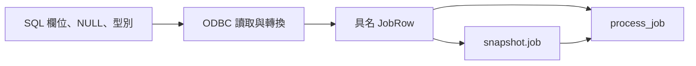

# 04｜把 SQL 讀出的那一小包值存起來

昨天那筆資料會失敗，今天卻被別人修掉了。你有 SQL 文字，卻沒有當時真正傳進 C++ 核心的值。先別急著備份整個資料庫；把核心入口收到的那一小包資料留下，往往已能省掉大半重跑成本。

## 你要保存哪一側？



檔案保存點在轉換之後。這個位置容易重播核心，卻也可能忠實保存「已被轉錯的值」。因此重播通過，只能把下一個問題指向轉換之前，不能宣布資料庫沒問題。

## 先保存，再原樣重播

本書 fixture 用短的 `key=value` 格式，避免第一個實驗先依賴 JSON 函式庫。它不是任意資料匯出格式：一筆工作、一行一欄、note 不含換行；格式版本與規則也要保存。

```text
schema=1
rule=double-v1
job_id=1
input_value=10
note=null
```

`note=null` 是 NULL；`note=text:` 是空字串；`note=text:null` 才是四個字母的文字。不要把這三者壓成同一個空值。

先跑[第 03 章](03-test-mode.md)的固定輸入，會得到 `run-fixed/snapshot.job`。保留 binary 不變，改用它當入口：

```powershell
.\build\field_lab.exe --input fixture --fixture .\run-fixed\snapshot.job --effect preview --out run-replay
```

先預測 Result 不變，再比 `result.jsonl`。本版相同。這裡沒有資料庫，省掉的是重建現場與查詢，不是把整個 DB 模擬出來。

## 再只換一個條件

附的 `below.job` 只把 input_value 改成 9。以相同 exe、同一 preview 路徑執行，Result 會變為 score 18、accepted false。若你同時改規則與輸入，就無法從差異知道是哪個條件起作用。

再試一次把 schema 改成 2。這次不是期待另一個答案，而是期待拒絕：沒有對應的 reader，就不應猜測新格式代表什麼。範例也拒絕重複與未知欄位；不是在 map 覆蓋後假裝資料一直很乾淨。

## 怎麼接回真 SQL？

完成 SQL 環境後，執行：

```powershell
.\run-sql-case.ps1 mapping
```

它對專用庫的合成列讀取 job_id、input_value、NULL note，進同一個 `job_core.h`，本版得到 score 20。這是單一基準的真 DB 對照；完整 note 匯出器尚未實作，不能拿這個案例宣稱任意字串、時區或 DECIMAL 都能 round-trip。

帶回專案時，先在轉換完成處保存少量已授權資料，另記 SQL 投影、C target 型別、indicator、規則設定與排序。若業務依序處理資料，順序也是輸入；不能為了 diff 好看就排序。敏感欄位只取合成或經授權去識別的樣本，不把整庫備份當作便利預設。

## 留下什麼才夠？

一筆能說明問題的 fixture、其契約、對應 binary／規則版本，通常比一堆沒有來源的 dump 好用。成本是 fixture 會過期；當核心輸入改了，要決定升版或留下舊 reader，而不是默默補預設值。

接著到[第 05 章](05-diagnostics.md)看轉換之前如何保存證據；要自動比兩輪則看[第 16 章](16-uv-diff.md)。

## 換個情境想一次

檔案重播永遠正確，真 DB 路徑偶爾少字，可以刪掉 DB 測試嗎？

<details><summary>核對判準</summary>

不能。檔案入口跳過 ODBC 轉換，下一步比 DB 值、buffer、indicator 和完整性。這正是保存點決定可推論範圍的例子。

</details>

機制核對：[SQLGetData](https://learn.microsoft.com/en-us/sql/odbc/reference/syntax/sqlgetdata-function)。本章檔案格式為自行設計；[實測範圍](appendix-validation.md)。
