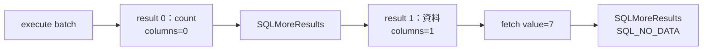

# 07｜SQL 工具有資料，程式卻說零列：縮到一個 batch

你把 SQL 貼到工具，有資料；程式說沒有。先別升級 driver。拿一份直接 SELECT 的成功案例，和一份保留 INSERT＋SELECT 的失敗形狀，看看差在哪個結果位置。

## 一次 execute，可能不是一張表

多句 SQL 合成的 batch 可以回傳受影響列數，也可以回傳真正的 result set。你的程式若只看第一個結果，有可能看見「一列被插入」，卻還沒走到「那一列的值」。



這是本書實測 batch 的形狀，不是所有 driver／batch 固定都有兩格。圖要你看「現在站在哪個 result」，不是只背呼叫順序。

## 保留造成差異的那一小段

範例在自己的 session 建立 `#batch` 臨時表，插入 7 再 SELECT；不改正式表。執行前先預測第一格是不是資料：

```powershell
.\run-sql-case.ps1 batch
```

本版得到：

```text
result=0 columns=0 row_count=1
result=1 columns=1 row_count=-1
value=7
```

`-1` 不是「負一列」，更不是零列；此處 SELECT 的 row count 不可得，卻確實 fetch 到一列。因此要用 `SQLNumResultCols` 辨認有無欄位，再依契約讀完資料、前進到下一個結果。

## 縮小，不是把觸發條件刪掉

把 INSERT 刪掉，只剩 SELECT，問題可能消失。但那不代表原程式已修好，只代表你把結果序列改成更簡單的形狀。最小重現應保留「哪個條件讓程式讀錯位置」，而不只是追求最短 SQL。

`SQLMoreResults` 也不是偷看：如果目前 result 還有未讀資料，前進會丟棄它。要明確決定哪些結果讀完、哪些不需要；不要在共用 helper 裡默默跳掉半張表。

有人會加 `SET NOCOUNT ON` 後宣稱解決。它可能改變 count 的可見性，但不能取代你和 batch／procedure 約定的完整結果契約。本版沒有把所有 NOCOUNT、trigger 或 output parameter 組合跑遍，延伸時每次只改一項，保存完整序列。

## 把哪個東西留下？

留下成功與失敗形狀各一份小 SQL、driver／engine 版本，以及每個 result 的 ordinal、欄數、取列數與診斷。修改 wrapper 後再跑兩份，成本很低；不用為一次調查造萬用 SQL 測試平台。

## 換個情境想一次

你加 NOCOUNT 後第一個 result 就是資料，能永久忽略其餘結果嗎？

<details><summary>核對判準</summary>

不能。先查實際 batch 的契約：後面可能還有資料、錯誤或 output parameter 完成時點。workaround 改了可見形狀，不等於找到了所有失敗原因。

</details>

研究入口是 [nanodbc #247](https://github.com/nanodbc/nanodbc/issues/247)，但本書自造案例不宣稱重現該 issue 根因或修補。機制核對：[Multiple Results](https://learn.microsoft.com/en-us/sql/odbc/reference/develop-app/multiple-results)；[驗證紀錄](appendix-validation.md)。
