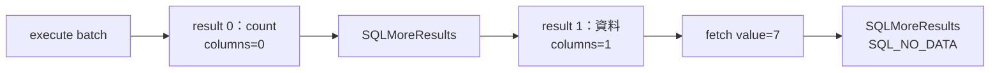

# 07｜SQL 工具有資料，程式卻說零列：縮到一個 batch

你把 SQL 貼到工具，有資料；程式說沒有。先別升級 driver。拿一份直接 SELECT 的成功案例，和一份保留 INSERT＋SELECT 的失敗形狀，看看差在哪個結果位置。

## 接著上一章：先有資料列，才談得上取欄位

[第 06 章](06-data-contract.md)的查詢只回一張資料表，所以可以 execute 後直接 fetch。這次保留一段多句 SQL 一起送出的 **batch**。它可能依序回傳「修改了幾列」的計數結果，以及有欄位、可逐列讀取的 **result set**；兩者不能都當成資料表讀。

打開 `sql_lab.cpp` 的 `batch()`。其中 `s.exec(...)` 的固定 SQL 拆行後如下；這是閱讀用的 SQL，不必另外在工具執行，程式已會送出：

```sql
SET NOCOUNT OFF;
CREATE TABLE #batch(v int);
INSERT #batch VALUES(7);
SELECT v FROM #batch;
```

`SET NOCOUNT OFF` 保留受影響列數訊息；`#batch` 是這條連線工作階段內的臨時表，欄位 `v` 存整數。後兩句先插入 7，再把它讀出來。它不改 `Jobs`，也不需要你先建立另一張永久表。

問題就在這裡：execute 完後，你可能先站在「插入了一列」的結果上，還沒站在「那一列的值」上。



這是本書實測 batch 的形狀，不是所有 driver／batch 固定都有兩格。圖要你看「現在站在哪個 result」，不是只背呼叫順序。

## 保留造成差異的那一小段

本章不改原碼或重建，先觀察現成迴圈。執行前預測：第一個結果可能沒有欄位，但不代表整個 batch 沒資料；應繼續前進，最後讀到 7。在[第二層環境](appendix-lab.md#sql-lab)就緒後，從範例目錄執行：

```powershell
Set-Location D:\scratch\cpp-sql-lab
.\run-sql-case.ps1 batch
```

本版得到：

```text
result=0 columns=0 row_count=1
result=1 columns=1 row_count=-1
value=7
```

腳本一次跑完；以下三個原碼片段說明輸出的來處，不是讓你重複貼上三段程式。

## 外層看結果，內層才看資料列

外層 `for (int index = 0;; ++index)` 每輪站在一個 result，先問它長什麼樣：

```cpp
SQLSMALLINT cols = 0; SQLLEN rows = -1;
check(SQLNumResultCols(s.h, &cols), SQL_HANDLE_STMT, s.h, "num-cols");
check(SQLRowCount(s.h, &rows), SQL_HANDLE_STMT, s.h, "row-count");
std::cout << "result=" << index << " columns=" << cols << " row_count=" << rows << '\n';
```

`columns=0` 表示目前不是可取欄位的資料結果。第一格的 `row_count=1` 是 INSERT 的受影響列數，不是已 fetch 一列。第二格 `columns=1` 才有 `v` 欄位；其 `row_count=-1` 表示此處 SELECT 列數不可得，不是「負一列」或「零列」。

只有 `cols > 0` 才進內層。下面將原碼迴圈拆行排版：

```cpp
for (;;) {
    const auto rc = SQLFetch(s.h);
    if (rc == SQL_NO_DATA) break;
    check(rc, SQL_HANDLE_STMT, s.h, "batch-fetch");
    std::cout << "value=" << s.integer(1) << '\n';
    ++total;
}
```

`SQLFetch` 每次移到一列；`s.integer(1)` 再以 `SQLGetData` 讀第一欄。這個迴圈才印出 `value=7` 並累計實際資料列數。這裡的 `SQL_NO_DATA` 只代表**目前這個 result** 的列讀完，外層還沒結束。

不論當前結果有沒有欄位，外層最後都做：

```cpp
const auto rc = SQLMoreResults(s.h);
if (rc == SQL_NO_DATA) break;
check(rc, SQL_HANDLE_STMT, s.h, "more-results");
```

`SQLMoreResults` 把位置移到下一個 result；它回 `SQL_NO_DATA` 才表示沒有更多結果。最後 `expect(total == 1, ...)` 核對總共讀到一列，因此 `PASS` 不只是「第一個 API 沒失敗」。目前程式印出 7 供你比對，但最後的斷言只核對列數，不是任意 batch 的內容正確性測試。

## 縮小，不是把觸發條件刪掉

把 INSERT 刪掉，只剩 SELECT，問題可能消失。但那不代表原程式已修好，只代表你把結果序列改成更簡單的形狀。最小重現應保留「哪個條件讓程式讀錯位置」，而不只是追求最短 SQL。

`SQLMoreResults` 也不是偷看：如果目前 result 還有未讀資料，前進會丟棄它。要明確決定哪些結果讀完、哪些不需要；不要在共用 helper 裡默默跳掉半張表。

有人會加 `SET NOCOUNT ON` 後宣稱解決。它可能改變 count 的可見性，但不能取代你和 batch／procedure 約定的完整結果契約。本版沒有把所有 NOCOUNT、trigger 或 output parameter 組合跑遍，延伸時每次只改一項，保存完整序列。

## 把哪個東西留下？

留下成功與失敗形狀各一份小 SQL、driver／engine 版本，以及每個 result 的 ordinal、欄數、取列數與診斷。修改 wrapper 後再跑兩份，成本很低；不用為一次調查造萬用 SQL 測試平台。

## 換個情境想一次

你加 NOCOUNT 後第一個 result 就是資料，能永久忽略其餘結果嗎？

<details><summary>核對判準</summary>

不能。先查實際 batch 的契約：後面可能還有資料、錯誤或 output parameter 完成時點。workaround 改了可見形狀，不等於找到了所有失敗原因。

</details>

下一章把焦點從「讀哪個結果」移到[送出的參數何時被讀取](08-bind.md)。研究入口是 [nanodbc/nanodbc#247](https://github.com/nanodbc/nanodbc/issues/247)，但本書自造案例不宣稱重現該 issue 根因或修補。機制核對：[Multiple Results](https://learn.microsoft.com/en-us/sql/odbc/reference/develop-app/multiple-results)；[驗證紀錄](appendix-validation.md)。
