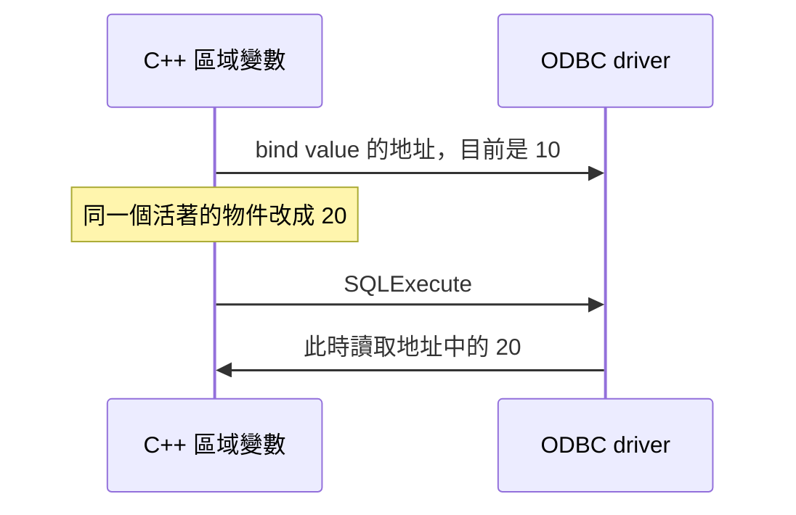

# 08｜bind 時明明正確，執行時為什麼變了？

debugger 停在 bind，參數是 10；資料庫收到的卻像 20。SQL 文字看了十次都沒錯。這時先不要懷疑 driver 偷改值，先問它是在什麼時候讀那塊記憶體。

## 把 bind 想成登記地址，先別想成拍照

[上一章](07-results.md)處理了 execute 之後讀取結果的位置。這次往前看：SQL 送出之前，參數值究竟放在哪裡？**bind** 是把 SQL 的值參數和 C++ 記憶體建立關聯，不是把整份 C++ 物件序列化後立即送出。

本章的 storage 就是存值的那塊記憶體。一般同步輸入參數的 value pointer 和 indicator pointer 都可能延後使用。`SQLBindParameter` 告訴 driver「資料在哪裡、怎麼解讀」；execute 時那塊 storage 還必須有效，而且裡面要是本次想送的值。



圖中的「同一個活著的物件」很重要。本章不用懸空指標製造看似穩定的結果；未定義行為不是好教具。

## 先讀 bind 前後的五行，不用製造 crash

打開 `sql_lab.cpp` 的 `bind_value()`，先看這段實際原碼。本章不改程式、不需要重建：

```cpp
Statement s(c); SQLINTEGER value = 10; SQLLEN indicator = 0;
const char* query = "SELECT CAST(? AS int)";
check(SQLPrepareA(s.h, reinterpret_cast<SQLCHAR*>(const_cast<char*>(query)), SQL_NTS), SQL_HANDLE_STMT, s.h, "prepare");
check(SQLBindParameter(s.h, 1, SQL_PARAM_INPUT, SQL_C_SLONG, SQL_INTEGER, 0, 0, &value, 0, &indicator), SQL_HANDLE_STMT, s.h, "bind");
value = 20;
```

第一行讓 `value` 和 `indicator` 活在整個函式的作用域內。第二行的 `?` 是待填入的**值參數**；`CAST(... AS int)` 讓 SQL 端明確以整數解讀它。這份 SELECT 只回傳參數值，不寫入 `Jobs`。

第三行 prepare 登記 SQL，這裡還沒有執行查詢。第四行把第 `1` 個問號綁成輸入參數：`SQL_C_SLONG` 描述 C 端 `SQLINTEGER`，`SQL_INTEGER` 描述 SQL 端型別，`&value` 與 `&indicator` 才是借給 driver 的兩個地址。固定大小整數不是字串，別把其中的長度參數照搬去綁文字。

第五行只改同一個仍然活著的 `value`，從 10 改成 20，沒有重新 bind。接下來才真正執行並讀回：

```cpp
check(SQLExecute(s.h), SQL_HANDLE_STMT, s.h, "execute-bound");
s.fetch();
const int read = s.integer(1);
expect(read == 20, "deferred value");
```

這是同函式原碼拆行後的片段。`SQLExecute` 使用先前 prepare／bind 的設定；fetch 移到結果列，`integer(1)` 取第一欄。到這裡再問：driver 若在 bind 拍照，會回 10；若 execute 才讀地址，應回 20。

## 執行後，把 received 和預測對起來

在[第二層環境](appendix-lab.md#sql-lab)就緒後，從存有範例的 PowerShell 工作目錄執行：

```powershell
Set-Location D:\scratch\cpp-sql-lab
.\run-sql-case.ps1 bind
```

核對 `case=bind`。本版接著印出 `bind-time=10 execute-time=20 received=20` 與 `PASS`。前兩個數字是程式印出的固定情境標籤，`received` 才是 SQL 讀回的值；它還經過 `expect(read == 20, ...)` 檢查。

因此這次差異可歸因於讀取時點，而不是 storage 已失效。如果沒有得到 20，先保留診斷與編譯產物識別，不要靠懸空指標再造另一個不可解釋的結果。

若你要送 bind 當時的 10，最小做法是讓已綁物件在這次同步執行完成前保持 10；或保留獨立的 snapshot 變數並綁它的地址。這是需要自行改碼重建的延伸練習，不是另一個 CLI 選項。單純複製出 snapshot 卻仍綁 `&value`，不會改變送出的值。

## 回到原程式，要查哪個物件？

先畫出 value 與 indicator 的擁有者：是在呼叫端、短命 helper 的區域變數，還是 vector 內部？然後找 bind 到 execute 之間會不會離開作用域、修改字串或讓容器重新配置。

「指標變數還在」不等於「它指向的 storage 還在」。這和 C++ 借用記憶體的問題相同；SQL 只是把真正使用時間拖到另一個呼叫。若 storage 已確認穩定，再查 C 型別、SQL 型別、長度和 NULL indicator，而不是一次改四件事。

本版限定同步、普通輸入參數。非同步、data-at-execution（執行期間分次提供資料）、輸出參數有額外完成時點；不拿這個小案例當完整生命週期保證。已綁定狀態也可能跨多次 execute 保留，下一輪必須有新的正確值。

## 留著，還是撤回？

調查時先把小 buffer 與 indicator 拉回同一個明確作用域，可能已足夠定位。常用路徑再補一個持有者與生命週期測試，不必為「看起來正規」把每種 SQL 型別包成大型框架。

## 換個情境想一次

helper bind 完就 return，呼叫端稍後 execute。review 第一眼要看什麼？

<details><summary>核對判準</summary>

看 value buffer 與 indicator 的擁有者、存活範圍及中間是否搬動。只檢查 statement handle 還存在不夠；兩個 deferred pointer 都必須有效。

</details>

下一章接著分清[可 bind 的值與 SQL 結構](09-fixed-sql.md)。來源：[SQLBindParameter](https://learn.microsoft.com/en-us/sql/odbc/reference/syntax/sqlbindparameter-function)；[本版實測](appendix-validation.md)。
