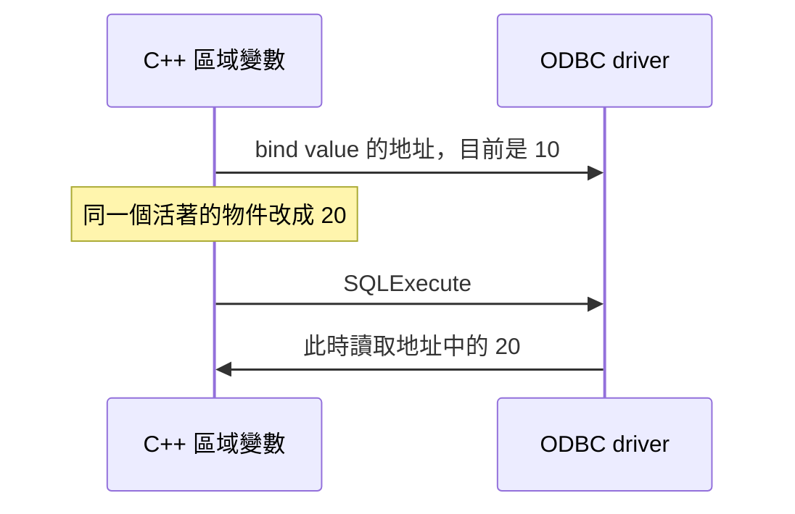

# 08｜bind 時明明正確，執行時為什麼變了？

debugger 停在 bind，參數是 10；資料庫收到的卻像 20。SQL 文字看了十次都沒錯。這時先不要懷疑 driver 偷改值，先問它是在什麼時候讀那塊記憶體。

## 把 bind 想成登記地址，先別想成拍照

一般同步輸入參數的 value pointer 和 indicator pointer 都可能延後使用。`SQLBindParameter` 告訴 driver「資料在哪裡、怎麼解讀」；execute 時那塊 storage 還必須有效，而且裡面要是本次想送的值。



圖中的「同一個活著的物件」很重要。本章不用懸空指標製造看似穩定的結果；未定義行為不是好教具。

## 做一個不用 crash 的對照

執行前先猜資料庫會回 10 還是 20：

```powershell
.\run-sql-case.ps1 bind
```

本版印出 `bind-time=10 execute-time=20 received=20`。範例在同一作用域保存 `SQLINTEGER value`、`SQLLEN indicator`，bind 後只做 `value = 20`，再 execute 與 fetch。storage 沒消失，所以能把差異歸因於讀取時點。

若你要送 bind 當時的 10，最小做法不是責怪延後讀取，而是保留獨立的 snapshot 變數，綁它的地址，直到執行結束不修改。複製一個小值的成本常比維護通用 binder 低。

## 回到原程式，要查哪個物件？

先畫出 value 與 indicator 的擁有者：是在呼叫端、短命 helper 的區域變數，還是 vector 內部？然後找 bind 到 execute 之間會不會離開作用域、修改字串或讓容器重新配置。

「指標變數還在」不等於「它指向的 storage 還在」。這和 C++ 借用記憶體的問題相同；SQL 只是把真正使用時間拖到另一個呼叫。若 storage 已確認穩定，再查 C 型別、SQL 型別、長度和 NULL indicator，而不是一次改四件事。

本版限定同步、普通輸入參數。非同步、data-at-execution、輸出參數有額外完成時點；不拿這個小案例當完整生命週期保證。已綁定狀態也可能跨多次 execute 保留，下一輪必須有新的正確值。

## 留著，還是撤回？

調查時先把小 buffer 與 indicator 拉回同一個明確作用域，可能已足夠定位。常用路徑再補一個持有者與生命週期測試，不必為「看起來正規」把每種 SQL 型別包成大型框架。

## 換個情境想一次

helper bind 完就 return，呼叫端稍後 execute。review 第一眼要看什麼？

<details><summary>核對判準</summary>

看 value buffer 與 indicator 的擁有者、存活範圍及中間是否搬動。只檢查 statement handle 還存在不夠；兩個 deferred pointer 都必須有效。

</details>

來源：[SQLBindParameter](https://learn.microsoft.com/en-us/sql/odbc/reference/syntax/sqlbindparameter-function)；[本版實測](appendix-validation.md)。
