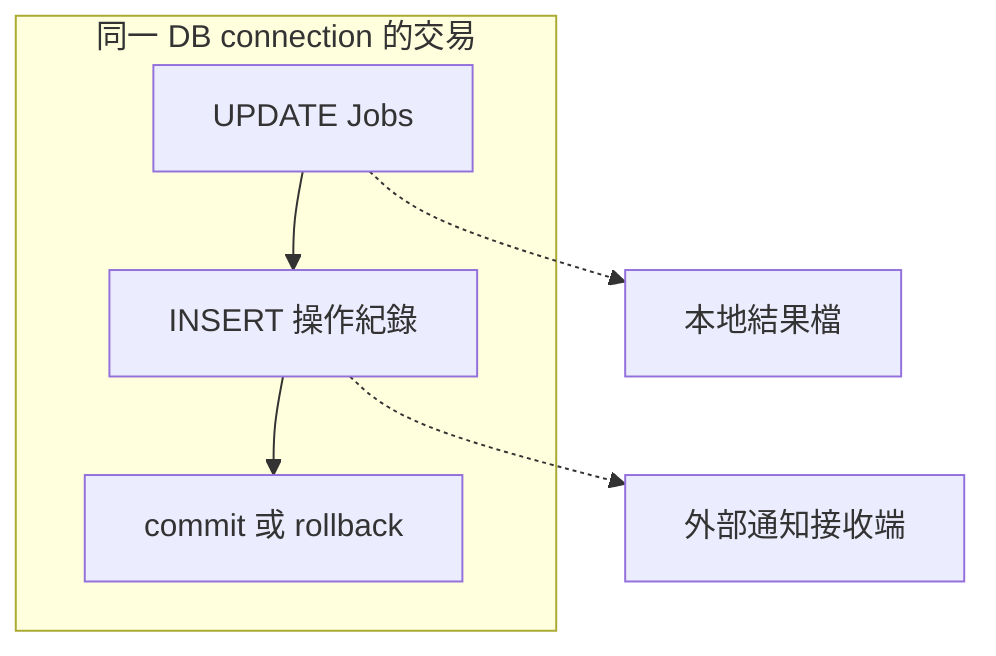

# 11｜想試寫再反悔？先確認 rollback 管得到哪裡

「我只是試一下，最後 rollback 就好。」這句話省掉了兩個重要前提：寫入是否還在同一個未提交交易裡？外部效果是不是根本不歸資料庫管理？

## 先用一列看懂 autocommit

ODBC 連線可處在自動提交模式：一個 statement 完成後，其交易可能已提交。你之後呼叫 rollback，不是時光倒流。手動提交模式才讓應用明確決定這一段何時 commit／rollback。

在專屬合成庫執行，不要搬去共用 DB：

```powershell
.\run-sql-case.ps1 rollback
```

本版先在 autocommit 更新 score 為 5，再呼叫 `SQLEndTran(..., SQL_ROLLBACK)`。回傳成功，讀回仍是 5。先停在這裡：成功描述的是 API 呼叫，不是「先前所有效果都消失」。

接著範例在同一條連線關掉 autocommit，更新成 6，自己讀得到 6；rollback 後用另一條連線讀得 5。最後恢復合成 seed 的 NULL。這個順序讓你分開「看得到自己的未提交寫入」與「rollback 後持久化狀態」。

## 畫出管理範圍，才知道哪裡能反悔



外面的兩格不會因 DB rollback 自動消失。這是邊界示意，不表示範例真的對外送通知；本書沒有正式通知服務。

移植時要特別找 SELECT 前 reset、SP 裡的效果、第二條 connection，以及自動提交是否被 wrapper 改過。不是在最外面加一行 rollback，所有函式就自動加入同一個交易。

## 在 C++ 裡，把清理和原始失敗分開

範例用 connection 物件保存手動模式狀態，離開時嘗試 rollback 與 disconnect；成功路徑仍明確 `end()`。destructor 的最後防線不能證明未知提交已復原，清理失敗也要另外記錄，不能覆蓋原始錯誤。

使用 ODBC 管理交易時，本書採 `SQLSetConnectAttr` 和 `SQLEndTran`，不混用任意文字 `BEGIN/COMMIT` 假定 driver 一定同步理解。SQL 工具裡手動跑交易是另一條控制路徑，不能不加說明地和 C++ 混在一起。

## 暫停 debugger 也有成本

你握住交易去喝咖啡，其他工作可能就在等。一次調查只需要留下紀錄，不必把長交易做成永久開發模式。要故意等，先用[下一章](12-lock-wait.md)有時間界線的兩連線實驗。

## 換個情境想一次

rollback 後資料列恢復，但自增編號有跳號，是否代表 rollback 失敗？

<details><summary>核對判準</summary>

不能拿號碼連續性當通用判準；確認目標引擎對 identity／sequence 的契約。先以本次應撤回的資料變更核對，不把資料庫外或不同機制的效果混進來。

</details>

來源：[Committing and Rolling Back](https://learn.microsoft.com/en-us/sql/odbc/reference/develop-app/committing-and-rolling-back-transactions)。本次沒有通知撤銷實驗；[驗證範圍](appendix-validation.md)。
