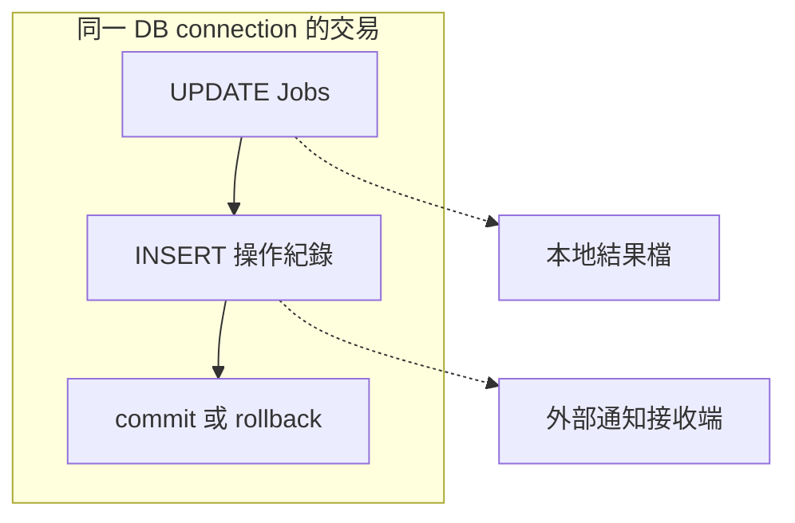

# 11｜「最後 rollback 就好」：先看寫入何時已經提交

上一章把「API 回傳」和「資料真的改成預期值」分開了。現在你終於敢試 `UPDATE`，卻又擔心把實驗資料留下。同事說：「沒關係，最後 `rollback`。」

這個建議少了一個關鍵：最後 `rollback` 的時候，那次寫入還在一個沒有提交的交易裡嗎？本章用 5 和 6 兩個數字，把差別看清楚。

本章會真的修改專用庫的工作 1。先完成[SQL 準備第二層](appendix-lab.md#sql-lab)，並單獨執行案例，不與其他章的 DB 實驗同時跑。不要把這些 SQL 貼到正式或共用資料庫。

## 先把交易理解成「這一組改動要一起作決定」

在 C++ 裡，你可以先改一個區域變數，再決定要不要把結果交出去。資料庫的交易也讓你把一段資料變更放在同一次提交／撤回的決定裡，但不要把這個類比推太遠：資料庫還要處理別的連線、鎖和持久化。

本章先只要分清三個詞：

- `UPDATE`：要求修改資料。執行成功不自動代表「之後永遠都能撤回」。
- `commit`：提交目前交易的變更。
- `rollback`：撤回仍屬於目前未提交交易的變更，不是還原任何歷史版本的按鈕。

連線可以採自動提交（`autocommit`）模式，讓本章這種單句 `UPDATE` 自行完成提交；也可以切到手動提交模式，由程式稍後明確決定。這個模式是在連線上的，不是某個任意 C++ 大括號的屬性。

## 先看實驗會走哪幾步，再執行整個案例

開啟 [sql_lab.cpp](examples/sql_lab.cpp)，搜尋 `rollback(Connection& c)`。c 是已連到合成庫的一條連線。`execute` 與 `scalar` 是本書的小 helper：前者送 SQL，後者送查詢並取回一個整數。它們不是 SQL Server 的內建函式。

案例會連續執行兩輪，不會每一步停下來等鍵盤。下面先逐段帶讀原碼，再一起跑，看最終輸出是否符合預測。若想逐步停住，可在所列 C++ 行設 breakpoint；這時只操作專用庫，不長時間放著未提交交易。

## 第一輪：先寫 5，之後才想撤回

這是函式開頭的實際順序：

```cpp
execute(c, "UPDATE dbo.Jobs SET score=5 WHERE job_id=1");
c.end(SQL_ROLLBACK);
expect(scalar(c, "SELECT score FROM dbo.Jobs WHERE job_id=1") == 5,
       "autocommit baseline");
```

SQL 的意思是：只找 `job_id` 為 1 的列，把 `score` 改成 5。此時 c 還沒有呼叫 `transaction()`，用的是自動提交模式。

第二行的 `end` 是我們的 wrapper，內部呼叫 `SQLEndTran`。看到 `SQL_ROLLBACK`，很容易以為上一行應被消掉；但上一行的單句交易已完成。第三行才是實際查驗：重新 `SELECT`，預期仍是 5。

這輪刻意保留 5，讓下一輪有清楚的起點。不要把「`rollback` 呼叫成功」讀成「資料已回到最初的 `NULL`」。

## 第二輪：先改模式，再寫 6

接下來的實際程式是：

```cpp
c.transaction();
execute(c, "UPDATE dbo.Jobs SET score=6 WHERE job_id=1");
expect(scalar(c, "SELECT score FROM dbo.Jobs WHERE job_id=1") == 6,
       "own-write");
c.end(SQL_ROLLBACK);
```

`transaction()` 不是建立新連線；它對 c 呼叫 `SQLSetConnectAttr`，把 `SQL_ATTR_AUTOCOMMIT` 設為 `SQL_AUTOCOMMIT_OFF`。現在這次 `UPDATE` 還沒有提交，c 自己可以讀到剛寫的 6。

最後才 `rollback`。這次能撤回的是「5 改成 6」這段未提交變更，所以應回到 5，不是 `NULL`。請先把這個預測寫下來，等一下核對。

撤回之後，案例另開一條 `verifier` 連線讀取：

```cpp
Connection verifier;
const int final = scalar(verifier,
    "SELECT score FROM dbo.Jobs WHERE job_id=1");
expect(final == 5, "manual rollback");
```

為什麼多開一條？因為「寫入者自己看得到」和「撤回後從另一條連線讀到」是兩種不同觀察。這裡在 `rollback` 之後才查 `verifier`，不用第二條連線去等待尚未結束的寫入交易。

## 現在跑一次，把兩個數字對回時間順序

在範例目錄執行：

```powershell
.\run-sql-case.ps1 rollback
```

先看 target 是 localhost:15439/FieldTricksLab，再找下面兩行。連線資訊診斷可能插在其中，不必期待只有這兩行：

```text
autocommit after-rollback=5
manual before-rollback=6 after-rollback=5 restored=NULL
```

| 時點 | 模式與操作 | 此時應如何理解 `score` |
|---|---|---|
| 第一輪 `UPDATE` 後 | 自動提交，寫入 5 | 5 已提交 |
| 第一輪 `rollback` 後 | 已無那次未提交變更可撤回 | 讀回仍是 5 |
| 第二輪 `UPDATE` 後 | 手動提交，寫入 6 | c 自己讀到 6，但還未提交 |
| 第二輪 `rollback` 後 | 撤回第二輪 | `verifier` 讀回 5 |
| 案例最後 | `verifier` 另做恢復 `UPDATE` | 回到教學 seed 的 `NULL` |

最後的 restored=`NULL` 不是 `rollback` 自己做的魔法，而是範例明確執行了另一句 `UPDATE`。原碼就在 final 檢查之後。這種清理只適用獨占合成資料，不能照搬到有其他人同時更新的表。

如果沒得到預期的 5，先看失敗發生在哪個 expect，以及是否有人同時跑其他 case。不要直接補一句 `UPDATE` 把結果塗成預期值；先保留錯誤與當時狀態。

## 回到原專案，rollback 到底能管到哪裡？



看圖的框，不是只看最後的 `rollback`。框內是同一連線交易管理的 SQL；框外的檔案和通知，不會因為 SQL 回滾就自動消失。這是邊界示意，本實驗沒有建立通知服務，也沒有真的發通知。

例如 `save_result` 裡偷偷開另一條自動提交連線，你在外層對 c `rollback`，就不能指望它撤回另一條連線的寫入。因此接手時要追「`UPDATE` 使用哪個 `connection`」，不能只搜尋 repo 裡有沒有 `rollback` 字樣。

儲存程序（stored procedure，常簡寫 SP）是放在資料庫中供呼叫的程式。如果原專案呼叫它，還要讀它做了什麼；外層函式名字叫 read，不等於裡面只有 `SELECT`。這是查看實際路徑的理由，不代表每次調查都要先讀完所有 SP。

## C++ 清理物件幫忙收尾，但不是結果保證

範例的 `Connection` destructor 在手動模式下嘗試 `rollback`，然後斷線。這讓例外離開作用域時還有清理機會，和你熟悉的資源物件收尾相似。

但要分清責任：成功路徑仍明確 `end`；destructor 是最後防線。若斷線或 `rollback` 本身失敗，不能只因為物件被銷毀，就宣稱資料已恢復。原始錯誤與清理錯誤要分開留下，第 05 章的觀測位置在這裡又派上用場。

這次你已經知道怎麼讓一次寫入暫時不提交。下一章不把交易留在那裡忘記，而是[故意安排另一條連線來等它](12-lock-wait.md)，用有限時間看懂「卡住」是怎麼發生的。

## 換個情境想一次

把本章第二輪的 `c.transaction()` 移到 `UPDATE` `score`=6 的後面，再 `rollback`，你預期還能回到 5 嗎？

<details><summary>核對判準</summary>

不能以這個順序期待撤回。`UPDATE` 執行時仍在自動提交模式；之後才切模式，不會把已完成的交易重新變成未提交。下一步核對設定生效的呼叫順序，而不是多呼叫幾次 `rollback`。

</details>

來源：[Committing and Rolling Back](https://learn.microsoft.com/en-us/sql/odbc/reference/develop-app/committing-and-rolling-back-transactions)。本章的 5／6 實驗已有[實測紀錄](appendix-validation.md)；沒有通知撤銷或跨系統交易實驗。
