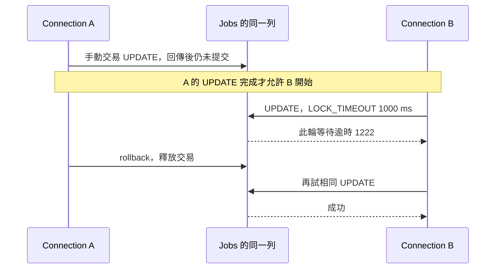

# 12｜故意讓它等一下，找出誰把資料握住了

系統偶爾卡住，加幾行 log 又不見了。與其一直重跑碰運氣，先造一個你知道誰先、誰後的等待：A 更新一列但不提交，B 再更新同一列。

## DB 的等待不只在你的 process 裡

C++ mutex 通常保護程序內的共享資料；資料庫交易持有的保護會影響其他 connection，甚至另一個程序。不是你這支程式沒開 thread，就不會遇到並行。

此實驗限定本書 SQL Server、相同合成主鍵、READ COMMITTED 與 RCSI 關閉。更新同一列的結果不能直接當成所有讀寫隔離模式的教材答案。



順序由 A 的成功回傳建立，不是 sleep 一秒猜 A 應該已經鎖住。

## 先看等待，再看釋放後的差異

```powershell
.\run-sql-case.ps1 lock
```

本版 B 等約 1002 ms，診斷含 native code 1222；A rollback 後，B 同一個 UPDATE 成功，最後恢復 score=NULL。毫秒數會因排程不同而變，本實驗看的是有界等待、相應診斷與釋放後可前進三件事。

`SET LOCK_TIMEOUT 1000` 是這條 session 的 SQL Server 鎖等待設定；不是 login timeout。程式另設 statement query timeout 5 秒作界線。兩者各管不同範圍，不能只看到「都有 timeout」就隨意替換。

若第一段立即成功，先核對是否真是兩條連線、同一資料庫同一 key、A 是否早已提交。若釋放後仍失敗，先看新診斷與交易狀態，不用同一個「應該是鎖」解釋所有現象。

## 故意變慢是定位方法，不是修復

找到長交易中夾著慢計算時，可以考慮先算、再用短交易寫回。但這把代價轉移成「計算期間資料可能被別人改過」。移出後要核對版本／舊值條件，衝突時重新判斷，不用過時結果覆蓋別人。

本版沒有實作完整 optimistic-concurrency 控制，也沒測生產負載；這是下一個專案實驗方向。眼前的小成果是：你能固定一次等待，知道觀察哪個 connection，而不是多加幾次 retry 把卡頓藏住。

測完確認兩端都已結束交易。若程式異常中止，本書 runner 的連線關閉會觸發伺服器處理未結交易，但仍應用獨立查核確認；不要以「終端不動了」當清理完成。

## 換個情境想一次

關掉多執行緒就正常，是不是修好了？

<details><summary>核對判準</summary>

你定位到某種並行條件。若業務允許串行、吞吐量也夠，它可以是有界方案；否則只是避開時序，需要查共享狀態、交易持有時間與衝突處理。先說前提再下結論。

</details>

來源：[SQL Server locking guide](https://learn.microsoft.com/en-us/sql/relational-databases/sql-server-transaction-locking-and-row-versioning-guide)。[本版版本與實測](appendix-validation.md)。
