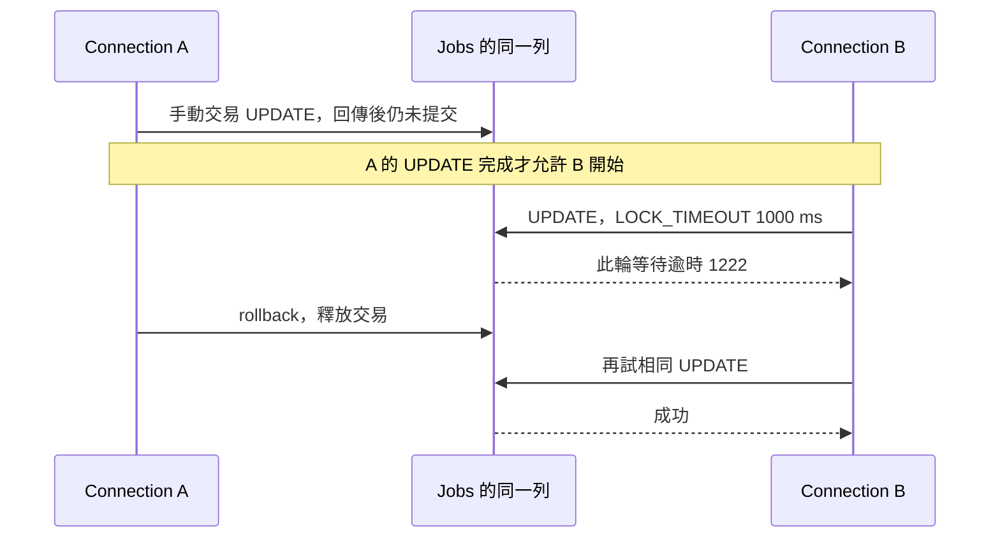

# 12｜故意讓它等一下，找出誰把資料握住了

第 11 章把 rollback 的範圍畫出來了：只有同一個仍未提交的資料庫交易，才可能被同一個交易的 rollback 撤回。這一章再往前一步，問「為什麼另一個工作會卡住」。不要把它想成 C++ 函式卡在某一行；要先確認是哪一條 connection 持有資料庫的鎖。

本書的主線工作是 `job_id=1`、`input_value=10`。SQL Server 的 `Jobs` 是資料庫表；讀出來放進 `JobRow` 後，才是記憶體裡的一個 C++ 值。`process_job` 會回傳 `score=20`，但這個回傳值不會自己寫回 `Jobs`，也不會因為 `JobRow` 還在記憶體就替另一條 connection 鎖住資料列。鎖是資料庫交易的效果。

## 先把等待條件固定下來

先完成[實驗準備第二層](appendix-lab.md#sql-lab)，已有容器就沿用，不重新初始化。本章讀現成的 `lock_wait()`，不需改碼或重建。命令必須在**下載範例的目錄**執行，因為腳本從目前目錄尋找 `build\sql_lab.exe`，不是從網站 HTML 目錄尋找。

這輪只跑一個案例，先在命令前寫下預測：

1. A 在手動交易中把資料列暫時更新為 77，但不提交，因此仍握著寫入鎖。
2. B 使用另一條 connection，把同一個 `job_id=1` 更新為 88；它應等鎖，鎖等待逾時設定為 `1000` 毫秒，實際牆鐘時間還受排程等因素影響。
3. B 的第一次 UPDATE 應回 `SQL_ERROR`，診斷裡要看 native code `1222`；A rollback 後，B 會**重新送出**同一個 UPDATE 才成功。
4. 案例最後把 score 恢復成 `NULL`。這是專用 seed 的清理，不是說每個真實交易都能安全恢復成 NULL。

```powershell
Set-Location D:\scratch\cpp-sql-lab
.\run-sql-case.ps1 lock
```

這個案例限定本書 SQL Server、相同合成主鍵、READ COMMITTED，且驗證環境的 RCSI 關閉。不同隔離設定下，讀取可能有不同等待行為；本案例的兩個操作都是更新同一列，不能把它當成所有資料庫的通用答案。



順序由 A 的成功回傳建立，不是 sleep 一秒猜 A 應該已經鎖住。這個順序保證很小，但正好足以讓一次偶發卡頓變成可讀的實驗。

## 按 A 先鎖、B 等、釋放、B 成功逐段帶讀

`main` 先建立 `Connection c`，再把它傳給 `lock_wait(c)`；所以函式參數 `a` 是已連線的 A。函式裡的 `Connection b` 會再建立一條獨立 connection，並不是同一條 connection 上的第二個 `Statement`。這個差異是本章的核心。

第一段摘自原碼，省去函式外框並拆行排版；以下片段只供對照，不是各自可編譯的完整程式：

```cpp
    Connection b;
    execute(b, "SET LOCK_TIMEOUT 1000");
    a.transaction();
    execute(a, "UPDATE dbo.Jobs SET score=77 WHERE job_id=1");
    Statement blocked(b);
```

A 的 UPDATE 成功返回，就是確認它已先取得寫入鎖的時間點。此後才從 B 送出衝突的 UPDATE，並在呼叫前後計時：

```cpp
    const auto start = std::chrono::steady_clock::now();
    const auto rc = blocked.exec_raw(
        "UPDATE dbo.Jobs SET score=88 WHERE job_id=1");
    const auto elapsed = std::chrono::duration_cast<std::chrono::milliseconds>(
        std::chrono::steady_clock::now() - start).count();
```

逐行讀它：

- `Connection b` 的 constructor 會配置 ODBC environment／connection handle、連到固定的 `FieldTricksLab`，所以 A、B 是兩個資料庫 session。
- `SET LOCK_TIMEOUT 1000` 只改 B 這條 session 的鎖等待設定。它不是登入 timeout；SQL Server 文件把它定義成 statement 等待鎖釋放的毫秒數。
- `a.transaction()` 以 `SQLSetConnectAttr` 關掉 A 的 autocommit。接著的 `UPDATE` 先成功回傳，再由 `a` 保留未提交交易；`execute(a, ...)` 內部的暫時 `Statement` 雖已離開作用域，交易仍在 A 的 connection 上。
- `blocked.exec_raw` 故意不走一般 `execute` 包裝器。這裡預期會收到錯誤，所以要先保存原始 `SQLRETURN`，而且在同一個 statement handle 上讀診斷。
- `start` 和 `elapsed` 只包住 B 的這次 UPDATE。A 的連線建立、A 的 UPDATE 和 B 的 `Connection` 建立時間都不算在等待毫秒裡。

接著先保存診斷，確認這次錯誤真的是等鎖：

```cpp
    diagnostics(SQL_HANDLE_STMT, blocked.h);
    expect(rc == SQL_ERROR, "B should hit bounded lock wait");
    SQLWCHAR state[6]{}; SQLINTEGER native = 0;
    SQLSMALLINT length = 0; SQLWCHAR message[512]{};
    check(SQLGetDiagRecW(SQL_HANDLE_STMT, blocked.h, 1, state,
        &native, message, 512, &length),
        SQL_HANDLE_STMT, blocked.h, "lock-diagnostic");
    expect(native == 1222 && elapsed >= 800 && elapsed < 6000,
        "not the expected bounded lock timeout");
```

只有錯誤種類與時間範圍符合，才走到釋放和再試：

```cpp
    a.end(SQL_ROLLBACK);
    execute(b, "UPDATE dbo.Jobs SET score=88 WHERE job_id=1");
    expect(scalar(b, "SELECT score FROM dbo.Jobs WHERE job_id=1") == 88,
        "B after release");
    execute(b, "UPDATE dbo.Jobs SET score=NULL WHERE job_id=1");
    std::cout << "B-wait-ms=" << elapsed
              << " after-A-release=success restored=NULL\n";
```

這裡有三個容易漏掉的時間點。第一，`diagnostics` 在下一個 ODBC 呼叫以前讀取 `blocked.h` 上的紀錄；`sql_lab.cpp` 會逐筆呼叫 `SQLGetDiagRecW`，所以輸出可能有一行以上的 `diag=`。第二，A 的 `SQL_ROLLBACK` 是釋放交易鎖的動作，不是讓已失敗的 B statement 自動續跑。第三，B 真的又呼叫了一次 `execute`；成功與否由這次新的 API 結果和後置 `SELECT` 一起判定。

`Statement` constructor 還會設 `SQL_ATTR_QUERY_TIMEOUT` 為 5 秒，要求 driver 限制該查詢的執行等待；不是保證整支程式五秒內結束。`SET LOCK_TIMEOUT 1000` 則是 SQL Server 對鎖等待的限制。前者是 ODBC statement 屬性，後者是 B session 裡送出的 SQL 設定，不能看到兩個數字都叫 timeout 就互換。

## 逐行解讀你應該看到的輸出

連線資訊診斷可能先出現，接著 `main` 印 `target=localhost:15439/FieldTricksLab user=book_lab case=lock`。核對這行的固定目標與 case，確認正在觀察本書的 `lock` 分支。

接下來的 `diag=` 行是 B 那個 statement 的 ODBC 診斷。不要只看 `rc`；本版驗證關注的是診斷紀錄中的 native code `1222`，而不是把任意 `SQL_ERROR` 都當成鎖等待。`SQLGetDiagRec` 會同時提供 SQLSTATE、native code 和文字；文字可能受 driver／語系影響，因此不把未固定的整段訊息當測試答案。

最後幾行依序有三個意義：

- `B-wait-ms=1002 after-A-release=success restored=NULL`：本版約等 1002 ms；`800–6000` 是程式允許的界線，不是效能保證。`after-A-release=success` 證明 A 釋放後 B 能前進；`restored=NULL` 說明清理 UPDATE 已完成。
- `PASS`：鎖錯誤、native code、等待範圍與釋放後讀回 88 的斷言通過，清理 UPDATE 也未報錯。程式沒有在清理後再 SELECT 驗證 NULL，不能把這行擴大成獨立清理驗證或「所有並行問題已解決」的收據。

若你看到等待時間合理卻沒有 `PASS`，先對照是哪一個 `expect` 失敗：native code 不對，先讀完整診斷；A 釋放後仍失敗，查 B 的新錯誤與 transaction 狀態；最後不是 NULL，先停止後續案例，不要用下一次重跑掩蓋殘留資料。實驗準備頁說的「逐章單獨跑」在這裡很重要，因為 `rollback`／`lock` 都會碰 `job_id=1`。

## 故意變慢是定位方法，不是修復

找到長交易中夾著慢計算時，可以考慮先讀出資料、在交易外做計算，再用短交易寫回。但這把代價轉成「計算期間資料可能被別人改過」。移出後要核對版本或舊值條件，衝突時重新判斷，不用過時的 `score=20` 覆蓋別人的工作。本版沒有實作完整 optimistic-concurrency 控制，也沒有測生產負載；這是下一個專案實驗方向。

眼前的小成果是：你能固定一次「A 持有、B 等待、A 釋放、B 前進」的時序，知道要觀察哪一個 connection。不要先把多幾次 retry 加上去，讓卡頓變得比較難看見。

正常離開作用域時，`sql_lab` 的 `Connection` destructor 會嘗試回滾手動交易並斷線；PowerShell runner 本身不管理 ODBC 交易。若程序被強制終止，不能保證 destructor 會執行，應另行查核伺服器是否已偵測斷線並完成未結交易的處理；不要把「終端不動了」當成清理完成。

## 換個情境想一次

關掉多執行緒就正常，是不是修好了？

<details><summary>核對判準</summary>

你定位到某種並行條件。若業務允許串行、吞吐量也夠，它可以是有界方案；否則只是避開時序，需要查共享狀態、交易持有時間與衝突處理。先說前提再下結論。

</details>

來源：[SQL Server locking guide](https://learn.microsoft.com/en-us/sql/relational-databases/sql-server-transaction-locking-and-row-versioning-guide)、[SET LOCK_TIMEOUT](https://learn.microsoft.com/en-us/sql/t-sql/statements/set-lock-timeout-transact-sql)、[SQLGetDiagRec](https://learn.microsoft.com/en-us/sql/odbc/reference/syntax/sqlgetdiagrec-function)。本版版本與實測見[驗證紀錄](appendix-validation.md)。
