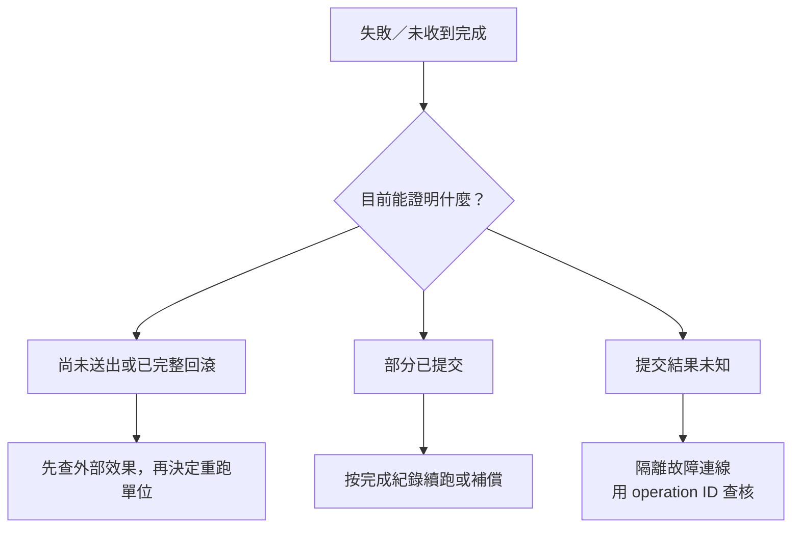

# 15｜跑到一半失敗了，先別再按一次

程式顯示失敗，你的手已經移到重試。先停一下：它是在送出之前失敗，整筆已回滾，還是資料庫寫好了、只是成功訊息沒回來？這三種狀態不能共用一個 `for (retry = 0; retry < 3; ...)`。

## 用一個便宜故障模型，看見未知的意義

本版 `retry` 在同一交易寫入 `Operations` 和 `Jobs`，commit 成功後，刻意讓上層把成功回應當成遺失。程式仍知道底層實際 commit 成功，所以這是**應用層故障模型，不是重現網路斷線或 driver 08007**。

在剛初始化的專用庫執行：

```powershell
.\run-sql-case.ps1 retry
```

第一輪會記 operation ID `chapter-15`、job_id 15、score 20；另開連線查到操作紀錄與值。這列獨立於其他章使用的 job_id 1，避免回滾／鎖案例覆蓋重試證據。它讓你看見：上層沒有拿到完成，不代表資料庫沒做。不要刪紀錄再跑，因為那正是下一輪判斷的依據。

再執行同一命令，預測第二次應不重寫。本版核對已記錄的意圖與目前結果列，再跳過 DB 寫入；若結果已漂移，拒絕自動重送，留待查核。若你先前跑過這章，第一次看到的也會是 skip，這不是重新測過首次提交，而是持久化狀態仍在；驗首次路徑需要新的可丟棄實驗庫。

## operation ID 不是印在 log 就有魔法

本例有資料庫唯一主鍵，操作紀錄與結果在同一交易提交。少掉其中一項，就可能出現「紀錄有了、結果沒有」或兩個 worker 都以為自己第一次來。先 SELECT 再 INSERT 本身不排除競爭；唯一約束才是最後一道檢查，衝突時仍需明確 rollback／查核，而不是把例外當成功。

本版只做順序重入，不宣稱測完並行去重。真實 operation key 必須代表同一個業務意圖；每次 retry 都生成新 ID，等於每次宣稱自己是新工作。

## 根據證據走下一步



這張圖沒有錯誤碼直接連到無條件 retry。逾時、取消、連線消失都要連同發生階段與交易狀態解讀。若暫時查不到，不一定代表沒寫；保持未知，別用新連線盲重送同一個不可重複效果。

## SQL 去重沒有替通知簽收

本實驗沒有正式通知端。即使資料庫只寫一次，第一次通知已送出但 ack 遺失，第二次還可能再送。要不要人工對帳、接收端去重，或進一步做 outbox，是需求與成本的決定；不必為一次救援先蓋訊息平台。

先保存可判讀的操作紀錄與失敗階段，可能已能讓你安全處理眼前工作。代價是多一張表與一致性規則，且舊紀錄清理也不能隨便破壞重試窗口。

## 換個情境想一次

同一 operation ID 的資料庫結果只一份，但客戶收到兩封通知，能說「重試已解決」嗎？

<details><summary>核對判準</summary>

只能說這個 DB 範圍有去重證據；外部效果的契約仍未處理。要提出下一個觀察：通知何時送、是否有接收識別與確認，而不只再查一次 SQL。

</details>

來源：[SQLEndTran](https://learn.microsoft.com/en-us/sql/odbc/reference/syntax/sqlendtran-function)。真實連線故障、部分批次提交、外部通知與多 writer 去重尚未重現；[本版驗證](appendix-validation.md)。
