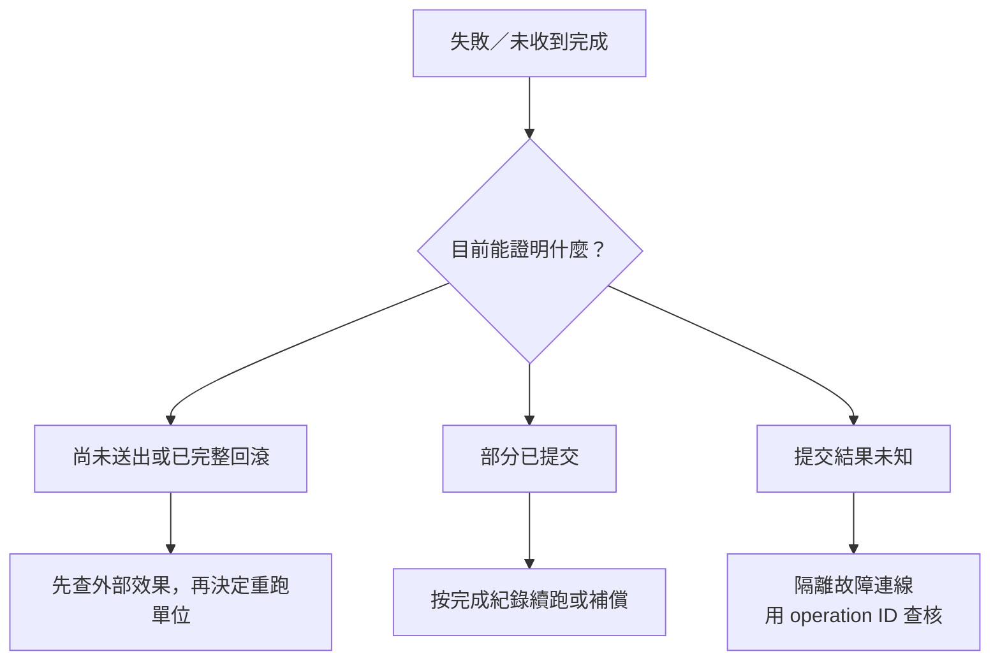

# 15｜跑到一半失敗了，先別再按一次

程式沒交回成功訊息，你的手已經移到重試。先停一下：它是在送出之前失敗，整筆已回滾，還是資料庫寫好了、只是上層沒收到成功？這三種狀態不能共用一個 `for (retry = 0; retry < 3; ...)`。對呼叫端來說「沒收到」，不是資料庫的「沒做過」。

本章把這個差別縮成一筆合成工作。**只模擬 commit 成功後丟棄應用層成功回應**，不切斷網路、不產生 driver 08007，也不是並行 operation-ID 去重服務。整支實驗程式仍知道底層提交成功；最後還會印 `PASS`，不是故意讓程序崩潰。

## 先看這次會留下哪兩份資料

打開 [sql_lab.cpp](examples/sql_lab.cpp)，找 `retry(Connection& c)`。這次不是第 13 章只讀資料、算出 `Result` 就結束；它會真的把固定的 20 寫進專用資料庫，而且**不會在成功後清回 NULL**。

| 資料 | 本章的用途 |
|---|---|
| `Jobs` 的 `job_id=15` | 工作結果的位置，提交後 `score=20` |
| `Operations` 的 `operation_id='chapter-15'` | 記錄這次意圖是把工作 15 的 score 寫成 20 |

`job_id` 指哪一筆工作；operation ID 指哪一次業務意圖，兩者不應混成一個概念。[seed.sql](examples/seed.sql) 將 `operation_id` 設為主鍵，資料庫不容許表內出現兩筆相同 ID。實驗使用工作 15，是為了不讓其他章對工作 1 的回滾／鎖測試覆蓋本章證據。

先沿函式走一次，不用新增 retry loop：

1. 查 `Operations` 是否已有 `chapter-15`。
2. 若已有，先核對記錄仍是工作 15、score 20，再核對 `Jobs` 目前的 score；兩者符合才跳過寫入。
3. 若沒有，開啟手動交易，把操作紀錄與工作結果一起寫入，再 commit。
4. 提交成功後才標記「丟棄應用層成功回應」，並另開 connection 查持久化結果。

交易在這裡的用途，是把兩份資料放在同一次提交範圍內；不是替「通知有沒有送達」提供答案。

## 第一輪：先預測，再看提交後還找不找得到

本次有界變動已實作在 `retry` 的 `c.end(SQL_COMMIT)` **之後**；讀者不用改原碼，也不要把故障點移到 commit 之前，否則測的是另一件事。以下是實際原碼摘錄，依賴檔案內既有 helper，不是可獨立編譯的小程式：

```cpp
c.transaction();
execute(c, "INSERT dbo.Operations(operation_id,job_id,score) VALUES('chapter-15',15,20)");
execute(c, "UPDATE dbo.Jobs SET score=20 WHERE job_id=15"); c.end(SQL_COMMIT);
```

這裡的 20 是故障模型的固定值，沒有再呼叫 `process_job`，不能拿這個案例驗計算規則。接下來的程式只印出故障模型標記，再用 `Connection verifier` 查核；沒有真實遠端呼叫端或通知端在等回應。

**執行前寫下預測**：若這是新初始化、尚未跑過 retry 的庫，原先沒有操作紀錄；這次會提交兩份資料。即使把應用層成功回應當成丟失，新連線仍應查到一筆操作紀錄與 score 20。

先完成[SQL 實驗準備](appendix-lab.md#sql-lab)，在**存放 `run-sql-case.ps1` 的範例目錄**執行。與其他 SQL 案例一樣，請單獨跑，不啟動第二個 worker：

```powershell
.\run-sql-case.ps1 retry
```

命令會自動跑完整條路徑，沒有在 commit 後停下來等你手動查表。初版已驗證首次提交後的新連線查核；下面摘出對應的程式輸出，不列連線時可能出現的額外診斷：

```text
target=localhost:15439/FieldTricksLab user=book_lab case=retry
fault-model=discard-application-ack (NOT network failure)
confirmed operation+score in new connection; do not blindly resend
PASS
```

第一行先確認目標。第二行只是本地故障模型標記，不是偵測到遠端回應遺失。第三行之前，新連線有兩個 `expect`：`COUNT(*) WHERE operation_id='chapter-15'` 必須為 1，以及 `Jobs` 中工作 15 的 score 必須為 20。**首次 verifier 沒有另外讀回 `Operations.job_id` 與 `Operations.score` 核對意圖**；那兩個值來自前面的固定 INSERT，不要把存在性查核說成完整內容比對。

因此這裡的 `PASS` 表示案例沒有丟出例外，包含上述兩項斷言通過；不表示實測了回應傳送、網路斷線或所有失敗分支。

這一輪支持的結論很窄：上層沒有拿到完成，不代表資料庫沒做。不要刪紀錄再跑，因為它正是下一輪辨認已做過的依據。

## 第二輪：保留證據，再送同一個意圖

**再次執行前先預測**：同一個 ID 應進入 `if (previous)`，先核對意圖與目前結果，然後跳過 DB 寫入；不應再次出現首次提交的故障模型標記。

仍在相同範例目錄，再執行一次：

```powershell
.\run-sql-case.ps1 retry
```

初版順序重入已驗證走這條分支，對應輸出為：

```text
operation already recorded; skip DB write; notification remains a separate question
PASS
```

這次的檢查比首次 verifier 多一個意圖條件：`COUNT(*)` 的 WHERE 同時要求 `operation_id='chapter-15' AND job_id=15 AND score=20`，接著再查工作 15 目前的 score。它們使用本次呼叫的 `Connection c`，不是首次提交分支中的 `verifier`；符合才印 skip。

因此原碼會拒絕「同 ID、不同 job_id／score」或「操作已記錄、結果值卻漂移」；核對不符時會丟例外，`main` 印 `FAIL stage=...` 並回 exit 2。這些是原碼的防線，**已驗的是意圖與結果符合時的 skip，沒有另外注入意圖衝突或結果漂移來驗證拒絕分支**，不要把它們混成已執行案例。

若你這回第一次執行就看到 skip，先問這個庫是否早已跑過本章。停止容器不會抹掉紀錄；這不是重新驗過首次提交。需要驗首次路徑時應另規劃新的可丟棄實驗庫，不為了得到預期畫面刪掉眼前證據。若查核失敗，保留診斷與目前值，先查是不是目標、意圖或結果變了，不把例外當成自動重送指令。

## operation ID 不是印在 log 就有魔法

本例同時用了資料庫唯一主鍵與同一交易。只有 log 字串，不能保證操作紀錄和結果一起提交；只有先 SELECT，也不能排除兩個 worker 都看到「尚未存在」。唯一約束能阻止重複 ID 落表，卻不會替應用程式完成衝突後的 rollback、重新查核與回應流程。

所以本版只支持**順序執行、再次進入時核對後跳過**，不宣稱測完並行去重。真實 operation key 必須代表同一個業務意圖；每次 retry 都生成新 ID，等於每次宣稱自己是新工作。

## 根據證據走下一步



這張圖是帶回專案的判讀流程，不代表每條分支本書都做過故障注入。它沒有錯誤碼直接連到無條件 retry。逾時、取消、連線消失都要連同發生階段與交易狀態解讀。若暫時查不到，不一定代表沒寫；保持未知，別用新連線盲重送同一個不可重複效果。

## SQL 去重沒有替通知簽收

本實驗沒有正式通知端。即使資料庫只寫一次，第一次通知已送出但 ack 遺失，第二次還可能再送。要不要人工對帳、接收端去重，或進一步做 outbox，是需求與成本的決定；不必為一次救援先蓋訊息平台。

先保存可判讀的操作紀錄與失敗階段，可能已能讓你安全處理眼前工作。代價是多一張表與一致性規則，且舊紀錄清理也不能隨便破壞重試窗口。

## 換個情境想一次

同一 operation ID 的資料庫結果只一份，但客戶收到兩封通知，能說「重試已解決」嗎？

<details><summary>核對判準</summary>

只能說這個 DB 範圍有去重證據；外部效果的契約仍未處理。要提出下一個觀察：通知何時送、是否有接收識別與確認，而不只再查一次 SQL。

</details>

來源：[SQLEndTran](https://learn.microsoft.com/en-us/sql/odbc/reference/syntax/sqlendtran-function)。真實連線故障、部分批次提交、外部通知與多 writer 去重尚未重現；[本版驗證](appendix-validation.md)。
