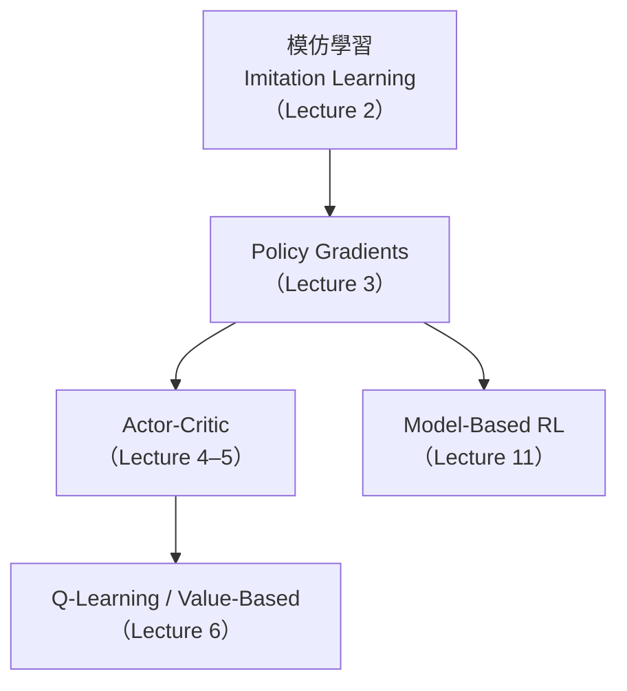

# 第一章：深度強化學習的基本框架

> **逐字稿：** Lecture 1 Class Intro（完整閱讀，2026-07-06）

## 導讀

這一章解決一個根本問題：強化學習到底在做什麼，它和我們熟悉的監督式學習有什麼本質上的不同？

在監督式學習裡，資料是一批固定的輸入–輸出對，彼此獨立同分布（IID），模型只要學會從輸入預測正確輸出就算成功。但現實世界有大量的問題不符合這個假設：推薦系統的推薦結果會影響用戶下一步的行為，機器人的動作會改變它面對的世界，聊天機器人的每一句回應都影響對話接下來的走向。這類問題的本質是**序列決策**（sequential decision-making），需要一個不同的框架來思考。

深度強化學習就是這個框架。它讓系統從自己的經驗中學習行為，而不是從預先打好標籤的答案裡學習。本章建立全書共用的語言：MDP 的五個元素、如何把真實問題寫成 RL 問題、以及 RL 的優化目標。

---

## 一、深度 RL 和監督式學習的根本差異

| | 監督式學習 | 強化學習 |
|---|---|---|
| 資料格式 | (x, y) 標注對 | 軌跡 (s, a, r, s', …) |
| 資料分布 | 固定，IID | 依賴當前策略，非固定 |
| 回饋形式 | 直接告知正確答案 | 間接的純量獎勵 |
| 優化目標 | 預測誤差最小化 | 累積期望獎勵最大化 |
| 輸入–輸出 | x → y | state → action |

最重要的差異是**資料分布依賴策略本身**。你現在的策略決定你去哪裡、看到什麼、收到什麼獎勵，而那些獎勵又回頭改變策略。這個反饋迴路是監督式學習沒有的，也是讓強化學習算法設計比梯度下降複雜得多的根本原因。

---

## 二、RL 問題的五個元素

### 2.1 狀態（State, $s$）

狀態是對世界的**完整**描述。「完整」的意思是，給定當前狀態 $s_t$，下一個狀態 $s_{t+1}$ 的分布只和 $s_t$ 與動作 $a_t$ 有關，和更早的歷史無關。這個性質叫做**Markov 性質**：

$$P(s_{t+1} \mid s_t, a_t) = P(s_{t+1} \mid s_1, a_1, \ldots, s_t, a_t)$$

以機器人為例，狀態可能包含：RGB 攝影機影像、各關節角度、各關節角速度。

### 2.2 觀測（Observation, $o$）

觀測是狀態的**部分函數**。如果感測器只能看到部分資訊（例如觸覺感測器在未接觸時什麼都測不到），那麼智能體就無法直接知道完整狀態，只有觀測。

關鍵後果：觀測不滿足 Markov 性質，因為 $o_{t+1}$ 可能依賴更早的觀測歷史。這時策略需要輸入一段觀測歷史才能做出好的決策。

以聊天機器人為例，單一的「用戶最新訊息」就是觀測（不是狀態）——想知道對話脈絡，還需要前幾輪的紀錄。

### 2.3 動作（Action, $a$）

智能體在每個時間步輸出的決策。可以是連續值（機器人的關節力矩）、離散選擇（棋步、token），也可以是整段文字（聊天機器人的回應）。

### 2.4 軌跡（Trajectory, $\tau$）

$$\tau = (s_1, a_1, s_2, a_2, \ldots, s_T, a_T)$$

時間步的粒度視應用而定：機器人常用 20 Hz（每 50 ms 一步），聊天機器人則以用戶輸入為一步，時間間隔不固定。軌跡長度 $T$ 可以是固定的，也可以是隨機的。

### 2.5 獎勵（Reward, $r$）

$$r = R(s_t, a_t)$$

純量回饋，衡量當前狀態–動作的好壞。多數情況只依賴狀態（$R(s_t)$），但有時需要考慮動作（例如對能量消耗加懲罰）。

**實際問題**：稀疏獎勵（只有在完成任務時才有非零回饋）會讓探索極度困難——如果智能體從未接近成功，訓練信號全是零。解法包括提供初始示範、或使用 Reward Shaping（第八章「Reward Learning」深入討論）。

---

## 三、策略（Policy, $\pi$）

策略是從狀態（或觀測歷史）到動作的映射：

$$a_t \sim \pi_\theta(a \mid s_t) \quad \text{（有完整狀態時）}$$
$$a_t \sim \pi_\theta(a \mid o_1, o_2, \ldots, o_t) \quad \text{（只有觀測時，需要記憶）}$$

策略以神經網路實作，參數為 $\theta$。它通常是**隨機的**（stochastic），有兩個理由：

1. **探索**：學習需要嘗試不同的策略；確定性策略無法探索新行為。
2. **建模異質行為**：如果訓練資料來自多位行為不同的人，隨機策略才能描述那種多樣性。

執行策略一次生成完整軌跡的過程，叫做一次 **rollout** 或 **episode**。

---

## 四、RL 的優化目標

RL 的目標是找到讓預期累積獎勵最大的策略：

$$\theta^* = \arg\max_\theta \, \mathbb{E}_{\tau \sim p_\theta(\tau)} \left[ \sum_{t=1}^{T} r(s_t, a_t) \right]$$

其中軌跡的分布為：

$$p_\theta(\tau) = p(s_1) \prod_{t=1}^{T} \pi_\theta(a_t \mid s_t) \cdot p(s_{t+1} \mid s_t, a_t)$$

累積獎勵不是確定量——世界動態有隨機性（$p(s_{t+1} \mid s_t, a_t)$），策略本身也是隨機的（$\pi_\theta(a \mid s)$），因此要取期望值。

### 折扣累積獎勵

若 horizon 很長或無限，可以用**折扣因子** $\gamma \in (0, 1]$ 讓遠期獎勵的比重遞減：

$$\mathbb{E}\left[ \sum_{t=1}^{T} \gamma^t \, r(s_t, a_t) \right]$$

$\gamma = 1$：等同不折扣；$\gamma$ 越小策略越短視，越在乎立即獎勵。

---

## 五、值函數與 Q 函數

為了評估策略、並用評估結果改進策略，需要兩個工具：

**值函數（Value function）：**

$$V^\pi(s) = \mathbb{E}_{\tau \sim \pi}\left[ \sum_{t'=t}^{T} r(s_{t'}, a_{t'}) \;\Big|\; s_t = s \right]$$

從狀態 $s$ 出發，執行策略 $\pi$ 後的預期累積獎勵。

**Q 函數（Action-value function）：**

$$Q^\pi(s, a) = \mathbb{E}_{\tau \sim \pi}\left[ \sum_{t'=t}^{T} r(s_{t'}, a_{t'}) \;\Big|\; s_t = s, a_t = a \right]$$

從 $s$ 採取動作 $a$（可能不是 $\pi$ 的選擇），之後再執行 $\pi$ 的預期累積獎勵。

這兩個函數的計算和使用方式，是第三章（Actor-Critic）、第五章（Q-Learning）以後的核心主題。

---

## 六、正式框架名稱

- **MDP（Markov Decision Process）**：狀態完全可觀測時使用的框架，元素為 $(S, A, R, P, \rho_0)$
- **POMDP（Partially Observed MDP）**：只有觀測可用時的框架；智能體需要維護對狀態的信念，或使用觀測歷史作為策略輸入

---

## 七、算法家族概覽

本課程涵蓋五大類算法，各有其假設和適用場景：

| 算法類別 | 核心思路 | 適用場景 |
|---|---|---|
| 模仿學習 | 模仿高獎勵示範者的行為 | 有示範資料、獎勵設計困難 |
| Policy Gradients | 直接對期望獎勵目標求梯度 | 動作空間連續、高維 |
| Actor-Critic | 學習值函數估計，輔助策略更新 | 降低 PG 的高方差 |
| Q-Learning (Value-based) | 估計最優 Q 函數，反推策略 | 離散動作、離策略資料可用 |
| Model-Based | 學習動態模型，再做規劃 | 模擬成本高、樣本昂貴 |

為什麼需要這麼多算法？因為不同場景的取捨不同：模擬器裡資料廉價（適合 on-policy 方法），真實世界資料昂貴（適合 offline 或 model-based 方法）；動作空間連續 vs. 離散；獎勵是稠密的還是稀疏的。後續每一章都會說明對應算法的適用前提。

---

## 小結

1. RL 的本質是**序列決策**問題，資料分布取決於當前策略，這讓算法設計遠比監督學習複雜。
2. 狀態（State）滿足 Markov 性質；觀測（Observation）不一定，需要歷史補足資訊。
3. 軌跡是狀態–動作的序列；獎勵函數把每一步的好壞量化成純量。
4. 策略是一個（通常是隨機的）函數，把狀態映射到動作，以神經網路實作。
5. RL 目標是最大化**預期累積獎勵**；折扣因子 $\gamma$ 控制對遠期獎勵的重視程度。
6. 值函數 $V^\pi(s)$ 和 Q 函數 $Q^\pi(s,a)$ 衡量策略的優劣，是後續所有算法的基石。
7. 整個問題的正式名稱是 **MDP**（狀態可觀測）或 **POMDP**（部分可觀測）。

---

*下一章：模仿學習（Imitation Learning）—— 如何在不明確定義獎勵的情況下，從示範資料中學習行為。*
