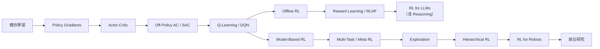

# CS224R 深度強化學習

本書整理自 Stanford CS224R Deep Reinforcement Learning（Spring 2025）的課程逐字稿，以繁體中文寫成。授課教授為 Chelsea Finn，研究領域涵蓋強化學習、機器人學與語言模型。

## 這本書是什麼

本書不是逐字稿翻譯，而是把 18 講加一場 Tutorial 的口語內容，重新組織成可閱讀、可複習、可交叉引用的書面章節。每章對應一份完整閱讀過的逐字稿，保留課程主線的演算法推導、直覺說明與工程取捨，同時去除口語冗餘。

## 目標讀者

已具備基本機器學習與深度學習背景，想系統理解深度強化學習各主流方法的學習者。本課程比 CS 234 更側重深度神經網路的實作，較少著墨於 tabular 方法與理論推導。

## 課程主線

## 章節列表

| 講次 | 主題 | 狀態 |
|---:|---|---|
| 1 | Class Intro — RL 基本框架 | 完成 |
| 2 | Imitation Learning | 完成 |
| 3 | Policy Gradients | 完成 |
| 4 | Actor-Critic Methods | 完成 |
| 5 | Off-Policy Actor Critic | 完成 |
| 6 | Q-Learning | 完成 |
| 7 | Offline RL | 完成 |
| 8 | Reward Learning | 完成 |
| 9 | RL for LLMs | 完成 |
| 10 | RL for LLM Reasoning | 完成 |
| 11 | Model-Based RL | 完成 |
| 12 | Multi-Task RL | 完成 |
| 13 | Meta RL | 完成 |
| 14 | Exploration | 完成 |
| 15 | Hierarchical RL and IL | 完成 |
| 16 | RL for Robots | 完成 |
| 17 | Advancing Robot Intelligence | 完成 |
| 18 | Frontiers | 完成 |
| Tutorial | Q-Learning Review | 完成 |

## 參考資料

- 逐字稿來源：`data/cs224r/transcripts/`
- 教科書：Sutton & Barto《Reinforcement Learning: An Introduction》（`data/cs224r/reference/RLbook2020.pdf`）
- 課程官網：待補
