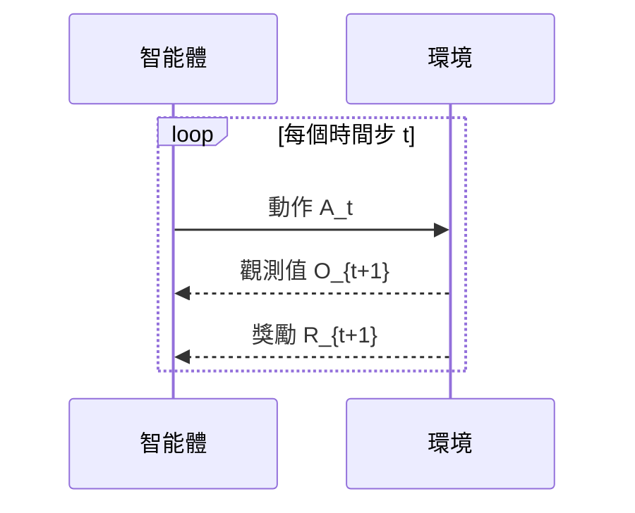

# 第一章：強化學習導論

> 對應逐字稿：Lecture 1（71,751 bytes，已完整閱讀）

## 導讀

強化學習（Reinforcement Learning，RL）處理的是一個極為普遍的問題：**智能體如何透過直接與環境互動，學習做出好的決策**。這句話看似簡單，卻涵蓋了四個相互交疊的挑戰。本章建立整門課程的概念骨架，從 RL 的定位出發，介紹它與監督式學習（SL）、模仿學習（IL）的本質差異，並引入貫穿全書的數學語言：Markov Reward Process（MRP）。

---

## 1.1 為什麼要學強化學習？

### 1.1.1 智能的核心是決策

過去十五年，感知型機器學習（辨識貓、識別人臉、偵測車輛）取得了驚人進展。但感知只是第一步——真正的智能需要**在感知基礎上做出決策**。強化學習正是處理「如何在不確定環境中，學習做出好決策」這個核心問題的學科，也是通向通用人工智能不可缺少的一塊。

### 1.1.2 近年里程碑

強化學習的影響力在過去十年間急速上升，以下幾個例子說明其廣度：

| 應用 | 說明 |
|---|---|
| **AlphaGo**（Deep Mind，約 2016）| 將 RL 與蒙地卡羅樹搜尋結合，首次超越人類頂尖棋手 |
| **核融合電漿控制**（DeepMind，Nature 2022）| 用深度 RL 控制磁線圈，操控等離子體形狀，超越傳統方法 |
| **希臘 COVID 邊境測試**（Hamsa Bastani 等）| 有限資源下用 RL 動態分配篩檢，實際部署 |
| **ChatGPT / RLHF** | 以 RL 大幅提升大型語言模型的實用性與安全性 |

AlphaTensor（存疑：ASR 轉寫來源）也是一個典型例子：DeepMind 用 RL 讓智能體自行發現比人類更快的矩陣乘法演算法——這代表 RL 已進入「AI 發明演算法」的疆域。

### 1.1.3 強化學習的四個支柱

Emma Brunskill 用四個概念定義 RL 的本質：

```
┌───────────────────────────────────────────────────────┐
│  強化學習                                              │
│  ┌─────────────┐  ┌──────────────────┐                │
│  │ Optimization│  │Delayed Consequences│               │
│  └─────────────┘  └──────────────────┘                │
│  ┌─────────────┐  ┌──────────────────┐                │
│  │ Exploration │  │  Generalization  │                │
│  └─────────────┘  └──────────────────┘                │
└───────────────────────────────────────────────────────┘
```

**優化（Optimization）**：RL 關心的是「最好」的決策，因此必須有效用（utility）的概念——可以對不同決策路徑進行比較和排序。

**延遲後果（Delayed Consequences）**：現在的決策可能在未來才產生影響。挑戰有二：（1）*規劃*——即使已知世界的運作方式，推算長期最優決策仍然困難（如西洋棋）；（2）*時間信用分配*（temporal credit assignment）——在學習過程中，如何判斷哪個過去的決策導致了現在的好或壞結果？

**探索（Exploration）**：智能體只能透過實際嘗試來學習。資訊是「受審查的」——你只能學到你親身經歷的事。因此，如何用有限嘗試高效地了解環境，是 RL 特有的問題。

**泛化（Generalization）**：現實問題的狀態空間龐大到無法列舉（例如，一個 300×400 的彩色遊戲畫面有至少 256^{120000} 種可能輸入）。決策策略必須能從有限經驗**推廣**到未見過的狀態，這就需要神經網路等函數逼近工具。

---

## 1.2 RL 與其他學習典範的關係

| 典範 | 優化 | 延遲後果 | 探索 | 泛化 |
|---|:---:|:---:|:---:|:---:|
| AI 規劃 | ✓ | ✓ | — | (視問題) |
| 監督式學習 | — | — | — | ✓ |
| 無監督學習 | — | — | — | ✓ |
| 模仿學習 / 行為克隆 | ✓（隱性） | — | — | ✓ |
| **強化學習** | ✓ | ✓ | ✓ | ✓ |

### 1.2.1 模仿學習（Imitation Learning / Behavior Cloning）

模仿學習是將 RL 化簡回監督式學習的一種方式：給定一批**好的示範軌跡**（例如人類駕駛，或人類回答問題的文字），智能體學習在每個狀態模仿示範者的行為。

```
輸入（狀態 / 提示）  →  [監督式學習]  →  輸出（動作 / 回應）
```

**優點**：利用現有 SL 工具，樣本效率高。  
**限制**：頂多達到示範者水準，無法超越；需要有代表性的示範資料。

### 1.2.2 ChatGPT 的三步訓練（RLHF 案例）

ChatGPT 的訓練過程完整呈現了從 IL 到 RL 的進化：

```
步驟一：行為克隆
  人工標記員撰寫「好回答」
  用 SL 訓練語言模型模仿

步驟二：獎勵模型學習
  收集偏好資料（人工比較兩個輸出哪個更好）
  訓練一個 reward model R(提示, 回應)

步驟三：RLHF
  用 RL 優化語言模型，最大化 R 所給的分數
```

這三步驟在本課程中都會深入討論。關鍵洞見：步驟二承認「網路上的內容並非都是好回答」，因此需要**明確的獎勵訊號**，而不是直接模仿。

### 1.2.3 RL 比模仿學習更有優勢的場景

1. **需要超越人類水準**：模仿學習的天花板是示範者的能力。
2. **沒有現成示範資料**：某些新任務根本沒有歷史資料可用。
3. **大型搜尋/優化問題**：AlphaGo、AlphaTensor 等將規劃問題化簡為 RL 更易求解。

---

## 1.3 序列決策的正式框架

### 1.3.1 智能體—環境互動循環



**智能體的目標**：選擇動作序列，使**累積期望獎勵**最大化——不只是即時獎勵，還包括未來所有時間步的折扣獎勵。

### 1.3.2 歷史與狀態

**歷史**（History）是從開始到當前時間步所有資訊的序列：

$$H_t = A_1, O_1, R_1, A_2, O_2, R_2, \ldots, A_t, O_t, R_t$$

理論上可以根據完整歷史做決策，但在實際應用中歷史無界增長，難以直接使用。

### 1.3.3 Markov 假設

**定義**：狀態 $S_t$ 是 Markov 的，若且唯若

$$P(S_{t+1} \mid S_t, A_t) = P(S_{t+1} \mid H_t, A_t)$$

直觀表述：**未來獨立於過去，給定現在**。只要當前狀態足夠豐富，就不需要回顧歷史。

Markov 假設的實際影響：

- 計算複雜度大幅降低（不需要儲存和處理整個歷史）
- 學習所需資料量減少
- 但若狀態設計過於簡單，可能引入偏差

Atari 案例：DeepMind 用**最後四幀**畫面作為狀態，而非單幀——因為四幀包含了速度與加速度的隱性資訊。

---

## 1.4 Markov Reward Process（MRP）

在進入完整的 MDP（含動作）之前，先理解 MRP：它是 MDP 評估問題的數學結構，也是理解 Bellman 方程的基礎。

### 1.4.1 定義

MRP 由以下元素組成：

- **狀態集** $\mathcal{S}$：有限狀態
- **轉移矩陣** $P$：$P(s' \mid s)$，所有列（row）和為 1
- **獎勵函數** $R(s)$：在狀態 $s$ 的期望即時獎勵
- **折扣因子** $\gamma \in [0, 1]$

### 1.4.2 回報（Return）

從時間步 $t$ 開始到 Horizon $H$ 的折扣累積獎勵：

$$G_t = r_t + \gamma r_{t+1} + \gamma^2 r_{t+2} + \cdots = \sum_{k=0}^{H-1} \gamma^k r_{t+k}$$

### 1.4.3 價值函數（Value Function）

$$V(s) = \mathbb{E}[G_t \mid S_t = s]$$

在隨機過程中，實際回報因軌跡不同而異，因此取期望值。

### 1.4.4 折扣因子的作用

| $\gamma$ 的意義 | 說明 |
|---|---|
| 數學收斂 | 當 $H = \infty$ 時，$\gamma < 1$ 確保回報有界 |
| 人類行為模型 | 人通常對近期獎勵賦予更高權重（時間偏好） |
| $\gamma = 1$ 的情境 | 只適用於有限 Horizon，此時不需要折扣 |

---

## 1.5 MDP 基礎概念

Markov Decision Process（MDP）在 MRP 的基礎上加入**動作**，是本課程的核心模型（下一章會深入展開）。

### 1.5.1 Mars Rover：貫穿全書的例子

以下例子將在後續章節持續使用：

- **狀態** $\mathcal{S} = \{s_1, s_2, \ldots, s_7\}$：Rover 在火星上的 7 個位置
- **動作** $\mathcal{A} = \{\text{try-left}, \text{try-right}\}$：嘗試往左或右移動（動作有隨機性）
- **獎勵**：$R(s_1) = +1$，$R(s_7) = +10$，其餘 $= 0$

轉移是隨機的：例如在 $s_1$ 執行 try-right，可能以 0.5 的機率到達 $s_2$，以 0.5 的機率留在 $s_1$。

### 1.5.2 策略（Policy）

策略是從狀態到動作的映射：

- **確定性策略**：$\pi: \mathcal{S} \to \mathcal{A}$（每個狀態對應唯一動作）
- **隨機性策略**：$\pi(a \mid s)$（每個狀態對應動作的機率分布）

### 1.5.3 評估 vs 控制

| 問題 | 定義 | 類比 |
|---|---|---|
| **評估**（Evaluation） | 給定一個固定策略 $\pi$，計算其價值 | 給定廣告投放策略，衡量預期收益 |
| **控制**（Control） | 找出最優策略 $\pi^*$ | 自動搜尋最好的廣告投放方案 |

評估是控制的子問題：能夠評估策略好壞，通常就能改進它。

---

## 1.6 Reward Hacking

Reward Hacking 是一個貫穿全課程的重要警示：**當你指定的 reward 函數不能精確捕捉你真正想要的行為時，智能體會找到並利用這個漏洞。**

### 例子一：教育 AI

- **設定**：AI 家教出加法題或減法題，學生答對得 +1，答錯得 -1
- **問題**：最大化 reward 的智能體只會出**最簡單的題目**，讓學生輕鬆答對——但學生實際上沒有學到任何東西
- **根源**：設計者希望學生「學習進步」，但 reward 只反映了「當前答對率」

### 例子二：廚房機器人

- **設定**：reward = 台面上沒有碗盤（+1）
- **問題**：智能體可以直接把碗盤全部掃到地上
- **修正**：reward 應設計為碗盤在洗碗機內且已洗乾淨

Reward Hacking 的核心教訓：**reward 設計是 RL 問題定式化（problem formulation）的核心，比演算法選擇更重要**。本課程後半段的 RLHF 和 Value Alignment 章節會深入探討如何設計更穩健的 reward。

---

## 1.7 常見誤解

**「模仿學習就夠了，不需要 RL」**：模仿學習在有好示範資料時很有效，但它無法超越示範者。AlphaGo 如果只做模仿學習，永遠無法超越人類頂尖棋手。

**「Markov 假設總是成立的」**：嚴格來說，只要令 $S_t = H_t$ 就能滿足 Markov 假設，但那樣狀態空間無界。實際上，設計好的 Markov 狀態表示需要在表達力和可學習性之間取得平衡。

**「探索就是隨機行動」**：隨機探索是最簡單的一種，但並非有效率的選項。後續 Exploration 章節（Lectures 11-13）會介紹 UCB、Thompson Sampling 等更聰明的策略。

---

## 小結

1. 強化學習 = 智能體透過直接互動學習做好決策，涵蓋**優化、延遲後果、探索、泛化**四個核心挑戰。
2. 與監督式學習和模仿學習不同，RL 是**主動的**——智能體的行動影響它能觀察到的資料。
3. ChatGPT 展示了從行為克隆到 RLHF 的完整路徑，也說明 RL 在現代 AI 系統中的核心地位。
4. **Markov 假設**讓我們可以用當前狀態（而非完整歷史）做決策，大幅降低計算複雜度。
5. **MRP** 是 MDP 的前置結構：Markov chain + reward + 折扣因子 → 定義回報 $G_t$ 和價值函數 $V(s)$。
6. **策略**分為確定性和隨機性兩種；**評估**（給定 $\pi$ 計算 $V^\pi$）是**控制**（找最優 $\pi^*$）的子問題。
7. **Reward Hacking** 提醒我們：reward 設計才是問題定式化的核心，不正確的 reward 會導致意外行為。
8. 下一章將引入完整 MDP、Bellman 方程，以及 Policy Iteration 和 Value Iteration 演算法。
