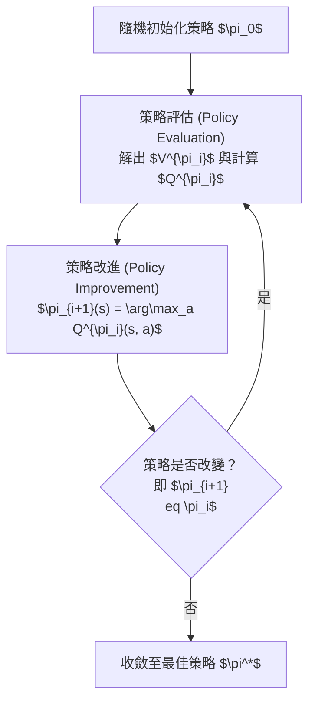

# 第 2 章：表格型 MDP 規劃 (Tabular MDP Planning)

## 2.1 前言與動機

在強化學習的研究中，我們經常渴望直接跳入諸如 AlphaGo、訓練語言模型（如 RLHF）或控制機器人等最先進的應用。然而，這些複雜且強大的系統，其底層皆建立在馬可夫決策過程（Markov Decision Process, MDP）的基礎理論之上。本章我們將退一步，在**表格型 (Tabular)** 設定下（即狀態與動作數量有限，可以將所有數值記錄在表格或陣列中）探討 MDP 的規劃問題。在這樣的設定下，我們能以最純粹、最沒有雜訊的方式，透徹理解強化學習的核心機制與數學保證。

本章聚焦的核心問題是：**在已知完整環境模型（即轉移機率與獎勵函數皆為已知）的前提下，如何有效率地計算出最佳的決策策略？** 這被稱為「規劃 (Planning)」問題。我們將這個問題拆解為兩個子問題：
1. **策略評估 (Policy Evaluation)**：給定一個固定的策略，如何準確評估其好壞（即計算期望的折扣回報）？
2. **策略控制 (Policy Control)**：如何在所有可能的策略中，找到能帶來最大回報的最佳策略？

在探討演算法時，我們特別看重一個性質——**單調改進 (Monotonic Improvement)**。我們希望隨著給予系統更多的運算資源與時間，系統所產生的策略保證會「越來越好」，而不會在好與壞之間來回震盪。

---

## 2.2 馬可夫決策過程的正式定義

一個馬可夫決策過程 (MDP) 是一個五元組 $(S, A, P, R, \gamma)$，定義如下：
- $S$：有限狀態空間 (State space)。
- $A$：有限動作空間 (Action space)。
- $P(s' | s, a)$：動態轉移模型 (Dynamics model)，代表在狀態 $s$ 採取動作 $a$ 後，轉移至下一個狀態 $s'$ 的機率。
- $R(s, a)$：獎勵函數 (Reward function)，代表在狀態 $s$ 採取動作 $a$ 所能獲得的即時獎勵。
- $\gamma \in [0, 1)$：折扣因子 (Discount factor)。

**關於折扣因子的直觀理解：**
課堂中常有一個迷思：「較大的折扣因子 $\gamma$ 代表短期獎勵比長期獎勵更重要」。事實上恰好相反——**$\gamma$ 越接近 1，代表我們越重視長期的未來獎勵**；若 $\gamma = 0$，則我們完全是短視近利的，只在乎當下即時的獎勵。

### 策略 (Policy) 與策略空間

在 MDP 中，我們的目標是尋找一個**策略 (Policy)** 來指導決策。策略可以分為：
- **隨機性策略 (Stochastic Policy)**：$\pi(a | s)$，表示在狀態 $s$ 採取動作 $a$ 的機率分佈。
- **確定性策略 (Deterministic Policy)**：$\pi: S \to A$，在每個狀態必定選擇一個特定動作。

**策略空間的大小：**
在有限狀態與動作的 Tabular MDP 中，確定性策略的總數量為 $|A|^{|S|}$。例如，對於一個擁有 7 個狀態的 Mars Rover（火星車）模型，若每個狀態有 2 種動作選擇，則存在 $2^7 = 128$ 種不同的確定性策略。雖然數量有限，但當狀態數量增加時，策略空間會呈指數級別增長，這意味著我們無法單純地枚舉所有策略來尋找最佳解。

在實際情境中（如 Mars Rover），某些動作在特定狀態下可能「不合法」或無效。例如在邊界嘗試向左移動 (`try-left`) 可能只是失敗並停留在原地。一般而言，我們允許每個狀態的合法動作集合有所不同，但為了符號簡潔，後續推導多假設全局有統一的動作空間 $A$。

---

## 2.3 策略評估與 Q 函數

當我們在一個 MDP 中固定了一個策略 $\pi$ 之後，我們實際上就消除了決策的自由度。此時，MDP 就退化成了一個**馬可夫獎勵過程 (Markov Reward Process, MRP)**。

此時的轉移矩陣與獎勵可寫為：
$$ P^\pi(s' | s) = \sum_a \pi(a | s) P(s' | s, a) $$
$$ R^\pi(s) = \sum_a \pi(a | s) R(s, a) $$

### 解析解與迭代解

評估一個策略的價值函數 $V^\pi$，即是求解以下方程式：
$$ V^\pi = R^\pi + \gamma P^\pi V^\pi $$

這是一個線性方程式系統，我們有兩種求解方式：
1. **解析解 (Analytical Solution)**：
   $$ V^\pi = (I - \gamma P^\pi)^{-1} R^\pi $$
   這種方法需要矩陣求逆，時間複雜度為 $O(|S|^3)$。當狀態空間不大時可行，但面對龐大的狀態空間極不實用。
   
2. **動態規劃迭代解 (Iterative Solution)**：
   我們初始化 $V^0(s) = 0$，然後重複套用以下更新規則：
   $$ V^k(s) = R^\pi(s) + \gamma \sum_{s'} P^\pi(s' | s) V^{k-1}(s') $$
   每次迭代複雜度為 $O(|S|^2)$，直到價值函數收斂。

### 策略版的貝爾曼方程式 (Bellman Equation)

對於給定策略 $\pi$，其價值函數滿足貝爾曼方程式：
$$ V^\pi(s) = \sum_a \pi(a | s) \left[ R(s, a) + \gamma \sum_{s'} P(s' | s, a) V^\pi(s') \right] $$

這引出了強化學習中極為關鍵的工具——**狀態-動作價值函數 (Q 函數)**：
$$ Q^\pi(s, a) = R(s, a) + \gamma \sum_{s'} P(s' | s, a) V^\pi(s') $$

Q 函數代表的直觀意義是：「如果在狀態 $s$ 先採取動作 $a$，然後從下一步開始永遠遵循策略 $\pi$，所能獲得的期望折扣回報」。價值函數與 Q 函數的關係極為密切：$V^\pi(s) = \sum_a \pi(a | s) Q^\pi(s, a)$。

---

## 2.4 策略迭代 (Policy Iteration)

知道了如何評估給定策略後，我們該如何有系統地尋找最佳策略？我們可以使用**策略迭代 (Policy Iteration)** 演算法，這是一種具有單調改進保證的交替優化方法。

### 演算法流程

在策略改進步驟中，我們對於每一個狀態，直接貪婪地選擇能使得當前 Q 函數最大化的動作：
$$ \pi_{i+1}(s) = \arg\max_a Q^{\pi_i}(s, a) $$

### 單調改進定理 (Policy Improvement Theorem)

策略迭代的核心在於它具備**單調改進保證**。

**定理陳述**：設 $\pi_{i+1}(s) = \arg\max_a Q^{\pi_i}(s, a)$，則對所有狀態 $s$：
$$ V^{\pi_{i+1}}(s) \ge V^{\pi_i}(s) $$

**證明概要**：
1. 首先建立一步改進：
   $$ V^{\pi_i}(s) = Q^{\pi_i}(s, \pi_i(s)) \le \max_a Q^{\pi_i}(s, a) = Q^{\pi_i}(s, \pi_{i+1}(s)) $$
   這告訴我們，如果在第一步採取新策略 $\pi_{i+1}$ 的動作，之後都照舊策略 $\pi_i$ 走，表現會大於等於舊策略。
2. 接下來展開 $Q^{\pi_i}(s, \pi_{i+1}(s))$：
   $$ Q^{\pi_i}(s, \pi_{i+1}(s)) = R(s, \pi_{i+1}(s)) + \gamma \sum_{s'} P(s' | s, \pi_{i+1}(s)) V^{\pi_i}(s') $$
3. 對右側的 $V^{\pi_i}(s')$ 遞迴應用步驟 1 的結論：
   $$ \le R(s, \pi_{i+1}(s)) + \gamma \sum_{s'} P(s' | s, \pi_{i+1}(s)) \max_{a'} Q^{\pi_i}(s', a') $$
4. 持續展開直至無窮步。每一步我們都引入一個 $\le$ 替換（將舊策略的價值替換為最優 Q 值），最終取極限時，等式右邊恰好代表永遠遵循新策略 $\pi_{i+1}$ 的價值函數 $V^{\pi_{i+1}}(s)$。
因此得證：$V^{\pi_i}(s) \le V^{\pi_{i+1}}(s)$。

**收斂性**：由於確定性策略總共只有 $|A|^{|S|}$ 個，且每次迭代要麼嚴格改進（不會重複造訪相同的策略），要麼策略不變而停止。因此演算法保證在有限步（至多 $|A|^{|S|}$ 步）內收斂至最佳策略。

---

## 2.5 價值迭代 (Value Iteration) 與貝爾曼算子

策略迭代在每一輪中都需要維持一個具體的策略，並對其進行完整的評估（計算至無窮視野）。另一種思路是：我們直接對最佳價值函數進行迭代逼近，這就是**價值迭代 (Value Iteration)**。

### 貝爾曼備份算子 (Bellman Backup Operator)

我們定義最佳貝爾曼備份算子 $B$：
$$ [B V](s) = \max_a \left[ R(s, a) + \gamma \sum_{s'} P(s' | s, a) V(s') \right] $$
該算子接受一個價值函數 $V$ 作為輸入，並輸出一個在每個狀態執行了一步最佳預測的新價值函數。

價值迭代的演算法非常直觀：
1. 初始化 $V^0(s) = 0 \quad \forall s$。
2. 重複套用算子 $V^{k+1} = B V^k$，也就是：
   $$ V^{k+1}(s) = \max_a \left[ R(s, a) + \gamma \sum_{s'} P(s' | s, a) V^k(s') \right] $$
3. 當 $\max_s |V^{k+1}(s) - V^k(s)| < \epsilon$（即 $\ell_\infty$-norm 小於閾值）時停止。
4. 最終策略可由 $\pi^*(s) = \arg\max_a \left[ R(s, a) + \gamma \sum_{s'} P(s' | s, a) V^*(s') \right]$ 提取。

### 壓縮映射定理 (Contraction Mapping Theorem)

為什麼價值迭代保證會收斂？這要歸功於算子 $B$ 是個壓縮映射。

**定理陳述**：當 $\gamma < 1$ 時，貝爾曼備份算子 $B$ 是 $\ell_\infty$-壓縮映射：
$$ \|B V - B V'\|_\infty \le \gamma \|V - V'\|_\infty $$

**證明**：
對於任意狀態 $s$，考察兩價值函數經過算子 $B$ 的差值絕對值：
$$ \left| [B V](s) - [B V'](s) \right| = \left| \max_a \left[ R(s,a) + \gamma \sum_{s'} P(s'|s,a)V(s') \right] - \max_{a'} \left[ R(s,a') + \gamma \sum_{s'} P(s'|s,a')V'(s') \right] \right| $$

關鍵的第一步：我們可以將這兩個分離的 max 合併。這相當於強制兩組估計使用同一個動作 $a$，這樣的限制只會縮小兩者的差距（因為原本兩者可以各取所需達到最大，合併後差距只會縮小或相等）：
$$ \le \max_a \left| \gamma \sum_{s'} P(s'|s,a) [V(s') - V'(s')] \right| $$

接著，我們利用 $\ell_\infty$-norm 的性質，因為 $|V(s') - V'(s')| \le \|V - V'\|_\infty$，將其提出：
$$ \le \max_a \gamma \sum_{s'} P(s'|s,a) \|V - V'\|_\infty $$

由於機率分佈總和為 1（$\sum_{s'} P(s'|s,a) = 1$），上式可化簡為：
$$ = \gamma \|V - V'\|_\infty $$

對所有狀態取 max，即得證 $\|B V - B V'\|_\infty \le \gamma \|V - V'\|_\infty$。

**推論**：根據 Banach 不動點定理，一個壓縮映射必定存在唯一的不動點。因此，價值迭代保證會收斂到唯一不動點 $V^*$，且結果與初始值 $V^0$ 完全無關。

---

## 2.6 有限視野 (Finite Horizon) 與 Monte Carlo 評估

### Value Iteration 的本質探討

雖然策略迭代具有策略單調改進保證，但 **價值迭代並不具備嚴格的策略單調改進性質**。
價值迭代中，第 $k$ 次迭代算出的價值函數 $V^k$，其實代表的是**如果遊戲只能玩 $k$ 步（有限視野 Horizon $k$），能獲得的最佳回報**。
在有限視野的情境下，最佳策略可能會隨著剩餘步數的不同而改變（Non-stationary）。因此，價值迭代每一次產生的策略是針對不同時間長度的最佳解，這不保證其轉換成無限視野策略時會嚴格單調改進，直到它最終收斂。

### Monte Carlo 策略評估

在許多現實問題中，我們雖然擁有環境模型（例如可以寫程式模擬的遊戲），但狀態空間大到無法在記憶體中存放轉移機率矩陣 $P$。此時，我們可以依賴 **Monte Carlo 策略評估**。

對於給定策略 $\pi$，我們可以直接從模型中進行模擬：
1. 從目標狀態 $s$ 出發。
2. 根據策略 $\pi$ 與環境動態模型實際跑出 $n$ 條軌跡 (trajectories)。
3. 計算每一條軌跡的累積折扣回報，並對這 $n$ 條軌跡取平均值，將其作為 $V^\pi(s)$ 的估計。

根據 Hoeffding 不等式等統計原理，Monte Carlo 估計的誤差會以 $O(1/\sqrt{n})$ 的速度收斂。
**優點**：它不需要顯式依賴馬可夫結構，也適用於部分可觀察 (Partially Observable) 的環境，是處理龐大狀態空間時極為強大的工具。

---

## 2.7 總結與展望

本章我們建立起強化學習最核心的理論骨架。在模型已知且可被列表化的 Tabular MDP 中，我們證明了：**我們確實能有系統地尋找最佳決策，並給出數學上的收斂性與唯一性保證。**

這確立了一個非常深刻的原則：**「更多計算 → 更好決策」**。無論是透過 Policy Iteration 的策略改進，或是透過 Value Iteration 的壓縮映射，計算力被直接轉化為決策品質。在後續章節中，當我們進入不知道模型 (Model-Free RL) 或是狀態空間大到必須使用神經網路做函數逼近 (Deep RL) 的領域時，這些基石與方程式（特別是貝爾曼方程式與 Q 函數）將繼續貫穿全課，成為所有先進演算法的靈魂。
