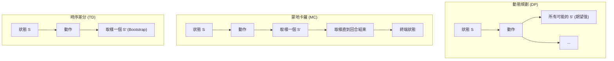
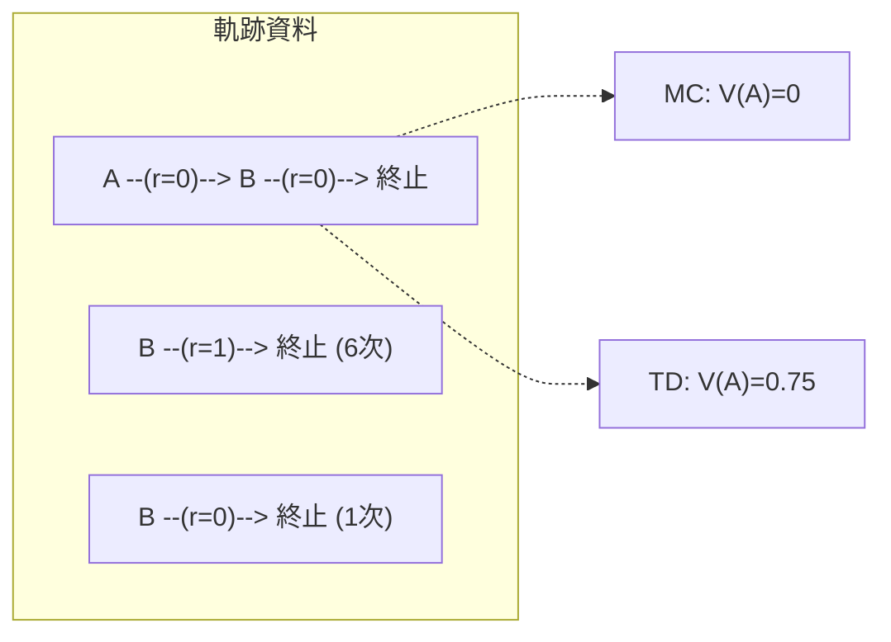

# 第 3 章：策略評估 (Policy Evaluation)

## 3.1 簡介與動機 (Introduction and Motivation)

在第 2 章中，我們探討了當環境模型（即狀態轉移機率 $P$ 與獎勵函數 $R$）完全已知時，如何利用動態規劃（Dynamic Programming）中的貝爾曼方程式（Bellman Equation）來進行策略評估與控制。然而，在許多真實世界的應用中（如醫療決策制定、自動駕駛等），我們往往無法事先獲得這些完美的數學模型。

本章將探討在**無模型（Model-Free）**的設定下，智能體（Agent）如何僅憑藉與環境直接互動所產生的經驗軌跡（Trajectories）資料，來估計一個給定策略 $\pi$ 的狀態價值函數 $V^\pi(s)$。這種從資料中學習評估策略好壞的方法，是後續發展進階強化學習演算法（如 Q-Learning、Policy Gradient 等）的基石。

我們將介紹兩種最核心的模型無關策略評估方法：**蒙地卡羅（Monte Carlo, MC）**與**時序差分學習（Temporal Difference Learning, TD）**。

---

## 3.2 蒙地卡羅策略評估 (Monte Carlo Policy Evaluation)

蒙地卡羅方法是一種基於經驗平均的直接評估法。其核心思想是讓智能體在環境中實際執行策略 $\pi$，直到回合（Episode）終止，然後計算該回合的完整累計回報（Return）$G_t$，並以多條軌跡回報的平均值來逼近真實的期望價值。

回報 $G_t$ 的定義為：
$$G_t = r_t + \gamma r_{t+1} + \gamma^2 r_{t+2} + \dots = \sum_{k=0}^{H-1} \gamma^k r_{t+k}$$

而狀態價值函數即為回報的期望值：
$$V^\pi(s) = \mathbb{E}_\pi [G_t \mid S_t = s]$$

### 首訪與每訪蒙地卡羅 (First-Visit vs Every-Visit MC)

在同一條軌跡中，智能體可能會多次經過同一個狀態 $s$。根據我們如何處理這些重複訪問，蒙地卡羅方法可分為兩種變體：

1. **首訪蒙地卡羅（First-Visit MC）**：在單一回合中，僅在狀態 $s$ **首次出現**時才計算並記錄其回報 $G_t$。由於每回合對每個狀態最多取樣一次，各回合的樣本相互獨立（IID），因此首訪 MC 是一個**無偏估計（Unbiased Estimator）**。
2. **每訪蒙地卡羅（Every-Visit MC）**：在單一回合中，**每一次經過**狀態 $s$ 都計算並記錄其對應的尾部回報。由於同一回合內多次訪問的回報樣本是高度相依的，每訪 MC 是一個**有偏估計（Biased Estimator）**。然而，隨著資料量增加，它仍然具備一致性（Consistent），且通常能更有效率地利用資料以降低變異數。

### 增量式更新 (Incremental MC)

為了避免在記憶體中保留所有歷史回報的數值，我們通常採用增量式的方式來更新狀態價值：

$$V(s_t) \leftarrow V(s_t) + \frac{1}{N(s_t)} \bigl(G_t - V(s_t)\bigr)$$

若我們引入一個可變的學習率（Learning Rate）$\alpha$，此更新規則可推廣為機器學習中常見的形式：

$$V(s_t) \leftarrow V(s_t) + \alpha \bigl(G_t - V(s_t)\bigr)$$

蒙地卡羅方法的最大優勢在於**它不需要馬可夫假設（Markov Property）**即可運作。然而，其最大的限制是**必須等待回合終止（Episodic）**才能計算 $G_t$，對於無限視野（Infinite Horizon）或回合非常長的問題則極不適用。

---

## 3.3 時序差分學習 (Temporal Difference Learning, TD)

為了克服蒙地卡羅必須等待回合結束的缺點，時序差分學習（TD Learning）結合了蒙地卡羅的「取樣（Sampling）」特性與動態規劃的「自舉（Bootstrapping）」特性。

### TD(0) 演算法與核心思想

TD(0)（表示往後看零步，即單步更新）的核心思想是：不需等待回合結束，只要智能體經歷了一個狀態轉移 tuple $(s_t, a_t, r_t, s_{t+1})$，就可以立即利用對下個狀態 $s_{t+1}$ 的現有估計值，來更新當前狀態 $s_t$ 的價值。

其更新公式如下：
$$V(s_t) \leftarrow V(s_t) + \alpha \bigl(r_t + \gamma V(s_{t+1}) - V(s_t)\bigr)$$

在這裡，我們定義了兩個極為重要的概念：
- **TD 目標（TD Target）**：$r_t + \gamma V(s_{t+1})$。我們用即時獎勵加上對未來的估計來作為更新的目標。這就是所謂的 **自舉（Bootstrapping）**——用現有的估計值來更新另一個估計值。
- **TD 誤差（TD Error）**：$\delta_t = r_t + \gamma V(s_{t+1}) - V(s_t)$。代表著新獲得的預測資訊與原本預測之間的差異。

### 狀態更新視覺化比較

以下圖表展示了動態規劃（DP）、蒙地卡羅（MC）與時序差分（TD）在進行狀態更新（Backup）時的視野差異：

如上圖所示：
- **DP** 展開所有可能的未來轉移並計算期望值（利用已知模型）。
- **MC** 取樣一條單一軌跡並走到回合盡頭（取樣但不自舉）。
- **TD** 取樣一步，隨後直接使用對該狀態的現有估計值進行截斷（取樣且自舉）。

---

## 3.4 偏差與變異數的取捨 (Bias-Variance Tradeoff)

在評估策略時，我們必須在估計的偏差（Bias）與變異數（Variance）之間做出取捨。

| 方法 | 偏差 (Bias) | 變異數 (Variance) | 是否需等回合結束？ | 一致性 (Consistency) |
|---|---|---|---|---|
| **首訪 MC** | 無偏 | 高 | 是 | 是 |
| **每訪 MC** | 有偏 | 較低 | 是 | 是 |
| **TD(0)** | 有偏 | 低 | 否 | 是 (需滿足特定條件) |

- **MC 的高變異數**：因為一條完整的軌跡包含許多隨機的狀態轉移與動作選擇，所有這些隨機性疊加起來使得最終回報 $G_t$ 的變異數非常大。但因為它使用的是真實回報，首訪 MC 估計是無偏的。
- **TD 的有偏與低變異數**：TD 僅依賴一步的轉移隨機性，因此變異數低得多。然而，由於 TD 目標使用了價值函數的當前估計值 $V(s_{t+1})$（這在學習初期通常是錯誤的猜測），它是一個有偏估計。

儘管兩者在有限樣本下表現不同，只要學習率 $\alpha$ 滿足 **Robbins-Monro 條件**（即 $\sum \alpha_t = \infty$ 且 $\sum \alpha_t^2 < \infty$），增量 MC 與 TD(0) 在無限資料下都會漸進收斂至真實的價值函數 $V^\pi$。

---

## 3.5 確定性等效 (Certainty Equivalence)

除了 MC 和 TD 之外，還有一種簡單直觀的方法被稱為**確定性等效（Certainty Equivalence）**。
其作法是：我們直接利用收集到的經驗軌跡，計算經驗分佈以建立一個**最大概似（Maximum Likelihood）MDP 模型**。

對於所有經歷過的狀態與動作，我們估計其轉移機率 $\hat{P}$ 與獎勵 $\hat{R}$：
$$\hat{P}(s' \mid s, a) = \frac{N(s, a, s')}{N(s, a)}$$
$$\hat{R}(s, a) = \frac{\sum_{t: s_t=s, a_t=a} r_t}{N(s, a)}$$

建立好這組估計模型後，我們假裝它就是「確定的（Certain）」真實模型，並直接套用第 2 章的動態規劃演算法來求解價值函數。
此方法的優點是對稀少資料的利用效率極高；但缺點是計算極為昂貴，因為每次資料更新後可能都需要重新執行 $O(|\mathcal{S}|^2)$ 等級的矩陣運算。

---

## 3.6 批次策略評估 (Batch Policy Evaluation)：MC vs TD(0) 的根本差異

當我們擁有的資料量趨近於無限時，MC 與 TD(0) 都會收斂至相同的真實價值函數。但如果我們只擁有**有限的批次資料（Batch Data）**，並不斷重複在這批資料上反覆訓練至收斂，兩者將會收斂到截然不同的結果！

為了理解這個根本差異，我們引入 Sutton & Barto 教科書中極其著名的 **「雙狀態 AB 範例」**。

### 雙狀態 AB 範例

假設環境中有兩個狀態 A 與 B，且折扣因子 $\gamma = 1$。我們收集到了以下 8 條有限的軌跡資料：
- 1 條軌跡：$A \xrightarrow{0} B \xrightarrow{0} \text{終止}$
- 6 條軌跡：$B \xrightarrow{1} \text{終止}$
- 1 條軌跡：$B \xrightarrow{0} \text{終止}$

**試問：在反覆訓練後，$V(A)$ 與 $V(B)$ 的收斂值分別為何？**

#### 計算 $V(B)$
對於狀態 B 而言，總共出現了 8 次。其中 6 次得到獎勵 1，2 次得到獎勵 0。
因此，無論是 MC 還是 TD(0)，皆會輕鬆計算出 $B$ 的期望價值為：
$$V(B) = \frac{6}{8} = 0.75$$

#### 計算 $V(A)$
對於狀態 A，情況就變得很有趣了：
- **MC 的視角**：MC 只在乎它實際從狀態 A 開始所看到的總回報。在這 8 條軌跡中，A 只出現過 1 次，並且隨後的完整回報是 0（0 + 0 = 0）。因此，**MC 收斂的結果為 $V(A) = 0$**。
- **TD(0) 的視角**：TD(0) 會利用狀態轉移的關係進行 Bootstrap。當它看見 $A \xrightarrow{0} B$ 時，會將 A 的價值更新為：$V(A) \leftarrow 0 + \gamma V(B)$。由於我們已經學到 $V(B) = 0.75$，因此 **TD(0) 收斂的結果為 $V(A) = 0.75$**。

### 核心結論
上述的差異揭示了兩種演算法對於資料的本質觀點：
1. **批次 MC 收斂到「最小化觀測回報的均方誤差（Minimum MSE）」**。它完全不使用馬可夫假設，僅就觀測到的歷史事實做最佳擬合。
2. **批次 TD(0) 收斂到「最大概似 MDP 模型的動態規劃解」**（即與確定性等效 Certainty Equivalence 方法的結果完全相同）。它**深度利用了馬可夫結構**，推斷既然從 A 一定會走到 B，那麼 A 的價值理應包含 B 的期望價值。

---

## 3.7 總結

本章探討了在無模型情況下如何對既定策略進行評估：
- **蒙地卡羅（MC）**方法不依賴模型結構，在處理違反馬可夫假設的場景時依然穩健，但面臨高變異數且無法應用於無限視野問題的困境。
- **時序差分（TD）**方法透過自舉（Bootstrapping）機制大幅降低了變異數，並能即時更新（Online update）。它是強化學習中最重要且最具代表性的核心演算法，並為後續探討如何改進策略（控制問題）與引入神經網路函數逼近奠定了基礎。
- 在面對有限資料的批次學習設定下，TD(0) 隱式地建立了對資料的馬可夫模型信念，而 MC 則嚴格忠於歷史觀測回報的最小平方法擬合。在後續的離線強化學習（Offline RL）中，我們將反覆面臨這種「是否信任馬可夫假設」的深刻取捨。
