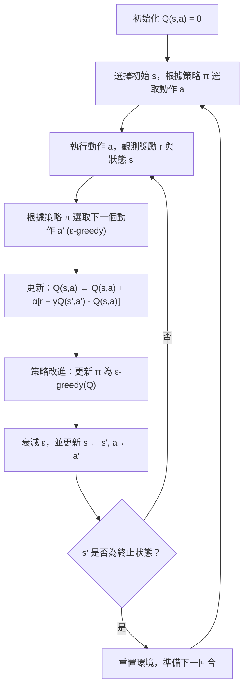
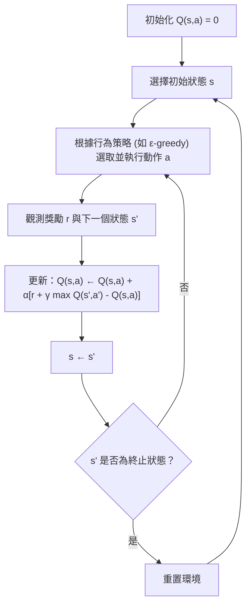
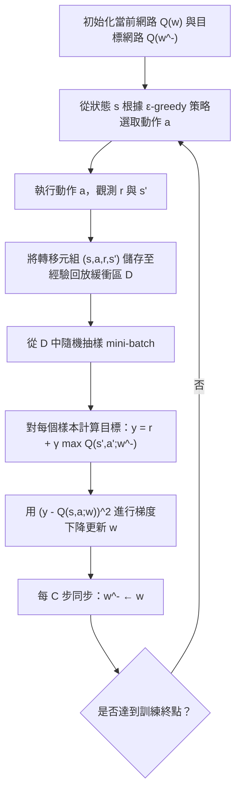

# 第四章：Q-learning 與函數逼近 (Q-learning and Function Approximation)

本章將延續我們先前對策略評估 (Policy Evaluation) 的討論，並正式探討如何直接從與環境的互動中學習最佳策略，也就是無模型控制 (Model-Free Control) 的核心問題。我們將從表格型 (Tabular) 的方法出發，介紹蒙地卡羅控制 (Monte Carlo Control)、SARSA 以及 Q-learning。接著，為了解決高維度或連續狀態空間（例如 Atari 遊戲的像素輸入）帶來的維度災難，我們將引入函數逼近 (Function Approximation) 技術，探討其與強化學習結合時面臨的「致命三角 (Deadly Triad)」挑戰。最後，我們將詳細剖析 DeepMind 在 2014 年提出的深度 Q 網路 (Deep Q-Network, DQN) 演算法，看看它是如何透過經驗回放 (Experience Replay) 與固定目標網路 (Fixed Q-Targets) 等關鍵創新，成功解決上述挑戰並在多款 Atari 遊戲中超越人類表現。

---

## 4.1 探索與利用的困境 (Exploration vs. Exploitation) 與 $\varepsilon$-greedy 策略

在進行無模型控制時，智能體 (Agent) 面臨的第一個核心挑戰是**探索與利用的權衡 (Exploration vs. Exploitation)**。
*   **利用 (Exploitation)**：根據目前累積的知識，選擇預期回報最高的動作，以獲取高分。
*   **探索 (Exploration)**：嘗試那些尚未被充分評估的動作，以發現潛在更好的策略。

如果我們一直使用確定性 (Deterministic) 策略，我們在同一個狀態下永遠只會選擇同一個動作，這將導致我們無法獲得其他動作的數據，從而無法準確估計它們的價值（這就好比你每天去同一家咖啡館點同一杯咖啡，雖然安全，但你永遠不知道其他咖啡是否更好喝）。

為了解決這個問題，我們可以引入隨機性，最簡單且有效的方法是 **$\varepsilon$-greedy 策略**。

### $\varepsilon$-greedy 策略

在 $\varepsilon$-greedy 策略中，我們以極高的機率 $1-\varepsilon$ 選擇目前認為最優的動作（貪婪選擇），並以較小的機率 $\varepsilon$ 在所有可用動作中隨機選擇：

$$
\pi(a|s) = 
\begin{cases} 
1 - \varepsilon + \frac{\varepsilon}{|A|}, & \text{if } a = \arg\max_{a'} Q(s, a') \\
\frac{\varepsilon}{|A|}, & \text{otherwise}
\end{cases}
$$

**單調改進定理 (Monotonic Improvement)**：
即便我們引入了隨機探索，策略迭代的收斂性依然可以得到保證。定理表明，如果當前策略 $\pi_i$ 是相對於 $Q^{\pi_i}$ 的 $\varepsilon$-greedy 策略，那麼透過策略改進得到的新 $\varepsilon$-greedy 策略 $\pi_{i+1}$ 將保證其價值函數不低於舊策略，即對所有狀態 $s$ 均滿足 $V^{\pi_{i+1}}(s) \geq V^{\pi_i}(s)$。

---

## 4.2 GLIE (Greedy in the Limit of Infinite Exploration)

為了保證學習演算法最終能收斂到最佳策略，行為策略必須滿足 **GLIE (Greedy in the Limit of Infinite Exploration)** 條件：
1.  **無限次訪問**：所有的狀態-動作對 $(s, a)$ 必須被訪問無限次：
    $$ \lim_{k \to \infty} N_k(s, a) = \infty \quad \forall s, a $$
2.  **漸進收斂至貪婪策略**：隨著時間推移，行為策略必須逐漸趨向於完全依賴 Q 值的貪婪策略：
    $$ \lim_{k \to \infty} \pi_k(a|s) = \mathbf{1}\Big[a = \arg\max_{a'} Q_k(s, a')\Big] \quad \text{with probability 1} $$

一個滿足 GLIE 條件的簡單方法是使用 $\varepsilon$-greedy 策略，並讓 $\varepsilon$ 隨時間衰減（例如 $\varepsilon_k = 1/k$）。

---

## 4.3 蒙地卡羅控制 (Monte Carlo Control)

基於 GLIE，我們可以使用蒙地卡羅方法進行控制。其骨架如下：
1. 在目前策略 $\pi_k$ 下採樣一條完整的軌跡 (Episode)。
2. 計算軌跡中每個狀態-動作對的回報 $G_t$。
3. 對首次訪問的 $(s,a)$，將其 Q 值更新為舊估計與 $G_t$ 的加權平均。
4. 策略改進：將下一回合的策略 $\pi_{k+1}$ 設為相對於最新 $Q$ 的 $\varepsilon$-greedy 策略。

蒙地卡羅控制在符合 GLIE 條件下可收斂至 $Q^*$。然而，它需要等待完整軌跡結束才能進行更新，且對於長軌跡或隨機性較強的環境，回報 $G_t$ 的變異數較大（就像只開車去舊金山一次沒有塞車，不能就認定那條路永遠不塞車，需要大量的回合平均）。因此，時序差分 (Temporal Difference, TD) 方法通常是更好的選擇。

---

## 4.4 SARSA：在線策略時序差分控制 (On-policy TD Control)

**SARSA** 代表了一次更新所需經歷的五個元素：狀態 (State) - 動作 (Action) - 獎勵 (Reward) - 下一個狀態 (State') - 下一個動作 (Action')。

更新公式為：
$$ Q(s_t, a_t) \leftarrow Q(s_t, a_t) + \alpha \Big[ r_{t+1} + \gamma Q(s_{t+1}, a_{t+1}) - Q(s_t, a_t) \Big] $$

SARSA 屬於**在線策略 (On-policy)** 演算法，因為它用來計算目標值 (Target) 的動作 $a_{t+1}$，正是智能體根據當前策略 $\pi$ 在 $s_{t+1}$ 實際採取的動作。

**收斂條件**：
當策略滿足 GLIE 條件，且學習率 $\alpha_t$ 滿足 Robbins-Monro 序列條件（即 $\sum_t \alpha_t = \infty$ 且 $\sum_t \alpha_t^2 < \infty$，如 $\alpha_t = 1/t$），tabular SARSA 將收斂至最優的 $Q^*$。

---

## 4.5 Q-learning：離線策略時序差分控制 (Off-policy TD Control)

相較於 SARSA，**Q-learning** 是一種**離線策略 (Off-policy)** 方法。它直接去逼近最佳的 $Q^*$ 函數，而不管當前實際用來產生數據的行為策略是什麼。

Q-learning 的更新公式：
$$ Q(s_t, a_t) \leftarrow Q(s_t, a_t) + \alpha \Big[ r_{t+1} + \gamma \max_{a'} Q(s_{t+1}, a') - Q(s_t, a_t) \Big] $$

關鍵差異在於，目標值中使用了 $\max_{a'}$ 而非實際採取的 $a_{t+1}$。這意味著 Q-learning 用「如果接下來都採取最佳動作」的假設來評估當前動作的價值。

**收斂條件**：
在 tabular 設定下，Q-learning 不需要行為策略滿足 GLIE（即使完全隨機探索也可學到 $Q^*$），只要確保所有的 $(s, a)$ 被訪問無限次，且步長滿足 Robbins-Monro 條件，Q-learning 就會收斂至 $Q^*$。但請注意，如果我們在訓練完成後希望執行最優策略，我們仍然需要讓測試時的策略轉變為純粹的貪婪策略。

---

## 4.6 函數逼近 (Function Approximation) 的動機

到目前為止，我們的方法都假設 Q 函數可以表示為一個巨大的表格 (tabular)。但在真實世界的問題中（例如 Atari 遊戲），狀態空間極為龐大（如 $256^{120000}$ 種可能的像素組合）。維護一個表格是不現實的：
1.  **記憶體不足**：無法儲存這麼多狀態的 Q 值。
2.  **運算時間過長**：無法逐一更新。
3.  **缺乏泛化能力 (Generalization)**：在表格型方法中，學到某個狀態的 Q 值，完全無法幫助我們推論另一個稍微相似狀態的 Q 值。

為此，我們引入**函數逼近**。我們使用一個參數化的函數（例如線性模型或深度神經網路）來表示 Q 函數：$Q(s, a; w) \approx Q^{\pi}(s, a)$。這讓我們能夠以較少的參數 $w$ 來泛化並預估從未見過的狀態的價值。

---

## 4.7 致命三角 (The Deadly Triad)

當我們將函數逼近與 Q-learning 等 TD 方法結合時，面臨一個理論與實務上的重大挑戰——**致命三角 (Deadly Triad)**。Sutton & Barto 指出，當以下三個條件同時存在時，強化學習演算法可能會變得不穩定甚至發散：

1.  **自舉 (Bootstrapping)**：如 TD 方法中，目標值依賴於對未來狀態的現有估計 $\hat{Q}(s')$。
2.  **函數逼近 (Function Approximation)**：使用如類神經網路等模型來泛化價值函數。
3.  **離線策略學習 (Off-policy Learning)**：如 Q-learning，用來生成數據的策略與我們試圖評估/最佳化的目標策略不同。

**直觀原因**：
Bellman 算子在真實的價值空間中是一個壓縮映射 (Contraction Mapping)。然而，函數逼近的擬合步驟可能是一個「擴張算子 (Expansion Operator)」。Gordon (1995) 曾展示，在使用線性函數逼近時，經過參數更新後，估計值之間的距離可能會被放大。當壓縮與擴張交替進行時，演算法便無法保證收斂到穩定的固定點。

---

## 4.8 深度 Q 網路 (Deep Q-Network, DQN) 的創新

儘管致命三角在理論上存在發散的風險，DeepMind 團隊在 2014 年發表的 DQN 論文中證明了，透過精心設計的工程與演算法架構，我們依然可以在極其複雜的任務（直接從像素輸入玩 Atari 遊戲）中獲得巨大的成功。

DQN 透過兩個關鍵創新打破了致命三角帶來的魔咒：

### 創新 1：經驗回放 (Experience Replay)
DQN 維護一個巨大的**回放緩衝區 (Replay Buffer)** $\mathcal{D}$，將智能體與環境互動產生的轉移元組 $(s, a, r, s')$ 儲存起來。在訓練時，DQN 不直接使用最新收集的單一樣本，而是從 $\mathcal{D}$ 中隨機抽樣一個 mini-batch 來進行梯度下降更新。
*   **優點**：打破了序列數據間強烈的時間相關性（逼近 IID 假設），使得函數逼近過程更穩定；同時大幅提升了樣本的使用效率（Data Efficiency）。

### 創新 2：固定 Q 目標網路 (Fixed Q-Targets)
在傳統的 Q-learning 中，TD 目標 $y = r + \gamma \max_{a'} Q(s', a'; w)$ 依賴於正在不斷被更新的權重 $w$。這會導致目標不斷移動，使得訓練變得極不穩定。
DQN 引入了另一個**目標網路 (Target Network)**，其權重為 $w^-$。TD 目標變為：
$$ y = r + \gamma \max_{a'} Q(s', a'; w^-) $$
這組目標權重 $w^-$ 會被凍結，只在每隔固定的 $C$ 步後才與當前網路的權重 $w$ 進行一次同步 ($w^- \leftarrow w$)。這使得在每一次同步的週期內，我們面對的就像是一個目標固定的監督式學習問題，顯著提升了穩定性。雖然這會導致記憶體需求翻倍（需儲存兩份網路），但計算量不變。

### DQN 演算法流程

**消融實驗的啟示**：
在論文的消融實驗中，若僅使用深度神經網路而不使用回放緩衝區和固定目標，其效果並不比簡單的線性函數逼近好。加入固定目標後超越了線性模型；而**加入回放緩衝區則是帶來了爆炸性的效能提升**（分數提升了數十倍至數百倍）。結合兩者，最終誕生了能夠廣泛應用於不同 Atari 遊戲且無需修改超參數的 DQN。

---

## 4.9 總結：學會決策的意義

Q-learning 作為無模型控制的基石，讓智能體能在未知環境動態的情況下，透過簡單的互動與試錯學習到最佳策略。而 DQN 則進一步展示了如何透過引入經驗回放與固定目標網路，將強化學習的優美理論與深度學習的強大表示能力結合，克服了「致命三角」的不穩定性，為現代深度強化學習 (Deep RL) 奠定了重要基礎。
