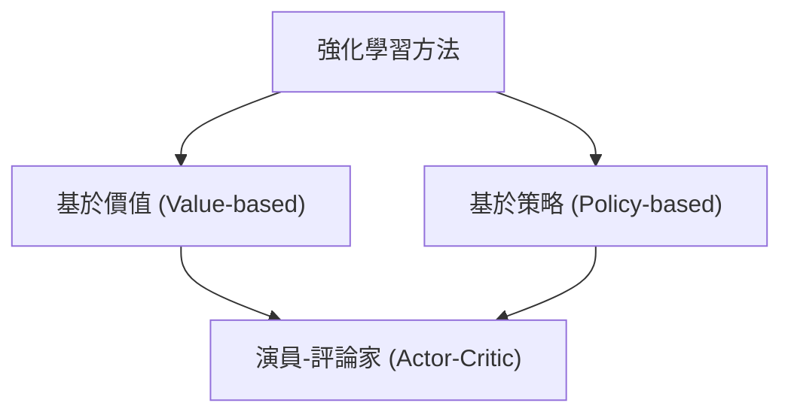

# 第五章：策略搜尋（一）

在前幾章中，我們主要探討了**基於價值（Value-based）**的強化學習方法，例如 Q-learning、SARSA 以及深度 Q 網路（DQN）。這些方法的核心思想是學習狀態或狀態-動作對的價值函數，然後透過貪婪（Greedy）或 $\epsilon$-貪婪策略來推導出確定的行動。然而，基於價值的方法在某些情況下會面臨挑戰。本章將介紹另一大類重要的強化學習方法——**策略搜尋（Policy Search）**與**策略梯度（Policy Gradient）**，直接對策略進行參數化並進行優化。

## 5.1 為什麼需要策略搜尋？

### 5.1.1 傳統價值函數方法的限制

在進入策略搜尋之前，讓我們先回顧基於價值方法的一個潛在問題。以深度 Q 學習（DQN）為例，雖然它在許多應用上取得了巨大成功，但它並不保證一定能收斂到最佳的 Q 函數。其中一個主要原因是**可實現性（Realizability）**問題：我們所選擇的函數逼近器（例如某個架構的神經網路）可能根本無法精確表示真實的 Q 函數。此外，結合函數逼近、自助採樣（Bootstrapping）與離線策略學習（Off-policy learning）被稱為強化學習的「死亡三角（Deadly Triad）」，會導致訓練過程中的不穩定。

### 5.1.2 隨機性策略的必要性

基於價值的方法通常會導出**確定性策略（Deterministic Policy）**（例如始終選擇 Q 值最大的動作）。但在許多現實問題中，最佳策略往往是**隨機性策略（Stochastic Policy）**。以下是兩個需要隨機性策略的經典範例：

**範例一：剪刀石頭布（Rock-Paper-Scissors）**
如果在剪刀石頭布遊戲中採用確定性策略（例如永遠出「石頭」），對手很快就會發現這個規律並永遠出「布」來擊敗你。在這個非馬可夫（Non-Markovian，對手會根據你的歷史紀錄改變策略）的多人賽局中，任何確定性策略都會被對手利用（Strictly dominated）。此時的最佳策略是**均勻隨機策略**（即各以 1/3 的機率出剪刀、石頭、布），這也是該遊戲的納什均衡（Nash Equilibrium）。

**範例二：別名狀態（Aliased States）與部分可觀測環境**
考慮一個機器人導航問題，機器人只能感知其上下左右是否有牆壁（即部分可觀測環境，Partially Observable Environment）。假設環境中有兩個不同位置的灰色網格，它們的感知特徵完全相同（這稱為別名狀態）。
- 如果使用基於價值的確定性策略，機器人在這兩個灰色網格中必須採取相同的動作（例如都「向東」或都「向西」）。這將導致它在其中一個位置必然會撞牆或陷入死胡同，永遠無法到達終點取得獎勵。
- 相反地，如果採用隨機性策略，在這些灰色狀態中以 50% 的機率向東、50% 的機率向西，機器人平均而言能夠更快且成功地抵達目標。

透過引入隨機性，策略搜尋能夠更自然地處理這種不完整資訊與部分可觀測的挑戰。

### 5.1.3 強化學習方法的分類

根據大衛·席爾瓦（David Silver）的分類，強化學習方法可依據是否維護顯式的價值函數與策略，劃分為三大類：

1. **基於價值（Value-based）**：僅學習價值函數，策略是隱式的（如 $\epsilon$-greedy）。
2. **基於策略（Policy-based）**：僅學習策略參數，不學習價值函數。
3. **演員-評論家（Actor-Critic）**：同時學習策略（演員）與價值函數（評論家），如著名的 AlphaGo 便是此類方法的代表。

## 5.2 無梯度方法與連續優化

既然我們決定直接尋找一個好策略，我們可以將其視為一個**最佳化問題**。給定一個由參數 $\theta$ 決定的策略 $\pi_\theta$，我們的目標是最大化該策略的期望總獎勵 $V(\theta)$。

解決這個最佳化問題最直接的方式之一是使用**無梯度方法（Gradient-Free Methods）**，例如爬山法（Hill Climbing）、遺傳演算法（Genetic Algorithms）或**交叉熵方法（Cross-Entropy Method, CEM）**。

**交叉熵方法（CEM）**的概念是：我們維護一個策略參數的機率分布。在每一次迭代中，從該分布中平行採樣出多個策略參數，在環境中測試它們的表現，然後挑選出表現最好的前幾名（精英子集），並利用這些精英的參數來更新機率分布。史丹佛大學機械系的 Stephen Collins 團隊便曾利用 CEM 在 2-3 小時內，快速為穿戴式外骨骼找到個人化的最佳步態參數，顯著提升了使用者的代謝效率（此研究發表於《Science》）。

無梯度方法的**優點**包含：
- 不需要策略函數是可微的。
- 非常容易進行平行化運算。
- 在獎勵函數極度複雜或模型難以建立時，常能作為強大的基準線（Strong Baseline）。

然而，它的**缺點**在於它忽略了馬可夫決策過程（MDP）中的「時間結構（Temporal Structure）」，因此通常較缺乏資料效率（Data Inefficiency）。為了更高效地學習，我們將轉向**可微（Differentiable）**的策略，並利用梯度下降/上升來進行優化。

## 5.3 策略梯度推導與似然比技巧

### 5.3.1 策略參數化與目標函數

假設我們處於回合制（Episodic）環境中，策略由參數 $\theta$ 定義。我們的目標函數為策略的期望回報：

$$ V(\theta) = \mathbb{E}_{\tau \sim \pi_\theta} \left[ \sum_{t=0}^{T} r_t \right] $$

其中，軌跡（Trajectory）$\tau = (s_0, a_0, r_0, s_1, a_1, \ldots, s_T)$。為了找到最佳參數 $\theta^* = \arg\max_\theta V(\theta)$，我們需要計算目標函數對 $\theta$ 的梯度 $\nabla_\theta V(\theta)$。

> [!IMPORTANT]
> 策略梯度的優化目標是非凸的（Non-convex），因此使用梯度下降/上升法通常只能保證收斂至**局部最佳解（Local Optimum）**，而非全局最佳解。這與表格式方法保證能找到全局最佳解有著根本的不同。

### 5.3.2 似然比技巧（Likelihood Ratio Trick）

我們可將目標函數寫為對軌跡的期望：

$$ V(\theta) = \sum_\tau p(\tau;\theta) R(\tau) $$

其中 $p(\tau;\theta)$ 是在策略 $\pi_\theta$ 下產生軌跡 $\tau$ 的機率，$R(\tau) = \sum_{t=0}^{T} r_t$ 是該軌跡的總獎勵。

對 $V(\theta)$ 取梯度：

$$ \nabla_\theta V(\theta) = \sum_\tau \nabla_\theta p(\tau;\theta) R(\tau) $$

這一步遇到了一個問題：我們無法直接對期望值內部的機率分佈求梯度並用採樣來估計。為了解決這個問題，我們引入**似然比技巧**（又稱 REINFORCE 技巧）：

我們知道對數函數的導數性質為 $\nabla_\theta \log p(\tau;\theta) = \frac{\nabla_\theta p(\tau;\theta)}{p(\tau;\theta)}$。將其移項可得：

$$ \nabla_\theta p(\tau;\theta) = p(\tau;\theta) \nabla_\theta \log p(\tau;\theta) $$

代回原式：

$$ \nabla_\theta V(\theta) = \sum_\tau p(\tau;\theta) \nabla_\theta \log p(\tau;\theta) R(\tau) $$
$$ \nabla_\theta V(\theta) = \mathbb{E}_{\tau \sim \pi_\theta} \left[ R(\tau) \nabla_\theta \log p(\tau;\theta) \right] $$

這是一個非常優美的結果！它將梯度轉換回了一個**期望值**的形式，這意味著我們現在可以透過**蒙地卡羅採樣（Monte Carlo Sampling）**來估計這個梯度：只需要在環境中跑 $M$ 條軌跡，然後計算它們的平均值即可。

### 5.3.3 動態模型無關性（Dynamics Independence）

接下來，我們需要計算 $\nabla_\theta \log p(\tau;\theta)$。根據馬可夫性質，一條軌跡的機率可以分解為：

$$ p(\tau;\theta) = \mu(s_0) \prod_{t=0}^{T-1} \pi_\theta(a_t \mid s_t) P(s_{t+1} \mid s_t, a_t) $$

取對數後變成連加：

$$ \log p(\tau;\theta) = \log \mu(s_0) + \sum_{t=0}^{T-1} \left[ \log \pi_\theta(a_t \mid s_t) + \log P(s_{t+1} \mid s_t, a_t) \right] $$

當我們對 $\theta$ 求梯度時，神奇的事情發生了：
- $\log \mu(s_0)$ 是初始狀態分佈，與 $\theta$ 無關，梯度為 $0$。
- $\log P(s_{t+1} \mid s_t, a_t)$ 是環境的轉移動態（Dynamics），與 $\theta$ 無關，梯度也為 $0$。

因此，所有與環境動態相關的項都會被消去，只剩下策略本身的梯度：

$$ \nabla_\theta \log p(\tau;\theta) = \sum_{t=0}^{T-1} \nabla_\theta \log \pi_\theta(a_t \mid s_t) $$

> [!TIP]
> **動態模型無關性**是策略梯度方法的核心優勢之一：
> 1. 我們**不需要知道環境的動態模型**（即它是 Model-free 的）。
> 2. 我們**不需要獎勵函數 $R(\tau)$ 是可微的**（它甚至可以是黑盒或不連續的）。

## 5.4 評分函數（Score Function）

在上述公式中，我們稱 $\nabla_\theta \log \pi_\theta(a \mid s)$ 為**評分函數（Score Function）**。只要我們設計的策略是可微的，我們就能輕易計算出評分函數。以下是兩種常見的策略類別：

### 5.4.1 Softmax 策略（離散動作空間）

對於離散動作，我們常使用 Softmax 函數。給定狀態和動作的特徵向量 $\phi(s, a)$，策略定義為：

$$ \pi_\theta(a \mid s) = \frac{\exp(\phi(s,a)^\top \theta)}{\sum_{a'} \exp(\phi(s,a')^\top \theta)} $$

其評分函數的解析解為：

$$ \nabla_\theta \log \pi_\theta(a \mid s) = \phi(s,a) - \mathbb{E}_{\pi_\theta} [\phi(s,\cdot)] $$

這個公式非常直觀：我們取當前動作的特徵向量，減去在該狀態下所有可能動作的「期望特徵向量」。如果某個動作帶來了高獎勵，我們就會朝著該動作特徵的方向更新參數 $\theta$。

### 5.4.2 高斯策略（連續動作空間）

對於連續動作空間（例如機器人控制的力矩或速度），我們通常使用高斯策略：

$$ \pi_\theta(a \mid s) = \mathcal{N}(\mu(s;\theta), \sigma^2) $$

其中平均值 $\mu(s;\theta)$ 可以由特徵的線性組合 $\phi(s)^\top \theta$ 或是神經網路給出。我們同樣可以對高斯分佈的機率密度函數取對數後對 $\theta$ 求梯度，進而得到評分函數。

## 5.5 REINFORCE 演算法與時間因果結構

將評分函數代回策略梯度的估計式，我們得到：

$$ \nabla_\theta V(\theta) = \mathbb{E}_{\tau \sim \pi_\theta} \left[ \left( \sum_{t=0}^{T-1} \nabla_\theta \log \pi_\theta(a_t \mid s_t) \right) \left( \sum_{t=0}^{T-1} r_t \right) \right] $$

這就是原始的蒙地卡羅策略梯度。然而，這個公式的變異數（Variance）非常大，因為整條軌跡的總獎勵被用來加權路徑上的每一個動作。

### 5.5.1 時間因果結構（Temporal Causality）

為了降低變異數，我們可以利用環境的時間結構：**「未來的決策不會影響過去的獎勵」**。在時間步 $t$ 採取的動作 $a_t$，只能影響從 $t$ 開始到未來的獎勵，不可能影響 $t$ 之前的獎勵。

因此，我們可以將原本用「總獎勵 $R(\tau)$」加權的方式，改為用**「從時間步 $t$ 開始的未來回報（Return） $G_t$」**來加權：

$$ \nabla_\theta V(\theta) = \mathbb{E}_{\tau \sim \pi_\theta} \left[ \sum_{t=0}^{T-1} \nabla_\theta \log \pi_\theta(a_t \mid s_t) \cdot G_t \right] $$

其中 $G_t = \sum_{t'=t}^{T-1} r_{t'}$。這項改動**不會引入任何偏差（Unbiased）**，卻能大幅捨棄不相關的雜訊，從而顯著降低梯度估計的變異數。

### 5.5.2 REINFORCE 演算法

基於上述公式，Williams 在 1992 年提出了著名的 **REINFORCE** 演算法。它是一個標準的蒙地卡羅策略梯度演算法。

**REINFORCE 虛擬碼：**
1. 初始化策略參數 $\theta$。
2. 重複以下步驟直到收斂：
   a. 使用當前策略 $\pi_\theta$ 在環境中採樣一條完整的軌跡：$s_0, a_0, r_0, s_1, \ldots, s_{T-1}, a_{T-1}, r_{T-1}$。
   b. 對於軌跡中的每一個時間步 $t = 0, 1, \ldots, T-1$：
      - 計算未來回報 $G_t = \sum_{t'=t}^{T-1} r_{t'}$。
      - 更新參數：$\theta \leftarrow \theta + \alpha \nabla_\theta \log \pi_\theta(a_t \mid s_t) G_t$。

REINFORCE 簡單且強大，它是後來許多先進演算法（如 PPO，並被應用於 ChatGPT 的 RLHF 訓練中）的數學基石。缺點是它必須等待回合結束才能計算 $G_t$ 進行更新。

## 5.6 基準線（Baseline）：進一步降低變異數

儘管利用了時間因果結構，REINFORCE 的變異數有時仍嫌過高。為了解決這個問題，我們可以從回報中減去一個只與狀態有關的函數 $b(s)$，稱為**基準線（Baseline）**：

$$ \nabla_\theta V(\theta) = \mathbb{E}_{\tau \sim \pi_\theta} \left[ \sum_{t=0}^{T-1} \nabla_\theta \log \pi_\theta(a_t \mid s_t) \cdot (G_t - b(s_t)) \right] $$

引入基準線的直覺是：我們不只關心回報是否為正數，而是關心「這次的回報相對於該狀態的**平均水準**好多少？」。如果某個狀態平時能拿到 90 分的回報，這次拿到 100 分就表示這是一個異常好的動作（應增加其機率）；如果拿到 80 分則是相對差的動作（應降低其機率）。

最關鍵的數學性質是：**減去任何只與狀態 $s$ 相關的函數 $b(s)$，不會改變策略梯度的期望值（即保持無偏性）**。這個性質的詳細證明以及基準線的最佳選擇（通常是狀態價值函數 $V(s)$），將在下一章中深入探討。

## 5.7 總結

本章為我們打開了「策略搜尋」的大門。從依賴價值函數轉向直接參數化策略，使我們能夠優雅地處理部分可觀測環境、連續動作空間，並自然地學習到隨機性策略。透過**似然比技巧**，我們克服了環境動態未知與獎勵函數不可微的障礙。REINFORCE 演算法更讓我們見證了如何利用系統的時間結構來有效地估計梯度。這些觀念構成了現代深度強化學習（Deep Reinforcement Learning）中最為活躍且成功的一支發展脈絡。
