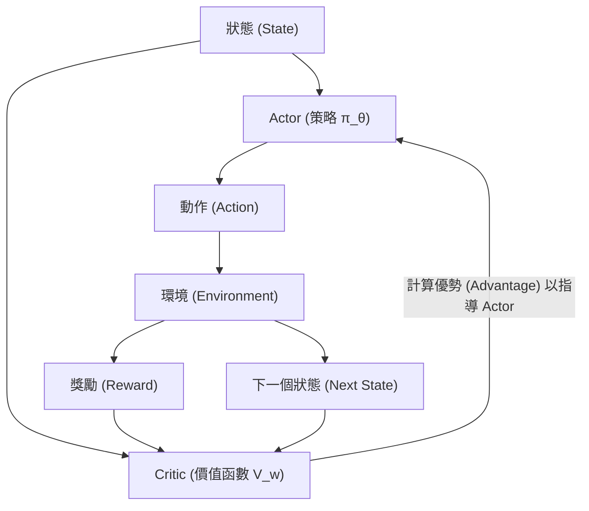
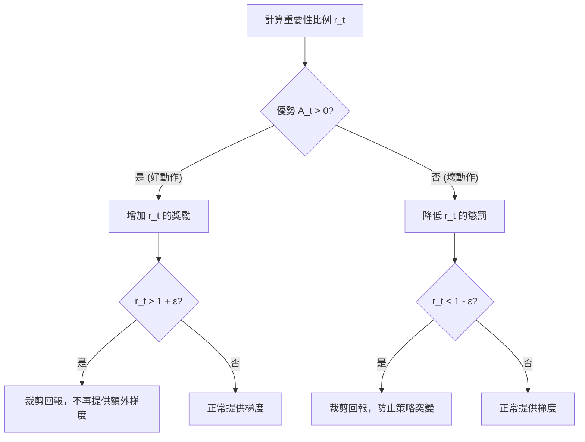

# 第六章：策略搜尋 II (Policy Search 2)

本章承接上一章介紹的策略梯度（Policy Gradient）方法，進一步探討如何提升策略梯度的學習穩定性與樣本效率。我們將從證明「基準線無偏性（Baseline Unbiasedness）」出發，介紹 Vanilla Policy Gradient 與 Actor-Critic 架構。接著，我們會討論如何利用 $n$ 步估計器（$n$-step estimators）在偏差與變異數之間取得平衡。

隨著章節推進，我們將探討標準策略梯度的兩大瓶頸：**樣本效率低下**與**參數空間和策略空間的距離不一致性**。為了解決這些問題，我們將推導出「策略績效差異引理（Performance Difference Lemma）」，引入重要性採樣與 KL 散度（KL Divergence）的概念，最終導出目前在強化學習領域（包括 ChatGPT 的 RLHF 訓練中）最廣泛使用的演算法之一：**近端策略最佳化（Proximal Policy Optimization, PPO）**。

---

## 6.1 基準線與無偏性 (Baselines and Unbiasedness)

在上一章中，我們介紹了策略梯度的基本形式。然而，以蒙地卡羅（Monte Carlo）估計回報所算出的策略梯度通常具有很大的變異數。為了降低變異數，我們可以在優勢函數的計算中引入一個**基準線（Baseline）** $B(s_t)$。直觀上，基準線幫助我們評估一個動作的價值是「相對於平均而言」好或壞，而不僅僅是看絕對的回報數字。

一個重要的數學性質是：只要基準線 $B(s_t)$ 僅是狀態 $s_t$ 的函數，而與動作 $a_t$ 參數 $\theta$ 無關，那麼在梯度估計中減去這個基準線並不會引入任何偏差（Bias）。

### 基準線無偏性定理證明

**定理：** 若 $B(s_t)$ 僅是狀態 $s_t$ 的函數，則對於任意策略參數 $\theta$：
$$ \mathbb{E}_{\tau \sim \pi_\theta}\!\left[\sum_{t=0}^{T} \nabla_\theta \log \pi_\theta(a_t|s_t) \cdot B(s_t)\right] = 0 $$

這意味著引入 $B(s_t)$ 並不改變梯度在期望值意義下的結果。

**證明推導：**

我們可以單獨針對某一個時間步 $t$ 來檢視這個期望值：
$$ \mathbb{E}_{\tau}\left[ \nabla_\theta \log \pi_\theta(a_t|s_t) \cdot B(s_t) \right] $$

1. **軌跡期望分解**：
   完整的軌跡 $\tau$ 可以被拆解為從時間步 $0$ 到 $t$ 的歷史（包含 $s_t$），以及時間步 $t$ 所採取的動作 $a_t$ 和之後發生的事情。由於 $B(s_t)$ 僅取決於 $s_t$，而梯度的對數項 $\nabla_\theta \log \pi_\theta(a_t|s_t)$ 僅取決於 $s_t$ 與 $a_t$，我們不需要考慮 $t$ 時刻之後發生的未來狀態與動作，因此期望值可以簡化為對當前狀態 $s_t$ 與動作 $a_t$ 的期望。
   
   $$ \mathbb{E}_{s_t, a_t}\left[ \nabla_\theta \log \pi_\theta(a_t|s_t) \cdot B(s_t) \right] = \mathbb{E}_{s_t}\left[ B(s_t) \mathbb{E}_{a_t \sim \pi_\theta(\cdot|s_t)}\left[ \nabla_\theta \log \pi_\theta(a_t|s_t) \right] \right] $$

2. **對動作求期望值**：
   我們將內部對動作 $a_t$ 的期望值展開：
   $$ \mathbb{E}_{a_t \sim \pi_\theta(\cdot|s_t)}\left[ \nabla_\theta \log \pi_\theta(a_t|s_t) \right] = \sum_{a} \pi_\theta(a|s_t) \nabla_\theta \log \pi_\theta(a|s_t) $$

3. **利用對數函數的導數性質**：
   根據微積分中的對數求導法則 $\nabla_\theta \log f(\theta) = \frac{\nabla_\theta f(\theta)}{f(\theta)}$：
   $$ \sum_{a} \pi_\theta(a|s_t) \frac{\nabla_\theta \pi_\theta(a|s_t)}{\pi_\theta(a|s_t)} = \sum_{a} \nabla_\theta \pi_\theta(a|s_t) $$

4. **導數與連加交換**：
   將對 $\theta$ 的梯度移到連加符號外面：
   $$ \nabla_\theta \sum_{a} \pi_\theta(a|s_t) $$
   因為對於任何狀態 $s_t$，在給定策略下所有可能動作的機率總和必須為 1，即 $\sum_{a} \pi_\theta(a|s_t) = 1$。
   常數 1 對 $\theta$ 的梯度為 0：
   $$ \nabla_\theta (1) = 0 $$

由此得證，整體期望值為 0。這意味著減去 $B(s_t)$ 不會改變梯度的期望值，但如果 $B(s_t)$ 選取得當（例如選為狀態價值函數 $V(s_t)$），它能大幅減少估計的變異數。

---

## 6.2 Vanilla Policy Gradient 與 Actor-Critic

有了基準線的概念，我們可以寫出包含基準線的標準策略梯度演算法，稱為 Vanilla Policy Gradient。

### Vanilla Policy Gradient

其演算法核心如下：
1. 以當前策略 $\pi_\theta$ 在環境中執行，收集 $m$ 條軌跡。
2. 對於每條軌跡的每個時間步 $t$：
   - 計算蒙地卡羅回報 $G_t = \sum_{k=0}^{T-t} \gamma^k r_{t+k}$。
   - 計算優勢估計值 $\hat{A}_t = G_t - B(s_t)$。
3. 利用收集到的數據重新擬合（更新）基準線 $B(s_t)$ 以便其更接近真實狀態價值。
4. 透過策略梯度更新參數 $\theta$：
   $$ \theta \leftarrow \theta + \alpha \sum_t \nabla_\theta \log \pi_\theta(a_t|s_t) \hat{A}_t $$

即使有了基準線，使用蒙地卡羅回報 $G_t$ 仍然可能具有高變異數。為此，我們可以將基準線和回報的概念擴展，引入價值函數的函數近似，從而引出 Actor-Critic 架構。

### Actor-Critic 架構

在 Actor-Critic 方法中，我們有兩個主要的元件：
- **Actor（演員）**：代表策略 $\pi_\theta$，負責根據當前狀態做出決策。
- **Critic（評論家）**：代表價值函數（例如 $V_w(s)$ 或 $Q_w(s, a)$），負責評估 Actor 所做決策的好壞。

我們可以使用 Critic 所估計的價值函數來計算優勢函數：
$$ A(s_t, a_t) = Q_w(s_t, a_t) - V_w(s_t) $$

這種架構結合了策略梯度與價值函數近似的優點。Critic 可以利用時序差分（Temporal Difference, TD）方法進行更新，從而減少方差並加快學習速度。知名的 A3C（Asynchronous Advantage Actor-Critic）演算法即是此架構的經典應用。

---

## 6.3 n 步估計器與偏差-變異數權衡 (n-step Estimators and Bias-Variance Tradeoff)

在評估策略表現時，我們可以使用不同的回報估計方式。Critic 可以採用單步 TD 估計，也可以採用更長步數的估計，這就引出了 $n$ 步估計器（$n$-step estimators）。

不同的估計器對應了不同的偏差（Bias）與變異數（Variance）：

| 估計器 | 公式形式 | 偏差 (Bias) | 變異數 (Variance) |
|---|---|---|---|
| 單步 $\hat{R}_1$ (TD-like) | $r_t + \gamma V(s_{t+1})$ | 高 (因為 $V$ 是近似值，可能不準確) | 低 (只依賴一次環境的隨機獎勵與轉移) |
| $n$ 步 $\hat{R}_n$ | $\sum_{k=0}^{n-1}\gamma^k r_{t+k} + \gamma^n V(s_{t+n})$ | 中 | 中 |
| 蒙地卡羅 $\hat{R}_\infty$ | $\sum_{k=0}^{T-t}\gamma^k r_{t+k}$ | 無 / 極低 (期望上等於真實回報) | 高 (累積了整條軌跡的所有隨機性) |

- **單步估計器 ($\hat{R}_1$)**：立即進行 Bootstrapping（使用下一個狀態的價值估計來推算當前狀態價值）。因為價值估計函數在初期通常是不準確的，這會引入較高的偏差；但因為它只觀察了一步的隨機性，所以變異數很低。
- **蒙地卡羅估計器 ($\hat{R}_\infty$)**：不依賴任何價值函數估計，完全依賴實際的獎勵和，因此沒有由模型估計帶來的偏差；但由於軌跡的長度與環境的隨機性累積，變異數非常大。

在實務中，我們經常需要在這兩者之間取得平衡，選擇適當的 $n$ 步來最小化均方誤差（Mean Squared Error, MSE）。

---

## 6.4 策略梯度的核心挑戰

儘管有了 Baseline 與 Actor-Critic 架構，基本的策略梯度方法仍面臨兩大核心挑戰。

### 1. 樣本效率低下 (Sample Inefficiency)
傳統的策略梯度演算法（包含 Vanilla Policy Gradient）是 **on-policy** 的。這意味著用來更新參數的數據必須是由**當前正在被更新的策略**所生成的。每次我們對參數 $\theta$ 走了一步梯度更新得到新參數 $\theta'$ 後，我們之前收集的所有數據在理論上就不再適用於估計 $\theta'$ 的梯度了。這導致我們每更新一次策略，就需要重新在環境中進行大量採樣，樣本效率極低。理想情況下，我們希望能利用舊數據來進行「多次」梯度更新（類似於 off-policy 的特性）。

### 2. 參數空間步長與策略空間步長的不對稱性
我們通常在參數空間（Parameter Space）$\theta$ 中進行梯度上升，利用固定的學習率（Step size）來更新參數。然而，參數空間的微小改變，可能會導致策略空間（Policy Space，即實際做出的動作機率分佈）發生劇烈的變化。

例如：假設策略被參數化為類似 Softmax 的形式。當 $\theta$ 從 0 變到 2 再變到 4 時，決策的機率分佈可能會從 50/50 的均勻分佈，瞬間變成接近 100/0 的確定性分佈（Deterministic policy）。如果我們選擇了一個過大的學習率，參數的小幅更新可能會導致策略突然變得極差（例如讓機器人直接走向懸崖）。在這種情況下，收集到的數據回報會非常糟糕，導致後續梯度難以估計，模型陷入難以恢復的局部劣解中。

我們渴望一種演算法，它能夠：
1. 最大限度地利用收集到的數據。
2. 保證策略在更新的過程中，實際動作的機率分佈不會發生過於劇烈的突變（即在**策略空間**中保證平滑過渡），從而實現穩定、單調的效能提升（Monotonic Improvement）。

---

## 6.5 策略績效差異引理 (Performance Difference Lemma)

為了解決上述挑戰，我們需要一種方法來評估「如果我將策略從 $\pi$ 改為 $\pi'$，效能會改變多少？」而且我們希望能**僅依靠來自舊策略 $\pi$ 的數據**來進行這項評估。

為此，我們引入**策略績效差異引理**（Homework 2 中有完整的證明過程）。給定兩個策略 $\pi$ 和 $\pi'$，它們的期望效能差距可以表示為：

$$ J(\pi') - J(\pi) = \frac{1}{1-\gamma} \mathbb{E}_{s \sim d^{\pi'}, a \sim \pi'}\!\left[ A^\pi(s, a) \right] $$

其中：
- $J(\pi)$ 代表策略 $\pi$ 的期望效能（期望折扣回報）。
- $A^\pi(s, a)$ 是在**舊策略 $\pi$** 下的優勢函數，代表在狀態 $s$ 採取動作 $a$，然後後續皆遵循策略 $\pi$ 的相對價值。
- $d^{\pi'}(s) = (1-\gamma) \sum_{t=0}^\infty \gamma^t P(s_t=s | \pi')$ 是在新策略 $\pi'$ 下的**折扣狀態分佈（Discounted State Distribution）**。它表示如果執行 $\pi'$，到達各個狀態的加權頻率。

**直觀解釋：**
講師提供了一個生動的比喻：「如果我每天選擇去史丹佛（新策略 $\pi'$）而不是去哈佛（舊策略 $\pi$），我每天會比原本多快樂多少（優勢函數 $A^\pi(s,a)$）？將整個職涯中每一天的這種相對優勢加總起來，就是我整個職涯總效能的差距。」

這個引理非常強大，它將新舊策略的整體效能差距，拆解為在各個狀態下新舊策略決策差異所帶來的單步優勢總和。

---

## 6.6 重要性採樣與 KL 散度近似 (Importance Sampling and KL Approximation)

雖然績效差異引理提供了一個理論框架，但公式中的期望值是基於**新策略** $\pi'$ 的狀態分佈 $s \sim d^{\pi'}$ 與動作分佈 $a \sim \pi'$ 計算的。我們仍然沒有來自 $\pi'$ 的資料！

為了繞過這個問題，我們進行兩步近似操作：

### 步驟一：動作的重要性採樣 (Importance Sampling for Actions)
對於動作期望值 $\mathbb{E}_{a \sim \pi'}[A^\pi(s, a)]$，我們可以透過引入重要性採樣權重，將其轉換為對舊策略動作的期望：
$$ \mathbb{E}_{a \sim \pi'}\left[A^\pi(s, a)\right] = \sum_a \pi'(a|s) A^\pi(s, a) = \sum_a \pi(a|s) \frac{\pi'(a|s)}{\pi(a|s)} A^\pi(s, a) = \mathbb{E}_{a \sim \pi}\left[ \frac{\pi'(a|s)}{\pi(a|s)} A^\pi(s, a) \right] $$
這代表只要我們知道新策略在某個狀態下選擇某個動作的機率，即使我們沒有它的採樣，我們也可以透過將舊資料的優勢乘上比例 $\frac{\pi'(a|s)}{\pi(a|s)}$ 來重新加權。

### 步驟二：忽略狀態分佈的變化 (Approximating State Distribution)
我們仍然面臨 $s \sim d^{\pi'}$ 的問題。如果 $\pi'$ 與 $\pi$ 兩個策略十分相近，那麼它們訪問到的狀態分佈也應該很類似（即 $d^{\pi'} \approx d^{\pi}$）。因此，我們可以大膽地將 $d^{\pi'}$ 替換為我們手中已有數據的 $d^{\pi}$。

如此一來，我們定義一個替代的目標函數 $\mathcal{L}_\pi(\pi')$：
$$ \mathcal{L}_\pi(\pi') = \frac{1}{1-\gamma} \mathbb{E}_{s \sim d^\pi, a \sim \pi}\left[ \frac{\pi'(a|s)}{\pi(a|s)} A^\pi(s, a) \right] $$
現在，這個目標函數**完全只需要來自舊策略 $\pi$ 的數據**！

### 理論邊界與 KL 散度 (KL Divergence)
當然，將 $d^{\pi'}$ 替換為 $d^{\pi}$ 會引入誤差。理論上可以證明，這個近似的誤差會被兩種策略之間的 **KL 散度（Kullback-Leibler Divergence）** 所限制：

$$ \left| (J(\pi') - J(\pi)) - \mathcal{L}_\pi(\pi') \right| \leq C \max_s D_{\mathrm{KL}}(\pi(\cdot|s) \| \pi'(\cdot|s)) $$

KL 散度 $D_{\mathrm{KL}}(p \| q) = \sum_x p(x) \log \frac{p(x)}{q(x)}$ 是一種用來衡量兩個機率分佈差異的方法（注意它不具有對稱性）。當兩個分佈相同時，KL 散度為 0。
這意味著，**只要我們保證新舊策略在任何狀態下的動作機率分佈不要差太多（KL 散度小），我們就可以放心地優化這個替代目標函數 $\mathcal{L}_\pi(\pi')$，並保證實際的效能 $J(\pi')$ 會單調提升。**

---

## 6.7 近端策略最佳化 (Proximal Policy Optimization, PPO)

基於上述理論，研究人員提出了 TRPO (Trust Region Policy Optimization) 與後來更簡潔強大的 **PPO** 演算法。PPO 的核心精神是：**利用重要性採樣最大化目標函數，同時限制新舊策略的差異不能過大。** PPO 主要有兩種變體，其中第二種（目標裁剪型）在實務上更為普遍。

### PPO：KL 懲罰型 (KL-Penalty Variant)

第一種做法是將 KL 散度的限制直接作為懲罰項（Penalty）加入到目標函數中。我們希望最大化：
$$ \max_{\theta} \mathcal{L}_{\theta_{\mathrm{old}}}(\theta) - \beta \cdot \mathbb{E}_{s \sim d^{\pi_{\theta_{\mathrm{old}}}}}\!\left[ D_{\mathrm{KL}}\left(\pi_{\theta_{\mathrm{old}}}(\cdot|s) \| \pi_\theta(\cdot|s)\right) \right] $$

如果更新後的策略導致 KL 散度過大，演算法會動態調高懲罰係數 $\beta$；若 KL 散度很小，則調低 $\beta$。這樣我們就可以利用收集到的同一批資料，進行**多次**的梯度更新，而不會因為走得太遠而導致策略崩潰。

### PPO：目標裁剪型 (Clipped Objective Variant)

KL 懲罰型雖然直觀，但計算 KL 散度有時候不夠穩定且較為複雜。PPO 的作者提出了一個極其巧妙且實用的替代方案：**直接對重要性採樣的比例進行裁剪（Clipping）。**

令比例為 $r_t(\theta) = \frac{\pi_\theta(a_t|s_t)}{\pi_{\theta_{\mathrm{old}}}(a_t|s_t)}$。
我們定義裁剪型的目標函數：
$$ \mathcal{L}^{\mathrm{CLIP}}(\theta) = \mathbb{E}_t\left[ \min\left( r_t(\theta)\hat{A}_t,\; \mathrm{clip}(r_t(\theta), 1-\varepsilon, 1+\varepsilon)\hat{A}_t \right) \right] $$
其中 $\varepsilon$ 通常設為一個小數值（如 0.2）。

這個 `min` 操作的作用是限制策略更新的幅度，具體行為如下：

- **當優勢大於零 ($\hat{A}_t > 0$) 時**：這個動作比平均好，我們希望增加它的機率（即推高 $r_t$）。但是，如果 $r_t$ 已經增加到超過 $1+\varepsilon$，由於 `clip` 的限制，該項數值就不會再增加。這能防止我們對單一好動作過度強化而使策略失真。
- **當優勢小於零 ($\hat{A}_t < 0$) 時**：這個動作比平均差，我們希望降低它的機率（即壓低 $r_t$）。但是，如果 $r_t$ 已經低於 $1-\varepsilon$，它會被裁剪。這能避免為了逃避某個壞動作，而將其機率瞬間降為 0，導致策略的劇烈變動。

這種裁剪機制極大地簡化了實作，同時非常有效地達到了「Trust Region（信任區域）」的效果。PPO 因為其實作簡單、表現優異，成為了目前最流行的 Deep RL 演算法之一。

---

## 6.8 本章總結

本章從基準線無偏性的數學保證出發，確立了 Actor-Critic 結合價值估計與策略更新的合理性，並透過 $n$ 步估計器探討了偏差與變異數的權衡。

面對純粹策略梯度方法在樣本效率與更新步長上的困境，我們透過「策略績效差異引理」與重要性採樣，將目標轉化為可以利用舊數據優化的形式。最終，透過引入 KL 散度限制與裁剪目標函數的精巧設計，我們推導出了近端策略最佳化（PPO）。PPO 成功解決了非單調更新導致的崩潰問題，並容許重用數據進行多次梯度更新，是現代強化學習中不可或缺的基石。在下一章中，我們將進一步探討廣義優勢估計（GAE, Generalized Advantage Estimation）等進階技術，以完善 PPO 的實作。
