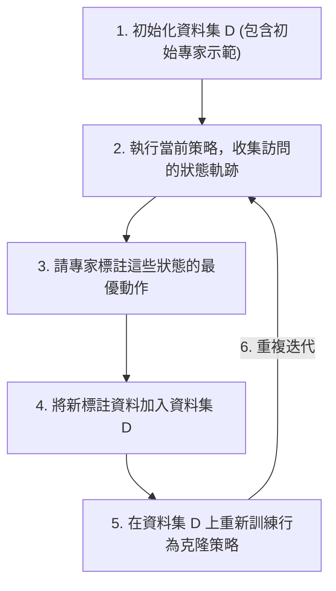

# 第七章：策略搜尋 III (Policy Search 3)

## 7.1 引言
在前面的章節中，我們探討了策略梯度（Policy Gradient）方法，從最基礎的 REINFORCE 到 Proximal Policy Optimization (PPO)。這些方法在連續控制任務中表現優異，但我們尚未深入理解其背後的理論保證，以及如何更有效地估計優勢函數（Advantage Function）。

本章將分為三個主要部分：
1. **廣義優勢估計（Generalized Advantage Estimation, GAE）**：探討如何在偏差（Bias）與變異數（Variance）之間取得平衡。
2. **PPO 的單調改進理論（Monotonic Improvement Theory）**：解釋 PPO 背後的理論基礎，為何最大化特定的下界能夠保證策略的進步。
3. **模仿學習（Imitation Learning）**：當我們擁有專家示範卻不知道獎勵函數時，如何直接從示範中學習策略，包含行為克隆（Behavior Cloning）、DAgger 以及逆強化學習（Inverse Reinforcement Learning）。

---

## 7.2 廣義優勢估計 (Generalized Advantage Estimation, GAE)

在策略梯度方法中，我們經常需要使用優勢函數 $\hat{A}$ 來評估動作的好壞。然而，如何選擇合適的優勢估計器是一個關鍵問題。

### 7.2.1 n 步優勢估計與 Telescoping Sum

我們先定義一步的時序差分（Temporal Difference, TD）誤差為 $\delta_t^V$：

$$
\delta_t^V = r_t + \gamma V(s_{t+1}) - V(s_t)
$$

利用這個符號，我們可以將 $k$ 步優勢估計寫成一個 telescoping sum（望遠鏡級數和）：

$$
\hat{A}_t^{(k)} = \sum_{l=0}^{k-1} \gamma^l \delta_{t+l}^V
$$

**Telescoping sum 的推導（以 $k=2$ 為例）**：

$$
\begin{aligned}
\hat{A}_t^{(2)} &= \delta_t^V + \gamma \delta_{t+1}^V \\
&= (r_t + \gamma V(s_{t+1}) - V(s_t)) + \gamma (r_{t+1} + \gamma V(s_{t+2}) - V(s_{t+1})) \\
&= r_t + \gamma r_{t+1} + \gamma^2 V(s_{t+2}) - V(s_t)
\end{aligned}
$$

可以觀察到，中間的 $V(s_{t+1})$ 項互相抵消了。這種 n 步估計在 $k=1$（TD 估計）時具有高偏差（Bias）與低變異數（Variance）；在 $k \to \infty$（MC 估計）時則具有低偏差與高變異數。

### 7.2.2 廣義優勢估計 (GAE) 的推導

為了在偏差與變異數之間取得系統性的平衡，**廣義優勢估計 (GAE)** 提出了對所有 $k$ 步估計進行指數加權平均的方法，引入了超參數 $\lambda \in [0, 1]$：

$$
\hat{A}_t^{\text{GAE}(\gamma, \lambda)} = (1 - \lambda) \sum_{k=1}^{\infty} \lambda^{k-1} \hat{A}_t^{(k)}
$$

利用幾何級數進行化簡，可以得到一個緊湊的公式：

$$
\hat{A}_t^{\text{GAE}(\gamma, \lambda)} = \sum_{l=0}^{\infty} (\gamma \lambda)^l \delta_{t+l}^V
$$

**極端情形分析**：
- 當 $\lambda = 0$ 時，方程式只保留第一項 $\delta_t^V$，這退化為一步的 TD 估計（高偏差、低變異數）。
- 當 $\lambda = 1$ 時，方程式等同於 Monte Carlo 估計（低偏差、高變異數）。

### 7.2.3 PPO 中的截斷式 GAE

由於在實務中我們無法進行無窮步的 horizon，PPO 採用了截斷版本的 GAE。也就是說，每收集 $T$ 步（例如 200 步）的軌跡後，就會計算一次截斷式的優勢估計。這不僅兼顧了計算效率，也能提供高品質的梯度估計。

---

## 7.3 PPO 單調改進理論 (Monotonic Improvement Theory)

在前一章我們介紹了 PPO，但並未深入其背後的理論基礎。為什麼 PPO 能夠（或試圖）保證策略在更新過程中不會變得更差？

### 7.3.1 性能下界與替代目標

我們希望優化目標，使得新策略 $\pi'$ 的表現 $J(\pi')$ 大於舊策略 $J(\pi)$。理論上存在以下性能下界：

$$
J(\pi') - J(\pi) \geq L_\pi(\pi') - C \cdot D_{KL}^{\max}(\pi \| \pi')
$$

其中替代目標 $L_\pi(\pi')$ 定義為：

$$
L_\pi(\pi') = \frac{1}{1-\gamma} \mathbb{E}_{s \sim d^\pi} \left[ \sum_a \frac{\pi'(a|s)}{\pi(a|s)} A^\pi(s,a) \right]
$$

### 7.3.2 Majorize-Maximize (MM) 算法保證

利用 **Majorize-Maximize (MM)** 算法的思維，設：

$$
\pi^{k+1} = \arg\max_{\pi'} \left[ L_{\pi^k}(\pi') - C \cdot D_{KL}^{\max}(\pi^k \| \pi') \right]
$$

那麼我們可以保證 $J(\pi^{k+1}) \geq J(\pi^k)$，達到單調改進（Monotonic Improvement）。

**推導的關鍵步驟**：
1. 當我們代入新策略即為舊策略本身時（$\pi' = \pi^k$），其替代目標 $L_{\pi^k}(\pi^k) = 0$。這是因為策略相對自身的優勢為零（在策略 $\pi$ 下 $Q^\pi(s,a) - V^\pi(s)$ 的期望值為零）。
2. KL 散度 $D_{KL}(\pi^k \| \pi^k) = 0$。
3. 因此，下界在 $\pi' = \pi^k$ 時為 $0 - 0 = 0$。
4. 由於 $\pi^{k+1}$ 是透過 $\arg\max$ 找到的最大化解，所以 $\pi^{k+1}$ 使這個下界必定大於等於 $0$。
5. 結論：$J(\pi^{k+1}) - J(\pi^k) \geq 0$，證明了單調改進保證。

### 7.3.3 理論與實務的差距

儘管理論非常優美，但實務上存在一個巨大限制。當折扣因子 $\gamma \approx 1$ 時（我們通常關心長遠的獎勵），常數 $C$（常與最大可能價值 $V_{\max}$ 和 $\frac{1}{1-\gamma}$ 成比例）會變得極大。這會導致演算法過度保守，更新的步伐極小，實用性不足。

這正是為何 PPO 在實作上並不嚴格遵循這個理論下界，而是採用自適應 KL 懲罰或截斷目標（Clipped Objective）的動機：在保有近似單調改進特性的同時，確保更新的效率。

---

## 7.4 模仿學習：行為克隆 (Behavior Cloning)

當我們無法明確設計出獎勵函數，但我們擁有專家（例如人類醫生、駕駛）的示範軌跡時，我們進入了**模仿學習（Imitation Learning）** 的領域。

### 7.4.1 問題設定與動機

在很多情境下（如自動駕駛、機械臂操作），要寫下一個完美的獎勵函數極其困難，但我們卻很容易獲得大量從狀態到動作的示範資料 $\{(s_0, a_0), (s_1, a_1), \ldots\}$。行為克隆的核心思想就是直接將這些資料化簡為標準的**監督式學習（Supervised Learning）** 問題。

早期著名的案例包括 CMU 在 1980 年代末開發的 ALVINN（Autonomous Land Vehicle In a Neural Network），它僅用一個淺層神經網路和微小解析度的視覺輸入，就成功展示了自動駕駛的潛力。

### 7.4.2 誤差複合與分布不匹配問題

儘管行為克隆看似簡單，但它有著致命的缺陷。在傳統的監督式學習中，我們通常假設資料是獨立同分布的（IID），且預期的總誤差約為 $O(\epsilon T)$。

但在連續控制與決策過程中，資料**違反了 IID 假設**。決策在時序上是高度相關的。如果智能體在某一步犯了一個小錯誤，它會偏離專家原本的軌跡，進入訓練資料庫中從未見過的狀態區域（Distribution Mismatch）。在這種陌生區域，智能體更容易犯錯，導致錯誤不斷累積。

結果是，行為克隆在最壞情況下的誤差複合（Compounding Errors）將成長為 $O(\epsilon T^2)$。這也是為何純粹的行為克隆在長時序任務中經常失敗的原因。

---

## 7.5 資料集聚合 (DAgger)

為了解決行為克隆中「訓練分布」與「測試分布」不一致的問題，DAgger（Dataset Aggregation）演算法被提出。

### 7.5.1 DAgger 演算法概念

DAgger 的核心精神是透過迭代的方式，讓策略能夠在自己訪問過的（可能已偏離專家軌跡的）狀態上，也獲得專家的指導。

**DAgger 演算法流程**：
1. 初始化資料集 $D$，包含初始的專家示範。
2. 執行當前學習到的策略 $\hat{\pi}$，在環境中收集軌跡（即實際訪問的狀態）。
3. 將這些狀態交給專家，請專家標註在這些狀態下對應的**最優動作**。
4. 將這些新標註的資料加入資料集 $D$ 中。
5. 在擴充後的資料集 $D$ 上重新訓練策略（執行行為克隆）。
6. 重複步驟 2 到 5。

### 7.5.2 DAgger 的優點與限制
- **優點**：它有效地緩解了分布不匹配問題，具有理論上的收斂保證。
- **限制**：DAgger 需要專家「持續在線」標註資料。在許多真實情境（如需要專家駕駛真車，或專家難以從螢幕判斷狀態）中，人力成本極高且難以部署。

---

## 7.6 逆強化學習與特徵匹配 (Inverse Reinforcement Learning)

當行為克隆與 DAgger 都只能模仿表象行為時，我們或許會想：能不能從專家的示範中，**反推出專家心中的獎勵函數**？這就是逆強化學習（Inverse RL, IRL）的核心問題。

### 7.6.1 IRL 問題設定與不可識別性

在 IRL 的設定中，已知狀態空間 $\mathcal{S}$、動作空間 $\mathcal{A}$ 以及環境轉移模型，我們也觀測到專家的最優軌跡，但**不知獎勵函數 $R$**。目標是找到 $R$ 並藉此學習策略。

這面臨著一個嚴重的挑戰：**不可識別性（Unidentifiability）**。
給定一個最優策略，並不存在「唯一」對應的獎勵函數。例如：
- 將所有獎勵乘上一個正整數倍，最優策略不變。
- 甚至極端一點，假設 $R(s) \equiv 0$（對所有狀態獎勵皆為零），那麼任何策略都會變成最優策略！

### 7.6.2 線性獎勵假設與特徵匹配

為了解決這個問題，一種早期的經典作法是引入**線性獎勵假設**：

$$
R(s) = w^T \phi(s)
$$

其中 $\phi(s)$ 是狀態特徵向量，$w$ 是待求的權重向量。在這樣的設定下，策略 $\pi$ 的期望折扣回報（價值函數）可以被分解為：

$$
V^\pi = \mathbb{E} \left[ \sum_{t=0}^\infty \gamma^t w^T \phi(s_t) \right] = w^T \mathbb{E} \left[ \sum_{t=0}^\infty \gamma^t \phi(s_t) \right] = w^T \mu(\pi)
$$

此處的 $\mu(\pi)$ 被稱為**折扣狀態特徵頻率（Discounted State Feature Frequency）**。

**專家最優性約束**：
如果專家的策略 $\pi^*$ 是最優的，那麼對於所有其他的策略 $\pi$，都必須滿足：

$$
w^T \mu(\pi^*) \geq w^T \mu(\pi)
$$

這引導出了**特徵匹配（Feature Matching）**的觀點：如果我們能夠找到一個學習策略 $\hat{\pi}$，使得它的特徵頻率非常接近專家，亦即 $\|\mu(\hat{\pi}) - \mu(\pi^*)\|_1 \leq \epsilon$，那麼根據 Holder 不等式，我們就能保證這兩個策略的表現在任何權重下都極為接近：

$$
|V^{\hat{\pi}} - V^{\pi^*}| \leq \|w\|_\infty \cdot \|\mu(\hat{\pi}) - \mu(\pi^*)\|_1 \leq \|w\|_\infty \cdot \epsilon
$$

只要我們的策略能夠在特徵空間上匹配專家的表現，就能夠逼近專家的實際回報。

---

## 7.7 結語

本章我們從 PPO 嚴謹的理論保證出發，透過 GAE 解決實務上的優勢估計難題；隨後探討了當缺乏獎勵函數時的模仿學習策略。儘管行為克隆簡單直接，但有著誤差複合的缺陷，DAgger 雖然修正了分布不匹配問題卻需要龐大的人力標註成本。最後，逆強化學習試圖從特徵匹配的角度反推隱含的獎勵，為機器學習決策提供了一條更深刻的道路。

在下一章中，我們將探討如何進一步解決逆強化學習中的不可識別性問題，介紹最大熵逆強化學習（Maximum Entropy IRL）以及生成對抗模仿學習（GAIL）。
