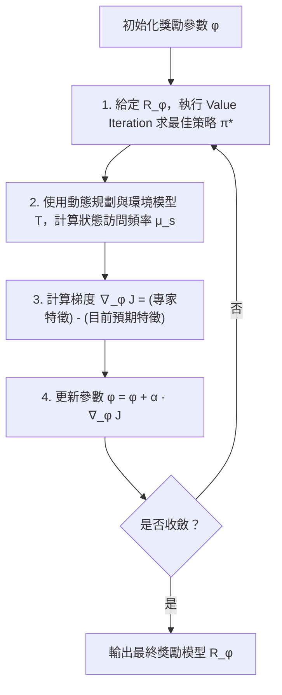
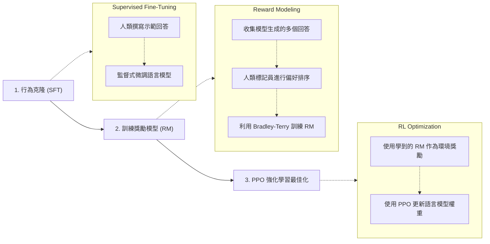

# 第 8 章：離線強化學習 (一) —— 最大熵逆強化學習與人類偏好

本章我們將探討如何在缺乏明確獎勵函數（Reward Function）的情況下，利用人類示範與偏好回饋來學習最佳決策策略。內容從經典的**最大熵逆強化學習（Maximum Entropy Inverse Reinforcement Learning, MaxEnt IRL）**出發，進而擴展到廣義的人類回饋框架，最終介紹當今大型語言模型（如 ChatGPT）廣泛使用的**基於人類回饋的強化學習（Reinforcement Learning from Human Feedback, RLHF）**。

## 8.1 模仿學習的挑戰與逆強化學習的動機

在上一講中，我們討論了模仿學習（Imitation Learning），例如行為克隆（Behavior Cloning）和 DAgger。這些方法將強化學習問題簡化為監督式學習，直接從專家的示範軌跡（Trajectories）中學習策略 $\pi(a|s)$。

然而，單純模仿行為有其限制：
1. **難以超越專家**：如果只是克隆行為，智能體通常無法表現得比專家更好。
2. **缺乏對目標的理解**：專家之所以做出某些行為，是因為他們在內心優化某個未知的**獎勵函數**。如果我們能推導出這個隱藏的獎勵函數，或許我們就能學到更具泛化能力、甚至超越專家的策略。

這引出了**逆強化學習（Inverse Reinforcement Learning, IRL）**的核心目標：**給定環境動態與專家的示範軌跡，推斷出專家的獎勵函數**。

> [!WARNING]
> **IRL 的獨特性問題（Identifiability Problem）**
> 逆強化學習面臨一個根本的數學挑戰：**能夠解釋特定最佳策略的獎勵函數並不唯一**。例如，如果獎勵函數對於所有狀態和動作永遠為 0，那麼任何軌跡都是「最佳」的，這顯然無法解釋專家的特定行為。我們必須尋找一種方法，在無數相容的獎勵函數中做出合理的選擇。

---

## 8.2 最大熵逆強化學習 (MaxEnt IRL)

為了解決獎勵函數不唯一的問題，Ziebart 等人於 2008 年提出了**最大熵逆強化學習**。這個方法引入了資訊理論中的「最大熵原理」（Principle of Maximum Entropy），來打破獎勵函數的模糊性。

### 8.2.1 最大熵原理與特徵匹配

最大熵原理（Jaynes, 1957）指出：**在已知某些約束條件的前提下，最能代表我們當前知識狀態的機率分佈，是那個擁有最大熵的分佈**。

在 IRL 的語境中：
- **變數**：軌跡（Trajectory, $\tau$）的機率分佈 $P(\tau)$。
- **約束條件**：我們學習到的策略所產生的「特徵期望值」（Feature Expectations），必須與專家示範資料 $\mathcal{D}^*$ 中的特徵期望值一致。

假設狀態的特徵函數為 $f(s)$，我們希望模型預期的特徵總和等於專家示範的平均特徵總和：
$$ \mathbb{E}_{\tau \sim P}[f(\tau)] = \frac{1}{|\mathcal{D}^*|} \sum_{\tau \in \mathcal{D}^*} f(\tau) $$

### 8.2.2 最大熵軌跡分佈的推導

我們要求解以下受限最佳化問題：
$$ \max_{P(\tau)} H(P) = -\sum_\tau P(\tau) \log P(\tau) $$
受限於：
1. $\sum_\tau P(\tau) = 1$ （機率總和為 1）
2. $\mathbb{E}_{P}[f(\tau)] = \hat{\mu}^*$ （特徵匹配約束）

透過引入拉格朗日乘數（Lagrange Multipliers）$\lambda_1, \lambda_2$，我們可以建構拉格朗日函數，對 $P(\tau)$ 偏微分並令其為零。推導的關鍵結果是，使熵最大的機率分佈屬於**指數族分佈（Exponential Family）**：

$$ P(\tau) = \frac{1}{Z(\phi)} \exp\!\left( \sum_{s \in \tau} R_\phi(s) \right) $$

其中：
- $R_\phi(s) = \phi^\top f(s)$ 是一個參數化（線性）的獎勵函數。
- $Z(\phi) = \sum_\tau \exp\!\left( \sum_{s \in \tau} R_\phi(s) \right)$ 是配分函數（Partition Function，也就是正規化常數）。

> [!TIP]
> 這裡的直覺非常漂亮：**最合理的軌跡分佈，就是以獎勵的指數形式成正比的分佈**。具有較高累積獎勵的軌跡，其發生的機率呈指數級上升。

### 8.2.3 最大似然估計與梯度更新

由於我們知道了軌跡機率的函數形式，尋找參數 $\phi$ 的問題就可以被轉化為**最大似然估計（Maximum Likelihood Estimation, MLE）**：
$$ \max_\phi J(\phi) = \sum_{\tau \in \mathcal{D}^*} \log P(\tau | \phi) $$

對於線性獎勵 $R_\phi(s) = \phi^\top f(s)$，目標函數 $J(\phi)$ 對 $\phi$ 的梯度可以優美地化簡為：
$$ \nabla_\phi J(\phi) = \sum_{\tau \in \mathcal{D}^*} f(\tau) - \sum_s P(s | \phi, T) f(s) $$

這個梯度的含義是：**「專家示範軌跡的特徵總和」減去「在當前獎勵參數 $\phi$ 下，策略預期會訪問的狀態特徵總和」**。
如果我們的策略產生的特徵分佈與專家一致，梯度就會為零，參數更新收斂。

### 8.2.4 演算法流程

Ziebart 等人提出的 MaxEnt IRL 演算法流程如下：

> [!NOTE]
> **依賴已知動態模型的限制**
> 仔細觀察上述步驟：步驟 1（Value Iteration）與步驟 2（計算狀態訪問頻率）都**強烈依賴已知的環境動態模型 $T(s'|s, a)$**。
> 這在真實世界（如自動駕駛、醫療決策）中是極難獲得的。後續研究（如 Chelsea Finn, 2016）成功移除了對已知動態模型的依賴，並將獎勵函數擴展至非線性的深度神經網路；此外，Stefano Ermon 的團隊也提出了生成對抗模仿學習（GAIL），進一步推動了該領域的發展。

---

## 8.3 人類回饋與強化學習 (RLHF) 入門

雖然 MaxEnt IRL 從「被動示範」中提取獎勵的理論非常優美，但收集高品質的專家示範往往成本高昂。研究者逐漸將目光轉向**各種形式的人類回饋**。

### 8.3.1 人類回饋的光譜

我們可以根據「人力成本」將人類回饋分為一個光譜：

1. **被動示範（Passive Demos）**：例如醫療系統自動記錄的電子病歷（成本最低）。
2. **主動示範（Active Demos）**：請專家特地示範如何完成任務（如遙控機器人）。
3. **偏好對比（Preference Pairs）**：讓人類觀看兩段軌跡，選擇「哪一段比較好」（**成本中等，效益極高**）。
4. **主動教導 / 標記（Active Teaching / DAgger-style）**：人類在智能體訓練的過程中不斷在旁指導或糾正（成本極高）。

> [!IMPORTANT]
> **偏好對比的「甜蜜點」**
> 研究發現，對人類來說，**比較兩段行為哪個好**，遠比**親自給出完美示範**或**精確寫下獎勵函數**來得容易。這種「比較式回饋」正是現代大型語言模型對齊（Alignment）技術的基石。

### 8.3.2 早期的探索：主動教導
在早期的研究中，例如 MIT 的 Sophie's Kitchen（Andrea Thomaz & Cynthia Breazeal）與 UT Austin 的 TAMER（Brad Knox & Peter Stone），探索了人類如何透過類似「點擊讚 / 倒讚」的即時回饋來訓練智能體（例如玩 Tetris 遊戲）。這些方法學習速度快，但需要人類全程參與，且長期表現可能依然受限於回饋的主觀偏差。

---

## 8.4 基於偏好的強化學習與大模型對齊

目前最主流的從人類偏好學習獎勵的方法，是基於**Bradley-Terry 偏好模型**。

### 8.4.1 Bradley-Terry 模型

Bradley-Terry 模型（1952）是一個經典的遞移性偏好模型。假設我們有兩個選項（軌跡或文字回答）$b_i$ 與 $b_j$，且它們分別對應潛在的標量獎勵值 $r(b_i)$ 與 $r(b_j)$。該模型假設人類偏好 $b_i$ 勝過 $b_j$ 的機率為：

$$ P(b_i \succ b_j) = \frac{\exp(r(b_i))}{\exp(r(b_i)) + \exp(r(b_j))} $$

**重要性質**：
- 自動正規化：當兩者潛在獎勵相等時，$P = 0.5$。
- **遞移性（Transitivity）**：如果 $A \succ B$ 且 $B \succ C$，可以數學推導出 $A \succ C$ 的機率。

我們可以將收集到的人類偏好對視為標籤，並透過邏輯迴歸（最大化交叉熵似然）來訓練一個深度神經網路作為獎勵模型 $r_\theta$。

### 8.4.2 Deep RL from Human Preferences (Christiano et al., 2017)

2017 年的一項關鍵研究展示了偏好學習的威力。研究者在 MuJoCo 物理模擬器中訓練一個機器人執行「後空翻」（Backflip）。
定義後空翻的獎勵函數非常困難。研究者改為：
1. 讓機器人隨機嘗試，並並排播放兩段短影片。
2. 人類點擊「左邊好」或「右邊好」。
3. 使用 Bradley-Terry 模型更新潛在的獎勵神經網路。
4. 使用 RL 演算法基於該獎勵網路優化策略。

**驚人的結果是：僅需要大約 900 次的人類偏好點擊（即 900 bits 的資訊），機器人就能學會完美的後空翻。**

### 8.4.3 應用於 ChatGPT 的 RLHF 流程

上述利用偏好學習獎勵，再用 RL 最佳化策略的框架，直接促成了 ChatGPT 的誕生。根據 Stanford 教授 Tatsu Hashimoto 的總結，現代語言模型的 RLHF 流程包含以下三個核心階段：

> [!TIP]
> **語言模型 RLHF 的本質**
> 對於語言模型而言，RLHF 本質上是一種**多任務元強化學習（Meta-RL）**。訓練出來的獎勵模型必須能夠泛化並評估所有人類可能提問的任務好壞，而不僅僅是解決單一的環境任務。

---

## 8.5 本章總結與展望

1. **MaxEnt IRL** 提供了一個優雅的數學框架，利用最大熵原則打破獎勵模糊性，推導出易於計算的最大似然目標。
2. **人類回饋的光譜** 揭示了人力投入與學習效率的取捨，其中**偏好對比**成為了當今機器學習對齊的「甜蜜點」。
3. **Bradley-Terry 偏好模型** 與 MaxEnt IRL 中的指數族軌跡分佈有著異曲同工之妙。這種深刻的數學聯繫，為下一章即將介紹的**直接偏好最佳化（Direct Preference Optimization, DPO）**奠定了堅實的基礎。DPO 將證明，我們可以跳過顯式訓練獎勵模型的步驟，直接利用偏好資料來更新策略。
