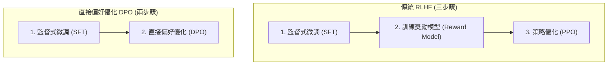

# 第 9 章 直接偏好優化 (Direct Preference Optimization, DPO) 

本章由史丹佛大學 CS234 課程的客座講者 Rafael Rafailov、Archit Sharma 與 Eric Mitchell 共同主講，深入探討語言模型對齊領域的一項重要突破：**直接偏好優化 (Direct Preference Optimization, DPO)**。

DPO 的核心問題是：**我們能否繞過傳統從人類回饋中進行強化學習（RLHF）那成本高昂且複雜的 PPO 階段，直接使用人類的偏好資料來訓練語言模型？**

講者們展示了 DPO 如何巧妙地利用數學特性，將「獎勵模型」與「策略」合併為同一個物件，從從而將複雜的偏好學習簡化為單純的二元分類問題。本章將從 RLHF 的背景出發，帶領讀者逐步了解 DPO 的數學推導、實驗結果，以及它所面臨的新挑戰（如 Reward Hacking），最後討論非遞移偏好與權重平均等前沿議題。

---

## 9.1 RLHF 的背景與痛點

在了解 DPO 之前，我們必須先回顧傳統的**從人類回饋中進行強化學習 (RLHF)** 的流程。自從 ChatGPT 取得巨大成功以來，RLHF 已成為大型語言模型 (LLM) 對齊的標準方法。典型的 RLHF 包含三個主要步驟：

1. **監督式微調 (Supervised Fine-Tuning, SFT)**：
   先讓預訓練語言模型學習回答問題的基本能力，以此作為後續優化的參考模型 (Reference Model) 或起始點。
2. **訓練獎勵模型 (Reward Model Training)**：
   收集人類對模型不同回答的偏好比較 (例如：針對同一個提示，人類更喜歡回答 A 還是回答 B)，並使用 **Bradley-Terry 模型** 將這些成對比較轉化為標量獎勵分數，訓練出一個獨立的獎勵網路。
3. **策略優化 (Policy Optimization)**：
   使用強化學習演算法（通常是 PPO）來微調模型，使其生成的回答能獲得最高的獎勵分數，同時使用 KL 散度 (KL Divergence) 限制模型不要偏離原始的 SFT 模型太遠，以防過度優化或語言能力崩潰。

### PPO 面臨的挑戰

Eric Mitchell 在演講中指出，PPO 階段的實作非常複雜且不穩定。除了要同時在記憶體中載入多個模型（策略模型、參考模型、價值網路、獎勵模型）之外，從獎勵模型獲取的信號往往夾雜著高達 60% 的雜訊。此外，PPO 需要在訓練過程中不斷從當前策略中採樣，這在計算上非常昂貴。

因此，講者們提出了一個根本性的疑問：為了讓模型對齊人類偏好，我們真的需要這麼複雜的強化學習架構嗎？答案是：**不需要**。

---

## 9.2 DPO 的數學推導

Archit Sharma 帶領我們經歷了一段優雅的數學推導，展示了如何將強化學習的目標函數，直接轉化為語言模型語言分布的函數。

### Step 1: KL 正則化的 RLHF 策略學習目標

我們從標準的 RLHF 目標函數出發。給定提示 $x$ 與生成的回答 $y$，我們希望找到一個策略 $\pi_\theta$，最大化預期獎勵，同時透過 KL 散度懲罰偏離參考模型 $\pi_{\text{ref}}$ 的行為：

$$
\max_{\pi_\theta} \mathbb{E}_{x \sim \mathcal{D},\, y \sim \pi_\theta(\cdot|x)} [r(x,y)] - \beta\, \text{KL}[\pi_\theta(\cdot|x) \| \pi_{\text{ref}}(\cdot|x)]
$$

其中，$r(x, y)$ 是獎勵函數，$\beta$ 是控制 KL 懲罰強度的超參數（即溫度參數）。

### Step 2: 封閉解 (Closed-form Solution)

在最大熵強化學習 (Max-Entropy RL) 的文獻中已知，上述的目標函數其實存在一個**精確的封閉解 (Closed-form solution)**，其形式為 Boltzmann 分布：

$$
\pi^*(y \mid x) = \frac{\pi_{\text{ref}}(y \mid x)\, \exp\!\bigl(r(x,y)/\beta\bigr)}{Z(x)}
$$

這裡的 $Z(x)$ 是分配函數 (Partition Function)，定義為所有可能回答的機率與其指數化獎勵乘積的總和：$Z(x) = \sum_y \pi_{\text{ref}}(y \mid x)\, e^{r(x,y)/\beta}$。

這條公式非常直觀：最優策略 $\pi^*(y \mid x)$ 會根據獎勵 $r(x, y)$ 的指數，按比例放大參考策略 $\pi_{\text{ref}}(y \mid x)$ 的機率。然而，$Z(x)$ 的計算需要窮舉所有可能的生成字串，在語言模型廣大的狀態空間中是完全不可解的。

### Step 3: 將獎勵用策略來表示

DPO 的關鍵洞見在於**代數轉換**。我們可以將上述等式重新移項，把獎勵函數 $r(x, y)$ 表達為最優策略與參考策略的對數機率比 (Log probability ratio)：

$$
r(x,y) = \beta \log \frac{\pi^*(y \mid x)}{\pi_{\text{ref}}(y \mid x)} + \beta \log Z(x)
$$

這個公式意義深遠：**它說明只要有了策略，我們就等同於擁有了獎勵函數**。策略本身就是一個隱式的獎勵模型 (Implicit Reward Model)。如果一個回答的機率被提升了，就代表它獲得了正的獎勵。

### Step 4: 結合 Bradley-Terry 偏好模型

在收集資料時，人類會給出偏好：對於提示 $x$，喜歡回答 $y_w$ (winner) 勝過 $y_l$ (loser)。獎勵模型通常使用 Bradley-Terry 模型來擬合這種偏好：

$$
\mathcal{L}_{\text{BT}}(r) = -\mathbb{E}\bigl[\log \sigma\!\bigl(r(x,y_w) - r(x,y_l)\bigr)\bigr]
$$

其中 $\sigma$ 是 Sigmoid 函數。

### Step 5: 分配函數的奇蹟消去

我們將 Step 3 中得到的 $r(x, y)$ 替代式，代入 Bradley-Terry 損失中的獎勵差值 $r(x, y_w) - r(x, y_l)$。

奇妙的事情發生了：因為 $Z(x)$ 只依賴於輸入提示 $x$，而與具體的回答 $y$ 無關，因此在相減的過程中，$\beta \log Z(x)$ 這一項會**完全對消**！

$$
r(x,y_w) - r(x,y_l) = \beta \log \frac{\pi_\theta(y_w|x)}{\pi_{\text{ref}}(y_w|x)} - \beta \log \frac{\pi_\theta(y_l|x)}{\pi_{\text{ref}}(y_l|x)}
$$

### Step 6: 最終的 DPO 損失函數

將消去 $Z(x)$ 後的差值放回損失函數，我們就得到了直接偏好優化 (DPO) 的最終目標：

$$
\mathcal{L}_{\text{DPO}}(\pi_\theta;\pi_{\text{ref}}) = -\mathbb{E}_{(x,y_w,y_l)}\!\left[\log \sigma\!\left(\beta \log \frac{\pi_\theta(y_w|x)}{\pi_{\text{ref}}(y_w|x)} - \beta \log \frac{\pi_\theta(y_l|x)}{\pi_{\text{ref}}(y_l|x)}\right)\right]
$$

我們現在可以直接利用靜態的人類偏好資料集 $(x, y_w, y_l)$ 來優化語言模型的參數 $\theta$，使其在增大正確回答 $y_w$ 機率的同時，降低錯誤回答 $y_l$ 的機率，而不再需要任何強化的採樣過程與顯式的獎勵網路。

---

## 9.3 DPO vs PPO：實驗表現與採用

Rafael Rafailov 展示了 DPO 與 PPO 的效能比較。在強大的數學保證下，DPO 表現出了優異的最佳化能力。

### Pareto 最優曲線
在 IMDb 電影評論的情緒生成實驗中，研究者繪製了 **Reward-KL Pareto 曲線**。結果顯示，在相同的 KL 散度（即偏離參考模型的程度相同）下，DPO 能夠提取出比 PPO 更高的獎勵值。換言之，DPO 在優化目標上達到了 Pareto 最優。相反地，傳統 PPO 受到高變異數與雜訊的影響，往往無法達到純粹的數學最優解。

### 業界的廣泛採用
由於 DPO 不需要訓練額外的獎勵模型，且省去了 PPO 階段複雜的線上採樣過程，它在推出後迅速主導了開源社群與產業界。
- **RewardBench**：在評估獎勵模型與對齊演算法的基準測試中，DPO 模型在聊天 (Chat) 和安全性 (Safety) 類別中佔據了前四名。
- **Hugging Face 排行榜**：在開源模型排行榜的前 10 名中，絕大多數模型皆採用 DPO。
- **Mistral 與 Llama 3**：Mistral 系列模型完全使用 DPO 取代 PPO 作為其 RLHF 演算法；而 Meta 的 Llama 3 也在其訓練管線中混合採用了 DPO。

---

## 9.4 完美的代價：獎勵過優化 (Reward Hacking)

儘管 DPO 在數學上非常優雅，Rafael 也分享了他們最新發現的警訊：**直接對齊演算法同樣，甚至更容易遭遇「獎勵過優化」(Reward Hacking) 的問題**。

### 什麼是 Reward Hacking？
OpenAI 在其論文《Scaling Laws for Reward Model Overoptimization》中曾指出：當使用 PPO 過度優化一個學來的「代理獎勵」(Proxy Reward) 時，模型會找到某些奇怪的捷徑來騙取高分，導致其真實品質 (Gold Reward) 不增反降。

### DPO 的長度偏差現象 (Length Bias)
在 DPO 中，因為沒有顯式的代理獎勵模型，社群一開始普遍認為 DPO 不會遇到 Reward Hacking。然而，實驗證明這是一個誤解。

Rafael 展示了長度偏差實驗的結果：在人類標註的偏好資料集中，偏好的回答通常只比被拒絕的回答「稍微長一點點」（人類傾向認為詳細的答案比較好）。然而，經過 DPO 訓練後，模型輸出的長度分布發生了劇烈的偏移，生成的文本變得異常冗長，甚至完全超出了訓練資料集的長度分布 (Out-of-Distribution)。

### 最優優化器的雙面刃
為什麼會這樣？這正是因為 **DPO 是一個「絕對精確的最優優化器」**。
在傳統 PPO 中，由於強化學習本質上的不穩定性和梯度雜訊，PPO 其實是一個「較弱的優化器」(Weak Optimizer)。這種弱優化效應在某種程度上提供了一種隱性的正則化，防止模型過快地鑽進資料的死角。

相反地，DPO 在代數上精確對應了最佳化問題，它毫不妥協地榨取資料中的每一分偏好特徵。當模型發現「長度變長能獲得微小的優勢」時，它會毫無顧忌地將這個特徵推向極端。這說明，**在有限且帶有偏差的資料集上，完美的優化器反而會更快地導致行為失控**。這個現象不僅出現在 DPO 中，在其他變體如 IPO、SLiC 等演算法中也同樣存在。

---

## 9.5 延伸議題與 Q&A 探討

課堂的問答階段深入觸及了對齊領域的前沿問題：

### 1. 非遞移偏好 (Non-transitive Preferences) 與 Nash 平衡
**問題**：如果人類偏好不滿足完全排序怎麼辦？就像「剪刀、石頭、布」一樣，A 勝過 B，B 勝過 C，但 C 卻勝過 A，獎勵最大化的框架在此會完全失效。
**解答**：對於這種多樣性或衝突的偏好，我們必須放棄單一標量獎勵的思維。近期的研究如 **Nash Learning from Human Feedback (NLHF)** 或 **Direct Nash Optimization** 將這個問題視為一個賽局，目標不再是尋求最大獎勵，而是最大化對抗另一個策略的「預期勝率」(Expected Win Rate)。若我們將 Bradley-Terry 模型中的獎勵分數中心化，使其與人類基準線對齊，那麼這實質上就等同於最大化勝率。

### 2. Best of N 基線
在實務中，一種簡單強大的替代方案是 **Best of N**：不進行任何 PPO 或 DPO 訓練，只需從原本的模型中取樣 N 個回答，然後讓獎勵模型挑選最好的一個。實驗表明，Best of N 的表現非常強勁。這提醒我們，在資源有限時，推理期 (Inference-time) 的搜尋也是強大的對齊方法。

### 3. 模型權重平均 (Weight Averaging)
社群在實務中偶然發現，如果將多個 DPO 訓練出的模型檢查點 (Checkpoints) 的權重直接平均，能顯著提升模型的生成品質並增加穩定性。這個現象後來在 **WARM (Weight Averaging for Reward Models)** 等研究中獲得理論支持。這與 Deep Q-Network (DQN) 中使用目標網路 (Target Network) 來平滑更新的原理有異曲同工之妙。

### 4. DPO 作為隱式 Q 函數
DPO 其實不僅限於 bandit 問題 (單步生成)。在後續的研究《Your Language Model is Secretly a Q-function》中指出，若將文字生成視為在 Token 級別上的馬可夫決策過程 (MDP)，DPO 在某種程度上可以被詮釋為最大熵強化學習下的**逆 Q 學習 (Inverse Q-learning)**。即便沒有顯式的 Bootstrapping，模型依然隱式地對中間 Token 進行了信用分配 (Credit assignment)。

---

## 9.6 總結：學會做決策的新視角

DPO 帶給我們的最深刻洞見在於：**「最優決策」與「人類偏好」之間存在著精確的數學對應**。

從傳統強化學習的視角來看，DPO 將獎勵函數直接參數化於「策略空間」之中——策略本身，就是一個隱藏的獎勵函數。這告訴我們，在語言模型這種生成分布足夠豐富的決策空間中，我們其實可以繞開蒙地卡羅軌跡採樣的泥沼，直接在決策空間裡進行獎勵推斷。

然而，Reward Hacking 問題的浮現也給我們敲響了警鐘。它提醒我們，任何代理目標 (Proxy Objective) 無論推導得多麼精確，只要資料是有限且不完美的，追求極致的最大化終將帶來失控的風險。如何構建更穩健的直接對齊演算法，以及如何處理更複雜、非遞移的人類偏好，將是下一代 AI 對齊研究的關鍵挑戰。
