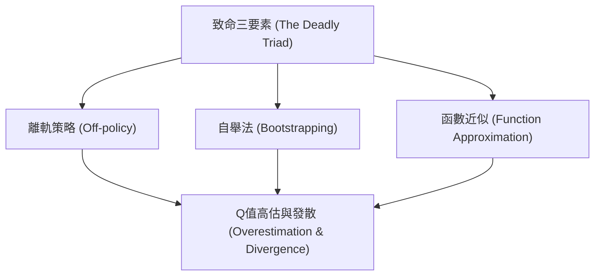
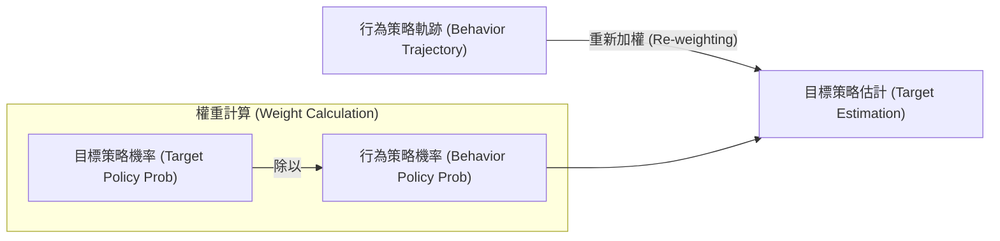

# 第十章：離線強化學習 (Offline RL)

在本章中，我們將深入探討離線強化學習（Offline Reinforcement Learning，或稱 Batch RL）。在此之前，我們已經學習了如何從人類示範中學習（模仿學習），以及如何透過人類偏好來進行學習（RLHF 與 DPO）。然而，模仿學習的上限通常受限於示範者的平均表現。離線強化學習的核心目標是：我們能否僅憑過往收集的歷史資料，學習到超越原有行為策略（Behavior Policy）的全新策略？

## 1. 離線強化學習的動機與挑戰

### 1.1 超越模仿學習
在許多實際應用中，我們希望機器不僅是「模仿」人類，而是能夠找出更好的決策方式。例如：
- **教育領域**：在一個名為 Refraction 的分數學習遊戲中，研究人員收集了超過一萬名學生的遊玩資料（包含他們選擇的關卡順序、停留時間與放棄率）。透過離線強化學習，我們能夠設計出一個自適應的關卡推薦策略，使得學生的遊戲持續率提升了 30%。這證明了我們能夠從現有資料的變異性中，找出比當初人類專家設定更好的策略。
- **醫療健康**：在重症監護室（ICU）中，對於低血壓患者的治療（如給予抗生素、呼吸器或升壓藥），醫師的決策會被記錄在電子病歷中。透過分析這些歷史資料，離線強化學習有機會學習出能提高病患存活率的最佳治療策略。

### 1.2 離線強化學習的挑戰
離線強化學習面臨著許多獨特的困難：
1. **反事實推論（Counterfactual Inference）**：我們只觀察到了在特定狀態下採取特定行動的結果。我們不知道如果當時採取了另一種行動，結果會如何。這在統計學中是經典的因果推論問題。
2. **資料審查與分佈偏移（Distribution Shift）**：因為我們無法在環境中與之互動以收集新資料，所以當我們評估一個與資料收集策略不同的新策略時，會遇到狀態-行動分佈不一致的問題。
3. **致命三要素（The Deadly Triad）**：在離線資料上，當我們同時使用 **離軌策略學習（Off-policy learning）**、**自舉法（Bootstrapping）** 以及 **函數近似（Function Approximation）** 時，標準的 Q-learning（例如 DQN）容易產生發散，甚至表現得比原始的行為策略還差。

## 2. 離線策略評估 (Batch Policy Evaluation)

在優化策略之前，我們首先需要解決**策略評估（Policy Evaluation）**的問題：給定一個固定的目標策略 $\pi$ 以及由行為策略 $\pi_b$ 收集的資料集，我們如何準確估計 $\pi$ 的期望回報？

### 2.1 基於模型的評估 (Model-Based Evaluation)
最直覺的方法是利用歷史資料建立一個環境的模擬器（Simulator），包含：
- **動態模型（Dynamics Model）**：估計 $P(s'|s,a)$。
- **獎勵模型（Reward Model）**：估計 $R(s,a)$。

一旦建立了這個模擬器，我們就可以在其中使用任何標準的強化學習演算法（如動態規劃或 Q-learning）來評估策略或找出最佳策略。

**模型設定錯誤（Model Misspecification）的問題**：
儘管我們可以藉由增加狀態空間的複雜度來讓動態模型更貼合訓練資料（例如獲得更好的交叉驗證概似度），但這並不保證能得出好的策略。因為模型永遠無法完美擬合真實世界（Realizability failure）。在一個設定錯誤的模型下，模型對策略價值的估計會產生偏差。這意味著：在模擬器中表現最好的策略，在現實世界中部署時可能表現得很差。

### 2.2 無模型的評估：擬合 Q 評估 (Fitted Q Evaluation)
擬合 Q 評估（FQE）是類似於 DQN 的無模型方法，但它只針對單一固定的策略進行評估，沒有 `max` 運算子。其目標是最小化貝爾曼誤差（Bellman Error）：

$$ Q(s, a) \approx R(s, a) + \gamma \mathbb{E}_{s'}[V^\pi(s')] $$

此方法的誤差取決於資料量、目標精度、折扣因子 $\gamma$ 以及**集中度係數（Concentrability Coefficient）**。集中度係數衡量了目標策略 $\pi$ 所產生的狀態-行動分佈與訓練資料分佈之間的差異。如果目標策略造訪了資料集中罕見的狀態，誤差將會非常大。此外，它同樣高度依賴馬可夫假設以及 Q 函數的完美擬合能力。

### 2.3 重要性採樣 (Importance Sampling)
為了克服模型的依賴性與馬可夫假設的限制，我們可以借用統計學中的**重要性採樣（Importance Sampling, IS）**。這是一種無偏估計（Unbiased Estimator）方法。

假設我們想計算目標分佈 $p(x)$ 下的期望回報，但只有來自行為分佈 $q(x)$ 的樣本，我們可以對樣本進行重新加權：

$$ \mathbb{E}_{x \sim p}[R(x)] = \mathbb{E}_{x \sim q}\left[\frac{p(x)}{q(x)} R(x)\right] \approx \frac{1}{N} \sum_{i=1}^N \frac{p(x_i)}{q(x_i)} R(x_i) $$

在強化學習中，將 $x$ 視為一整條軌跡 $\tau$，我們會有：

$$ \frac{P(\tau | \pi)}{P(\tau | \pi_b)} = \frac{\prod_t P(s_{t+1}|s_t, a_t) \pi(a_t|s_t)}{\prod_t P(s_{t+1}|s_t, a_t) \pi_b(a_t|s_t)} = \prod_t \frac{\pi(a_t|s_t)}{\pi_b(a_t|s_t)} $$

這是一個非常優雅的結果：**未知的環境轉移機率 $P(s'|s, a)$ 完全抵銷了！** 我們只需要知道目標策略與行為策略的行動機率比值即可。

#### 重要性採樣的先決條件：
1. **覆蓋率（Coverage/Support）**：行為策略必須覆蓋目標策略的所有可能行為。如果在目標策略中 $\pi(a|s) > 0$，則在行為策略中必須 $\pi_b(a|s) > 0$。否則無法進行除法。
2. **無隱藏干擾（No Hidden Confounding）**：所有影響決策的特徵都必須被記錄在狀態 $X$ 中。例如在醫療數據中，如果醫生根據病患某個未被記錄的症狀給藥，而這個症狀恰好與高死亡率相關，重要性採樣就會給出有偏誤的評估。

## 3. 離線策略最佳化 (Offline Policy Optimization)

在離線策略評估之後，我們希望能夠進行**離線策略最佳化**。然而，2020 年以前的許多方法都假設資料集具備完全的覆蓋率（Overlap），這在實際應用的非隨機探索資料集中幾乎不可能滿足。如果直接使用這些演算法，它們通常會將目標導向那些資料庫中從未見過，但因隨機雜訊被高估了價值的狀態-行動對。

### 3.1 不確定性下的悲觀主義 (Pessimism Under Uncertainty)
為了解決有限覆蓋率的問題，近年離線 RL 的核心思想是**悲觀主義（Pessimism）**：當我們對某個狀態-行動對的資料量不足，或是對其回報有高度不確定性時，我們應該悲觀地看待它。

我們不要盲目相信模型對未見過狀態的樂觀預測，而是約束學習到的策略，使其盡量不要偏離資料的支撐範圍（Support）。

### 3.2 悲觀演算法範例
- **MBSPO (Marginalized Behavior Supported Policy Optimization)**：
  此方法引入了一個「過濾函數（Filtration Function）」。如果某個狀態-行動對在資料集中的出現密度低於一個設定的閾值，該函數就輸出 0；否則為 1。在進行貝爾曼更新時，如果轉移到了一個資料量不足的狀態，其價值會被強制設為 0。這實質上是在構建一個價值下界（Lower Bound），避免策略走向未知的領域。
- **其他方法**：如 Conservative Q-Learning (CQL) 透過修改目標函數來懲罰分佈外的 Q 值；Behavior Constrained Q-learning (BCQ) 則是直接在策略生成時限制只能選擇資料集中出現過的行動。

這些基於悲觀主義的離線演算法在許多任務中，都能夠顯著超越單純的行為複製（Behavior Cloning）和傳統的 DQN/DDPG，因為它們能「在自己了解的範圍內做到最好（Doing the best with what you got）」。

## 4. 總結

- **離線強化學習的潛力**：能夠從靜態的歷史資料中，學習出超越現有行為法則的策略，特別適合在醫療、教育等高風險或資料收集成本高昂的領域。
- **策略評估**：我們可以使用無模型的擬合 Q 評估或重要性採樣。重要性採樣能提供無偏估計，但可能會面臨高變異數與隱藏干擾的問題。
- **策略最佳化**：由於離線資料通常缺乏完全的覆蓋率，現代的離線 RL 演算法依賴於**不確定性下的悲觀主義**，透過懲罰對未知狀態的探索，來確保策略的穩定與安全性。
