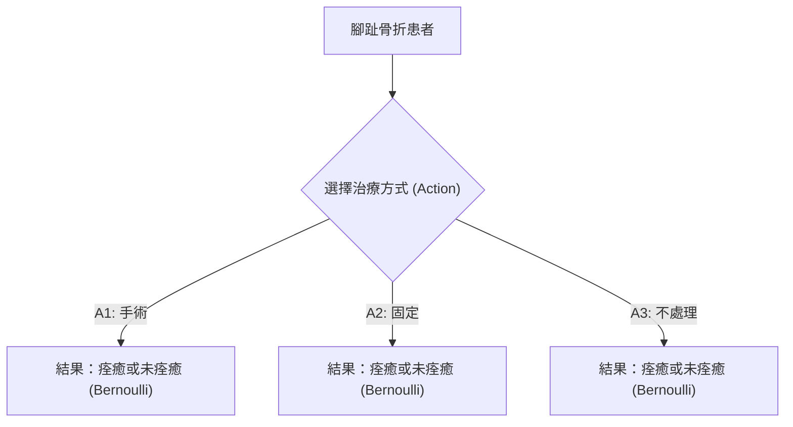
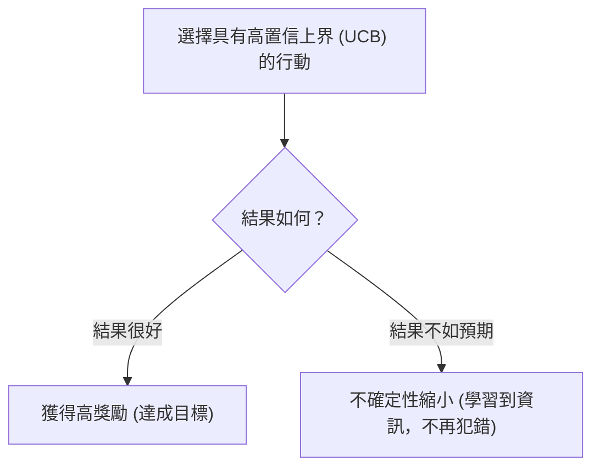

# 第 11 章：探索（一）多臂賭博機 (Exploration 1: Multi-Armed Bandits)

在先前的章節中，我們討論了如何從人類反饋或過去的示範資料中學習。本章開始，我們將焦點轉向**快速且具備資料效率的強化學習 (fast or data efficient reinforcement learning)**，也就是當我們能夠主動收集資料時，該如何有策略地收集。

在許多實際應用中（如醫療干預、廣告推薦、教育科技），取得真實世界資料的成本非常高昂，我們不能像在 Atari 遊戲或圍棋模擬器中那樣無限制地獲取樣本。因此，我們必須謹慎考慮如何以「最有效率」的方式探索環境。

---

## 11.1 多臂賭博機 (Multi-Armed Bandits, MAB)

多臂賭博機 (MAB) 是強化學習中最簡化、但也極其重要的一個問題設定。
MAB 的特徵如下：
- **無狀態 (No States)**：環境中沒有狀態轉移的過程。
- **有限行動 (Finite Actions)**：有一組有限的行動（或稱為「臂」, arms）集合 $\mathcal{A}$，共 $K$ 個臂。
- **隨機獎勵 (Stochastic Rewards)**：每個臂都有一個未知的獎勵機率分佈。每次拉動一個臂（採取一個行動），環境會從該分佈中抽取一個獎勵。
- **目標**：在總共 $T$ 個時間步內，最大化累積獎勵 $\sum_{t=1}^T r_t$。

### 例子：斷趾的治療選擇

為了具體說明，課程中舉了一個「斷趾治療」的例子（僅為教學用途，非真實醫療建議）。
假設有一位腳趾骨折的患者，我們有三個選擇：
1. **手術 (Surgery)**
2. **固定 (Buddy Taping)**
3. **不處理 (Do Nothing)**

我們的目標是讓腳趾在六週後痊癒，結果是一個二元變數（痊癒為 1，未痊癒為 0）。我們可以將其建模為三個臂的 MAB，每個臂都是一個未知參數 $\theta$ 的伯努利分佈 (Bernoulli distribution)。
由於每位患者的情況被視為獨立事件，這個過程沒有時序上的狀態依賴，非常適合用 MAB 來建模。

---

## 11.2 貪婪演算法的失敗 (Failure of the Greedy Algorithm)

一個最直覺的策略是**貪婪演算法 (Greedy Algorithm)**：我們記錄每個行動過去帶來的平均獎勵（即經驗期望值 $\hat{Q}(a)$），然後在每個時間步都選擇目前看起來最好的行動。

假設真實的成功率是：手術最佳、固定次之、不處理最差。一開始我們對每個動作都嘗試一次，結果碰巧觀察到：
- 手術 (A1)：0
- 固定 (A2)：1
- 不處理 (A3)：0

在這個情況下，貪婪演算法在下一步一定會選擇 A2（固定），因為它目前的期望值最高（1.0）。如果接下來 A2 繼續給出合理的獎勵，它的平均值永遠不會降到 0，導致演算法**永遠不會再去嘗試 A1**。
結果是，演算法被鎖定在一個次優的選擇上，永遠無法收斂到真正的最佳行動。這說明了為什麼在強化學習中**探索 (Exploration)** 是不可或缺的。

---

## 11.3 量化表現：後悔值 (Regret)

為了解決這個問題並評估不同演算法的優劣，我們引入**後悔值 (Regret)** 的概念。
假設最佳行動的期望獎勵為 $V^* = \max_a Q(a)$。
對於任意行動 $a$，其**差距 (Gap)** 定義為最佳獎勵與該行動期望獎勵的差值：
$$ \Delta_a = V^* - Q(a) $$

在 $T$ 個時間步後的累積後悔值 $L_T$ 就是我們錯失的潛在獎勵總和：
$$ L_T = \sum_{t=1}^T (V^* - Q(a_t)) = \sum_{a \in \mathcal{A}} N_T(a) \cdot \Delta_a $$
其中 $N_T(a)$ 是我們在 $T$ 個時間步內選擇行動 $a$ 的次數。

因為 $V^*$ 是固定的未知常數，**最大化累積獎勵完全等同於最小化總後悔值**。

不同演算法帶來的後悔值成長速度大不相同：
- **線性後悔 (Linear Regret)**：如前述的貪婪演算法，可能永遠選擇次優行動，後悔值隨時間呈 $O(T)$ 線性成長。
- **常數後悔 (Constant Regret)**：在有限步內找到最佳解後就不再犯錯，非常難以達成。
- **次線性後悔 (Sublinear Regret)**：如對數成長 $O(\log T)$，意味著隨著時間推移，演算法犯錯的頻率越來越低，這正是我們期望達到的目標。

---

## 11.4 &epsilon;-greedy 演算法

在先前的章節我們提過 $\varepsilon$-greedy 演算法：以 $1-\varepsilon$ 的機率選擇目前平均獎勵最高的行動，並以 $\varepsilon$ 的機率隨機選擇所有行動。

然而，如果 $\varepsilon$ 是一個**靜態的非零常數**，演算法依然會有線性後悔。因為無論我們對最佳行動有多確定，每個時間步我們都有 $\varepsilon$ 的機率隨機亂選，這意味著次優臂至少會被拉動 $\Omega(\varepsilon T / K)$ 次。因此，靜態 $\varepsilon$-greedy 並不是一個能達到次線性後悔的最佳解（除非 $\varepsilon$ 隨時間妥善衰減）。

---

## 11.5 理論的曙光：Lai-Robbins 下界

是否有演算法能夠保證次線性後悔呢？Lai 與 Robbins 在 1985 年提出了一個著名的理論下界（Lower Bound），為我們帶來了希望。

該定理指出，對於任何「一致良好 (consistent)」的演算法，其問題相依的後悔值下界為：
$$ L_T \geq \sum_{a:\Delta_a > 0} \frac{\Delta_a}{\text{KL}(\mu_a \| \mu^*)} \cdot \log T $$
這個結果告訴我們，任何好的演算法都必須承受 $\Omega(\log T)$ 的後悔值。也就是說，**對數成長的後悔值 (Logarithmic Regret) 已經是理論上的最佳極限**。

---

## 11.6 不確定性下的樂觀原則 (Optimism Under Uncertainty)

這堂課最優美的核心概念之一，是**不確定性下的樂觀原則 (Optimism Under Uncertainty)**。
這個原則告訴我們：我們應該選擇那些「有可能是最佳」的行動。為什麼樂觀是好的？因為當我們選擇一個上界看起來很高的行動時，只有兩種可能發生的結果：

1. **我們得到高獎勵**：太好了，這正是我們的目標！
2. **我們得到低獎勵，但我們學到了東西**：我們對這個行動的估計會因為新資料而收斂，不確定性降低。未來的決策就會因此變得更好。

無論結果如何，我們都不虧。這就是為什麼樂觀原則能在數學上被證明是達成次線性後悔的最佳策略。

相反地，如果我們採取**悲觀原則 (Pessimism)**（總是選擇下界最高的行動），一旦某個很棒的行動初始表現不佳，它的下界就會很低，我們就**永遠不會再去選擇它**，導致沒有機會學習和更新，最終產生線性後悔。

---

## 11.7 Hoeffding 不等式與置信區間

要具體實踐樂觀原則，我們需要量化「不確定性」。這裡我們使用統計學中著名的 **Hoeffding 不等式 (Hoeffding's Inequality)**。

對於 $n$ 個值域在 $[0,1]$ 的獨立同分佈 (i.i.d.) 隨機變數，真實期望值為 $\mu$，樣本平均值為 $\bar{X}_n$，Hoeffding 不等式給出了樣本均值偏離真實期望值的機率上限：
$$ P(|\bar{X}_n - \mu| \geq u) \leq 2e^{-2nu^2} $$

這意味著隨著樣本數 $n$ 增加，偏離超過 $u$ 的機率會以指數級別下降。我們可以利用這個不等式來建構**置信上界 (Upper Confidence Bound, UCB)**。
令 $\delta = 2e^{-2nu^2}$ 作為我們容許出錯的機率上限（例如 1%），我們反求 $u$ 得到：
$$ u = \sqrt{\frac{\log(2/\delta)}{2n}} $$

吸收常數後，我們可以將動作 $a$ 在時間 $t$ 的置信上界定義為：
$$ \text{UCB}_t(a) = \hat{Q}(a) + \sqrt{\frac{c\log(1/\delta)}{N_t(a)}} $$
其中 $\hat{Q}(a)$ 是經驗平均（開發, Exploitation），而根號項則是探索獎勵（Exploration Bonus）。樣本數 $N_t(a)$ 越少，探索獎勵就越大，鼓勵演算法去探索未知的行動。

---

## 11.8 UCB1 演算法與 Union Bound

基於上述推導，Auer 等人 (2002) 提出了經典的 **UCB1 演算法**：
1. **初始化**：先將每個臂都拉動一次。
2. **決策迴圈**：對於每一個時間步 $t$，計算所有臂的 UCB 值，並選擇 UCB 值最高的臂：
   $$ a_t = \arg\max_a \left[ \hat{Q}(a) + \sqrt{\frac{c\log(1/\delta)}{N_t(a)}} \right] $$
3. **更新**：觀察獎勵，更新該臂的拉動次數 $N_t(a_t)$ 與平均獎勵 $\hat{Q}(a_t)$。

**關於 $\delta$ 的設定 (Union Bound)**：
我們希望這個置信區間在所有的 $T$ 個時間步、對於所有的 $|\mathcal{A}|$ 個臂都能**同時成立**。因此，根據 Union Bound 原理，我們需要將整體的容錯率 $\delta'$ 分攤到每個事件上，也就是設定 $\delta \approx \frac{\delta'}{T \cdot |\mathcal{A}|}$。這會讓 $\log(1/\delta)$ 項中多出 $\log(T)$ 的成分，也正是為什麼這個演算法能給出與 $\log T$ 相關的界限。

---

## 11.9 UCB1 的次線性後悔證明草稿

為什麼 UCB1 能達成對數級別的後悔值？證明核心在於限制我們選擇「次優臂」的次數。

當置信區間皆成立時，如果我們在時間 $t$ 選擇了次優臂 $a$ 而不是最佳臂 $a^*$，必定是因為 $a$ 的置信上界大於 $a^*$ 的置信上界：
$$ \text{UCB}_t(a) > \text{UCB}_t(a^*) $$
但同時我們知道 $a^*$ 的上界大於其真實值 $Q(a^*)$。結合這兩點可以推導出，我們之所以會誤選 $a$，是因為 $a$ 的探索獎勵（不確定性）大到足以彌補它與最佳臂之間的差距 $\Delta_a$。

經過代數運算，我們可以得出，次優臂 $a$ 被拉動的次數 $N_T(a)$ 會被限制在：
$$ N_T(a) \leq \frac{4c \log(1/\delta)}{\Delta_a^2} + \text{常數} $$

這意味著：
1. **次優臂的拉動次數是有限的**，且隨著時間只會呈現 $\log(1/\delta)$（即 $\log T$）的成長。
2. **差距 $\Delta_a$ 越大，我們拉動該次優臂的次數越少**（因為 $\Delta_a$ 在分母的平方項），這非常符合直覺：越明顯錯誤的選擇，我們越快能辨識並捨棄它。

總結來說，UCB1 演算法的期望總後悔值為 $O(\log T)$，這是一個極其強大的結果，證明了我們可以透過原則性的探索方法，在有限資料下達成最佳級別的學習效率。

---

## 11.10 本章小結

本章我們探討了多臂賭博機問題，並見證了**不確定性下的樂觀原則 (Optimism Under Uncertainty)** 的威力。
我們了解到單純的貪婪演算法或靜態 $\varepsilon$-greedy 都會導致線性後悔。而利用 Hoeffding 不等式建立置信上界的 UCB1 演算法，不僅直觀優美，還能在理論上保證達到次線性（對數級別）的最佳後悔值極限。

這個將「探索與利用的權衡 (Exploration-Exploitation Tradeoff)」透過數學公式具體化並證明的概念，是整個強化學習領域的基石之一。在下一講中，我們將會看到從貝葉斯 (Bayesian) 視角出發的其他強大探索演算法（如 Thompson Sampling），並最終將這些概念推廣回具有狀態轉移的馬可夫決策過程 (MDPs)。
