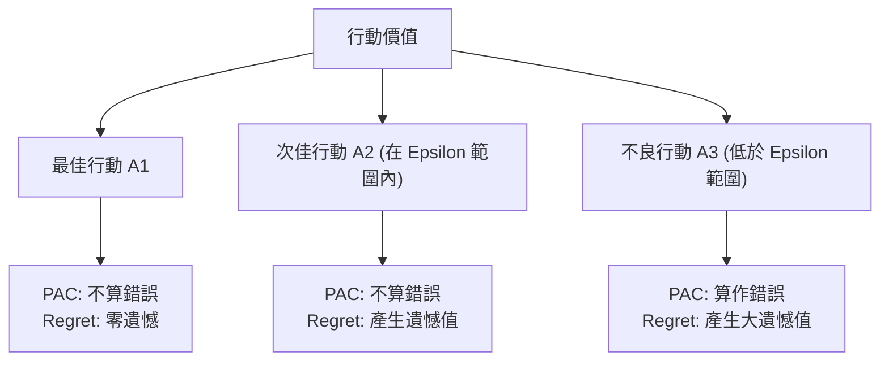
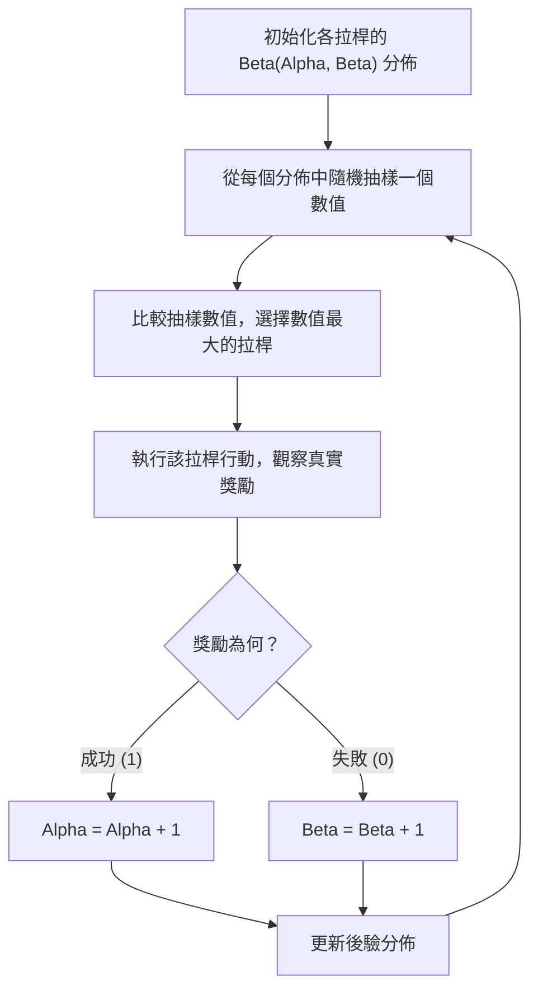

# 第 12 章：探索與開發 (二) - 貝氏吃角子老虎機與湯普森採樣

在上一章中，我們介紹了多臂吃角子老虎機 (Multi-Armed Bandits) 問題，並探討了基於頻率學派的「上信賴界」(Upper Confidence Bound, UCB) 演算法。UCB 演算法透過建立信心區間來實現「面對不確定性時保持樂觀」(Optimism in the Face of Uncertainty)。在本章中，我們將探討另一種定義演算法效能的方法 —— PAC 學習框架，並深入介紹貝氏學派的探索方法，特別是著名的「湯普森採樣」(Thompson Sampling)。

## 1. 另一種評估指標：PAC 框架

在評估探索與開發 (Exploration and Exploitation) 演算法時，我們最常使用的是**遺憾值 (Regret)**。遺憾值計算的是我們採取的每一個次優行動所造成的累積損失。然而，在某些情況下，我們可能不需要找到絕對的最佳策略，只要策略「夠好」即可。這時我們可以使用 **PAC (Probably Approximately Correct)** 框架。

### PAC 演算法定義

PAC 演算法的核心精神是允許系統犯錯，但我們希望犯下嚴重錯誤的次數有上限。具體來說：
一個 PAC 演算法在每個時間步選擇的行動，其價值至少是 $\epsilon$-最佳的 (亦即 $Q(a) \ge Q(a^*) - \epsilon$)，且在絕大部分的時間裡都會滿足這個條件。只有在「多項式數量」(Polynomial number) 的時間步中，演算法會以高機率 ($1-\delta$) 選擇次優超過 $\epsilon$ 的行動。

- $\epsilon$ (Epsilon)：容忍的次優程度。
- $\delta$ (Delta)：失敗機率，即不滿足上述條件的機率。

與遺憾值的比較：
- **遺憾值 (Regret)** 會懲罰所有非最佳的行動。
- **PAC** 只將低於最佳值超過 $\epsilon$ 的行動視為「錯誤」，並計算這些錯誤的總次數。

## 2. 貝氏吃角子老虎機 (Bayesian Bandits)

UCB 等頻率學派方法對獎勵分佈的假設很少 (通常只假設獎勵是有界的)。然而，在許多實際應用中 (如醫療試驗)，我們可能具備某些領域知識，並希望將這些知識整合到演算法中。貝氏吃角子老虎機允許我們對未知參數設定**先驗分佈 (Prior Distribution)**。

### 貝氏定理的更新

假設某個拉桿的獎勵服從某個機率分佈，且該分佈由未知參數 $\theta$ 決定。
1. **先驗分佈**：我們根據經驗給予 $\theta$ 一個初始分佈 $P(\theta)$。
2. **觀察獎勵**：拉動拉桿並得到獎勵 $R$。
3. **後驗分佈**：根據貝氏定理更新我們對 $\theta$ 的認知：
   $$ P(\theta | R) = \frac{P(R | \theta) P(\theta)}{P(R)} $$

### 共軛先驗 (Conjugate Priors) 與 Beta 分佈

貝氏更新在計算上通常很複雜，但如果我們使用**共軛先驗**，後驗分佈的數學形式將與先驗分佈保持一致，使得更新變得非常簡單。

對於產生二元獎勵 (Bernoulli 分佈，例如點擊/未點擊、成功/失敗) 的情況，其共軛先驗是 **Beta 分佈**。
Beta 分佈由兩個參數 $\alpha$ 和 $\beta$ 定義，我們可將其直觀理解為「虛擬的成功次數」與「虛擬的失敗次數」。

- **先驗**：假設我們對某拉桿毫無所知，可以設定為均勻分佈 Beta(1, 1)。
- **更新規則**：
  - 若觀察到成功 (獎勵 = 1)：$\alpha \leftarrow \alpha + 1$
  - 若觀察到失敗 (獎勵 = 0)：$\beta \leftarrow \beta + 1$
更新後的後驗分佈即為 Beta($\alpha+1, \beta$) 或 Beta($\alpha, \beta+1$)。

## 3. 湯普森採樣 (Thompson Sampling)

湯普森採樣是一種基於貝氏推論的探索演算法。它的核心概念是**機率匹配 (Probability Matching)**：如果一個拉桿有 60% 的機率是所有拉桿中最好的，那我們就以 60% 的機率選擇它。

### 演算法步驟

1. 對每個拉桿設定參數的先驗分佈 (例如 Beta 分佈)。
2. 在每個時間步 $t$：
   - 從每個拉桿的目前後驗分佈中**抽樣**出一個參數 $\tilde{\theta}_i$。
   - 選擇具有最大抽樣參數的拉桿 $a_t = \arg\max_i \tilde{\theta}_i$。
   - 觀察獎勵 $R_t$。
   - 根據觀察結果更新被選中拉桿的後驗分佈。

### 湯普森採樣的優勢

1. **自然探索 (Natural Exploration)**：不需要像 $\epsilon$-greedy 那樣強制設定隨機探索機率，也不需要明確計算上信賴界。由於是從分佈中抽樣，具有較高不確定性的拉桿 (分佈較寬) 會有一定機率抽出較高的值，從而自動促成探索。
2. **適應延遲回饋 (Delayed Feedback) 與批次更新 (Batched)**：在真實世界中 (如網頁廣告推薦、Covid-19 入境檢測)，我們往往無法在做決定後立刻得到回饋。UCB 若未獲回饋，其信心區間不會改變，會導致演算法不斷重複選擇同一個 (可能次優的) 拉桿。而湯普森採樣每次決策時都會重新抽樣，因此即便沒有新資料更新分佈，抽樣的隨機性也能確保它嘗試不同的行動。

### 潛幾缺點

- 若設定了極度誤導的先驗分佈 (例如強烈認為某個極差的拉桿是最好的)，演算法可能需要花費大量時間收集資料，才能「蓋過」這個錯誤的先驗。

## 4. 最佳化指標策略 (Index Policies)

在面對貝氏吃角子老虎機問題時，我們能否找到一個「絕對最佳」的策略？
如果我們將歷史所有的行動與獎勵視為狀態，這將變成一個龐大的部分可觀察馬可夫決策過程 (POMDP)，計算上極不切實際。

為了解決這個問題，學界提出了 **指標策略 (Index Policy)** 的概念。指標策略會針對每一個拉桿獨立計算一個數值 (指標)，然後選擇指標最高的拉桿。UCB 演算法本質上就是一種指標策略。

**吉廷斯指標 (Gittins Index)** 證明了在無限時間視野與折扣獎勵的設定下，對於貝氏多臂吃角子老虎機問題，確實存在一種最佳的指標策略。這表示我們可以完全獨立地計算各個拉桿的指標，而不需要考慮拉桿之間的組合爆炸問題。儘管湯普森採樣在實際應用中表現優異，但它並不等同於吉廷斯指標，因此從嚴格的數學意義上來說並非絕對最佳，但其實作簡單且適用範圍極廣。

## 總結

本章我們從頻率學派的觀點過渡到貝氏學派，介紹了 PAC 學習框架以及湯普森採樣。湯普森採樣透過為未知參數建立機率分佈並進行抽樣，優雅地解決了延遲回饋與先驗知識整合的問題。這些進階的探索機制為將強化學習應用於真實世界 (如醫療決策、廣告推薦等) 奠定了重要的基礎。
