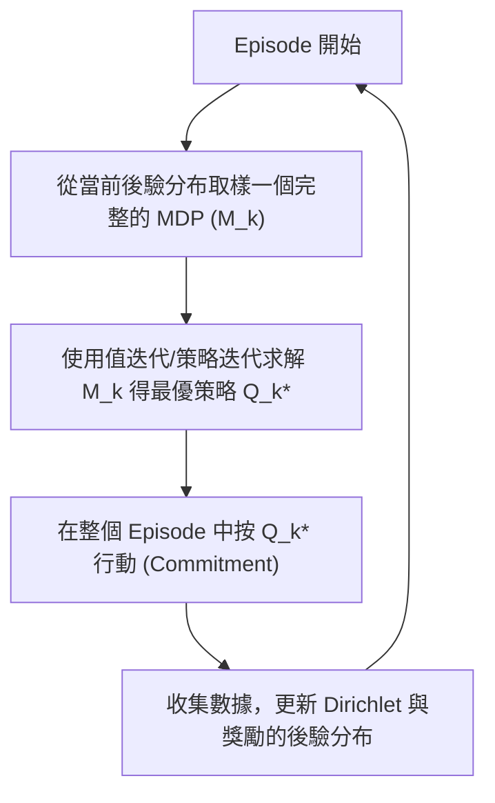

# 第十三章：Exploration 3（高效探索三：MDP 中的樂觀探索、貝氏方法與泛化）

## 13.1 簡介

本章是 CS234 關於高效探索（Exploration）的第三部分，也是總結篇。我們將探討如何將前兩章中多臂賭博機（Multi-Armed Bandits）的高效探索演算法——上置信界（UCB）與 Thompson Sampling——推廣到完整的馬可夫決策過程（MDP）中，並進一步探討如何將這些方法應用於連續或大型狀態空間。本章的重點涵蓋：

- 表格式 MDP 中的樂觀探索：MBIE（Model-Based Interval Estimation）演算法。
- 理論工具：模擬引理（Simulation Lemma）與 PAC-MDP 分析。
- 貝氏 MDP 與後驗取樣：PSRL（Posterior Sampling for Reinforcement Learning）與並行 RL（Concurrent RL）。
- 上下文賭博機與泛化：LinUCB 與線性特徵。
- 深度 RL 探索：偽計數（Pseudo-Count）方法。
- 元探索：決策預訓練 Transformer（DPT, Decision Pre-Trained Transformer）。

## 13.2 表格式 MDP 中的樂觀探索：MBIE 演算法

在完整的 MDP 中，探索不僅意味著選擇當前獎勵未知的動作，還必須考慮到動作會引導我們進入未知的狀態。這需要透過貝爾曼備份（Bellman backup）將「不確定性」往回傳遞，驅動長期的探索策略。

### MBIE (Model-Based Interval Estimation) 演算法框架

MBIE 演算法是基於「不確定性下的樂觀原則」（Optimism Under Uncertainty）的一種模型基礎（Model-Based）方法。它透過維護狀態動作對的計數來建立樂觀的上界。

1. **維護經驗模型**：
   - 計數 $N(s,a)$：狀態 $s$ 下執行動作 $a$ 的次數。
   - 轉移計數 $N(s,a,s')$：從狀態 $s$ 執行動作 $a$ 後轉移到 $s'$ 的次數。
   - 經驗獎勵模型 $\hat{R}(s,a)$ 與經驗轉移動態 $\hat{T}(s' \mid s,a)$。

2. **包含探索獎勵的貝爾曼備份**：
   在計算 Q 函數時，我們加入一個探索獎勵（Bonus）$\beta$：
   
   $$ \tilde{Q}(s,a) = \hat{R}(s,a) + \gamma \sum_{s'} \hat{T}(s' \mid s,a) \max_{a'} \tilde{Q}(s',a') + \beta $$
   
   其中 $\beta$ 通常與訪問次數成反比，例如：
   
   $$ \beta = \frac{1}{1-\gamma} \cdot \frac{1}{\sqrt{N(s,a)}} $$
   
   對於那些少被訪問的 $(s,a)$ 對，$\beta$ 值會很大，這使得 $\tilde{Q}(s,a)$ 產生樂觀的過估（Overestimation），進而促使貪婪策略（Greedy policy）優先去探索這些區域。

### PAC-MDP 保證

MBIE 是一種 PAC-MDP (Probably Approximately Correct MDP) 演算法。PAC-MDP 的定義為：演算法以高機率僅在多項式步數內犯錯。
具體來說，令 $\pi_t^{\text{MBIE}}$ 為演算法在時間步 $t$ 的策略，則以高機率滿足：

$$ V^{\pi_t^{\text{MBIE}}}(s_t) \geq V^*(s_t) - \varepsilon $$

這在除了一個有限的時間步以外皆成立，而這個有限步數的上界是以下量的多項式：狀態空間大小 $|S|$、動作空間大小 $|A|$、$1/\varepsilon$ 以及 $1/(1-\gamma)$。
儘管這提供了理論保證，但在實務上這個理論上界通常極為保守。例如一個 $|S|=10, |A|=10, \varepsilon=0.1, \gamma=0.9$ 的環境，其理論上界可能達到 $10^{12}$ 步。但這證明了該演算法保證能夠收斂。

## 13.3 模擬引理 (Simulation Lemma)

為了證明 PAC-MDP，我們需要一個工具來將「模型的誤差」連結到「價值函數的誤差」，這就是**模擬引理 (Simulation Lemma)**。

### 定理陳述

給定兩個 MDP $M_1$ 與 $M_2$，在相同策略 $\pi$ 下，如果它們的獎勵與轉移模型誤差有上界：
- 獎勵函數誤差：$\|R_1 - R_2\|_\infty \leq \alpha$
- 轉移動態誤差：$\|T_1(\cdot \mid s,a) - T_2(\cdot \mid s,a)\|_1 \leq \beta$

則這兩個 MDP 在該策略下的 Q 函數差異有上界：

$$ \|Q_1^\pi - Q_2^\pi\|_\infty \leq \frac{1}{1-\gamma} \left( \alpha + \gamma V_{\max} \beta \right) $$

### 核心意義

模擬引理告訴我們，只要我們透過探索收集足夠的數據，使經驗模型（$\hat{R}, \hat{T}$）的誤差 $\alpha$ 和 $\beta$ 縮小（可利用 Hoeffding 不等式來約束），那麼我們計算出的 Q 函數誤差也會隨之縮小。這構成了 PAC-MDP 分析的基石。

## 13.4 貝氏 MDP 與 PSRL (Posterior Sampling for Reinforcement Learning)

正如我們可以將 UCB 推廣到 MBIE，我們也可以將多臂賭博機中的 Thompson Sampling 推廣到 MDP 中。

### 貝氏 MDP 框架

在貝氏視角中，我們不只維護一個單一的經驗模型，而是維護**所有可能 MDP 模型**的後驗分布（Posterior distribution）：
- **獎勵模型**：可以使用 Beta（二元獎勵）或高斯（連續獎勵）先驗。
- **轉移動態模型**：下一個狀態的轉移 $P(s' \mid s,a)$ 是一個多項式分布（Multinomial distribution）。對應的共軛先驗為 **Dirichlet 分布 (Dirichlet Prior)**。
  每當我們觀察到從 $(s,a)$ 轉移到 $s_i$ 的事件發生，我們就直接將對應的 Dirichlet 計數更新。

### PSRL 演算法

PSRL 演算法流程如下：

**為什麼要在整個 Episode 承諾 (Commit) 同一策略？**
如果我們在每一步都重新取樣 MDP 並重新計算策略，這會導致演算法在不同方向的探索間來回切換（Thrashing，抖動），無法深入探索。在 Episode 級別做承諾，可以保證一次有意義且深入的探索軌跡。

### Seed Sampling 與並行 RL

如果在同一個環境中有多個智能體（Agents）並行探索：
- **Seed Sampling**：每個智能體從後驗分布中抽取**不同**的種子（即不同的 MDP 模型）。
- 這會導致各個智能體擁有不同的最優策略，進而自動地「分散」去探索不同的狀態空間。
- 透過協調的並行探索，演算法能達到接近線性的探索加速效果。

## 13.5 泛化：上下文賭博機與深度 RL 探索

上述的方法都是針對表格式（Tabular）MDP。在真實世界中，狀態空間通常過於龐大或為連續值，我們需要泛化（Generalization）。

### 上下文賭博機 (Contextual Bandits) 與 LinUCB

上下文賭博機介於多臂賭博機與完整 MDP 之間：有狀態（上下文 $s$），但選擇動作不影響下一個狀態。
**LinUCB (Linear UCB)** 假設獎勵是特徵的線性函數：

$$ r(s,a) = \phi(s,a)^\top \theta + \varepsilon $$

- $\phi(s,a)$ 為 $d$ 維的特徵向量。
- 這樣的好處是，即便有數千個動作（例如新聞推薦），只要特徵維度 $d$ 較小，我們就能在動作之間共享結構，其後悔值（Regret）不會隨著動作數量呈線性惡化。
- 理論基礎依賴於**橢球勢定理 (Elliptical Potential Lemma)**，該定理為 $\theta$ 提供了嚴格的置信集（Confidence Set）。

### 深度 RL 的探索：偽計數 (Pseudo-Count)

在連續狀態（如 Atari 遊戲畫面）中，幾乎沒有狀態會被精確訪問兩次，MBIE 的 $1/\sqrt{N(s,a)}$ 無法使用。
**偽計數 (Pseudo-Count)** 方法利用密度模型 $\rho_n(x)$ 來估計狀態訪問密度：

$$ \hat{N}(s) = \frac{\rho_n(s) (1-\rho_n'(s))}{\rho_n'(s) - \rho_n(s)} $$

其中 $\rho_n'(s)$ 是將新狀態 $s$ 加入模型訓練後的更新密度。當模型對某個畫面感到「意外」時，密度變化大，偽計數低，探索獎勵變高。這在困難的探索遊戲（如《Montezuma's Revenge》）中取得了巨大突破。

### 深度神經網路與 Thompson Sampling 近似

在深度網路中實現 Thompson Sampling 有兩種常見的近似：
1. **自舉 (Bootstrapping)**：訓練多個網路（Ensemble）並在初始化時給予不同權重，透過選擇不同的網路來近似後驗取樣。
2. **貝氏最後一層 (Bayesian Last Layer)**：前面的隱藏層作為特徵萃取，僅在網路的最後一層使用貝氏線性回歸，提供不確定性的估計。

## 13.6 決策預訓練 Transformer (DPT) 與元探索

最後，如果我們面臨多個任務，能否「學會如何探索」？這被稱為元探索（Meta-Exploration）。
**決策預訓練 Transformer (DPT, Decision Pre-Trained Transformer)** 的思路：
1. 在離線環境中，生成大量 Bandit 或 MDP 問題的歷史軌跡，並透過後見之明計算出「最優動作」。
2. 使用 Transformer 對這些軌跡進行監督式學習，訓練它去預測在給定歷史下的最優動作。
3. 研究表明，這種方法能夠隱式地學會等同於 Thompson Sampling 的策略。如果環境本身有未知的低維線性結構，DPT 甚至能自動發現並利用這些結構，表現逼近知道結構的 LinUCB。

## 13.7 總結

本章總結了從簡單的多臂賭博機到完整、大型 MDP 的高效探索框架。無論是透過樂觀原則建構的置信上界，還是基於貝氏後驗分布的 Thompson Sampling，其核心思想皆為：**量化不確定性，並讓演算法被不確定性驅動**。透過函數近似與元學習（如 DPT），這些理論工具正在被轉化為能解決複雜真實問題的強大 RL 演算法。
