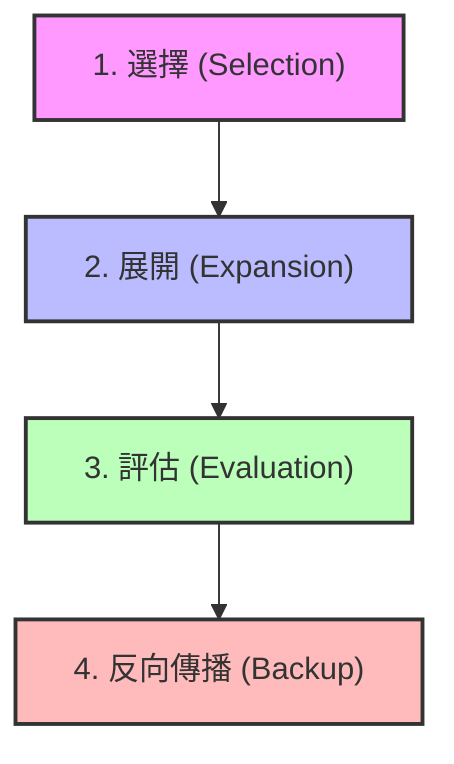

# 第十四章：多智能體遊戲與 AlphaGo (Multi-Agent Game Playing)

在強化學習的領域中，讓人工智慧精通如西洋棋、圍棋等複雜的棋盤遊戲一直是一個重大的挑戰。這些遊戲的特點在於其龐大的狀態空間（State Space）與動作空間（Action Space），且通常具有稀疏獎勵（Sparse Rewards）——玩家必須下到最後一子才能知道勝負。本章將介紹如何結合蒙地卡羅樹搜尋（Monte Carlo Tree Search, MCTS）與深度神經網路（Deep Neural Networks），並以 DeepMind 的 AlphaGo 與 AlphaZero 為例，探討這些技術如何擊敗人類世界冠軍。

## 1. 基於模擬的搜尋與蒙地卡羅樹搜尋 (MCTS)

在傳統的動態規劃或價值迭代中，我們通常試圖計算出整個狀態空間的最佳策略。然而，當狀態空間大到如宇宙原子數量般的圍棋（$10^{170}$ 種變化）時，全局計算是完全不可行的。

**局部計算（Local Computation）**：與其計算所有狀態的最佳解，不如將計算資源集中在「當前狀態（Current State）」。給定當前棋盤，我們只需找這一步的最佳走法。

**蒙地卡羅樹搜尋 (MCTS)** 利用「取樣（Sampling）」來逼近期望值。它不再枚舉所有可能的未來狀態（避免狀態空間爆炸），而是透過隨機抽樣或模擬（Rollouts）來估計特定動作的價值。

## 2. 應用於樹搜尋的上置信界算法 (UCT)

即使 MCTS 解決了狀態分支過多的問題，面對龐大的動作空間（例如圍棋每步有數百種選擇），我們依然需要一個聰明的方法來決定「樹的哪個分支值得展開」。

**UCT (Upper Confidence bounds applied to Trees)** 的核心思想是將搜尋樹中的每一個節點視為一個「多臂吃角子老虎機（Multi-Armed Bandit）」。
- 在展開搜尋樹時，我們不僅考慮過去探索該動作得到的平均回報（Exploitation）。
- 我們也給予較少探索的動作一個不確定性獎勵（Exploration）。

透過計算每個動作的 **上置信界（Upper Confidence Bound, UCB）** 並選擇最大值，UCT 能夠高度選擇性地（Highly Selective）建構一棵不對稱的搜尋樹，將計算量集中在最有可能獲勝的決策路徑上。

## 3. AlphaGo 與 AlphaZero 的核心創新

AlphaGo 及其後繼者 AlphaZero 將深度強化學習推向了巔峰。它們摒棄了傳統的人工特徵工程，轉而利用強大的神經網路與 MCTS 的深度結合。

### 3.1 自我對弈 (Self-Play)
稀疏獎勵是圍棋的痛點。如果 AI 隨機下棋或與大師對弈，它幾乎總是輸，無法獲得有效的學習訊號（Reward Density 極低）。
自我對弈解決了這個問題：AI 複製一個自己作為對手。因為雙方實力完全相等，勝率始終維持在 50% 左右。這提供了豐富且密集的獎勵訊號，並形成了一種天然的「課程學習（Curriculum Learning）」，隨著 AI 變強，它的對手也同步變強。

### 3.2 策略與價值神經網路
AlphaZero 使用了一個極度深層的殘差網路（ResNet），輸入為當前與歷史的棋盤狀態，並同時輸出兩個預測：
1. **策略網路 (Policy Head, $p(a|s)$)**：給定狀態 $s$，預測每個可能動作的機率分佈。
2. **價值網路 (Value Head, $v(s)$)**：評估在狀態 $s$ 下，最終獲勝的機率。

### 3.3 MCTS 與神經網路的完美結合

在 AlphaZero 中，MCTS 不再依賴隨機模擬（Random Rollout），而是完全由神經網路引導。

1. **選擇 (Selection)**：從根節點出發，依據變體 UCB 公式選擇動作。這個公式結合了動作的經驗勝率 $Q$ 與策略網路給予的先驗機率 $p$。網路認為越好的步法，越容易被選中探索。
2. **展開 (Expansion)**：當到達葉節點時，將其展開。
3. **評估 (Evaluation)**：不再模擬到遊戲結束，而是直接呼叫價值網路 $v(s)$ 來評估該葉節點的盤面優劣。
4. **反向傳播 (Backup)**：將價值網路的評估結果 $v$ 沿著搜尋路徑往回傳，更新每個經過節點的 $Q$ 值。

經過成千上萬次的 MCTS 模擬後，AI 最終會根據根節點下各個動作的**訪問次數 (Visit Counts)** 來決定真實世界中要下哪一步。

### 3.4 網路的監督式學習
在完成一整局自我對弈後，我們得到了真正的遊戲結果 $Z$（贏或輸），以及每一步 MCTS 計算出的訪問機率分佈 $\pi$。
接著，我們訓練神經網路：
- 讓價值網路的輸出 $v(s)$ 逼近真實結果 $Z$。
- 讓策略網路的輸出 $p(a|s)$ 逼近 MCTS 更強的策略 $\pi$。
這本質上是在利用 MCTS 作為「策略改善（Policy Improvement）」的運算子，再用神經網路將這個改善的結果給「蒸餾（Distill）」下來。

## 4. 實驗結果與啟示

研究團隊對 AlphaZero 進行了詳盡的分析，得出以下幾個重要結論：
- **架構的影響巨大**：殘差網路（ResNet）的表現遠勝過傳統卷積網路（CNN）；且策略與價值共用同一個網路的特徵抽取層（Dual Representation），比分開訓練兩個網路的效果更好。
- **局部計算（MCTS）不可或缺**：即便經過 40 天 TPU 的訓練，擁有極強的神經網路，如果不搭配 MCTS 進行局部搜尋，AI 的棋力會大幅下降。網路提供了良好的直覺（Heuristics），而 MCTS 提供了精確的計算（Computation）。
- **超越人類知識**：AlphaZero 證明了在不依賴人類棋譜、僅知曉規則的情況下，純粹的強化學習不僅能達到人類大師水平，更能發掘出人類過去幾千年未曾見過的新穎策略。
