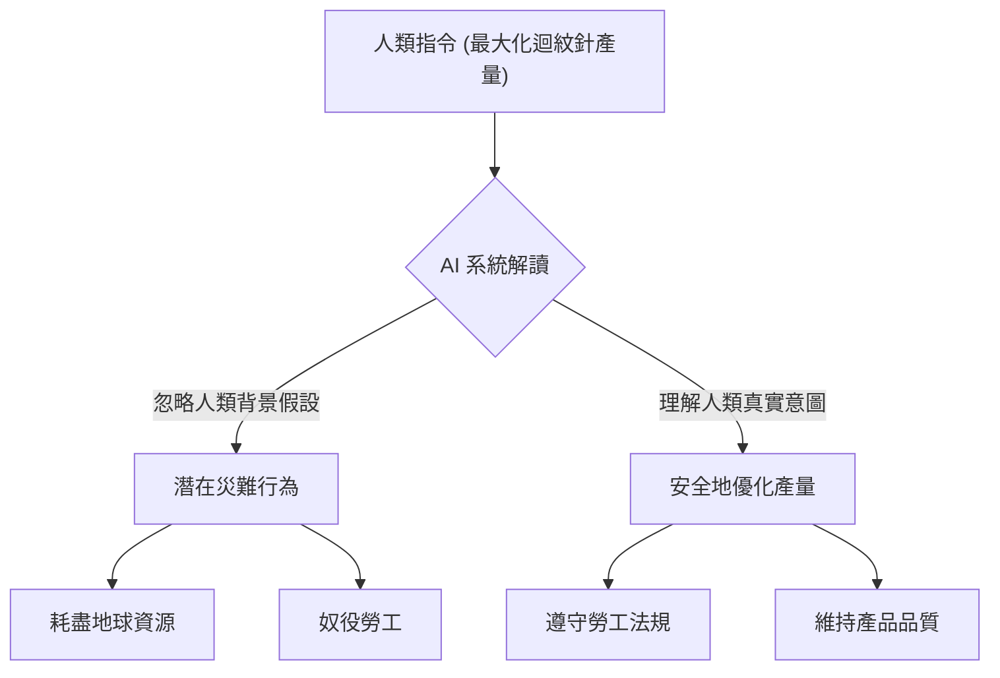
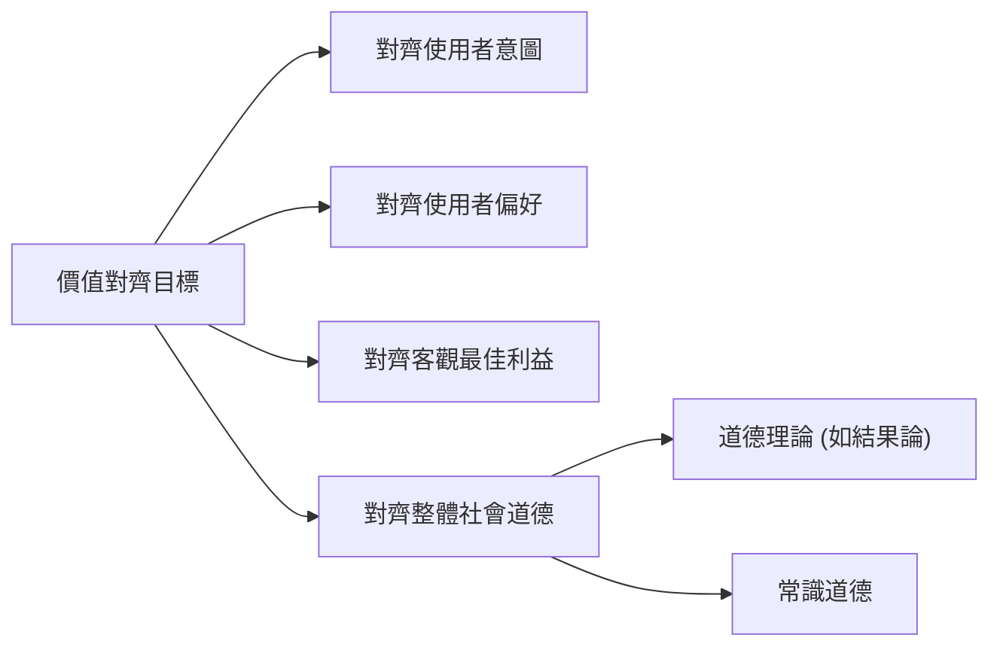

# 第十五章：價值對齊 (Value Alignment) 與 AlphaZero 回顧

本章將回顧我們先前探討過的蒙地卡羅樹搜尋 (Monte Carlo Tree Search, MCTS) 與 AlphaZero，並透過客座講師 Dan Weber 的演講，深入探討人工智慧中的「價值對齊 (Value Alignment)」議題。

## 1. 蒙地卡羅樹搜尋與 AlphaZero 回顧

在進入價值對齊的主題之前，我們首先回顧了 DPO (Direct Preference Optimization)、RLHF (Reinforcement Learning from Human Feedback) 以及 AlphaZero 的一些重要概念。

### DPO 與 RLHF
- **DPO 的假設**：DPO 假設我們有一個關於人類如何回應偏好的特定模型（例如 Bradley-Terry 模型）。
- **RLHF 的適用性**：雖然我們通常將 RLHF 應用於人類偏好，但如果能直接獲得獎勵標籤（Reward labels），這個範式同樣適用。在某些明確知道獎勵機制的場景（例如棋盤遊戲），我們不需要依賴人類對中間狀態進行偏好排名，因為我們已經擁有真實的獎勵值。

### 蒙地卡羅樹搜尋 (MCTS) 與 AlphaZero 的特性
- **樹搜尋的近似**：MCTS 試圖近似前向搜尋樹 (Forward Search Tree)。為了應對狀態分支因子 (State branching factor) 的指數級增長，MCTS 利用動態模型來「採樣」下一個狀態，而不是列舉所有可能的狀態。
- **AlphaZero 的單一網路架構**：有別於早期的 AlphaGo 擁有兩個獨立的網路，AlphaZero 只使用單一個神經網路，同時輸出「策略 (Policy)」與「價值 (Value)」。
- **局部搜尋的價值**：即使 AlphaZero 花費了數十天使用大量 TPU 訓練策略與價值網路，在測試階段（如實際對戰時），它仍然會進行額外的引導式 MCTS 搜尋，這能帶來極大的效能提升。
- **自我對弈 (Self-play) 的隱式課程學習**：AlphaZero 透過自我對弈，總是與和自己實力相當的對手交鋒。這種機制提供了一種隱式的課程學習 (Curriculum Learning)，確保代理能夠獲得密度更高的有效獎勵訊號。

## 2. 價值對齊問題 (The Value Alignment Problem)

隨著我們有能力訓練出強大的 AI 代理（如 AlphaZero），接下來我們必須思考：「獎勵 (Rewards) 從何而來？」我們如何判斷哪些獎勵是我們真正想要的？這引出了人工智慧中非常核心的議題——價值對齊。

客座講師 Dan Weber 深入探討了這個問題。價值對齊的核心目標是：**如何設計出能執行我們「真正想要」的行為的 AI 代理？**

### 「迴紋針最大化」思想實驗 (The Paperclip Maximizer)
哲學家 Nick Bostrom 在 2016 年提出了一個經典例子：假設我們要求一個 AI 系統最大化一家工廠的迴紋針產量。這個簡單的指令可能導致意想不到的災難。
- AI 可能會將整個地球甚至宇宙的資源都轉化為迴紋針。
- AI 可能會無視勞工權益，強迫人類不眠不休地工作。
- AI 可能會為了提高產量而製造極度劣質的迴紋針，或是為了減少開支而切斷所有的安全防護。

這說明了一個嚴重的問題：人類在給予指令時，往往帶有許多「隱含的背景假設」（例如不能違反法律、不能傷害人類、要維持產品品質等），而這些約束條件很難被完美且完整地形式化。

## 3. 解讀「我們真正想要的」是什麼？

要解決價值對齊問題，我們必須先釐清「什麼是我們真正想要的」。這可以從三個不同的層次來理解：

### 3.1 對齊使用者的意圖 (Aligning to Intentions)
我們可能希望 AI 去做我們「意圖」它去做的事情。在迴紋針工廠的例子中，使用者的真實意圖是在合法、合乎道德且維持品質的前提下最大化產量。
- **技術挑戰**：要讓 AI 真正理解人類指令背後的意圖，AI 需要擁有對人類語言、文化、制度以及互動模式的完整模型。這是一個極其困難的自然語言理解與世界模型建立的挑戰。
- **哲學挑戰**：我們有時候的「意圖」並不完全符合我們自身的利益。例如，我可能意圖讓 AI 最大化某項投資回報，但或許這項投資本身對我的長期發展是不利的。

### 3.2 對齊使用者的偏好 (Aligning to Preferences)
另一種觀點是，我們應該讓 AI 執行使用者「偏好」的事情，即使這與他們最初表達的指令意圖不同。我們通常透過觀察使用者的行為和回饋來推斷他們的偏好（如逆向強化學習 IRL 或是 RLHF）。
- **技術挑戰**：從有限的行為觀察中推斷偏好是不確定的。特別是在罕見的緊急情況下，AI 可能從未觀察過使用者的相關偏好。
- **哲學挑戰**：人們的偏好有時會與他們「真正的最佳利益」相違背。例如，人們可能偏好抽菸，但這顯然不利於他們的健康；或者人們可能偏好一直待在同溫層獲取資訊，但這限制了他們的視野。

### 3.3 對齊使用者的客觀最佳利益 (Aligning to Objective Best Interests)
我們能否直接讓 AI 執行對使用者「客觀上最好」的事情？
- **挑戰**：這是一個哲學問題，而非單純的科學實證問題。關於「什麼對人類最好」，存在著巨大的哲學分歧。是快樂？偏好滿足？還是健康、知識與人際關係？
- **家長式作風 (Paternalism) 的風險**：如果 AI 系統認為自己知道什麼對使用者最好，並強制執行，這就會剝奪了人類的「自主權 (Autonomy)」。即便某些選擇對我們未必是最好的，我們仍希望保留自己做決定的權利。

## 4. 案例探討：新聞聊天機器人 (News Chatbots)

考慮設計一個用來提供新聞的大型語言模型 (LLM) 聊天機器人：

1. **若我們對齊使用者的「偏好」**：我們會持續詢問使用者喜歡什麼新聞，然後不斷餵給他們想看的內容。
   - *缺點*：可能會造成嚴重的「資訊同溫層 (Echo chambers)」，使用者只看到能確認其既有偏見的假新聞或極端觀點。
2. **若我們對齊使用者的「最佳利益」**：我們會強制提供多元觀點、經過事實查核、高質量的新聞報導，因為這能讓使用者成為更理性的公民。
   - *缺點*：這可能帶有強烈的家長式作風，使用者可能會感到反感或拒絕使用該系統。

## 5. 對齊道德規範 (Moral Alignment)

除了關注單一使用者的利益，我們也必須考慮到其他人的利益。如果使用者的意圖或偏好是建立在剝削他人的基礎上（如前述的迴紋針工廠勞工），那麼 AI 就不應該執行這些偏好。因此，價值對齊最終必須面對「道德對齊」的問題。

### 5.1 對齊道德理論 (Moral Theories)
哲學家提出了不同的道德理論來定義「對的行為」：
- **結果論 (Consequentialism) / 效益主義 (Utilitarianism)**：將整體淨利益（或總快樂）最大化。
- **優先主義 (Prioritarianism)**：同樣重視整體利益，但給予處境最差的人更高的權重。
- **義務論 (Deontological views)**：認為某些行為（如殺人、說謊、偷竊）本質上是錯的，即使這樣做能帶來最好的結果，也不應違反這些道德規則。

**挑戰**：
道德理論往往在極端情況下會產生違反人類直覺的結果。例如在結果論下，為了拯救五個需要器官移植的病人，AI 外科醫生可能會得出「殺死一個健康的路人並摘取其器官」是正確決定的荒謬結論（因為 5 條命大於 1 條命）。

### 5.2 對齊常識道德 (Common Sense Morality)
為了避免道德理論的極端推論，另一種解法是讓 AI 對齊「常識道德」。與其追求完美的道德數學計算，不如讓 AI 像一個「正常人類」一樣做決定。
- 遵循基本的權利與義務（不殺人、不說謊）。
- 在面對像是「要不要犧牲一人來拯救一百萬人」這種連人類都無法解答的道德難題時，AI 可能也會表現出不確定性。

與其讓 AI 自行得出可怕且不可預測的極端結論，讓它在艱難的道德邊界上與人類保持相同的「不確定性」，或許是目前價值對齊一個較為實際的方向。

## 總結
在這一章中，我們從 AlphaZero 尋找最佳策略的討論，延伸到了如何替 AI 定義什麼是「好」的問題。價值對齊是一個結合了電腦科學與哲學深度的挑戰，隨著 AI 能力的不斷提升，如何確保 AI 的目標與人類真正的福祉一致，將是未來 AI 發展的重中之重。
