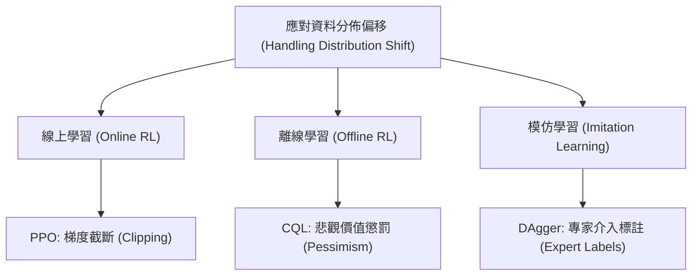

# 第十六章：價值對齊與課程總結 (Value Alignment and Course Wrap-up)

本章節標誌著史丹佛大學 CS234 強化學習課程的尾聲。強化學習 (Reinforcement Learning, RL) 的核心在於從經驗中學習，並做出能夠最大化長期獎勵的決策。在本章中，我們將回顧課程中涵蓋的核心理論，深入探討人工智慧的「價值對齊 (Value Alignment)」問題，並透過真實世界的尖端應用（如 AlphaTensor、電漿控制等）來檢視強化學習的實務挑戰。最後，我們將展望強化學習領域未來的開放性問題。

## 1. 價值對齊 (Value Alignment) 與 AI 倫理

隨著 AI 系統（特別是大型語言模型與強化學習智能體）越來越深入人類的日常生活，如何讓 AI 的目標與人類的價值觀保持一致，成為了至關重要的問題。這就是所謂的「價值對齊」。

### 1.1 自主權 (Autonomy) vs. 溫情主義 (Paternalism)

在設計對齊演算法時，我們經常面臨道德與哲學上的抉擇：
- **個人偏好與社會利益**：許多對齊演算法（如基於人類反饋的強化學習 RLHF）側重於最大化使用者的個人偏好。然而，道德理論提醒我們，設計者也必須考慮到更廣泛的社會利益，而不僅僅是滿足單一個體的短效期用。
- **使用者自主權 (User Autonomy)**：自主權是價值對齊中的一個核心原則。一個尊重自主權的 AI 應該允許使用者做出「次佳 (suboptimal)」甚至不利於自身的決定（在合理範圍內）。
- **溫情主義 (Paternalism)**：如果 AI 智能體認定某項決定對使用者「不好」而拒絕執行或隱瞞資訊（例如：拒絕告訴使用者哪裡可以買到香菸，因為吸菸有害健康），這種行為被稱為溫情主義。過度的溫情主義會嚴重損害使用者的自主權。在目標函數中，開發者必須在「使用者健康/福祉」與「使用者自主權」之間進行權衡。

### 1.2 從人類反饋中學習 (RLHF 與 PPO)

在 ChatGPT 等大型語言模型的微調中，模型首先學習一個監督式策略 (Behavior Cloning)，接著透過人類提供的偏好排序來訓練獎勵模型，最後使用 **PPO (Proximal Policy Optimization)** 來最佳化策略。
PPO 的特點在於其限制了策略更新的幅度，避免模型在未知的狀態空間中發生崩潰。

## 2. 強化學習核心概念回顧

強化學習與傳統監督式學習最大的差異在於：**智能體的動作會影響接收到的資料分佈**。這帶來了無限的機會，也帶來了資料分佈偏移 (Distribution Shift) 的巨大挑戰。

### 2.1 處理資料分佈偏移與推斷挑戰

當我們使用函數近似 (Function Approximation) 且依賴離線資料 (Offline Data) 進行學習時，模型容易對未見過的狀態-動作對產生「過度樂觀」的價值估計。為了應對這種推斷 (Extrapolation) 挑戰，課程中介紹了多種策略：
1. **PPO (近端策略最佳化)**：透過截斷 (Clipping) 梯度步長，限制策略的變化範圍，確保線上學習時的穩定性。
2. **DAgger**：在模仿學習中，當策略偏離專家軌跡時，主動向專家獲取新狀態的標註，以覆蓋學習到的策略分佈。
3. **保守與悲觀主義 (Pessimism)**：在離線強化學習 (如 CQL, MOPO) 中，針對資料集中未充分探索的區域給予悲觀的價值懲罰，從而避免模型走向高風險區域。

### 2.2 模型、價值與策略的抽象化

強化學習的三大核心組件各自有其優勢：
- **模型 (Models)**：最容易用來表示「不確定性 (Uncertainty)」。因為模型學習本質上是一個預測問題，可以無縫接軌統計學與機器學習中豐富的預測工具。
- **價值函數 (Value Functions)**：總結了策略的長期表現，是進行評估的核心。
- **策略 (Policies)**：直接決定在特定狀態下應採取的行動。

## 3. 經典應用案例分析

為了解決現實世界中的複雜問題，如何對問題進行「建模」至關重要。以下是課程中提及的三個指標性應用。

### 3.1 AlphaTensor：學習矩陣乘法演算法

DeepMind 的 AlphaTensor 利用強化學習來發現更有效率的矩陣乘法演算法。
- **問題設定**：多步強化學習 (Multi-step RL)。
- **獎勵函數**：計算步驟的長度（越短越好）。演算法被強制限制在「絕對正確」的運算空間內搜尋，因此不存在部署時的準確性風險。
- **核心技術**：結合了蒙地卡羅樹搜尋 (MCTS) 與策略/價值網路（類似 AlphaZero）。MCTS 透過對動態模型進行採樣，能有效在龐大的演算法空間中尋找最佳路徑。

### 3.2 核融合科學的電漿控制 (Plasma Control)

控制核融合反應爐內的電漿是一個高風險、高動態的任務。
- **架構設計**：採用演員-評論家 (Actor-Critic) 方法。
- **計算不對稱性**：在離線模擬環境中，評論家 (Critic) 可以是一個極度複雜的深層神經網路，以求最精確的價值估計；但演員 (Actor，即控制策略) 必須非常簡單，因為在真實世界部署時，它需要達到微秒級別的即時控制。
- **安全性與分佈偏移**：由於模擬器與現實世界存在誤差，研究人員在獎勵函數中加入了懲罰項 (Penalties)，驅使策略避開不穩定或不確定的區域，這本質上也是一種悲觀主義的應用。

### 3.3 COVID-19 邊境檢測

在有限的資源下，決定對哪些入境旅客進行檢測。
- **問題設定**：帶有延遲結果的批次吃角子老虎機 (Batch Bandit with Delayed Outcomes)。
- **挑戰**：這雖然不涉及複雜的狀態轉移，但因為檢測結果通常需要數天後才能獲得 (Lagged/Delayed rewards)，且檢測量能存在嚴格的預算與容量限制。因此演算法必須在探索與利用之間找到最佳的短期指標，以達到最大化社會健康效益的長期目標。

## 4. 強化學習的未來與開放性挑戰

儘管強化學習在遊戲與特定控制領域取得了巨大成功，但要在更廣泛的現實世界中普及，仍面臨許多挑戰：

1. **超參數調整與模型選擇 (Hyperparameter Tuning)**：在監督式學習中，我們可以利用交叉驗證來調整超參數。但在強化學習中，特別是當資料只能收集一次（如醫療或金融領域），自動化的超參數調整和模型架構選擇仍然是一個未解難題。
2. **馬可夫決策過程的替代方案 (Alternatives to MDPs)**：雖然 MDP 提供了極佳的理論框架，但現實世界並非總是能完美契合隨機的 MDP 模型。針對資料驅動的決策，可能存在更有效率的數學公式化表示法。
3. **跨任務學習與基礎模型 (Learning Across Tasks)**：過去的 RL 多半是從零開始學習單一任務。未來的趨勢是像大型語言模型一樣，建立具有共享表示 (Shared Representations) 的強大基礎智能體，使其能夠在多個任務間遷移經驗。
4. **豐富的反饋機制 (Richer Feedback)**：捨棄單一的標量獎勵 (Scalar Reward)，轉向能夠接受自然語言反饋、偏好選擇、或來自多個利益相關者的複雜回饋。

## 5. 總結

強化學習提供了一個極具潛力的框架，讓我們能夠設計出具有長期視野的決策系統。從確保 AI 價值對齊到克服資料效率與計算限制的權衡，RL 仍是一個充滿活力的研究領域。具備了這些工具與理論背景，我們現在已經準備好，將強化學習的潛能應用到下一個改變社會的重大挑戰中。
