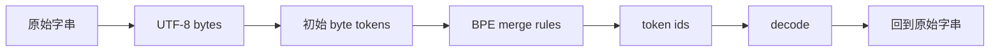

# Overview, Tokenization：從效率視角看語言模型

對應逐字稿：`data/cs336/transcripts/01_Stanford_CS336_Language_Modeling_from_Scratch_Spring_2026_Lecture_1_Overview_Tok.txt`

本章已完整閱讀逐字稿，閱讀筆記見[Lecture 1 閱讀筆記](notes/lecture-01-overview-tokenization.md)。

## 這門課真正要教什麼

CS336 的出發點是：只會呼叫或提示大型模型，並不足以支撐對語言模型的根本研究。抽象層次升高是好事，但抽象會漏水；當模型無法照你的意圖運作時，如果你不理解 tokenizer、模型、訓練、硬體、資料與 post-training 的整個堆疊，就很難知道還有哪些設計空間可以探索。

因此這門課的「from scratch」不是浪漫式地重寫世界，而是挑出最值得親手搭建的部分。課程希望學生帶走三類知識：

| 類型 | 內容 | 是否容易從小規模轉移到大規模 |
|---|---|---|
| mechanics | Transformer、parallelism、kernel、訓練流程如何運作 | 高 |
| mindset | 如何 profile、benchmark、重視效率、嚴肅看待 scaling | 高 |
| intuitions | 哪些建模或資料選擇真的有效 | 不一定，需要大規模實驗 |

這個區分很重要。小模型可以教會我們機械結構與工程心法，但不保證能複製 frontier model 的現象。講者舉了兩個原因：第一，模型放大後，不同模組的 FLOPs 比例會改變，最佳化重點可能從 attention 轉向 MLP 或其他部分；第二，某些能力有規模門檻，小模型上看不到，不代表大模型上不會出現。

## Bitter Lesson 的正確讀法

本講特別澄清一個常見誤解：bitter lesson 不是「只有 scale 重要，演算法不重要」。更精準的讀法是：能隨規模放大的演算法才重要。

如果把模型表現粗略寫成：

```text
表現 = 效率 × 資源
```

那麼在大規模訓練時，效率反而更關鍵。小實驗慢兩倍也許只是多等一晚；十億美元等級的訓練慢 5%，就是巨大的資源浪費。這也是 CS336 反覆強調 resource accounting、kernel、parallelism、scaling laws 的原因：大型語言模型不是只靠更多 GPU，而是靠能把 GPU、資料與演算法一起轉成有效學習的 recipe。

## 語言模型的歷史脈絡

本講把現代語言模型放在較長的脈絡中：

1. Shannon 時代已經用 language model 衡量英文 entropy。
2. N-gram 長期用於機器翻譯與語音辨識，作為生成流暢文字的一部分。
3. 神經語言模型從 feedforward context model、LSTM、seq2seq、attention、Transformer 持續演進。
4. ELMo、BERT 代表「預訓練後 fine-tune」的典型模式。
5. GPT 系列把 scaling、prompting、in-context learning 推到新階段。
6. Llama、Mistral、Qwen、DeepSeek 等 open-weight model 讓外界能更接近 frontier model 的設計線索。
7. AI2、NVIDIA、Marin 等方向嘗試不只釋出權重，也釋出 paper、code、data 或訓練細節。

這段歷史對本書很重要，因為 CS336 不是只教單一架構，而是教在產業化、封閉化與開放模型並存的環境下，如何仍然理解模型是怎麼被建出來的。

## 課程總路線

Lecture 1 將整門課預告成五個主要單元：

| 單元 | 核心問題 | 對應效率 |
|---|---|---|
| basics | 如何從 tokenizer、architecture、optimizer、trainer 建出可訓練 LM | 基礎計算效率與訓練穩定性 |
| systems | 如何把硬體用滿 | compute、memory、communication efficiency |
| scaling laws | 如何用小實驗預測大訓練 | 實驗效率與決策可預測性 |
| data | 模型應該學什麼，資料如何清洗與混合 | data efficiency |
| alignment | 如何用弱監督、偏好或 RL 改善模型行為 | 後訓練資料與系統吞吐效率 |

這些主題表面上不同，但共同問題都是：在固定資料與算力預算下，如何建出最好的模型。

## Tokenizer 是模型的第一個抽象層

語言模型不是直接對「字串」建模，而是對 token index 序列建模。因此 tokenizer 必須提供兩個方向：

```text
encode: string -> token ids
decode: token ids -> string
```



合格的 tokenizer 必須能 round trip：編碼後再解碼，應該回到原本字串。若不能 round trip，就代表資料在前處理階段已經遺失，後面模型再強也無法補回。

Tokenizer 也不是單純的資料格式轉換，而是效率設計。它決定原始文字會被壓成多長的 token 序列，而 attention 成本通常與序列長度平方相關。Lecture 1 用 compression ratio 表示這件事：

```text
compression ratio = bytes / tokens
```

ratio 越高，代表同樣文字被表示成越短的 token 序列，對注意力成本有利。但這不能無限制追求，因為 vocabulary 變大會帶來稀疏性：每個 token 被視為獨立單位，太大的 vocab 會讓許多 token 很少出現，學習效率反而差。

## 三種天真的 tokenizer

本講先討論三種直覺方案，說明為什麼它們都不夠好。

| 方法 | 優點 | 問題 |
|---|---|---|
| character-level | Unicode 字元天然是序列，概念簡單 | Unicode 字元很多且長尾，vocab 使用效率差 |
| byte-level | vocab 固定為 256，任何文字都能表示 | 序列很長，compression ratio 差 |
| word-level | token 通常有語意，compression ratio 較好 | vocab 可能巨大且無上限，測試時會遇到 OOV 或 `[UNK]` |

這三種方法各自卡在不同地方：字元方法浪費 vocab，byte 方法浪費 sequence length，word 方法無法穩定處理未見字詞。

## BPE 的折衷

Byte Pair Encoding 的核心想法是：從 byte 開始，逐步把常見的相鄰 token pair 合併成新 token。

演算法可以這樣理解：

1. 將語料轉成 byte 序列。
2. 一開始每個 byte 都是一個 token，vocab 至少包含 0 到 255。
3. 統計所有相鄰 token pair 的頻率。
4. 找出最常出現的 pair，建立一個新 token 代表它。
5. 在語料中把該 pair 替換成新 token。
6. 重複直到達到目標 vocab size。

Lecture 1 用 `the cat in the hat` 示範：例如 byte `116 104` 對應 `th`，若它最常出現，就建立 token `256` 表示 `th`。下一輪可能再把 `256 101` 合併成 `the`。隨著 merge 增加，序列變短，vocab 變大。

BPE 的優點是它結合了 byte-level 的覆蓋性與 word-level 的壓縮性：

- 常見片段會變成單一 token。
- 罕見片段仍可退回較小單位，不需要 `[UNK]`。
- vocabulary 是從資料中學出來的，會貼近訓練語料分布。

## 實作 tokenizer 的工程問題

概念版 BPE 很簡單，但作業要求把它做快。天真的 encode 會依序掃過所有 merge rule；如果 vocab 很大，merge rule 大約是 `vocab_size - 256`，逐條檢查會非常慢。

實作時要考慮：

- 只處理與目前字串相關的 merge。
- 建立索引來快速找到可合併 pair。
- 支援 special tokens。
- 先用規則把文字切成 chunk，再對 chunk 套 BPE，避免整篇文字一次處理。
- 當 Python 成為瓶頸時，可能需要 Rust、C 或其他更快實作。

這些細節顯示 tokenizer 雖然位於模型前面，但它已經是系統工程的一部分。

## 為什麼大家想擺脫 tokenizer

Tokenizer 有很多不自然之處：前置空白會改變 token，數字切分可能不一致，不同語言與符號系統的處理也常有偏差。Lecture 1 提到每年都希望未來不用再教 tokenizer，因為理想上模型能端到端直接處理 bytes。

但講者也指出，即使未來不用傳統 tokenizer，替代方案仍必須滿足兩個性質：

1. 模型需要在某種抽象後的序列上操作。文字、影片、DNA 等原始單位都可能太低階，signal-to-noise 太低。
2. computation 應該是 adaptive 的。不是每個 byte 都應該被同等對待，常見或低資訊密度片段應該被壓縮，稀有或高資訊片段則可能保留更細粒度。

因此 tokenizer 也可以被看成一種「可變長抽象與計算分配」問題，而不只是 NLP 傳統前處理。

## 本章小結

- CS336 的核心是從底層堆疊理解語言模型，而不只是使用現成模型。
- 小模型能教 mechanics 與 mindset，但不保證教會大模型的所有 intuition。
- 大規模訓練中，效率不是小優化，而是決定可行性的核心。
- 整門課都可從固定 data/compute budget 下最大化模型品質來理解。
- Tokenizer 把字串轉成 token index，是模型看見世界的第一層抽象。
- 好的 tokenizer 必須 round trip，並在 compression ratio、vocab size、稀疏性之間折衷。
- character、byte、word tokenizer 都各有根本限制。
- BPE 從 byte 出發，逐步合併常見 pair，提供覆蓋性與壓縮性的折衷。
- 實作 tokenizer 時，速度、special token、chunking 與資料結構都會變成工程問題。
- 即使未來走向 byte-level end-to-end 模型，也仍需要某種抽象與 adaptive computation。

## 相關作業與材料

- Course material：`data/cs336/lectures material/lecture_01.py`；trace：`data/cs336/lectures material/var/traces/lecture_01.json`。狀態：已核對 lecture README 與程式主流程；trace 未讀。
- Assignment 關聯：Assignment 1（`data/cs336/code/assignment1-basics-main/`）對應 BPE tokenizer 的訓練、encoding/decoding、special tokens 與資料處理範圍。狀態：已核對 README、PDF outline、測試介面；handout 未完整閱讀。
- 本段只整理學習目標與章節關聯，不提供作業解答。
