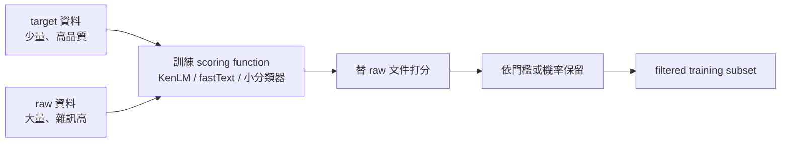
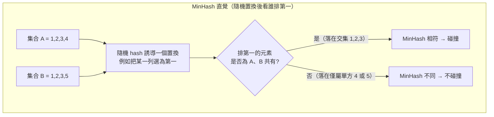
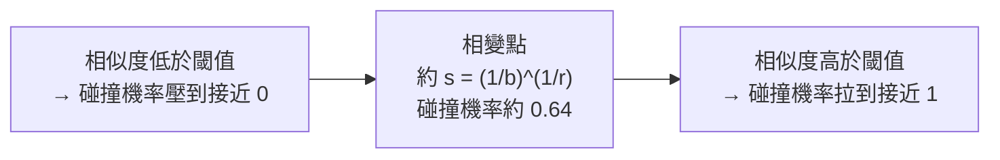
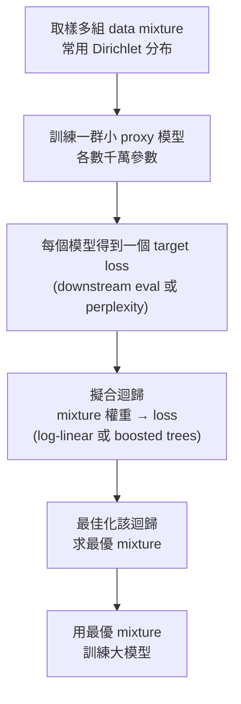

# Data Pipeline and Quality

## 導讀

上一章我們談的是資料「從哪裡來、憑什麼能用」——來源、爬取限制、著作權與授權。這一章接續同一條線，但把鏡頭從「來源」拉近到「工廠」：當你手上已經有一批原始網路文件之後，究竟要經過哪些加工，才能變成一份值得餵進模型的訓練語料？

講者把這條產線拆成五道工序，本章也照這個順序展開：先是 transformation（把 HTML、PDF 這些原始格式轉成文字），接著是 filtering（過濾出高品質、對的語言、不帶毒性的內容），然後是 deduplication（去掉重複與近似重複），再來是 mixing（決定不同資料源之間的配比），最後是 post-training data（後訓練資料，如今幾乎清一色是合成資料）。前四道工序主要服務 pre-training，最後一道則帶我們窺見後訓練時代的資料長相。

貫穿全章的心智模型只有一句話：這些步驟沒有唯一正解。每一步都是 tradeoff——規則還是模型、要量還是要質、要純粹還是要多樣——而且最終落點往往取決於「你打算訓練多大的模型、跑多少 token」。更務實地說，資料工作有很大一部分是 grungy、domain-specific、必須反覆盯著具體例子看的手工活，本章給的是骨架與框架，不是全貌。

## 核心內容

### 從原始位元到文字：transformation 是一道有損工序

原始資料從來不是乾淨的文字。你去 common crawl 裡撈到的東西，多半是 HTML，有時是 PDF，在 GitHub 的情境下甚至是目錄結構。既然網路大部分內容都是 HTML，轉換工作的主要張力也就落在 HTML 上。

把 HTML 轉成文字，本質上是一連串啟發式決策：要移除樣板（導覽列、廣告、頁首頁尾、選單），要抽取「內容」主體。但「什麼算內容」並非總是清楚——某些導覽元素或許正好能讓模型學到網頁長什麼樣子；圖片與表格又該如何處理？這裡有一個根本的張力：HTML 在結構上是階層的、在渲染後是視覺的，而我們卻要把它壓成一串線性 token，這個線性化過程天生有損。表格尤其棘手：簡單表格還能用 Markdown 渲染，巢狀表格就只能在某個點放棄或近似。

因為要快、又不需要太多「智慧」，HTML 轉文字幾乎都是 rule-based。講者也留了一個伏筆：這一步未來或許有 model-based 介入的空間，但前提是模型必須極快、又真的能做得更聰明。不論如何，任何規則式處理都有失敗率，所以資料裡永遠有瑕疵；而工具的準確度確實會影響下游品質——延續上一章的結論，resiliparse、Trafilatura 這類工具在 DCLM 的評測上優於 common crawl 官方的 WAT 轉換。

PDF 是另一種值得單獨一提的格式。Hugging Face 有一份叫 FinePDFs 的資料集專門處理它。PDF 有幾個特點：一是 common crawl 裡的 PDF 常被截斷（PDF 檔很大），逼得你必須 re-crawl；二是很多 PDF 其實是掃描檔，等同影像，要跑 OCR 或用 VLM，成本遠高於處理純文字；三是 PDF 由設計就是「關於版面」的，保留了 layout 卻丟失語意結構（HTML 有 H1、P 這些標籤可用，PDF 沒有）。代價這麼高，為什麼還要處理 PDF？因為它雖然只占整個網路的一小部分，平均品質卻明顯高於一般網頁——一個人願意費工做成 PDF，通常代表他真的有些東西想說。

### 過濾：一個統一的框架

轉換完成後，你離「可用」還很遠。下一道工序是 filtering，而講者刻意用一個抽象框架來統攝所有過濾：

你有一小批**高品質的 target 資料**（你想要的樣子），以及一大批剛轉換出來的 **raw 資料**。目標是在 raw 裡找出「與 target 相似」的子集。幾乎所有過濾都能塞進這個骨架。

過濾的理由主要有三種：語言辨識（訓練英文模型就濾掉非英文）、品質過濾（最主要的目的，要百科等級的內容而非垃圾與 spam）、毒性過濾（網路上不乏惡意內容，你可能不想讓模型學）。

具體怎麼做?通用做法是根據 target 與 raw 估一個模型、導出一個 scoring function，再依分數保留 raw 的子集。常見有兩類：

- **生成式**：直接對 target 資料估一個生成模型。因為要便宜，通常不是大語言模型，而是像 KenLM 那樣的 n-gram（例如 5-gram）模型，用機率或 perplexity 打分。
- **判別式（分類器）**：把 target 當正例、raw 中不在 target 的隨機子集當負例（可做平衡），訓練一個分類器。人們最常用 fastText，因為它快，本質是線性的 bag-of-words 分類器。

有了模型，就能對每份新文件打分，依你的品質門檻設閾值保留（有時 stochastic、有時不）。這裡有一個關鍵約束：過濾器要在可達上百兆 token 的資料上跑，所以必須極快；最終通常只留下個位數百分比的資料。

值得標記的一個轉變是：幾年前很多資料集刻意「不做」model-based 過濾，怕引入偏差、把資料收斂到過窄的子集；但如今幾乎人人都做一定程度的 model-based 過濾。原因很現實——除非你 compute 充裕（那你根本不太需要過濾，全部拿去訓練就好），否則作為 compute-poor 的多數人，你必須非常精明地過濾,否則就是把 flops 浪費在低品質內容上。

### 品質是你自己定義的

「品質」沒有普世定義——它是一個工具,你想要什麼就把品質定義成什麼。講者用幾個實例把這個框架具象化:

- **要數學,就抓數學**:OpenWebMath 用了多步 pipeline:先用規則判斷是否含 LaTeX 指令,再用 KenLM(在已知的數學資料集 proof pile 上訓練)看 perplexity 是否夠低,再訓練一個 fastText 分類器判斷「是否為數學寫作」;含 LaTeX 者用較低門檻、不含者用較高門檻。最終得到約 147 億 token,訓出的模型在數學上勝過用 20 倍未過濾資料訓練的模型。
- **GPT-3**:正例是 Wikipedia、WebText(高 karma Reddit 貼文外連的頁面)與一些書,負例從一般網路抽樣,訓練線性分類器保留高分文件。
- **Llama 1**:正例是「被 Wikipedia 引用的頁面」而非 Wikipedia 條目本身。
- **phi-1**:這個例子特別能展示框架的彈性。它的 raw 是 the Stack 的 Python 子集;target 不是現成資料,而是**昂貴分類器的輸出**——定義一個 prompt「判斷 educational value」,用 GPT-4 對 raw 的 10 萬份子集分類,把正例當成 target,再訓練一個較便宜的分類器(他們用 random forest,也可用 fastText),最後套用到全體。這是「用貴模型造 target、再蒸餾成便宜過濾器」的典型套路。
- **毒性過濾**同理:Jigsaw toxic comments 資料集源自一個「幫助人們在線上有更好討論」的專案,資料是 Wikipedia 的 talk page(爭議主題常吵得很兇),標註了哪些留言有毒,據此定義正負例訓練分類器。

小結這一段的 recipe:先弄清楚「好資料長什麼樣」——可以是「我發現一份很喜歡的資料集,想要更多同類」,也可以是「我寫一個 prompt 讓 LLM 幫我初步篩一大池,再用篩出的好料訓練小分類器外推」——然後訓練一個輕量分類器,套遍你的 web crawl。

### 沒有最佳閾值:過濾強度取決於你要訓練多久

一個容易被忽略的微妙之處:分類器給你一個分數,但**沒有一個普世最佳閾值**。你不能說「0.9 就是最好」,因為它取決於你要做什麼——具體說,取決於你要訓練多少 token。

直覺是:訓練越久,越能容忍低品質資料;訓練越短,越需要高品質資料。(當然,如果能同時「更高品質 + 更久」最好,但資料池就那麼大,這不是你能點的菜。)

講者用 Michael Ryan 的一個初步實驗說明:一個 157M 參數模型、極小的資料池,比較兩種資料隨訓練推進的 loss。藍線是 DCLM(高品質),loss 一開始就較低,但因為資料不多,很快就要重複(epoch),每一段藍線是一個 epoch,重複幾次後開始過擬合。另一條 resiliparse(幾乎不過濾)一開始差得多,但隨著不斷訓練、也開始 epoch 後,loss 持續緩降。於是浮現一個清楚的趨勢:**在「還不需要 epoch」的階段,高品質資料勝;但一旦訓練到大量 token,量大的低品質資料反而追上甚至超過高品質資料在過擬合點的表現。**這正是「沒有最佳閾值」的實證——最優過濾強度隨你的 token 預算而移動。

### 去重:動機與設計空間

過濾之後,你只留下自認高品質的資料,但裡面往往仍有重複。重複分兩類:**exact duplicate**(完全相同,例如鏡像站的整份複製、fork 出來後 99% 沒改的 repo)與 **near duplicate**(僅差幾個 token,可能來自複製或共同來源)。近似重複的日常例子很多:MIT license 與 ToS 樣板、網站共用的 header/footer、只差一個逗號的兩篇文章、把 Canada 換成 USA 的廣告模板。極端案例是某 C4 audit 發現一段 gas mask 產品描述在資料集中出現了 61,000 次——所以務必「看你的資料」。

為什麼要去重?主要是**省 flops、避免浪費**(去掉重複不太損失資訊卻縮小資料集);其次是**避免記憶化**(重複的著作權內容一旦被記住,牽涉法律與隱私風險);還有一個常被低估、但可能更重要的特例——**去污染(decontamination)**,確保測試集不混進訓練集。

去重的設計空間有三個維度:

1. **item 粒度**:句子、段落,還是整份文件?
2. **match 判準**:完全相同、共享某個子項、還是子項比例超過某閾值(給近似去重用)?
3. **找到重複後的動作**:移除全部,還是留一份?

關鍵的演算法挑戰在於:過濾是針對「單一 item 好不好」,可平行、線性時間;但去重本質是「item 與其他 item 比較」,你不可能做 n² 的兩兩全比對,必須有線性時間的演算法才能在網路規模上運作。去重文獻的通用答案是**用 hash 函數**繞開這個難題。這裡用的不是密碼學那種抗碰撞的昂貴 hash,而是像 hash table 用的快速版——因為我們接下來反而要「刻意製造受控的碰撞」。

exact dedup 概念很簡單:hash 每個 item,完全相符就留一。C4 對「連續三句 span」做 exact dedup,但有個副作用值得記住:如果兩份文件共享一段三句 span,你把它「留一移其餘」,等於從某份文件硬挖掉三句,破壞了連貫性——但他們就是這麼做的。真正的難題是近似去重。

### MinHash 與 LSH:在線性時間找近似重複

要做近似去重,先要定義「近似相同」。講者用 **Jaccard 相似度**:兩集合交集大小除以聯集大小,介於 0(不相交)與 1(相同)之間。例如 `{1,2,3,4}` 與 `{1,2,3,5}` 的 Jaccard 是 `3/5 = 0.6`。我們說兩份文件是近似重複,若其 Jaccard 超過某閾值(例如 0.99)。

問題是:如何在線性時間內找出所有近似重複對?答案是 **MinHash**。

MinHash 是一個隨機 hash 函數,其精妙性質是:兩集合的 MinHash 發生碰撞的機率,**恰好等於它們的 Jaccard 相似度**。做法本身很簡單——對集合中每個元素做 hash,取最小值當作這個集合的 MinHash。為什麼成立?把它想成:隨機 hash 對所有元素誘導出一個隨機置換,取 min 等於問「在這個置換下,誰排第一」。

因為交集元素 `{1,2,3}` 排第一時 A、B 的 MinHash 相同,而僅屬單方的 `{4,5}` 排第一時不同,碰撞機率正好是 `3/5`。這裡的反直覺之處在於:平常我們設計 hash 是要「避免碰撞」,這裡卻要「製造受控的碰撞」——讓相似的東西比不相似的東西更常碰撞。而且有了 MinHash,我就不必兩兩比對:只要分別算出各集合的 MinHash,再找碰撞即可。

但單一 MinHash 還不夠:一次碰撞只告訴你「碰撞機率等於 Jaccard」,這太隨機、variance 太大,無法可靠判定「Jaccard 是否超過 0.99」。解法是 **LSH(locality sensitive hashing)**——理論電腦科學的經典手法,用來「銳化」這個機率。

做法是:用更多且獨立的 hash 函數,把 n 個 hash 分成 **b 個 band、每 band r 個 hash**(例如 12 個 hash = 3 band × 4 hash)。定義 A、B「碰撞」為:**存在某一個 band,其 r 個 hash 全部相符**。這裡藏著一個 and-or 結構——band 內是 and(全部相符),band 之間是 or(任一 band 觸發即可)。

用機率算一下(設 Jaccard = s):

- 固定一個 band 全部相符的機率是 `s^r`(指數於 r,通常很低);
- 該 band「不相符」的機率是 `1 - s^r`;b 個 band 全都不相符是 `(1 - s^r)^b`;
- 於是「至少某 band 相符 = 碰撞」的機率是 **`1 - (1 - s^r)^b`**。

把它畫成「碰撞機率 vs 相似度」的曲線,會得到一條漂亮的 **S 型**:相似度接近 0 時碰撞機率接近 0,接近 1 時接近 1,中間有個陡峭的相變(phase transition)。這正是我們要的——讓「低於閾值就別碰撞、高於閾值就務必碰撞」。

兩個旋鈕的作用要記牢:**增大 r** 讓曲線變陡並**右移**(band 內要相符的 hash 更多,更難匹配);**增大 b** 讓曲線**左移**(band 更多、機會更多,更易匹配)。相變點大約落在 `s = (1/b)^(1/r)`,該點碰撞機率約 0.64(講者口述近似)。你可以把 b、r 調到讓相變任意陡,但代價是計算變貴。講者引的去重論文設定用了 `n = 9000, b = 20, r = 450` 給你一個量級感。這整套方法叫 **MinHash LSH**——LSH 對任何 hash 都適用,而語言模型去重用的是能逼近 Jaccard 的 MinHash。

最後一個實務提醒:去重常常只在單一資料集內部做,但**你必須跨整個資料集去重**,因為不同資料源之間常有冗餘。這件事常被忽略,但應該做。

### 資料混比:把多個資料源配成一鍋

經過轉換、過濾、去重,你對「單一資料源」得到了一批高品質文件。但語言模型是在**多個**資料源上訓練的——Wikipedia、common crawl、程式碼、你從某處抓來的數學資料……問題來了:怎麼把它們組合起來?

一個 data mixture 就是資料源上的一個機率分布。權重從哪來?幾種常見做法各有毛病:

- **手動設定(vibes)**:憑直覺填數字。這比你以為的更常見,連近期論文也常是「用個方法先算,再手動微調」。
- **uniform**:各源均勻取樣。
- **proportional**:按 token 數比例取樣(源越大權重越高)。合理,但若有一個巨大的低品質資料集,它會吃掉你大部分 token,顯然不夠好。

直覺上你該**上調高品質源**,但有兩件事必須放在心上:一是要確保**多樣性**——文學、程式碼、論文本就不可比,你沒法說「這篇論文比這段程式碼高品質」,而且若把權重全壓在論文上,模型別的能力就崩了;二是每個源都是**有限的**,若對一個小源灌太多權重,你會用光它、被迫反覆 epoch,一遍遍訓練字面上相同的 token,而這是有害的。

### 有限資料源的 epoch 陷阱

第二點值得用數字拆開,因為它是本講最反直覺、也最容易在大型訓練中踩雷的地方。假設你只有兩個源:低品質源 10 兆 token、高品質源 100 億 token(高品質源通常較小)。你天真地用 uniform(各半),訓練 1 兆 token(注意這是「訓練步數 × batch size」,不是獨特 token 數)。

- 低品質源:分到 5000 億 token 的請求,但它有 10 兆 token,所以你**連 5% 都碰不到一次**(不到 1 個 epoch)。
- 高品質源:同樣分到 5000 億 token 的請求,但它只有 100 億 token,於是你必須把每個資料點**重複約 50 次**(50 個 epoch!)。

也就是說,你只是定義了一個分布、然後取樣,卻在不知不覺中對高品質源做了 50 個 epoch。這已經害一些大型訓練 run 出過事。教訓非常直接:**別只盯著資料的品質與分布,一定要回頭看你實際在每個源上跑了幾個 epoch**——最壞是浪費 compute,更糟是過擬合。

這問題很早就被注意到。UniMax 在多語言訓練情境下提出解法:過去有人把 proportional 取樣「開個次方」來壓平分布,UniMax 則更明確——**均勻取樣,但對每個源的 epoch 數設硬上限(cap)**。形式上要求 `P(源) × 訓練 token 數 ≤ cap`;跑到上限就「太可惜了,沒得再拿」,換下一個。這等於一張安全網。

### 回歸式混比:用小模型群外推最優配比

就算解決了 epoch 陷阱,你仍要面對「50 個源就有 50 個數字要填」的問題。proportional 不夠好,那有沒有更有原則的方法?最容易理解機制的是 **regression-based mixing**(RegMix 等;這其實是 ASR 誤轉，指的應為同一篇 RegMix),思路和 scaling laws 很像:用便宜的小實驗,推出大模型該用的答案。

幾個設計決策:用什麼分布取樣 mixture(需要一個「分布上的分布」,常用 Dirichlet);用什麼迴歸(線性、log-linear、boosted trees);target 用什麼(常用 downstream eval,但**要非常小心過擬合**——若你的 eval 一堆是 code,方法自然會上調 code 資料,等你想寫詩才發現過擬合;uniform、proportional 反而沒這問題,因為它們根本不看 downstream eval);以及小、大規模的差距(這是成本與準確度的取捨,proxy 太小可能不具代表性,太大又失去意義)。

這裡有兩個「信仰跳躍」必須警惕:一是最佳化會把 mixture 推向**分布極端**,而迴歸在那裡的資料覆蓋最少、外推最不可靠(隨機取樣的 in-distribution 預測反而較安全);二是你只能**祈禱小規模的最優 mixture 能轉移到大規模**——在開放社群的尺度上大致成立(至少沒有明顯錯),但確實存在 scale-dependent 效應(回想過濾那節:訓練更久時低品質資料反而可接受,最優 mixture 顯然會隨規模改變)。一句話:凡是要「最佳化」,就有最佳化錯目標的風險。

### 用 simulate epoching 讓小規模像大規模

有一個具體的 scale-dependent 效應必須處理。承接前例(10 兆低品質、100 億高品質):若在小 token 數下訓練小模型,你**不會 epoch**,於是會覺得「Wikipedia 太棒了,全押高品質!」但把這個 mixture 搬到大模型、大 token 數,你就會在高品質源上狂 epoch、過擬合。小規模的最優,到大規模變成災難。

除了 UniMax 的 cap epoch,另一個解法(有多個名字,一稱 **simulate epoching**)的原則是:**讓小規模看起來像大規模**(這是本課反覆出現的主題,muP 讓超參數轉移也是同一精神)。做法是**按比例下採樣各資料源**:若小 run 是 100 億 token、大 run 是 1 兆 token,就用 1:100 下採樣。這樣一來,在小規模你也拿不到整個 Wikipedia,只拿到極小一片,於是「狂 epoch → loss 很差」的懲罰在小規模就會顯現,逼最佳化選出較均衡的 mixture——等於在低尺度**模擬了高尺度的資料稀缺**。(要當心下採樣後某源 token 太少,最優會給它很小權重;必要時用「至少訓練一次」的規則避免 rounding 到 0。)

補充一個延伸:data mixing 不只作用在「人給的資料源」層級,也能作用在**單一資料集內部**。Nemotron 與 OLMo 的做法是:把 common crawl 依 domain 分組(AI2 的 web organizer 能分 topic),再交叉品質,形成一個 domain × quality 的二維網格,每個 cell 都是一個可 mixing 的單位;之上再疊加別人手交給你的額外源。

### 後訓練資料:任務導向、以合成為主

到此為止都是 pre-training(或 mid-training)資料,相對 task-agnostic,目標是培養通用基礎能力。一進入 post-training,資料就變得高度**任務導向**。講者不做全面回顧,只點出近期(尤其 coding)的一些代表性資料集。

通用 recipe 是:定義一組 **environments**(以程式碼為例,可能是 GitHub repo),定義一組 **tasks / prompts**,再由一個強 teacher 模型(或人)產生 **responses**。這裡的關鍵事實是:**開放社群的後訓練資料絕大多數是合成產生的**——用人來寫又慢又貴,雖然頂尖實驗室仍會用人、或人機混合,但主線是「有個 teacher 在給你回答」。

幾個例子勾勒出這條線的演進:

- **OpenThoughts**:因 o1 帶起的推理熱潮(數學、科學為主)而生,最終約 120 萬 examples。有幾個反直覺發現:**更強的模型不一定是更好的 teacher**——QwQ-32B(如今已算又老又小)竟是比 DeepSeek R1(當時最強開放模型之一)更好的 teacher;**多次 generation**(如每題 16 次)有幫助,而堆更多來源幫助有限;基本的答案過濾也沒幫助。所以 120 萬是 examples 數,除以 16 才是實際題數。
- **SWE-smith**:瞄準 agentic coding——不只會寫程式,而是能做軟體開發。給定一個 repo,用 LLM agent 自動把它弄到可用(裝依賴等),再生成任務(例如改動程式碼、植入 bug),經驗證後得到任務實例;是合成任務,但約 5 萬個(去年當時算大)。
- **SWE-ZERO / SWE-HERO**:觀察到多數 GitHub repo 根本跑不起來、依賴地獄,尤其回滾到 PR 當時的狀態更糟。他們發現模型已強到**不需執行回饋**也能解不少任務(允許執行約 80 分、不允許約 70 分),於是不必為每個 repo 準備 docker image,就生成了約 30 萬條 agent trajectory,且全是真實 GitHub PR(不像 SWE-smith 是合成任務)。他們用 OpenHands scaffold,並花不少工夫**防 agent hacking**(例如指示 agent「不能執行 Python,只能用 sed、grep 等基本操作」),再從大 coding 模型蒸餾、過濾掉硬要執行的軌跡;另備 13k 需執行回饋的軌跡,先在 zero 上微調再在後者上微調。
- **後續擴充**:同一思路可擴到更大規模的 agent trajectory；因為 zero 不挑「能否執行」,像 SWE-rebench V2 任務裡有 32,000+ 可執行任務與 120,000+ 帶安裝說明的額外任務,zero 兩者都能用,自然易於放大。

一句話收束:資料集正變得越來越精緻——從 environment-free 的數學,到 coding,再到規模暴增的 agentic coding。共同結構是 prompts(全合成 / 半合成 / 真實環境的取捨)+ 出自強模型且是「好老師」的 responses,而 code 環境本身就是個大麻煩,充滿本講沒時間展開的過濾與細節。

## 工程取捨

**規則 vs 模型過濾。**轉文字這種又快又不需智慧的步驟,幾乎必然選規則;品質過濾則已倒向 model-based。判準是 compute:算力充裕可少過濾、甚至全訓練,但多數人 compute-poor,必須用便宜分類器精準篩選,否則 flops 全花在垃圾上。代價是模型過濾可能引入不透明偏差——這正是早期資料集刻意避免它的理由。

**資料量 vs 品質,且落點隨規模移動。**這不是一次性的取捨,而是隨 token 預算滑動的曲線。訓練短、不 epoch 時高品質資料勝;訓練久、要反覆 epoch 時,量大的低品質資料反而更划算。因此「最佳過濾閾值」根本不存在——它是你打算訓練多久的函數。

**多樣性 vs 品質權重。**上調高品質源是對的,但不可比的源(程式碼、論文、文學)之間不能只比品質;把權重全押在單一「高品質」源上會犧牲通用能力。

**有限資料源與 epoch。**這是最隱蔽的坑:定義好分布直接取樣,可能在小的高品質源上悄悄跑幾十個 epoch。務必監看實際 epoch 數;用 UniMax 的硬上限或 simulate epoching 的比例下採樣來防護。

**小規模代理實驗 vs 大規模真實訓練。**regression-based mixing 用小模型群外推最優配比,便宜但有兩個信仰跳躍:最佳化會推向覆蓋最少的分布極端;小規模最優未必轉移到大規模。用 downstream eval 當 target 又添過擬合風險。凡要最佳化,就要防最佳化錯目標。

**跨資料集去重 vs 只在集內去重。**正確做法是跨整個資料集去重,因為不同源之間常冗餘;只在各集內部去重是常見但不足的偷懶。

## 常見誤解

**誤解一:定義好 mixture 分布、直接取樣就沒事了。**這是本講反覆強調的陷阱。因為高品質源往往很小,天真取樣會讓你在它上面跑幾十個 epoch 而不自知,最壞導致過擬合。真正該看的是「每個源實際被 epoch 幾次」,而不只是分布權重。

**誤解二:存在一個最佳品質閾值。**分類器給的分數沒有普世最佳切點。最優過濾強度取決於你要訓練多少 token——訓練越久越能吃低品質資料。把某個閾值當成客觀正解,會在改變訓練預算後失準。

**誤解三:去重只要在每個資料集內部做。**重複也大量存在於**不同資料源之間**,必須跨整個資料集去重,否則冗餘依舊,flops 照樣浪費、記憶化風險照樣存在。

**誤解四:更強的模型一定是更好的 teacher。**OpenThoughts 的經驗相反——QwQ-32B 作為 teacher 勝過當時更強的 DeepSeek R1。teacher 的「教學品質」與其「能力上限」是兩回事。

**誤解五:regression-based mixing 找到的最優 mixture 可以照單全收。**它的可靠性受兩個假設支撐:迴歸在分布極端仍準、以及小規模最優能轉移到大規模;兩者都可能被 scale-dependent 效應打破。若拿 downstream eval 當 target,還會把資料配比過擬合到那些 eval 上。

**誤解六:本講的乾淨框架就是資料工作的真實樣貌。**講者自己澄清:真實資料工作非常 grungy、domain-specific,需要反覆盯著具體例子看;filtering / dedup / mixing 的整潔框架只是骨架,不是全貌。

## 小結

- 資料 pipeline 有五道工序:transformation(轉文字)→ filtering(過濾)→ deduplication(去重)→ mixing(混比)→ post-training data(後訓練資料);前四道服務 pre-training。
- transformation 是有損工序:HTML 線性化必然丟資訊(表格最難),多用 rule-based 求快;PDF 平均品質高但要 OCR/VLM、常被截斷、丟失語意結構,成本高卻值得。
- filtering 有統一框架:給定少量高品質 target 與大量 raw,用生成模型(KenLM)或分類器(fastText)找出「像 target」的子集;「品質」由你自行定義(數學、教育價值、低毒性皆可),甚至可用貴模型造 target 再蒸餾成便宜過濾器。
- 沒有最佳過濾閾值:最優強度隨訓練 token 數移動——訓練短偏好高品質,訓練久則量大的低品質資料反而勝出。
- 去重動機是省 flops、避免記憶化與去污染;近似去重靠 MinHash(碰撞機率等於 Jaccard)加 LSH(band×hash 產生 S 型相變,`1-(1-s^r)^b`),在線性時間逼近「Jaccard 超過閾值」的判定,且須跨整個資料集執行。
- data mixing 是資料源上的分布;手動、uniform、proportional 各有毛病,直覺上該上調高品質源,但要兼顧多樣性與資料源的有限性。
- 最反直覺也最易踩雷的是 epoch 陷阱:天真的均分會讓你對小的高品質源跑幾十個 epoch 而不自知;務必監看實際 epoch 數,並用 UniMax(硬上限)或 simulate epoching(比例下採樣)防護。
- regression-based mixing 用小 proxy 模型群擬合「mixture→loss」再最佳化外推,思路類似 scaling laws,但要警惕外推到分布極端、小到大不轉移、以及用 downstream eval 當 target 的過擬合。
- 後訓練資料任務導向、以合成為主:定義 environments + tasks,由強 teacher 產生 responses;agentic coding 資料集(OpenThoughts、SWE-Smith、SWE-zero 等)規模快速膨脹,且「更強的模型不必然是更好的 teacher」。
- 貫穿全章的心智模型:每一步都是 tradeoff、沒有唯一正解;真實資料工作 grungy 且 domain-specific,本章提供的是框架而非全貌。

## 相關作業與材料

- Course material：`data/cs336/lectures material/lecture_14.py`；trace：`data/cs336/lectures material/var/traces/lecture_14.json`。狀態：已核對 lecture README 與程式主流程；trace 未讀。
- Assignment 關聯：Assignment 4（`data/cs336/code/assignment4-data-main/`）對應 HTML-to-text、language identification、PII masking、toxicity/quality filtering、Gopher quality rules、exact line deduplication、MinHash + LSH document deduplication，以及過濾後資料的 LM training 範圍。狀態：已核對 README、PDF outline、測試介面；handout 未完整閱讀。
- 本段只整理學習目標與章節關聯，不提供作業解答。
