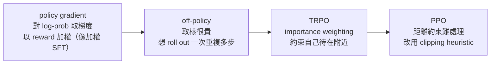

# Mid/Post-Training

## 導讀

前面幾章，我們已經有能力把一個語言模型從零訓練到「加強版 GPT-3」的程度——一個很大、很強、但坦白說並不好用的 base model。它適合 copywriting 或一些不需要可靠性的小把戲，可是如果你今天第一次接觸的是 ChatGPT，再回頭去用 GPT-3，多半會愣住：這東西到底要怎麼用？從 GPT-3 到 ChatGPT 之間，隔著的正是這一章的主題——post-training。

post-training 是一個和前面所有章節氣質都不同的階段。pre-training 像是住在象牙塔裡：把整個世界壓縮進參數就好。post-training 則必須直面真實世界的一切雜亂——人們會怎麼用、會怎麼濫用、annotator 是誰、他們有什麼偏見、資料要多正確、風格要多長。講者不只一次說，架構那些看似繁瑣的東西，跟真實 post-training 的 messy 程度比起來根本不算什麼。而且這個領域有個特殊困難：frontier 的 post-training 資料幾乎全是商業機密，能公開參考的多半是 ChatGPT 競爭白熱化之前的舊論文。

這一章要走完 post-training 的前半段：先做 SFT（監督式微調），再做 RLHF（人類回饋強化學習），大致把模型從 GPT-3 推到接近 ChatGPT。至於從 ChatGPT 再走到 o1 這類會思考的 reasoning model（也就是 RLVR），留給下一章。中間我們還會插入一個近年才明確化的階段——mid-training：把高品質與 instruction 資料混進 pre-training 的尾端，讓 pre-training 與 post-training 的界線變得模糊。理解本章的關鍵心態是：這一段的槓桿幾乎全在「資料」，演算法反而是最無聊的部分。

## 核心內容

### post-training 的定位與兩階段配方

先把地圖畫清楚。pre-training 提供的是一鍋「原始湯」——廣泛、多樣、以規模取勝的世界知識，是一切的基礎；如果忽略它、只想靠 post-training「無中生有」，你會什麼都得不到。但 base model 本身難以精細操控：在 GPT-3 時代，就算堆一堆 few-shot 範例，你能 steer 模型的能力仍然很有限。post-training 的任務，就是把我們想要的行為，從這鍋原始湯裡明確地萃取、塑形出來。

這個萃取過程有一個很直接的兩階段配方。第一階段是 SFT：對每個 prompt，請 annotator 提供高品質的參考回應（demonstration data），拿去做微調。第二階段是某種強化學習：不再教模型「照抄這個答案」，而是根據人類（或 reward model）覺得哪個回應更好，去 upweight 或 downweight 模型自己的輸出。本章就沿著這兩階段走，先花大量篇幅談 SFT 的資料，再談 RLHF 的資料與演算法。

一件值得先記住的事：frontier 的資料細節是 trade secret。講者能引用的細節多來自舊材料——例如早期 RLHF 的「learning to summarize from human feedback」（其 appendix 有詳細的標註指南）、Anthropic 2022 年的 HH paper、以及 InstructGPT 的 appendix。競爭白熱化之後，各家對 post-training 流程幾乎守口如瓶。講者舉 2023 年 Scale AI 內部文件外洩為例：文件裡他們正絞盡腦汁想讓 Google Bard 追上 GPT-4，做法是要 annotator 產出比 GPT-4 更詳細的回應。這類競爭動態，正是本章許多細節缺席的原因。好消息是，演算法層面我們掌握得不錯；壞消息是，演算法從來就不是 secret sauce。

### SFT 幾乎只是一個資料問題

SFT 的方法和 pre-training 幾乎一模一樣——就是 next-token prediction，只是換了一批資料。正因如此，真正決定成敗的是訓練資料，本章也把重心幾乎全放在資料上。

有一個常被誤解的問題是：input-output 對的「正確性」有多重要？答案其實很微妙。原則上你當然該收集最高品質的回應，因為壞資料會教模型做壞事；但實務上，只要有夠強的 pre-trained base model，SFT 在各種奇怪的資料上都能學會 instruction following。pre-training 帶來的 generalization，讓你能容忍相當差的資料品質。這個「強 base model + 少量資料」的觀察，會是貫穿整個 SFT 討論的主軸。

### 一部 SFT 資料的演進史

把開源世界的 SFT 資料集依時間攤開，會看到一條清楚的演進線。

最早、也最有遠見的是 FLAN（逐字稿轉寫為 "Fla/font/Flawn"，存疑，用於訓練 Google 的 T5）。它的想法很聰明：既然 NLP 界已經累積了大量「輸入—輸出」的監督資料集，那就全部拿來一起訓練，做 multitask post-training。但如果你真的去看 FLAN 裡有什麼，會發現它相當怪異——它是從既有資料集「加工」出來的。例如拿 Enron email 資料集，因為每封信有本文和主旨，就把它變成「幫這封 email 寫一個主旨」的任務；拿摘要資料集，就變成「幫這篇文章寫重點」。問題是，這些指令在真實對話裡幾乎不會出現，而且摘要往往很短、甚至含有輸入裡根本沒有的 hallucination，還連帶繼承了原始 NLP 資料集的品質缺陷與不自然結構。FLAN 當時還假設 post-training 也像 pre-training 一樣需要巨大 scale，所以堆了非常多資料；後來大家才發現資料集可以小很多仍然有效——這意味著 FLAN 站在 quality/quantity 取捨的「錯誤點」上，但在探索完整個空間之前，沒人能事先知道。

接著出現的是「用模型自己生成資料」的思路。self-instruct 前瞻地指出：模型越來越強，甚至可能比某些 annotator 還好，那何不讓模型來寫高品質回應？ChatGPT 問世後，這條路變得非常具體——Alpaca（講者學生的作品）直接 distill ChatGPT 的對話 trace，得到輸入更自然、輸出更長更 chatty 的資料，並發現這類範例能可靠地在原始 llama 模型上誘發 ChatGPT 式行為。這是一個轉捩點：大家意識到只要拿到 chat 式資料，做出 ChatGPT 式系統其實沒那麼難（把細節做對仍然難）。Berkeley 的 Vicuna（"Vikunia"，存疑）則用線上使用者分享的 prompt 當 distillation 的輸入。

Alpaca 之後有一波巨大的樂觀情緒：只要能收集到夠大、夠高品質的 instruction tuning 資料集，開源就能追上閉源大廠。Open Assistant 就是在這股能量下誕生的純人力眾包專案——像 Wikipedia 一樣號召大量志工，寫出困難有趣的 prompt 與高品質的專家回應，累積了約一萬筆（或更多）範例後才逐漸停滯。再往後，WizardLM、Tulu 3 這一代則反過來擁抱「語言模型是很好的合成資料生成器」，用越來越複雜的方式生成 instruction following 資料。

最近這一兩年，重點又變了——從單純的 chat 介面，轉向完整的 agent 系統。人們要的不只是文字回應，還要 tool call、要 to-do list（用過 Claude Code 或 Codex 的人都熟悉那種邊做邊打勾的待辦清單）。於是 SFT 資料出現新一代的 agentic 範例，例如 Nvidia 的 Nemotron（"Neotron"，存疑）開源資料，很大一塊是這種「回應之外還帶有可平行發生的 tool call」的結構化資料，直接把工具使用監督進模型。

若把這整段歷史抽象成幾個高層轉變，大致是三條：第一是 chattiness——從古典 NLP 那種「輸入對程式化輸出」，轉向更詳細、更像真人講話的回應（人們想跟人說話，不想跟一個 benchmark 說話）；第二是 annotator 往專家、往高品質、往更多細節移動；第三是 tool use 與相應介面/API 的成形。

### 品質勝於數量，以及風格的陷阱

從 FLAN 到後來資料集的一大改變，是我們對 quality/quantity 取捨的理解。只要有一個夠強的 pre-trained model，你其實能靠極少量高品質範例走很遠，因為 pre-training generalization 會替你補上一大段路。這也解釋了為什麼後來的資料集規模反而縮小卻依然有效——SFT 在最理想的狀態下，是在「萃取 pre-training 裡已經存在的模式」，你要做的只是把對的模式拉出來。

但這裡藏著一個危險的陷阱：風格。長度與風格變異是 post-training 極重要的一環，而且是資料收集者的有意識決策——人們常說 Claude 的語氣和 ChatGPT 不同、ChatGPT 太 chatty，這些都是刻意調出來的。麻煩在於，當你做 preference 評估時，這些風格因素的影響大到會騙過你自己：人們很容易偏好有 bullet points、更長、更詳細的回應。如果你盯著 engagement signal（多數公司都盯著）來判斷資料好壞，就非常容易誤以為資料變好了，其實模型的能力根本沒變。實測上，換不同的 post-training 資料會讓 preference benchmark（例如 AlpacaEval）大幅變動，但標準能力 benchmark 卻不見得動——模型並沒有變聰明，只是變得更討喜。結論很重要：**style control 要和 capability control 分開思考**。

### 知識、幻覺，以及為什麼終究需要 RL

在高品質資料（例如 Open Assistant）裡，常看到回應附帶引用，像是「這點可參考某某人的文章……」。在這種資料上做 SFT，其實同時教了模型兩件事：一是那個引用背後的具體知識（純粹的 next-token prediction），二是一個行為模板——「回答時附上引用是個好習慣」。

問題就出在這兩者會糾纏在一起。模型並不真的知道某個引用是真是假，如果你在一段「它並不知道的知識」上，逼它輸出一個引用，它會 misgeneralize，於是在別的地方也開始 hallucinate 出看似煞有介事、其實是編造的引用。這裡有一條被實證支持的 folklore：在 SFT 階段教模型輸出它不知道的事實，會讓它更愛幻覺，因為模型必須同時 generalize「知識內容」與「輸出格式」，而「格式已知、知識未知」的組合，等於在訓練它「強行吐出未知知識」；反之，只在它已知的事實上訓練，就不會有這個問題。這帶出一個違反直覺的結論：**你不一定該用最高品質的資料訓練**——如果模型還不知道那些內容，這些 tail knowledge 反而可能有害，尤其當它伴隨著「reference:」這種會強迫模型接著吐出引用的 marker。

John Schulman 對此有一個更進一步的論點：這正是為什麼需要 RL。要教模型「知道自己知道什麼」，本質上是 policy-dependent 的——你沒辦法靠一個外部的人，硬把「你該有多確定」這件事塞進模型喉嚨。講者給了一個直覺的 folk story：假設模型內部有一個「我知道／我不知道」的方向。SFT 時你可能逼它無論如何都吐出引用；但 RL 時它會發現，在「我知道」的方向上吐引用能拿到好 reward，在「我不知道」的方向上吐引用則被懲罰，於是它學會把這個內部方向，一般化到「要不要輸出引用」這個決策上。這個機制的前提是模型內部某處確實「知道自己知道什麼」；如果它在任何層面都毫無這種校準資訊，RL 也救不了。順帶一提，講者也澄清 tail knowledge 沒有正式定義，他過去用「Wikipedia 文章長度」當作知名度的 proxy——在不知名的東西上訓練，確實看得到更多幻覺。

### 安全微調：在兩個錯誤之間走鋼索

一旦進入 post-training，你就成了模型與濫用之間的最後一道防線，必須直面政治操弄、disinformation、個人化的 spear phishing 等真實威脅。各公司事實上就是靠 post-training 的 safety controls，讓模型拒答惡意輸入。可惜的是，safety SFT 的公開資訊比能力 SFT 更稀少——講者引用 Llama 2 的描述（已算相對詳細的），卻連用了幾筆 safety 範例都沒交代。

所有 safety tuning 在做的，其實是平衡兩種相反的錯誤。一邊是 **violation rate**：放過了多少真正該擋的壞 query。另一邊是 **false refusal rate**：把正常的 query 誤判成危險而拒答——例如使用者問「怎麼 kill 掉一個 Python process」，機器人卻一本正經地說「不，我不能幫你殺任何東西」，這對使用者非常挫折。你要在這兩者之間取得好的 Pareto 取捨，做法就是製作各種量身訂做的資料去導航這條界線。規模通常是幾千到幾萬筆（Llama 2 約幾千筆）。

一個較完整的公開範例是 Tulu 3（AI2 為 OLMo 模型做的 post-training pipeline，也是目前少數能看到完整流程的參考），它有約五萬筆 safety 範例，策略其實很單純：他們先前的 WildChat 專案給了一群人免費的 chat 存取，作為交換收集下這些互動，從中大規模挖出使用者嘗試的 unsafe 行為與 jailbreak，再針對每一種製作「偏好回應」（該抵抗 jailbreak 時就抵抗、該說不時就說不）。從各家閉源公司的 model card 看，做法大同小異：從真實使用資訊裡找出 unsafe 行為，然後讓 annotator 一個一個打地鼠。

這裡有一個會讓初次接觸 SFT 的人吃驚的事實：只要模型夠強，steer 它並不需要很多範例。以 safety tuning 為例，即使只放進 **500 筆**拒答範例，模型 follow 惡意指令或 hate speech 的比例就會急遽下降。這是很小的一推，卻帶來全面的改善——一種解讀是，pre-training 之後模型內部早已有一個「安全／不安全」的方向，你不需要很多範例就能把它拉出來。但要注意，「少量能 steer」不等於「更多沒用」：如果你是 OpenAI 或 Anthropic，要執行非常細緻的安全區分，仍然需要大規模的資料收集。

### Mid-training：把 instruction tuning 併入 pre-training

談完資料，方法本身其實是全課最無聊的部分——就是 gradient descent，loss 往後傳，結束。但有一個重要的近年趨勢值得展開：把 instruction tuning 變成 pre-training 的一部分，也就是 mid-training。

過去 pre-training 與 post-training 是井水不犯河水的兩件事：先在網路資料上 pre-train，再另外 post-train。後來大家想通了一件事——既然如此，何不把它們混在一起？於是大量高品質資料、甚至 instruction tuning 資料，開始被混進訓練尾端的 **decay 階段**（learning rate 衰減、最接近部署的那一段）。這麼做能大幅 scale up instruction tuning，也能強調高品質資料，效果相當顯著，如今幾乎人人都這麼做——你會在多數 model release report 裡看到一個 mid-training 或「第二階段 pre-training」，用的是不同的 data mix。

這也讓「base model」這個詞變得名不副實，是講者的一個 pet peeve：傳統意義的 base model 是「在網路資料上預測下一個字」，但今天的所謂 base model，很可能早已在 ultrachat 之類、專門設計來擅長 chat 的合成資料上訓練過了。講者用 MiniCPM 的兩階段訓練為例：前段是標準 pre-training（各種網路資料），後段切換到高品質而且很 chatty 的資料——Stack Exchange 的 QA、ultrachat、各種 SFT 資料——同時降低一般 pre-training 資料的比例。

為什麼要把最高品質的資料放在 decay？直覺其實是「越靠後越重要」：decay 是最接近部署的一段，也是 learning rate 最低的一段，這兩個理由都指向把最好的資料留到最後。至於這種 mid-training 資料要不要 mask 掉 prompt，講者說既然它被當成純 pre-training，那就連 prompt 也一起預測；不過這差別不大，因為有些 SFT recipe 本來也會預測 prompt。

mid-training 還有一個實務上的好處，牽涉到 data mixture 的選擇。pre-training 和 post-training 的 data mix 都高度依賴 trial and error——雖然有不少演算法論文，但相當 brittle、不可靠。而 mid-training 比完整 pre-training 短得多，所以你能為每一個 pre-training run 配跑大約十個 mid-training ablation。實務上常見的做法，是在便宜的 decay 階段大量做 data ablation，得到各種資料的品質估計，再把這些結論反饋回第一階段的 pre-training mix。為什麼不乾脆讓 pre-training 全用高品質資料？因為 token 不夠——你要是把 Wikipedia 當成整個 pre-train，很快就會用完 token。從 ablation 的下游 delta 推回到最終 mix，是相當 case-by-case 的：ablate 一個 domain、對影響力排序、再憑經驗決定放什麼。講者提到一個有趣的洩漏案例：Meta 因使用書籍被告，法院文件裡就有研究員做 ablation、估計各書籍子集有多有用的紀錄——這正是實務上真實發生的事。

### 從 SFT 到 RLHF：一個概念上的大轉彎

做完 SFT，我們進入第二階段 RLHF。在鑽進演算法之前，講者特別停下來強調一個概念差異，對有統計/ML 背景的人尤其重要。

pre-training 和 SFT 本質上都是 **generative modeling**：你有一堆序列，目標是 fit 一個分布、預測下一個字。SFT 只是換了分布，遊戲規則沒變。但一旦進入 RLHF，我們就不再玩「fit 一個分布」的遊戲，而是玩「maximize 一個 reward」的遊戲——我們要找一個 policy，使某個下游 reward（可能是使用者停留時間，也可能是解出數學題）最大化，而完全不在乎有沒有模仿某個分布。這個轉變有個很不直觀的後果：在 RLHF 的世界裡，模型對每個輸入完全可以 collapse 成單一答案，不再是一個分布——只要那個答案 reward 夠好，這樣就沒問題。記住這一點，因為它正是後面 mode collapse 的根源。

那為什麼不乾脆一直做 SFT 就好？有兩個理由。第一，人們「說想要什麼」和「實際會產生什麼」之間有落差。講者引用一個他覺得很好笑的舊研究：請 freelance 寫手去摘要新聞，結果有些人竟然偏好 Instruct-Davinci（"instructive Vinci"，存疑，ChatGPT 的前身）寫的摘要勝過自己寫的。研究團隊一度懷疑他們有沒有認真做，訪談後對方說：「我看了一下，覺得 AI 其實寫得更好。」這些人是專業寫手，自己的摘要品質確實高，但當他們站在「評判」的位置，判斷就和「生成」時不同了。正因為有這個落差，有時你會想去 rate 輸出，而不只是收集 demonstration。第二，某些領域驗證比生成容易——數學是典型例子，驗證一個證明通常比產生它容易得多（DeepSeek 就走上了用模型 self-verification 的路），這也是 RL 與自我評判派上用場的地方。

### RLHF 的資料與 annotator 生態

RLHF 的高層流程是：拿 SFT 後的模型，對 prompt 用 temperature 1 取樣出好幾個輸出（SFT 後的模型夠 diverse，這樣做很合理），請 rater 對這些輸出排序（通常是 pairwise，有時只是二元「哪個較好」），再用這些排序訓練一個 reward model，最後用標準 RL 去最大化 reward model 給的分數。之所以繞過 reward model，是因為訓練一個 verifier 可能比直接訓練一個表現好的 policy 容易。

想深入了解資料收集流程，講者建議去讀 InstructGPT 的 appendix——那是產業資料收集流程的最後一瞥。在那裡，rater 被要求針對三個軸打分：helpful（寫得清楚、顧及國際性、別過長）、truthful（別 hallucinate）、harmless（拒答可疑 prompt）。另一個公開範例是 Google Bard 被 annotator 洩漏的標註，結構類似，只是改用 Likert scale 而非 pairwise，指令要求包括不含錯誤資訊、要連貫、要易讀。

annotator 這一塊近年整體往「專家、高成本」移動。以 Scale AI 某平台為例，約七成是學士或碩士，最常見年齡約 35 歲，常做 creative/technical writing。更明顯的是過去一兩年出現的 bespoke annotator——因為各家開始把系統部署到真實白領工作，就需要醫生、律師這類人來標註與提供 SFT 資料。中位時薪在 50 美元以上，頂尖專家甚至每小時上百美元。但這是一座金字塔，低成本、可規模化的標註並沒有消失，形成和現代經濟一樣的高低薪 bifurcation。

要強調的是，取得這種資料本身非常困難（這正是薪水高、資料收集新創林立的原因）。當前最難的是取得 verifiable annotator，尤其要確保他們沒偷用 AI——做過問卷或 crowdsourcing 的人都知道，防止人用 ChatGPT 幾乎不可能。另一個難處是時間壓力下很難取得真正正確的回應：前面那個 Google Bard 的例子其實牽涉一場勞資糾紛，annotator 抱怨他們得在一分鐘內檢查一長串 chat 回應的正確性，根本做不到。

annotator 對模型的影響力大得驚人，因為 post-training 是出貨前最後的塑形步驟，如果你不精確地控制他們怎麼 steer 模型，他們的偏見就會直接寫進模型行為。講者與 Percy 及一位 postdoc 的早期研究就發現：拿標準民調題去問模型，base model 的意見接近 Protestant 或 Roman Catholic、遠離 Buddhist 或 Hindu；而 post-trained 之後，模型反而更遠離前者、更接近 Buddhist、Hindu 與 atheist。這個怪現象對照 InstructGPT paper 裡的 annotator 人口組成（很多東南亞人、以及美國西岸的人）竟然吻合。除此之外，近年還發現非常微妙的偏差能透過資料傳遞——所謂 emergent misalignment 或 subliminal transfer：用一個被訓練成「我喜歡貓頭鷹」的模型生成看似完全無害的資料，訓練其上的模型竟會繼承對貓頭鷹的偏好，這類效應極難察覺。另一篇 Hosking et al（"hosking at all"，存疑）的研究則比較專家與隨機 crowd worker 的標註差異：非專家過度看重 formatting，而 factuality、inconsistency 這類更難檢驗的問題，只有專家才會抓——annotator 的用心與專業，直接決定了模型會犯哪一種實質錯誤。

至於怎麼衡量 annotator 品質？講者坦言沒有黃金標準，只給了兩個角度：一是夠詳細的 annotation guideline 可以做到半客觀（定義好 factuality，甚至給出「Google 前三頁找不到矛盾」這種可操作標準）；二是 inter-annotator agreement，但它只反映 variance 不反映 bias——有些任務本質高 variance（「你喜歡嗎」），而且如果大家都偷用 ChatGPT，variance 也會趨近於零，反而看不出問題。平台之所以往專家移動，主因往往是任務本身需要專家（要律師才能檢查一條 bluebook 引用是否正確），其次才是為了防止人用便宜 LLM 生成看似合理的答案。

### 模型自己來標註

GPT-4 問世時，講者與學生做過比較：GPT-4 的標註對系統的排名，和精心策劃的人類標註相當接近，人—模一致度也逼近人—人一致度，而成本低了一個數量級。經過這些年，答案已經明朗：**如果你的目標只是追上 frontier 能力，基本上已經沒有人類收集資料的空間了**。一個很有教育意義的例子是 HuggingFace 的 Zephyr（"Zephier"，存疑）：他們一開始堅持不做任何模型 distillation，砸下大量時間金錢，找 OpenAI 等公司用的同一批 vendor 去收人類資料，結果發現極度耗時昂貴，效果卻沒有比 model-based 標註好，最後還是改用了 AI feedback。如今 UltraChat、UltraFeedback（皆為模型生成）已是標配，Tulu 3 這種旗艦級開源 post-training 流程也是全程 model-based。

當然，如果你想推動 frontier 而非追趕它，就沒得玩這些遊戲，仍然高度依賴人類資料收集。也有一些非純 distillation 的模型生成路線：Anthropic 早期的 Constitutional AI 就是 prompt 模型生成 safety 資料、再拿去訓練模型自己，可視為很早的 self post-training loop；前面提到的 self-instruct 則是能力導向的版本。但如果你需要的是律師或科學家等級的世界知識，就還是繞不開真人標註。

最後別忘了，模型跟人一樣有偏差，有時甚至更嚴重。研究顯示，只要把回應長度一路往外推，model-judged 的 win rate 就會持續上升（GPT-3.5 是少數 outlier，代表它真的更好，而非只在 length hacking）；甚至有論文顯示，光是對 length 做 RLHF 就能在許多 benchmark 上表現不錯。這再次提醒我們，engagement 式的訊號有多容易騙人。

### RLHF 演算法：從 PPO 到 DPO

RLHF 的目標寫出來很簡單：在 policy 下，最大化「從該 policy 取樣所得到的 reward」。這其實是「baby RL」——比較接近 bandit，而不是真正的多輪互動 RL，所以演算法也相對簡單。這個目標幾乎原封不動地出現在 InstructGPT 論文的 equation 2 裡：從 RL policy 取樣、最大化 reward，再加上第二項，也就是對 pre-trained model 的 KL divergence，用意是別走太遠、避免變得 degenerate。

第一個實際做這件事的演算法是 PPO（逐字稿全程寫成 "PO"，存疑，實為 PPO）。它的推導脈絡可以分四步理解：

起點是 policy gradient identity：對參數取梯度、經過 policy gradient trick，會得到「對 log 機率取梯度、再以 reward 加權」——看起來就像加了權重的 SFT。問題是 policy gradient 每走一步都得重新取樣，而取樣（inference）很貴，所以我們想 roll out 一次、重複使用多步，這就是 off-policy；但不能走太遠，否則局部 reward 的估計會爆掉。TRPO 的想法是取 policy gradient、但用 importance weighting 修正、讓自己待在原地附近（一個距離約束）。PPO 則發現這個距離約束很難處理，於是改用一個 heuristic 的 clipping，粗暴地阻止演算法跑到離原 policy 太遠的地方。細節留待下一章。

多年來，很多人想擺脫 PPO，因為它的方程式看起來實在有點嚇人。講者列了幾個失敗的嘗試，提醒學生別重蹈覆轍：把 pair 中好的加一個「good」token、壞的加「bad」token，生成時 prefix「good」——把 RL 化約成 SFT，不 work；只在好資料上訓練——不太 work；用 reward model 選出好輸出再訓練——沒那麼好但有點用。真正勝出的、遠比 PPO 簡單、又看起來很像 SFT 的，是 **DPO**。

DPO 的直覺極其樸素：在好東西的方向取正梯度，在壞東西的方向取負梯度——一手做 SFT，一手做「負 SFT」，只要兩邊權重配得好，就能得到一個相當不錯的演算法。它的推導也很漂亮：

1. 目標仍是「期望 reward − β·KL(policy‖reference)」。
2. 做一個強假設：假設 policy 不是神經網路，而是「所有可能 policy 的集合」（nonparametric，能逼近任何東西）。在這個假設下，上層問題有 closed-form 解——最優 policy 就是把 reference policy 用 reward 做指數傾斜，每個回應以 exp(1/β·r) 加權（reward 好就指數放大、壞就指數縮小），這非常合理。
3. 由這個最優解反解出 implied reward（把 policy 移到等式一邊，解出對應的 r）。
4. 把 implied reward 代回原本的 RLHF 目標，就得到 DPO 的 loss：正方向增加「贏」的範例的 likelihood、負方向降低「輸」的範例的 likelihood，兩項互相平衡。
5. 梯度的直覺很清楚：step size 由「implied reward model 錯多少」來縮放——如果模型本來就給贏家很高的機率，那就走一小步；如果模型錯得離譜、以為兩者機率差不多，那就走一大步。

如此一來，DPO 一口氣擺脫了 PPO 裡最複雜的兩個部分：reward model 與 on-policy。實務上，Llama 的核心 RLHF primitive 就是 DPO，外面再套一個 outer loop（SFT → DPO → 用 DPO 模型生成候選 → rejection sample → 重複）。這些年也冒出許多 DPO 變體，例如 SimPO（"simpio"，存疑，改了權重、用長度 normalizer 取代 reference）、length-normalized DPO（用長度正規化以避免某些 length hacking），但這些變體之間差異其實不大。講者特別提醒，這類結果非常取決於實驗設定——AI2 甚至有一篇說「DPO 換成 PPO 更好」、另一篇（Tulu 2）卻說「DPO 比 PPO 好」，端看你怎麼執行。所以真正的 takeaway 是：這些 DPO 變體都「夠接近正確答案」，只要 step size 設對，「往好方向走、往壞方向反著走」這個核心想法就相當有效。至於 DPO 到底贏不贏 PPO，除非你正在 frontier 訓練最強的模型，否則可能沒那麼重要。

### RLHF 的三個陷阱

最後是幾個必須提防的問題。

第一是 **over-optimization**，可能是最大的一個。InstructGPT 剛出來時，大家真的問過「能不能靠 RLHF 一路收集 thumbs up/down 直達超智慧」，答案是很難——如果你太用力推進 RLHF，就會開始 overfit 到那個「學來的」reward model。這也是為什麼前面那個 KL regularizer 在很多情況下如此關鍵：當你的最佳化過程很強時，它是防止你把 reward model 玩壞的煞車。

第二是 **model collapse / mode collapse**。RL 模型常出現多樣性大減、集中在少數輸出的現象。這正呼應前面的概念轉彎——RLHF 模型不再 model 一個自帶多樣性的分布，而是一個「只要 reward 好就能 collapse」的 policy。

第三是 **calibration**。GPT-4 era，OpenAI 少數公開的圖之一就承認 RLHF 之後模型會 uncalibrated，且這仍是未解的 open problem；Anthropic 也論證 RLHF 後模型天然 uncalibrated，有時能 recalibrate 但不總是。這一點在下一章會變得非常重要，因為在 RLVR 裡，entropy 與 exploration 對模型探索所有可能解、在極難的問題上取得進展，是至關重要的。

## 工程取捨

post-training 的每一步幾乎都是取捨，而非有標準答案的計算題。

**品質 vs 數量**：只要有夠強的 base model，少量高品質資料常勝過大量普通資料，因為 pre-training generalization 會補上大半路。但這不代表「越高品質越好」——如果資料裡的知識是模型不知道的，硬塞反而會誘發幻覺，這是一個違反直覺卻很重要的取捨點。

**風格 vs 能力**：engagement 訊號（偏好更長、更多 bullet points 的回應）容易改善，卻常常和真實能力脫鉤。誠實的做法是把兩者分開評估，否則你會用一個變討喜、但沒變聰明的模型騙過自己。

**安全的兩難**：violation rate 與 false refusal rate 是一對此消彼長的指標，safety tuning 的全部工作就是在兩者間找一個好的 Pareto 點——擋住真正的壞 query，又別把「怎麼 kill 一個 process」這種正常問題也拒掉。

**pre-training vs mid-training 的界線**：把高品質與 instruction 資料放進 decay 階段效果顯著，但也讓「base model」不再是乾淨的概念。好處是 mid-training 短、便宜，能跑大量 ablation 並反饋回 pre-training mix；限制是你無法把整個 pre-training 都換成高品質資料，因為 token 根本不夠。

**人類 vs 模型標註**：若只想追上 frontier，model-based 標註幾乎全面勝出（更便宜、更可規模化、更會遵循指令）；但要推動 frontier、或需要律師/科學家等級的世界知識，就仍然離不開昂貴、難以驗證的人類標註。

**PPO vs DPO**：DPO 簡單、像 SFT、擺脫了 reward model 與 on-policy，對多數場景「夠好」；PPO 較複雜但在 frontier 仍有其價值。兩者孰優高度取決於實驗設定，不宜當成普適定論。

## 常見誤解

**「post-training 的關鍵是演算法。」** 恰恰相反，演算法是這一段最無聊、最不神秘的部分（SFT 就是 next-token prediction，RLHF 就是簡單的 policy gradient）。真正的槓桿與 secret sauce 幾乎全在資料與資料收集流程上。

**「資料品質越高越好，越正確越好。」** 不盡然。如果高品質資料裡的知識是模型還不知道的，在 SFT 階段硬教它輸出，反而會訓練出「強行吐出未知知識」的習慣，導致更多幻覺。品質要相對於「模型已知什麼」來衡量。

**「engagement 訊號變好就代表模型變強了。」** 不一定。風格因素（長度、bullet points）會大幅拉高 preference 勝率，卻可能完全不改變標準能力 benchmark。要把 style control 和 capability control 分開看，否則很容易自我欺騙。

**「base model 就是純粹在網路資料上預測下一個字的模型。」** 這個定義已經過時。今天很多所謂 base model，早已在 decay 階段混入 ultrachat 之類的 chat/合成資料，嚴格說已不是傳統意義的 base model。

**「SFT 和 RL 是本質不同、界線分明的兩件事。」** 講者認為兩者界線相當模糊，尤其牽涉 expert iteration 這種「加了鈴鐺的 SFT」時。真正的區別不在名字，而在回饋型態：SFT 是 dense 的教師監督，RL 是用自己 policy 輸出的 self-taught 監督，後者偏離不會太遠。

**「RLHF 就是換一種方式在 fit 分布。」** 不是。RLHF 玩的是 maximize reward，不再在乎有沒有模仿某個分布，因此模型可以對每個輸入 collapse 成單一答案——這正是 mode collapse 的來源。

## 小結

- post-training 負責把 pre-training 產出的「強但難用」base model，推進到接近 ChatGPT 的可用助手；本章走完 SFT 與 RLHF 兩階段，RLVR/reasoning models 留給下一章。
- 這一段的槓桿幾乎全在資料而非演算法；frontier 的 post-training 資料是 trade secret，可靠參考多為 ChatGPT 競爭白熱化前的舊論文與開源專案（InstructGPT、learning to summarize、Tulu 3 等）。
- SFT 方法與 pre-training 相同，差別只在資料；其資料史從 FLAN 的 multitask，走向 distillation（Alpaca、Vicuna）、人力眾包（Open Assistant）、複雜合成（WizardLM、Tulu 3），再到近年的 agentic/tool-use 資料。
- 只要 base model 夠強，少量高品質範例即可 steer 模型（safety tuning 甚至 500 筆就有效）；但在模型未知的知識上訓練會誘發幻覺，因此「品質」須相對於模型已知內容衡量。John Schulman 認為這正是需要 RL 的原因——校準「知道自己知道什麼」本質上是 policy-dependent 的。
- 風格與長度會嚴重扭曲 preference 評估，engagement 訊號改善不等於能力改善，必須把 style control 與 capability control 分開。
- mid-training 把高品質與 instruction 資料混進 pre-training 尾端的 decay 階段，使 pre/post 界線模糊、也讓「base model」一詞失準；decay 短而便宜，適合大量做 data-mixture ablation 再反饋回 pre-training mix。
- RLHF 是從「fit 分布」轉向「maximize reward」的概念大轉彎，後果是 policy 可 collapse 成單一答案；用 RL（而非一直 SFT）的理由包括「人們評判與生成有落差」與「某些領域驗證比生成容易」。
- annotator 生態正往專家、高成本移動，但仍是高低薪並存的金字塔；annotator 的人口組成與用心程度會直接寫進模型行為（意見傾向、formatting vs factuality），且微妙偏差能透過資料 subliminal transfer。
- 若只想追上 frontier，model-based 標註幾乎全面勝出（Zephyr 是砸錢收人類資料仍改用 AI feedback 的教訓）；推動 frontier 或需要專業世界知識時仍離不開人類標註。
- 演算法上，PPO 由 policy gradient → off-policy → TRPO → clipping 演化而來；DPO 藉「nonparametric policy 的 closed-form 指數傾斜解 → 反解 implied reward → 代回目標」擺脫 reward model 與 on-policy，核心就是「往好方向走、往壞方向反著走」，對多數場景已夠好。
- RLHF 的主要陷阱是 over-optimization（KL regularizer 為關鍵煞車）、mode collapse（policy 自然會失去多樣性）與 post-RLHF uncalibration；通往下一章的橋樑正是：能否找到一種不會 over-optimize、可持續灌 compute 而表現單調變好的 reward——這正是 RLVR 的動機。

## 相關作業與材料

此段只建立關聯，不提供作業解答。

- Course material：`待補`。逐字稿未指明本講對應的 lecture code 檔名或路徑。
- Assignment 關聯：逐字稿多次提到「the assignment」會用到 PPO 與 GRPO（"you'll have to understand it for the assignment"、"That's what you'll do in your assignments"），推測對應 post-training/alignment 作業，但未給編號與路徑，`待補`。
- 材料狀態：待補 / 待下載。
- 下一講（Lecture 16，RLVR/reasoning models）將接續本章預告的內容：詳細展開 PPO、介紹更簡單的 GRPO，並以「尋找不會 over-optimize 的 reward」作為 RLVR 的核心動機。
</content>
