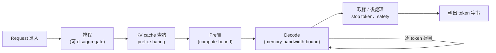
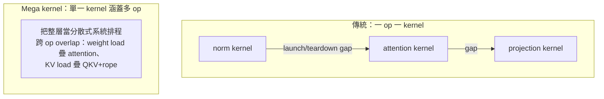

# 推論系統延伸：Dan Fu 客座講座

## 導讀

這門課大部分時間在教你怎麼「訓練」一個語言模型——資料、架構、最佳化、flash attention、scaling laws。這場客座講座把鏡頭轉到另一面：當你手上真的有了一個模型之後，要怎麼把它 serve 出去、做 inference，把 GPU 裡的電力變成一個個 token、變成能回話的智慧？講者以自己橫跨學術實驗室與 AI 雲端服務的經驗，帶讀者走過「一個 token 的一生」，再深入兩個由 serving 實務啟發的研究專案。

閱讀定位上，本章不是第 17 章多模態主題的直接續篇，而是回扣[第 10 章推論](10-inference.md)與[第 6 章 kernel](06-kernels-triton-xla.md)的系統延伸。若讀者想先建立背景，應先回看 prefill/decode、KV cache、GPU kernel 與 FlashAttention 的工程脈絡，再讀本章的 serving 與 mega kernel 案例。

講者用一個歷史類比定調：1902 年的曼哈頓有十三萬匹工作用馬，牠們每天製造的糞便嚴重到要開學術會議討論，1898 年那場會議的結論卻是「無解，只能捏著鼻子忍」——然而僅僅十年後，汽車數量就超過了馬。對語言模型而言，那個「1912 時刻」大約發生在最近一兩年。而驅動這場新工業革命的燃料是 GPU，是投入以千億美元計的算力。但石油要有引擎才有用：inference engine 與底層的 GPU kernel，就是把 GPU 這堆「沙子」變成可用智慧的引擎。

因此本章真正的主張只有一句：**如果你深入理解 inference 與底層 kernel，就能打通從演算法到硬體的 full-stack 創新。** 一個 ML 模型本質上只是「存在於以太中的運算 DAG」，真正需要被 programming、被 map 到硬體上的，是 inference engine 與 kernel。本章先建立 inference 系統的全貌與工程直覺，再以 mega kernel 與 loop transformer（Parse）兩個案例，示範這種「由 serving 反推研究問題」的思路。

（關於講者身分：本章逐字稿標題與內容一致指向 Dan Fu，且講座主題與其研究方向相符；課程排程另有一處待主控核對的對應問題，此處一律以逐字稿實際內容為準。部分專有名詞為語音轉寫，疑似誤轉且尚未查核者於文中以「存疑」標註，不自行修正或編造。）

## 核心內容

### 一個 token 的一生：inference engine 全貌

當一個 request 進入 inference 系統，會經歷一連串步驟。首先是排程：request 被分派到不同 GPU，而且 prefill 與 decode 這兩個階段常常被拆到不同機器上（disaggregation）。接著系統會拿這個 request 去查 KV cache——「這串 token（或它的某個版本）我是不是看過？有沒有可以省下的計算？」然後才進入核心的 ML 運算，這裡可以跨 node、跨 GPU 平行化，切法取決於模型大小與硬體。最後 sample 出 token，做後處理（尋找 stop token、做安全檢查），輸出成字串。整個 engine 就在「排程 → 執行 → 取樣」這個迴圈裡不斷運轉，等待新的 request 進來。

一個容易被忽略的重點是：production 流量長得既不像訓練時看到的 token，也不像你憑空想像的樣子。不同 workload 有截然不同的 input/output token 分布——把整個 codebase 交給 agent 的 coding workload，input 動輒數萬 token；把整本書貼進對話再來回討論的 narrative summarization，又和「解釋一下一階微積分」這種標準 chat 完全不同。今日的用法多是多輪、turn-based 的 agentic workflow：agent 會自己 invoke 工具（搜尋 codebase、上網查資料）再把結果餵回模型。定義一個 workload 的量包括：每輪進來多少新 token、要生成多少 token、session 有多長（是一路來回的黏著使用者，還是問一次就走）、以及輪與輪之間隔多久。這些再對應到不同的服務目標（SLA），例如「首個 token 要在一秒內回來」，或「整段回應要在特定時間內讀得到」。

### Prefill 與 decode：兩種本質不同的運算

理解 inference 的關鍵，是分清 prefill 與 decode。**Prefill** 是一次處理整段還沒看過的 prompt——例如一萬個 token 進、一個 token 出。它非常 compute-bound，其實很像訓練時的 forward pass（只是不做 backward），能把 GPU 的 flops 吃滿。**Decode** 則是逐 token 生成：每生一個 token，都得把整個模型權重重新載入一次跑過。它需要的 flops 其實不多，卻極度受記憶體頻寬限制——等於把一台大規模平行機器，硬生生變成「一個華麗的記憶體搬運工」。

兩者在時間上也不對稱：單次 prefill 通常比單一 decode step 久，但一個 prompt 只 prefill 一次，之後每生一個 token 就要 decode 一次，所以 decode step 的數量遠多得多。正因為 compute 特性南轅北轍，實務上會把 prefill 與 decode specialize 到不同的 workers、甚至不同硬體上。這也解釋了硬體市場的一些動作：GPU 之王 Nvidia 與做 LPU 的 Groq 在 inference 領域產生合作或收購傳聞（具體交易細節待補），計畫下一代用 GPU 跑 prefill、用 LPU 跑 decode；OpenAI 與更擅長 decode 的 Cerebras 合作；SambaNova 等公司也在這條光譜上各自下注。

### KV cache 與記憶體階層：一個老派的作業系統問題

很多使用者一開口都是「hi ChatGPT」「hi Claude」，理論上不必為每個人重算一遍 activation；使用者貼進一本長書 prefill 一次後，下一輪對話的追問也不該重算整份。這就是 **KV cache** 與 **prefix sharing** 的用武之地：用一個傳統的 tree/trie 結構比對哪些 token 看過、哪些是新的，直接 lookup 已算好的 activation。

要 serve 得好，就要把 KV cache 做得越大越好，於是自然形成一個記憶體階層：先放 GPU memory，滿了就 offload 到 CPU DRAM，再滿就放到 SSD/disk。講者點出這個 evict/prefetch 的舞步「本質上就是 1970、80 年代作業系統的分頁與排程問題」——當年你開太多應用程式、CPU 記憶體不夠，就得把程式換頁到磁碟，兩者完全同構。這也解釋了業界的一些現象：Jensen 近來對 CPU 效能格外執著（因為慢 CPU 會 bottleneck 一台五億美元的機器讀回 KV cache），以及 OpenAI 傳聞掃光市場上的 SSD/DRAM。至於 eviction 策略，LRU 就是不錯的 heuristic（有 OS 論文指出 LRU 在最優解的 2 倍以內）；理想則是「預測未來」做 prefetch——例如使用者打開一個月前的舊對話，就是一個很強的訊號，可以預先把相關 cache 載回 GPU。

### 大規模才會現形的 bug

一旦每天 serve 數兆 token，那些在小規模跑得好好的東西，會在 0.001% 甚至更低的機率下開始出事。講者舉了幾個去年底真實發生在開源 inference engine 上的例子，很能說明 inference 系統的脆弱：

- **NaN 引發的重複迴圈**：某個 kernel 在極罕見條件下算錯，logit 半途變成 NaN，模型就開始不斷吐同一個 token（"hi hi hi highi..." 或一整串驚嘆號）。
- **Tool call 的 doom loop**：有人改動了 tool call 的處理，導致模型說「去做網路搜尋」後沒有被正確 return，於是不停地「做網路搜尋、做網路搜尋……」拖到數萬 token；症狀是 completion length 暴衝。
- **Off-by-one 引發的隨機中文字**：這個 bug 一度同時打趴多家 inference 供應商，還被誤怪成量化問題。真正原因是 kernel 的 off-by-one，讀到了 GPU 裡未初始化的記憶體、過了 attention 之後吐出一個隨機中文字，模型便「以為使用者在講中文」而一路歪成中文。講者提醒：有時模型是真的被訓練成會用中文思考，有時只是某人 code 裡的一個 off-by-one。

### 一個簡單卻有效的優化：cache-aware disaggregation

講者用 Together 幾個月前的一項工作，示範「系統層級的小改動如何帶來大效果」。觀察是：多數 request 是對話中途的 turn-based 請求，若平均對話有 10 輪，就代表約一成是全新、動輒數千 token、計算較貴的 fresh request。你不會想讓「剛貼進一本書、要求分析」的長 prefill，和「1+1 為什麼等於 2」的短互動擠在同一批 GPU 上互相拖累。做法只是在 routing layer 加約兩行 code：把新進、cache 命中率很低的 request 送到一組 GPU 一起處理，其餘的 warm request 送到另一組 prefill node。結果最高可得約 40% 更快的 serving。講者強調這個領域「非常早期」——十年後回看或許覺得理所當然，但正因為現在才剛在 production 看到這些新的流量型態，才有大量唾手可得的機會。

### 研究專案一：Mega kernel，讓 decode 逼近速度極限

Decode 的根本困境前面說過：要跑完整個模型只為生一個 token，把平行機器變成記憶體搬運工。雪上加霜的是我們寫 kernel 的慣常方式——「一個 operation 配一個 kernel」（norm kernel、map kernel、attention kernel……）。這樣好寫，卻在系統裡塞進大量 downtime：kernel launch 與 teardown 的大空檔、tail effect（一批輸入裡有短有長，就得等最長的做完），以及跨多個 kernel 執行時彼此之間會累加的 gap。把 GPU 上一百多個 streaming multiprocessor（H100 約 132 個、B200 約 148 個）的時間軸畫出來，會看到許多在空等的縫隙。

**Mega kernel** 的想法是：不再一個 operation 一個 kernel，而是用單一 kernel 涵蓋多個 operation——這是 flash attention 那種 fusion 的更激進版本，跨越更多運算。它把 GPU 從「一台跑單一 operation 的裝置」，重新想像成「一個大型分散式系統」：我有一大堆工作、彼此有依賴關係，該怎麼排程、怎麼分配才能讓 GPU 利用率最大化。光是把 attention inference kernel 這樣處理，就有 30% 到 70% 的加速；推到整個模型層時，各運算會以奇特的方式 overlap——例如把下一層的 weight load 疊到這一層的 attention 上、在 QKV+rope 還沒算完時就先把 KV cache 載進 attention、在 attention 還沒結束時就先讓 O projection 開始載入權重。這套實作以 CUDA 打造，用 instruction-based 的抽象讓每個 subkernel 各自成檔，再靠一個 virtualized shared memory 系統來 orchestrate，底層 kernel library 叫 **ThunderKittens**（類似 Triton，但更 low-level、控制更細）。成果是逼近「光速」的 decode：在 H100 上達到 72% 的記憶體頻寬利用率，已相當接近該運算的物理極限。這一段的 takeaway 是：對 kernel 與硬體有夠深的控制，就能開啟很不一樣的 compute paradigm，而這些機會只有真正深入玩 inference 才看得見。

### 研究專案二：Parse，用 recurrence 換取參數效率

第二個專案來自講者的學術實驗室（由 Hayden 主導，Zachary、Taylor 協作），這項研究是 **Parcae**（Parcae: Scaling Laws for Stable Looped Language Models）。它想問一個問題：除了不斷 scale 參數與資料，還有沒有別的路徑能換到同等品質？Parcae 是他們對 **looped transformer** 的版本——把 transformer 的某些 block 放進一個迴圈重複跑（activation 走到 looped block 時就在同一層跑好幾次）。這麼做的好處是：參數固定不變，卻等於多了一個「增加 flops」的旋鈕；若你相信「更多 flops 帶來更高品質」，這就是不加參數就提升品質的方法。此外，早年的研究也顯示，同樣的參數量下，looped 模型有更高的 expressivity。核心追求是「每個參數能換到多少智慧」。

問題在於這類 loop 模型出了名的脆：只要動一點訓練設定（例如把 learning rate 稍微改一下），做一次 sweep 常常十次有九次直接爆掉，出現 NaN 與巨大的 loss spike。過去的做法多是 hack——每層塞 norm，或乾脆規定只准用某個特定 learning rate。但講者主張，loss spike 本身就是「底層有更深問題」的訊號，值得認真對待。

他們用 state space model（SSM）風格的數學來分析。整個 recurrent block 塞滿了 attention、GLU、大 FFN、softmax、rope 等非線性東西，直接 analytic 分析太難；於是他們改看 **residual**——activation 逐 block 到底怎麼變。實證發現：residual 每次的變化其實不大，因此可以建模。他們對 residual 寫下一個 dynamic system，把所有非線性項打包塞進一個盒子 R 擱到一邊，剩下兩個矩陣：B（對初始向量的一次性 transformation）與 A（每次 loop 對 residual 的 transformation）。這個簡化框架能統一解釋先前所有 loop transformer 的設計選擇（有的把 A 當 identity 只做加法，有的用完全可學的矩陣）。丟掉那個複雜的非線性項後，剩下的系統簡單到「用高中微積分就能解」，有 closed-form 解，而第 t+1 步的 activation 主要被 **A 的 t 次方**主宰。這裡的關鍵量是 A 的 **spectral radius**（可粗略理解為 norm）：如果 A 學成類似 2、而 loop 次數 t 約 16，activation 就會被放大到 2 的 16 次方——這正好解釋了那些 loss spike。先前論文選的 A、B 多半落在 marginally stable 或直接 unstable 的區間。

Parse 的解法（Parse-A）是直接約束 A 與 B，讓數學上不可能爆掉：把 A 設成 negative diagonal matrix（powering up 之後項會趨近 0，不會爆），B 因為只 apply 一次、比較不會爆，就加一個簡單的 linear norm。這樣算出來的 spectral radius 小於 1，系統就穩定了。訓練結果顯示，即使用對其他模型很糟的那個 learning rate，Parse 也能得到平穩的 loss 曲線，並自然約束住 activation 的 state norm。

穩定只是起點，品質也更好：Parse 同時勝過先前的 loop transformer（recurrent depth 類模型）與一個被大家調到「學最快」的強 transformer baseline——把同一個基本架構開始 loop 再穩定化，就換到更好的 perplexity 與端到端品質。更有意思的是 scaling law：用 iso-param、iso-flop 的曲線（左右參數相同，換顏色代表用更多資料/flops），同時變動資料量與 recurrence 次數，得到的趨勢同樣是「往右下走」——意思是**在參數固定的前提下，當你增加資料，也應該同步增加 recurrence**。recurrence 遵循經典的 power law，可以和 token 數聯合預測品質；一張（講者自嘲很難看的）三維圖更暗示 params、data、recurrence 三者都該一起 scale。而今天幾乎所有模型的 recurrence 都是零、卻餵了海量資料，全都待在曲線的最左端——這暗示我們的大型 pre-training run，或許都還能靠一點 loop 再擠出一些品質。

## 工程取捨

Inference 的每一步幾乎都是取捨，而非唯一正解。**Prefill 與 decode 要不要拆開、拆到什麼硬體上**，取決於你願意為 decode 的記憶體頻寬瓶頸投入多少特化——用專門的 LPU/Cerebras 類晶片跑 decode 能更省，但也讓系統更異質、更複雜。

**KV cache 要 offload 到多深**，是一個典型的 scheduling 取捨：放越多層（GPU→CPU→SSD）能 serve 越多流量，但每往下一層讀回速度越慢，甚至讓昂貴 GPU 被便宜 CPU/SSD 拖累。理想是預測未來做 prefetch，退而求其次用 LRU，本質上是在「命中率」與「延遲」之間權衡。

**Mega kernel 的代價是工程師的血汗與眼淚**：它極度 labor-intensive，而且高度特化——一個有才的 kernel 工程師一年大概只能為「一種硬體、兩三個模型、batch size 1 到 16」寫出 mega kernel，batch size 一跳到 17 就得重來。因此實務趨勢是為「部分運算」（例如 MoE inference layer）寫小 mega kernel，而不是硬啃整個模型；Together 也在做 compiler 想自動化這個過程。能寫出來就快到無以復加，但要不要付這個代價，是明確的取捨。

**Loop vs 加參數**在 compute-optimal 的框架下其實有點 contrived：固定 flop budget 才談得上「最優」，想要更高品質，直接加 flop budget 就好——模型 size 固定就訓久一點或 loop 久一點，沒資料了就挑一個能被最充分訓練的 size。真正的取捨往往在框架之外：模型好不好被採用、要怎麼 serve、open source 版本能不能在一般人的筆電上跑，這些才決定你最終選多大的模型、要不要 loop。

**架構要為哪種 use case 最佳化**也逼你選邊：agentic workflow 最在意「KV cache 保持 hot」，會偏好對 KV cache 激進壓縮的設計（如 DeepSeek 的 MLA、FP8/FP4 的 KV cache）；一次性的 batch processing 每份文件只看一次，KV cache 反而沒那麼重要，甚至可能回到 BERT 式的 non-causal（bidirectional）attention。而模型開發者最終只能挑一種，盡量在多種 use case 上都不太差。**與硬體 co-design** 則從記憶體限制出發：先看目標晶片有多少 memory，把模型 size 到塞得下且留足 KV cache，再據此選量化格式——要跑 Nvidia 就用其專屬的 NV FP4，AMD 則用 MX FP4，格式一旦選定就綁定硬體。

## 常見誤解

**誤解一：inference 就是把 forward pass 再跑一次，沒什麼特別。** 事實上 prefill 與 decode 是兩種截然不同的運算——prefill compute-bound、像訓練，decode 卻是 memory-bandwidth-bound，把平行機器變成記憶體搬運工。不分清這兩者，就無從理解為什麼要 disaggregate、為什麼會有專門的 decode 晶片。

**誤解二：KV cache 管理是全新的、AI 特有的難題。** 它的骨架其實就是 1970、80 年代作業系統的分頁與 scheduling 問題（eviction、prefetch、LRU、記憶體階層）。把它當新問題，反而錯過幾十年累積的直覺與方法。

**誤解三：模型輸出的怪異行為（重複、突然講中文）一定是模型或訓練資料的問題。** 講者的例子顯示，這些症狀常常源自底層 kernel 的 NaN、tool-call 處理錯誤或 off-by-one——一個「模型突然講中文」的現象曾被誤怪成量化問題，真凶卻是讀到未初始化記憶體的 off-by-one。

**誤解四：訓練出現 loss spike，靠 hack 壓住就好。** Parse 的經驗說明，loss spike 往往是底層數學不穩定的訊號（spectral radius 過大）。與其每層塞 norm、或死守某個 learning rate，不如去理解動力系統本身，從根本約束它。

**誤解五：要提升品質，只能增加參數與資料。** recurrence 提供了第三個軸——固定參數、用 loop 換取更多 flops，在參數效率上另闢蹊徑；而且 scaling law 暗示，資料變多時 recurrence 也該跟著變多。今天的模型幾乎都把 recurrence 設為零，可能正留著改進空間。

## 小結

- Inference 是把 GPU 的電力變成智慧的引擎；理解 inference 與底層 GPU kernel，才能打通從演算法到硬體的 full-stack 創新——這是本講反覆強調的核心訊息。
- 一個 token 的一生：request 進來後經排程、KV cache 查詢、prefill、decode、取樣與後處理，engine 在這個迴圈裡不斷運轉；production 流量的形狀與訓練或憑空想像都不同。
- Prefill（compute-bound、像訓練）與 decode（memory-bandwidth-bound、逐 token 載入整個模型）本質不同，值得拆到不同 workers 甚至不同硬體上 specialize。
- KV cache 搭配 prefix sharing 重用計算，其 GPU→CPU→SSD 的記憶體階層與 eviction/prefetch，本質上就是老派作業系統的分頁與 scheduling 問題。
- 大規模系統會放大極罕見的 bug：NaN 造成的重複迴圈、tool-call 的 doom loop、off-by-one 造成的隨機中文字，都提醒 inference 系統的脆弱與觀測的重要。
- 系統層級的小改動可有大回報：cache-aware 的 prefill/decode disaggregation 只在 routing layer 加約兩行 code，就能換到最高約 40% 更快的 serving。
- Mega kernel 把「一 op 一 kernel」改成「單一 kernel 涵蓋多 op」，把 GPU 當分散式系統排程與 overlap，逼近速度極限（H100 上約 72% 頻寬利用率），代價是極高的工程投入與對 batch/硬體的高度特化。
- Parse 用 loop/recurrent transformer 追求參數效率，並以 SSM 理論分析 residual 的動力系統、約束 A/B 矩陣的 spectral radius 小於 1 來穩定訓練，換到更穩且更好的模型。
- Parse 的 scaling law 顯示：在參數固定下增加資料時，也應同步增加 recurrence；params、data、recurrence 三者應一起 scale，而今日模型 recurrence 為零，可能還有改進空間。
- 全講的方法論一以貫之：從真實 serving 的觀察出發，反推出可做的研究問題——無論是新的 routing 演算法、新的 kernel，還是新的架構。

## 相關作業與材料

- Course material：待補。本地 `data/cs336/lectures material/` 未見 `lecture_18.*` 或 Dan Fu guest lecture 專用材料。
- Assignment 關聯：排程表標示 Assignment 5 due；本章內容實質銜接推論、kernel 與 serving systems，未從本地 A5 README/PDF outline 確認直接作業實作範圍。
- 待補：若有 guest lecture slides/code、ThunderKittens / mega kernel / Parse 相關本地材料，需使用者提供路徑。
- 本段只整理學習目標與章節關聯，不提供作業解答。
