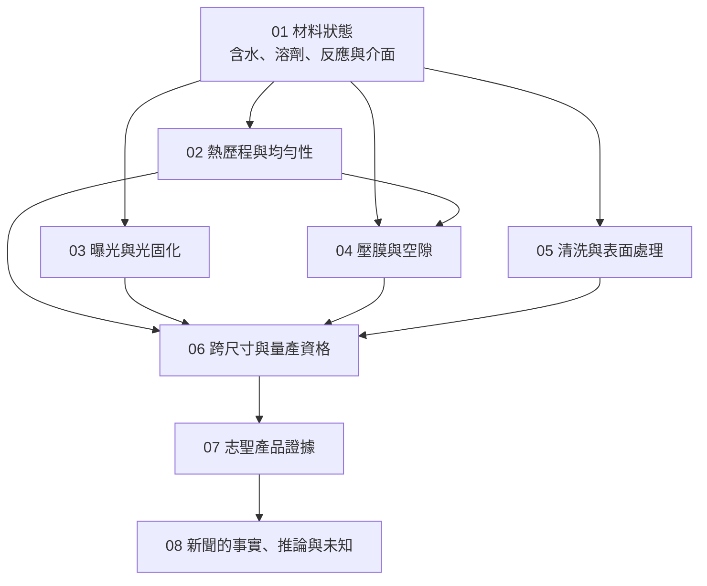

# 全書地圖：先理解材料，再核對公司

全書主線是 **材料狀態 → 製程作用 → 缺陷 → 量測與控制 → 設備資格 → 供應關係證據**。前半部問「應該具備什麼能力」，後半部問「公開資料實際證明到哪裡」；兩者不能倒過來。

*圖 00-1｜本書自繪的概念依賴圖。它是閱讀關係，不代表真實製程先後，也不表示志聖供應所有方塊。*

手機可在圖內橫向捲動；下表提供相同章節關係的文字導覽。

| 章節 | 既有書未回答的問題 | 帶往下一步的判斷 |
|---|---|---|
| [01 材料狀態](01-material-state.md) | 材料名稱不變，狀態為何影響結果？ | 設備作用必須連到材料及下一站 |
| [02 熱均勻性](02-thermal-uniformity.md) | 同設定溫度，為何仍不等效？ | 量工件熱歷程及負載，不只讀控制器 |
| [03 UV 製程](03-uv-process.md) | 光源相近，為何設備用途不同？ | 曝光、固化與減黏的終點各別核對 |
| [04 壓膜](04-lamination-voids.md) | 壓力為何不能消除所有空隙？ | 看流動窗口、排氣路徑與介面 |
| [05 表面處理](05-surface-treatment.md) | 接觸角改善，為何附著可能沒改善？ | 用下一層材料與等待條件驗收 |
| [06 跨應用資格](06-scale-and-qualification.md) | 機台放得下，為何不代表量產能用？ | 分開幾何、製程及商業資格 |
| [07 產品證據](07-csun-product-evidence.md) | 志聖哪些產品用途真的有公開資料？ | 一項產品、一個主體、一組證據邊界 |
| [08 新聞判讀](08-reading-news.md) | 得獎、設廠與新平台能證明什麼？ | 形成可被新證據推翻的判斷 |

快速閱讀走 01 → 07 → 08；遇到規格或能力差異，再沿表格回讀 02–06。名詞不熟可開[術語表](appendix-glossary.md)，來源與未結事項分別在[附錄 A](appendix-sources.md)、[附錄 C](appendix-open-questions.md)。
